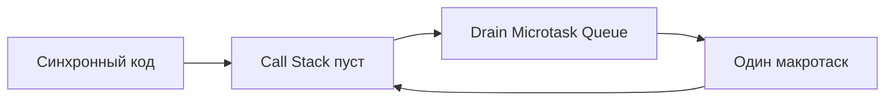
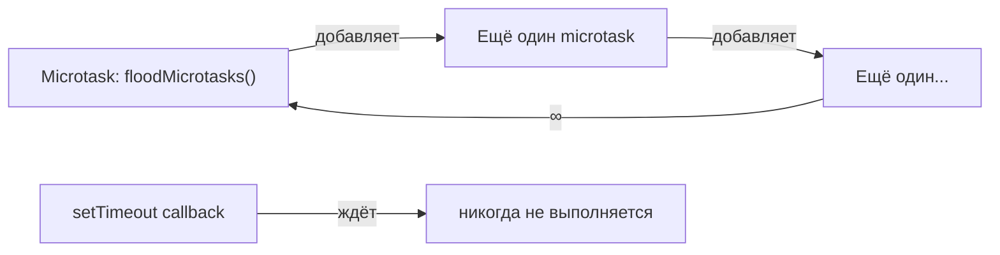

# Promise: цепочки и ошибки — расширенная теория

## Внутренняя механика: как .then() создаёт новый промис

Когда вы вызываете `.then(onFulfilled)`, происходит следующее:

1. Создаётся новый Promise-объект (назовём его `nextPromise`)
2. В текущем промисе регистрируется пара: `{ onFulfilled, nextPromise }`
3. Когда текущий промис разрешается с `value` → вызывается `onFulfilled(value)`
4. Если `onFulfilled` вернул обычное значение `v` → `nextPromise` resolves с `v`
5. Если `onFulfilled` вернул промис `P` → `nextPromise` "следует" за `P`: когда `P` resolves с `v2` → `nextPromise` resolves с `v2`
6. Если `onFulfilled` выбросил ошибку → `nextPromise` rejects

Псевдокод внутренностей промиса:

```js
// Упрощённая модель того, что делает .then():
Promise.prototype.then = function(onFulfilled, onRejected) {
  const nextPromise = new Promise((resolve, reject) => {
    this._handlers.push({
      onFulfilled: (value) => {
        try {
          const result = onFulfilled(value)
          if (result instanceof Promise) {
            result.then(resolve, reject)  // "следовать" за промисом
          } else {
            resolve(result)               // обернуть значение
          }
        } catch (err) {
          reject(err)                     // пробросить ошибку
        }
      },
      onRejected: /* аналогично */
    })
  })
  return nextPromise
}
```

## Промисы и микротаски: когда ИМЕННО выполняется коллбэк .then()

Коллбэки `.then()` никогда не выполняются синхронно — даже если промис уже разрешён:

```js
const p = Promise.resolve(42)
p.then(v => console.log('then:', v))
console.log('sync')

// Вывод:
// sync       ← сначала синхронный код
// then: 42   ← потом микротаск
```

Правило: коллбэки `.then()` помещаются в **Microtask Queue** и выполняются:
- После того как Call Stack полностью опустел
- Но **до** следующего макротаска (setTimeout, setInterval, I/O)
- **Весь** Microtask Queue дренируется перед переходом к макротаскам



Это объясняет порядок вывода в задании 4.3: `A → E → B → C → D`.

## .then(onFulfilled, onRejected) vs .then().catch() — тонкая разница

Оба синтаксиса выглядят похоже, но есть важное отличие:

```js
// Вариант 1: два аргумента .then()
promise.then(
  value => { /* ... */ },
  error => handleError(error)
)

// Вариант 2: .then().catch()
promise
  .then(value => { /* ... */ })
  .catch(error => handleError(error))
```

**Разница**: если ошибка выброшена внутри `onFulfilled` в варианте 1 — `onRejected` её **не поймает**, потому что это ошибка в уже следующем промисе:

```js
// Вариант 1: ошибка из onFulfilled НЕ попадёт в onRejected!
Promise.resolve(42).then(
  value => { throw new Error('в onFulfilled') }, // ← ошибка здесь
  error => console.log('Не поймаю!')             // ← не вызовется
)

// Вариант 2: .catch() поймает ошибку и из .then(), и из промиса
Promise.resolve(42)
  .then(value => { throw new Error('в onFulfilled') })
  .catch(error => console.log('Поймаю!')) // ← вызовется
```

📌 Предпочитай `.then().catch()` — это безопаснее и читаемее.

## Promise.prototype.finally: особенности

`.finally(callback)` выполняется независимо от исхода — и при fulfilled, и при rejected:

```js
fetchData()
  .then(data => display(data))
  .catch(err => showError(err))
  .finally(() => hideSpinner()) // всегда
```

Особенности `.finally()`, которые важно знать:

**1. Коллбэк не получает аргументов:**

```js
Promise.resolve(42)
  .finally(value => {
    console.log(value) // undefined! Аргумент не передаётся
  })
```

**2. Возвращаемое значение игнорируется (если не промис):**

```js
Promise.resolve(42)
  .finally(() => 'ignored')
  .then(v => console.log(v)) // 42, а не 'ignored'
```

**3. Если .finally() выбрасывает ошибку — она заменяет исходную:**

```js
Promise.reject(new Error('original'))
  .finally(() => { throw new Error('finally error') })
  .catch(err => console.log(err.message)) // 'finally error' — перебила!
```

## Длинные цепочки: проблема отладки

Длинные цепочки `.then()` затрудняют чтение стека ошибок:

```js
// Stack trace при ошибке в длинной цепочке — размытый:
// Error: something failed
//   at step3 (app.js:42)
//   at process.nextTick (...)  ← асинхронные границы теряют контекст
```

💡 Для отладки используй:
- Именованные функции вместо стрелок (имя появится в стектрейсе)
- `async/await` для линейного стектрейса (следующий уровень курса)
- Инструменты браузера: DevTools → Async stack traces

```js
// Хуже для отладки (анонимные стрелки):
fetchUser(42)
  .then(u => getPosts(u))
  .then(p => filter(p))

// Лучше (именованные функции):
fetchUser(42)
  .then(function fetchPosts(user) { return getPosts(user) })
  .then(function filterRecent(posts) { return filter(posts) })
```

## Возврат rejected промиса из .catch()

`.catch()` — синтаксический сахар для `.then(undefined, onRejected)`. Если нужно "пробросить" ошибку дальше по цепочке:

```js
fetch('/api/data')
  .catch(err => {
    if (err.message === 'Network error') {
      return fallbackData() // восстановились
    }
    throw err // пробрасываем другие ошибки дальше
  })
  .catch(err => {
    // сюда попадут только НЕ-Network ошибки
    logToSentry(err)
  })
```

## Starvation: когда микротаски блокируют макротаски

Поскольку Microtask Queue дренируется полностью перед каждым макротаском, бесконечный поток микротасков заблокирует браузер:

```js
// Опасный паттерн:
function floodMicrotasks() {
  Promise.resolve().then(floodMicrotasks) // рекурсивно!
}
floodMicrotasks()

// setTimeout никогда не выполнится:
setTimeout(() => console.log('Я застрял!'), 0)
```



В реальном коде это проявляется редко, но понимание помогает диагностировать "зависания" приложения.

## Promise.resolve() с промисом в аргументе

Хитрый случай: `Promise.resolve(aPromise)` не оборачивает промис в промис, а возвращает тот же объект:

```js
const p = Promise.resolve(42)
const q = Promise.resolve(p)

console.log(p === q) // true! Один и тот же объект
```

Но `new Promise(resolve => resolve(aPromise))` и `Promise.resolve(aPromise)` работают одинаково — результирующий промис "следует" за `aPromise`.

## Ключевые выводы расширенной теории

- `.then()` создаёт новый промис: если коллбэк вернул промис — следует за ним; если значение — оборачивает в `Promise.resolve`
- Коллбэки `.then()` всегда асинхронны (микротаск), даже если промис уже resolved
- Предпочитай `.then().catch()` вместо `.then(fn, fn)` — он ловит ошибки и из самого `.then()`
- `.finally()` не получает аргументов и не меняет значение промиса (кроме throw)
- Бесконечные рекурсивные промисы вызывают starvation — блокируют Event Loop навсегда
