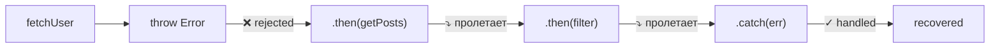

# Promise: цепочки и ошибки

## Промис как конвейер на заводе

Представьте конвейерную линию на заводе: заготовка входит с одного конца, проходит через несколько станций (сварка → покраска → проверка → упаковка), и выходит готовым продуктом. Каждая станция знает только о своём шаге: берёт то, что пришло, делает своё дело, передаёт дальше.

`.then().then().then()` — это ровно такой конвейер. Каждый `.then()` — станция обработки.

## Цепочки .then(): каждый вызов создаёт новый промис

Ключевое понимание, которого часто не хватает:

```js
const p1 = Promise.resolve(1)
const p2 = p1.then(x => x + 1)   // НОВЫЙ промис
const p3 = p2.then(x => x * 10)  // ЕЩЁ ОДИН новый промис

console.log(p1 === p2) // false
console.log(p2 === p3) // false
```

`p1`, `p2`, `p3` — три разных объекта. Каждый `.then()` подписывается на предыдущий промис и создаёт новый.

Цепочку обычно пишут вертикально, чтобы читалось как последовательность шагов:

```js
fetchUser(42)
  .then(user => getPosts(user))
  .then(posts => filterRecent(posts))
  .then(recent => sortByLikes(recent))
  .then(sorted => formatOutput(sorted))
  .then(result => console.log(result))
```

## Return value vs return Promise

Внутри коллбэка `.then()` можно вернуть как обычное значение, так и новый промис. Разница:

```js
// Вариант 1: return обычного значения
.then(posts => posts.filter(p => p.recent))
// ↑ результат автоматически оборачивается в Promise.resolve(filteredPosts)

// Вариант 2: return Promise
.then(posts => fetchDetails(posts))
// ↑ следующий .then() ждёт, пока fetchDetails завершится
```

✅ Оба варианта дают одинаковый эффект с точки зрения цепочки. Следующий `.then()` в любом случае получает разрешённое значение.

## Error bubbling: ошибка летит через всю цепочку

Это самая важная особенность промис-цепочек. Если в каком-то `.then()` выбрасывается ошибка — все последующие `.then()` пропускаются, и управление переходит к ближайшему `.catch()`:

```js
fetchUser(42)
  .then(user => { throw new Error('Нет доступа') }) // ← ошибка здесь
  .then(posts => filterRecent(posts))     // ← ПРОПУСКАЕТСЯ
  .then(recent => sortByLikes(recent))    // ← ПРОПУСКАЕТСЯ
  .catch(err => console.error(err))       // ← ловит ошибку отсюда
```



## Recovery: .catch() возвращает fulfilled промис

`.catch()` — это тоже звено цепочки. Если он возвращает значение (не бросает ошибку повторно) — цепочка продолжается в режиме "fulfilled":

```js
fetchUser(42)
  .then(user => { throw new Error('fail') })
  .catch(err => {
    console.warn('Ошибка:', err.message)
    return { id: 0, name: 'Guest' } // ← возвращаем дефолт
  })
  .then(user => console.log(user.name)) // ← выполняется! 'Guest'
```

⚠️ Если `.catch()` повторно бросает ошибку — цепочка снова уходит в rejected:

```js
.catch(err => { throw err }) // ← ошибка летит дальше
```

## Promise.resolve() и Promise.reject() как shortcut

```js
// Вместо new Promise(resolve => resolve(42)):
const p = Promise.resolve(42)

// Вместо new Promise((_, reject) => reject(new Error('fail'))):
const q = Promise.reject(new Error('fail'))
```

Полезно когда нужно вернуть уже готовый промис из функции — например, из кэша:

```js
function getUser(id) {
  if (cache.has(id)) return Promise.resolve(cache.get(id))
  return fetch(`/api/users/${id}`).then(r => r.json())
}
```

## Unhandled Rejection

Если в цепочке нет `.catch()` — необработанная ошибка попадает в `unhandledRejection`:

```js
// В браузере: событие window.unhandledRejection
// В Node.js: process.on('unhandledRejection', ...)
fetchUser(999).then(posts => filterRecent(posts))
// ↑ если fetchUser отклоняется — никто не обработает ошибку!
```

💡 Правило: всегда завершайте цепочку `.catch()`.

## Частые ошибки новичков

**Ошибка 1: Потеря цепочки — не возвращают промис**

```js
// Плохо — цепочка разорвана:
fetchUser(42).then(user => {
  fetchPosts(user)        // ← забыли return!
  // следующий .then() получит undefined
}).then(posts => {
  console.log(posts)      // undefined!
})

// Хорошо:
fetchUser(42)
  .then(user => fetchPosts(user))  // ← return неявный (стрелка)
  .then(posts => console.log(posts))
```

**Ошибка 2: .catch() в середине цепочки**

```js
// Плохо — catch в середине "глотает" ошибку, но цепочка продолжается:
fetchUser(42)
  .then(user => { throw new Error('oops') })
  .catch(err => console.error(err))  // ← обработал
  .then(posts => {
    // posts === undefined! catch вернул undefined
    filterRecent(posts) // TypeError: cannot read props of undefined
  })

// Хорошо — catch в конце, или явно возвращай дефолт:
  .catch(err => {
    console.error(err)
    return []  // дефолтное значение
  })
```

**Ошибка 3: Вложенные промисы вместо цепочки**

```js
// Плохо — "Pyramid of Doom" с промисами:
fetchUser(42).then(user => {
  fetchPosts(user).then(posts => {
    filterRecent(posts).then(recent => {
      // ...
    })
  })
})

// Хорошо — плоская цепочка:
fetchUser(42)
  .then(user => fetchPosts(user))
  .then(posts => filterRecent(posts))
  .then(recent => ...)
```

## Ключевые выводы

- Каждый `.then()` создаёт новый промис — цепочка это серия промисов
- Return value из `.then()` = `Promise.resolve(value)`, результат тот же
- Ошибка "летит" через все `.then()` до ближайшего `.catch()`
- `.catch()` возвращает fulfilled промис → цепочка продолжается
- Всегда заканчивай цепочку `.catch()` — иначе Unhandled Rejection
