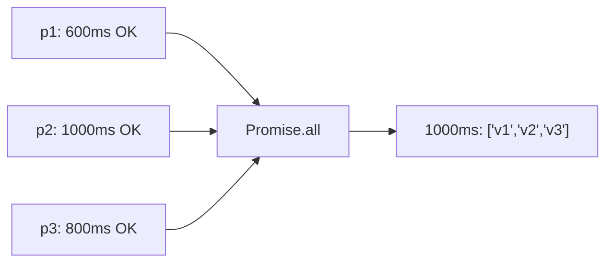
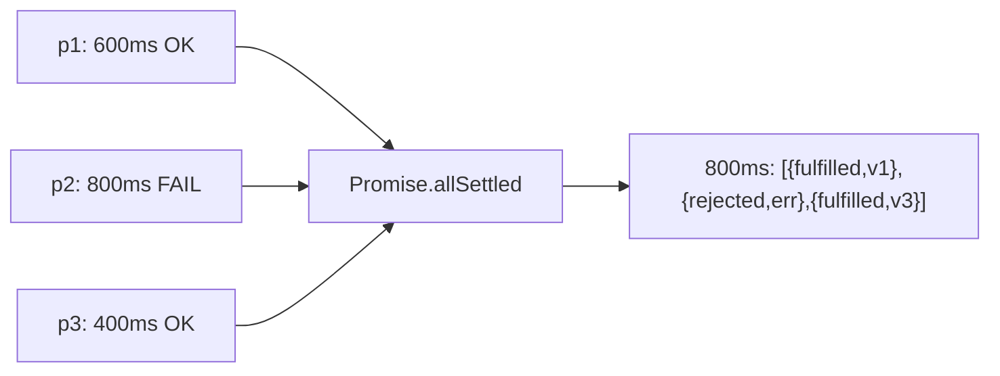
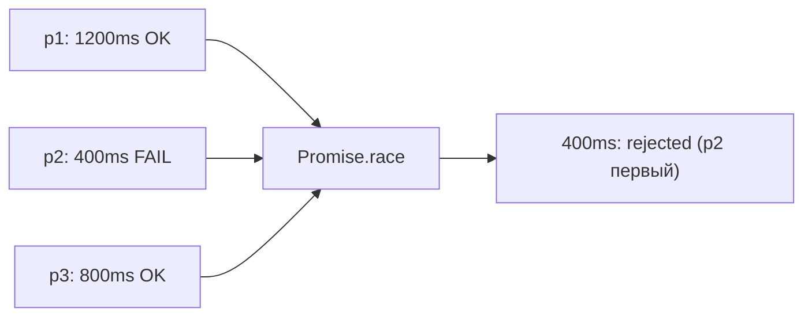
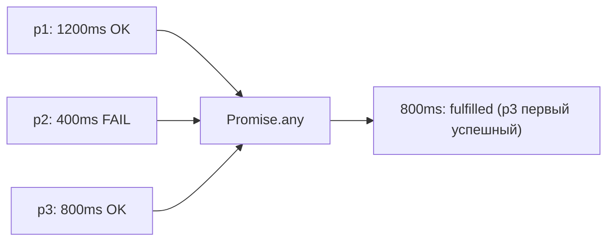

# Promise: комбинаторы — расширенная теория

## Под капотом: как Promise.all работает

Самостоятельная реализация помогает понять механику:

```js
function promiseAll(promises) {
  return new Promise((resolve, reject) => {
    const results = new Array(promises.length)
    let remaining = promises.length

    if (remaining === 0) {
      resolve(results) // пустой массив — немедленно fulfilled
      return
    }

    promises.forEach((promise, index) => {
      Promise.resolve(promise).then(
        (value) => {
          results[index] = value    // сохраняем в правильную позицию
          remaining -= 1

          if (remaining === 0) {
            resolve(results)        // все готовы — отдаём результат
          }
        },
        (reason) => {
          reject(reason)            // первый rejected — сразу падаем
        }
      )
    })
  })
}
```

Ключевые наблюдения:
- `results[index] = value` — порядок результатов соответствует порядку входных промисов, не скорости выполнения. Промис из позиции 2 будет в `results[2]`, даже если он завершился первым.
- `remaining` — простой счётчик. Когда доходит до 0 — всё готово.
- `reject` вызывается без проверки: первый же вызов решает судьбу промиса (Promise можно resolve/reject только один раз).

## Под капотом: Promise.any

```js
function promiseAny(promises) {
  return new Promise((resolve, reject) => {
    const errors = new Array(promises.length)
    let rejectedCount = 0

    if (promises.length === 0) {
      reject(new AggregateError([], 'All promises were rejected'))
      return
    }

    promises.forEach((promise, index) => {
      Promise.resolve(promise).then(
        (value) => resolve(value),  // первый fulfilled — победа
        (reason) => {
          errors[index] = reason
          rejectedCount += 1

          if (rejectedCount === promises.length) {
            // Все упали — AggregateError
            reject(new AggregateError(errors, 'All promises were rejected'))
          }
        }
      )
    })
  })
}
```

Инверсия по сравнению с `all`: здесь `resolve` вызывается при первом успехе, `reject` — только когда все упали.

## AggregateError (ES2021)

`AggregateError` — специальный тип ошибки для случаев, когда несколько операций провалились одновременно. Впервые появился вместе с `Promise.any`.

```js
try {
  await Promise.any([
    Promise.reject(new Error('Server 1: timeout')),
    Promise.reject(new Error('Server 2: 503')),
    Promise.reject(new Error('Server 3: DNS error')),
  ])
} catch (err) {
  console.log(err instanceof AggregateError) // true
  console.log(err.message)                   // 'All promises were rejected'
  console.log(err.errors)                    // [Error1, Error2, Error3]
  // errors сохраняет порядок входных промисов, не порядок rejection
}
```

Важно: `AggregateError` поддерживается во всех современных браузерах и Node.js 15+. В старых окружениях потребуется полифилл.

## Паттерн: Promise.all с лимитом конкурентности

`Promise.all` запускает все промисы немедленно. Если запросов тысяча — это может перегрузить сервер или исчерпать соединения. Решение — пул с ограниченным параллелизмом (подробнее в Level 7, здесь — превью):

```js
async function asyncPool(limit, items, iteratorFn) {
  const results = []
  const executing = new Set()

  for (const item of items) {
    const promise = iteratorFn(item).then((result) => {
      executing.delete(promise)
      return result
    })

    executing.add(promise)
    results.push(promise)

    // Когда достигли лимита — ждём завершения одного
    if (executing.size >= limit) {
      await Promise.race(executing)
    }
  }

  return Promise.all(results)
}

// Пример: загрузить 100 файлов, но не более 5 одновременно
const results = await asyncPool(5, fileList, downloadFile)
```

`Promise.race(executing)` здесь используется как механизм «освобождения слота»: как только один из активных промисов завершается, мы берём следующий из очереди.

## Edge case Promise.race: пустой массив

```js
const result = await Promise.race([])
// Этот await никогда не завершится!
// Promise навсегда остаётся в состоянии pending
```

В отличие от `Promise.all([])` (немедленно `fulfilled` с `[]`) и `Promise.any([])` (немедленно `rejected` с `AggregateError`), `Promise.race([])` просто зависает. Это задокументированное поведение — добавляйте проверку перед вызовом:

```js
if (promises.length === 0) return Promise.resolve(undefined)
return Promise.race(promises)
```

## Composability: комбинирование комбинаторов

Реальная сила комбинаторов — в их комбинировании. Например, загрузить данные из нескольких источников с таймаутом на каждый:

```js
async function fetchWithFallback(urls, timeoutMs) {
  // Оборачиваем каждый URL в race с таймаутом
  const promises = urls.map(url =>
    Promise.race([
      fetch(url).then(r => r.json()),
      new Promise((_, reject) =>
        setTimeout(() => reject(new Error(`Timeout: ${url}`)), timeoutMs)
      )
    ])
  )

  // any берёт первый успешный (даже если другие таймаутнули)
  return Promise.any(promises)
}

// Или: загрузить несколько независимых ресурсов,
// каждый с таймаутом, собрать все статусы
const results = await Promise.allSettled(
  urls.map(url => withTimeout(fetch(url), 3000))
)
```

## Диаграммы: визуализация каждого комбинатора









## Производительность: когда использовать какой

- `Promise.all` — когда нужны **все результаты** и один сбой = ошибка для всей операции (загрузка критичных данных для страницы).
- `Promise.allSettled` — когда нужны **все результаты**, но частичный сбой допустим (массовые операции: отправка писем, уведомлений).
- `Promise.race` — **таймауты** и выбор «первого ответившего», когда вас устраивает любой результат, включая ошибку.
- `Promise.any` — **CDN/fallback-паттерны**, когда нужен первый _успешный_ ответ из нескольких источников.

## Обработка ошибок: полный паттерн

```js
// Безопасный вызов с логированием каждого статуса
async function loadDashboard(userId) {
  const [userResult, postsResult, statsResult] = await Promise.allSettled([
    fetchUser(userId),
    fetchPosts(userId),
    fetchStats(userId),
  ])

  const user = userResult.status === 'fulfilled'
    ? userResult.value
    : null  // показываем fallback UI

  const posts = postsResult.status === 'fulfilled'
    ? postsResult.value
    : []    // пустой список

  if (statsResult.status === 'rejected') {
    // Логируем, но не ломаем страницу
    console.error('Stats unavailable:', statsResult.reason)
  }

  return { user, posts, stats: statsResult.value ?? null }
}
```

## Микротаски и порядок выполнения

Все колбэки `.then()` внутри комбинаторов — микротаски. Это означает:

```js
Promise.all([
  Promise.resolve(1),
  Promise.resolve(2),
]).then(([a, b]) => {
  console.log('all done:', a, b) // выведется в микротаск-очереди
})

console.log('synchronous') // выведется раньше

// Порядок вывода:
// synchronous
// all done: 1 2
```

Даже если все промисы уже resolved — `.then()` никогда не выполняется синхронно. Event Loop сначала завершит текущий синхронный код, затем возьмёт микротаски.
