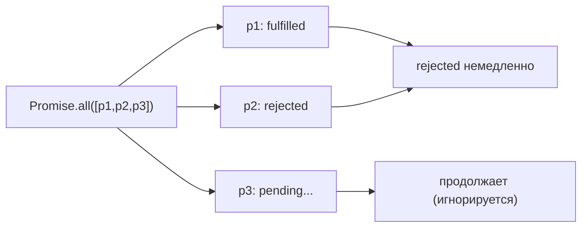

# Promise: комбинаторы

## Зачем нужны комбинаторы

Промис — это один асинхронный запрос. Но реальные приложения редко делают запросы по одному. Нужно загрузить профиль, посты и настройки одновременно. Или попробовать три CDN и взять первый ответивший. Комбинаторы — это инструменты для работы с **несколькими промисами сразу**.

Представьте ресторан: гость заказал стейк, суп и десерт. Можно готовить их по очереди — долго. Или параллельно — быстро. Комбинаторы — это способ сказать кухне: «готовьте всё сразу, и вот моё условие выдачи результата».

## Сравнительная таблица

| Метод | Ждёт кого | Возвращает | Если есть rejected |
|---|---|---|---|
| `Promise.all` | Всех | Массив значений | Немедленно rejected (fail-fast) |
| `Promise.allSettled` | Всех | Массив `{status, value/reason}` | Ждёт всех, возвращает каждый статус |
| `Promise.race` | Первого (любой) | Первое значение или ошибку | Если первым упал — rejected |
| `Promise.any` | Первого fulfilled | Первое успешное значение | Игнорирует rejected; AggregateError если все упали |

## Promise.all — «все или ничего»

Аналогия: вы договорились с друзьями пойти в кино. Идёте только если **все** придут. Один опоздал — все ждут. Один позвонил и отказался — поход отменяется немедленно (не ждёте остальных).

```js
const [user, posts, settings] = await Promise.all([
  fetchUser(id),
  fetchPosts(id),
  fetchSettings(id),
])
// Все три запроса идут параллельно
// Если любой упадёт — получим ошибку сразу
```

Важно понимать: **Promise.all не отменяет запросы**. Если один упал, остальные продолжают выполняться в фоне — вы просто не получите их результаты.



## Promise.allSettled — «дождаться всех»

Аналогия: опрос команды — вы хотите знать позицию **каждого**, независимо от того, согласен он или против. Никого не игнорируете.

```js
const results = await Promise.allSettled([p1, p2, p3])

results.forEach(result => {
  if (result.status === 'fulfilled') {
    console.log('Успех:', result.value)
  } else {
    console.error('Ошибка:', result.reason)
  }
})
```

`allSettled` **всегда fulfilled** — его собственный промис никогда не rejected. Это делает его безопасным для ситуаций, когда частичный сбой — норма (например, массовая отправка уведомлений).

## Promise.race — «первый — любой»

Аналогия: вызов такси через несколько приложений. Принимаете первую машину — неважно, из какого приложения. Остальные отменяете.

Ключевой нюанс: `race` реагирует на **первый результат любого типа** — будь то fulfilled или rejected. Если самый быстрый промис упадёт — `race` тоже упадёт.

```js
// Классический паттерн: таймаут через race
function withTimeout(promise, ms) {
  const timeout = new Promise((_, reject) =>
    setTimeout(() => reject(new Error(`Timeout after ${ms}ms`)), ms)
  )
  return Promise.race([promise, timeout])
}

const data = await withTimeout(fetch('/api/data'), 5000)
```

⚠️ Пустой массив `Promise.race([])` → pending навсегда. Это edge case, который стоит знать.

## Promise.any — «первый успешный»

Аналогия: попытка открыть файл с нескольких зеркал. Берёте первое рабочее зеркало, игнорируете недоступные.

```js
const response = await Promise.any([
  fetch('https://cdn1.example.com/asset.js'),
  fetch('https://cdn2.example.com/asset.js'),
  fetch('https://cdn3.example.com/asset.js'),
])
// Первый успешный ответ — победитель
// Если cdn1 offline — ждём cdn2 или cdn3
```

Если **все** промисы rejected — выбрасывается `AggregateError` (ES2021):

```js
try {
  await Promise.any([p1, p2, p3])
} catch (err) {
  if (err instanceof AggregateError) {
    console.log(err.errors) // [Error1, Error2, Error3]
  }
}
```

## Параллельность vs конкурентность

JavaScript — конкурентный, не параллельный. Настоящей параллельности в одном потоке нет: промисы не выполняются «одновременно» в смысле многопоточности. Они конкурентно занимают Event Loop.

Когда мы пишем `Promise.all([p1, p2, p3])`, все три промиса **запускаются немедленно**, но их колбэки попадают в очередь по мере завершения. Сам JS-код выполняется одним потоком, а I/O (сетевые запросы, файлы) обрабатывается браузером/Node.js параллельно на уровне ОС.

## Частые ошибки новичков

**Ошибка 1: Последовательный await вместо Promise.all**

```js
// Плохо: 3 секунды вместо 1
const user = await fetchUser(id)      // 1 сек
const posts = await fetchPosts(id)    // ещё 1 сек
const settings = await fetchSettings(id) // ещё 1 сек

// Хорошо: ~1 секунда (параллельно)
const [user, posts, settings] = await Promise.all([
  fetchUser(id),
  fetchPosts(id),
  fetchSettings(id),
])
```

**Ошибка 2: Игнорирование AggregateError у Promise.any**

```js
// Плохо: необработанный rejection
const result = await Promise.any([p1, p2])

// Хорошо: всегда обрабатывать случай "все упали"
try {
  const result = await Promise.any([p1, p2])
} catch (err) {
  // AggregateError когда ВСЕ отклонены
  console.error('Все источники недоступны:', (err as AggregateError).errors)
}
```

**Ошибка 3: Путаница race и any**

```js
// race: отвечает на первый ЛЮБОЙ результат
Promise.race([failFast, slowSuccess])
// → rejected (failFast упал первым)

// any: отвечает на первый FULFILLED
Promise.any([failFast, slowSuccess])
// → fulfilled с значением slowSuccess (ждёт успеха)
```
