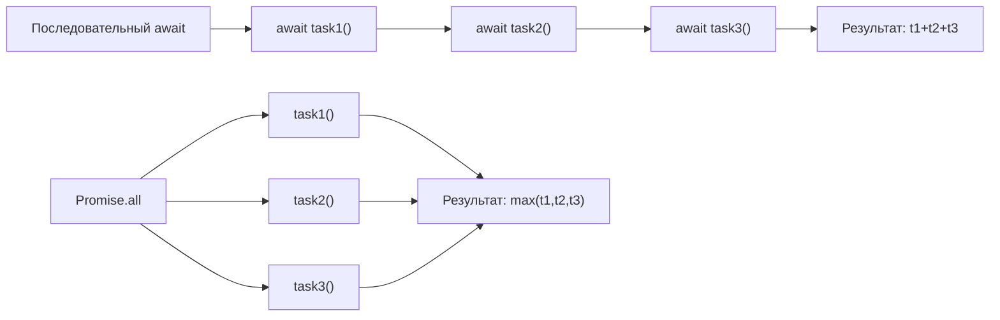

# async/await — углублённо

## Под капотом: async как state machine

JavaScript-движок компилирует `async function` в конечный автомат (state machine) — похожую структуру использует `function*` (генератор). Каждый `await` — это точка перехода между состояниями.

```js
// Исходный async/await код:
async function fetchAndProcess(id) {
  const user = await fetchUser(id)
  const posts = await fetchPosts(user.id)
  return posts.length
}

// Примерно во что компилируется (упрощённо):
function fetchAndProcess(id) {
  let _state = 0
  let _user, _posts

  function _step(value) {
    switch (_state) {
      case 0:
        _state = 1
        return fetchUser(id).then(_step)   // await #1
      case 1:
        _user = value
        _state = 2
        return fetchPosts(_user.id).then(_step)  // await #2
      case 2:
        _posts = value
        return Promise.resolve(_posts.length)
    }
  }

  return _step(undefined)
}
```

Генераторы используют `yield` как точки паузы — `async/await` работает по той же идее, но промисы подключаются автоматически.

## Что выполняется ДО первого await

Код до первого `await` выполняется **синхронно** — в том же тике Event Loop, что и вызов функции:

```js
async function tricky() {
  console.log('A — синхронно')    // выполнится сразу
  console.log('B — тоже синхронно') // до первого await

  await Promise.resolve()         // точка паузы

  console.log('C — микротаска')  // следующий тик
}

console.log('1 — до вызова')
tricky()
console.log('2 — после вызова функции')
Promise.resolve().then(() => console.log('3 — ещё одна микротаска'))

// Порядок вывода: 1, A, B, 2, C, 3
```

Это критично знать: если до первого `await` кидается исключение — оно возникает синхронно (до того как промис успел "уйти").

## Error stack traces

В асинхронном коде стектрейсы исторически были ужасными. V8 решил это через **Async Stack Traces** (начиная с Node.js 12):

```
Error: Something went wrong
    at processData (app.js:15:9)       ← место броска
    at async fetchAndProcess (app.js:8:3)  ← async caller
    at async main (app.js:3:3)         ← async caller
```

С Promise-цепочками стектрейс обрывался на `.then()`. С `async/await` — V8 сохраняет "виртуальный" стек через точки `await`, делая отладку намного удобнее.

## Conditional await

`await` можно использовать условно — это полезный паттерн:

```js
async function fetchWithCache(url, useCache = true) {
  if (useCache) {
    const cached = getFromCache(url)
    if (cached) return cached // нет await — возвращаем сразу
  }

  // await только если нужен реальный запрос
  const response = await fetch(url)
  const data = await response.json()

  if (useCache) setCache(url, data)
  return data
}
```

`await` — не обязательный: вы можете вернуть синхронный результат из `async function` без любого `await`.

## IIFE async pattern

Когда нужен `await` на верхнем уровне, но нет поддержки top-level await:

```js
// Без top-level await (CommonJS, старые окружения)
;(async () => {
  const config = await loadConfig()
  const app = createApp(config)
  await app.listen(3000)
  console.log('Server started')
})()

// С обработкой ошибок
;(async () => {
  // логика
})().catch((err) => {
  console.error('Fatal:', err)
  process.exit(1)
})
```

Обратите внимание на точку с запятой перед `(` — защита от автоматической вставки точки с запятой (ASI).

## for-await-of — превью Level 9

`for-await-of` позволяет итерировать по async-итерируемым объектам:

```js
// Async generator (подробно разберём в Level 9)
async function* paginatedFetch(url) {
  let page = 1
  while (true) {
    const data = await fetch(`${url}?page=${page}`).then(r => r.json())
    if (data.length === 0) break
    yield data
    page++
  }
}

// for-await-of "разворачивает" async-итератор
for await (const page of paginatedFetch('/api/items')) {
  process(page) // обрабатываем постранично
}
```

`for-await-of` можно использовать только внутри `async function`.

## Sequential vs Parallel — развёрнутая схема



Когда последовательный await оправдан:

```js
// ПРАВИЛЬНО — результат шага 1 нужен для шага 2
const user = await fetchUser(userId)
const permissions = await fetchPermissions(user.roleId)
// permissions зависит от user — нельзя параллелить

// НЕПРАВИЛЬНО — независимые данные
const user = await fetchUser(userId)
const config = await fetchAppConfig() // не зависит от user!
// Используйте Promise.all
```

## Partial parallelism — когда нужна и зависимость, и параллельность

```js
async function loadDashboard(userId) {
  // Сначала получаем пользователя
  const user = await fetchUser(userId)

  // Дальше — данные, которые зависят от user,
  // но между собой независимы — запускаем параллельно
  const [posts, friends, notifications] = await Promise.all([
    fetchPosts(user.id),
    fetchFriends(user.id),
    fetchNotifications(user.id),
  ])

  return { user, posts, friends, notifications }
}
```

## Паттерн: async constructor

Конструкторы классов не могут быть `async`. Обходное решение — статический фабричный метод:

```js
class Database {
  private constructor(private connection: Connection) {}

  static async create(url: string): Promise<Database> {
    const connection = await connect(url)  // async инициализация
    return new Database(connection)
  }

  async query(sql: string) {
    return this.connection.execute(sql)
  }
}

// Использование:
const db = await Database.create('postgres://localhost/mydb')
const rows = await db.query('SELECT * FROM users')
```

## Частые ошибки новичков

**Ошибка 1: await в forEach**

```js
// Плохо — forEach не ждёт async-коллбэки
const ids = [1, 2, 3]
ids.forEach(async (id) => {
  await processId(id) // forEach уже вернулся!
})
// Код после forEach выполнится до завершения обработки

// Хорошо — for...of или Promise.all
for (const id of ids) {
  await processId(id)
}
```

**Ошибка 2: Забытый await**

```js
// Плохо — user это Promise, а не объект пользователя
const user = getUser() // async function
if (user.isAdmin) { ... } // всегда false — у Promise нет isAdmin

// Хорошо
const user = await getUser()
if (user.isAdmin) { ... }
```

**Ошибка 3: Promise-ад с async/await**

```js
// Плохо — теряем преимущества async/await
async function nested() {
  return fetchA().then(a =>
    fetchB(a).then(b =>
      fetchC(b).then(c => c)
    )
  )
}

// Хорошо — линейный читаемый код
async function nested() {
  const a = await fetchA()
  const b = await fetchB(a)
  const c = await fetchC(b)
  return c
}
```

**Ошибка 4: Не обрабатывать ошибки в top-level async**

```js
// Плохо — необработанный rejection
async function main() {
  const data = await fetchCritical() // если упадёт — процесс падает без предупреждения
}

main()

// Хорошо
main().catch(err => {
  console.error('Unhandled error:', err)
  process.exit(1)
})
```

## Ключевые выводы

- async компилируется в state machine на основе генераторов
- Код до первого `await` выполняется синхронно
- V8 поддерживает async stack traces — отладка удобна
- `for-await-of` для async-итераторов (разберём в Level 9)
- IIFE `(async () => { ... })()` — замена top-level await в CommonJS
- Параллельность через `Promise.all`, зависимые вызовы — последовательно
