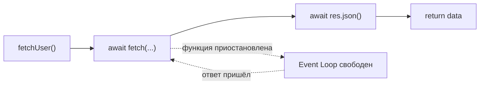

# async/await

## Что такое async/await

Представьте, что вы ждёте заказ в кафе. Вы садитесь за стол (вызываете функцию), официант принимает заказ и уходит на кухню (запрос уходит в сеть). Пока готовят — вы читаете меню, смотрите в телефон, разговариваете (другие задачи выполняются). Когда приносят еду — вы продолжаете. Вот как работает `await`.

**async/await** — это синтаксический сахар над Promise. Под капотом — те же промисы, но код читается как синхронный.

## async function ВСЕГДА возвращает Promise

```js
async function greet() {
  return 'Hello'
}

const result = greet()
console.log(result) // Promise { 'Hello' }
console.log(await greet()) // 'Hello'
```

Даже если внутри нет ни одного `await` — возвращаемое значение оборачивается в `Promise.resolve()`. Это важно помнить: вызывающий код получает промис, а не само значение.

## await "распаковывает" промис

`await` — это как `.then()`, только написанный прямо в теле функции:

```js
// Эти два варианта эквивалентны:

// async/await
async function fetchUser() {
  const res = await fetch('/api/user')
  const data = await res.json()
  return data
}

// Promise-цепочка
function fetchUser() {
  return fetch('/api/user')
    .then(res => res.json())
    .then(data => data)
}
```



## await приостанавливает функцию, но НЕ поток

Это ключевое отличие от блокирующего кода. Когда выполнение достигает `await`:

1. Текущая функция "засыпает" — возвращает управление вызывающему коду
2. Event Loop продолжает работать: обрабатывает клики, таймеры, другие промисы
3. Когда промис резолвится — функция "просыпается" и продолжает с места остановки

```js
async function demo() {
  console.log('1 — начало')
  await somePromise() // функция засыпает
  console.log('3 — после await')
}

demo()
console.log('2 — этот код выполнился пока demo спала!')
// Вывод: 1, 2, 3
```

## try/catch для обработки ошибок

`await` бросает исключение при reject промиса. Это позволяет использовать обычный `try/catch`:

```js
// async/await с try/catch
async function loadData() {
  try {
    const data = await fetchData()
    return data
  } catch (err) {
    console.error('Ошибка:', err.message)
    return null
  }
}

// Эквивалент через Promise
function loadData() {
  return fetchData()
    .catch(err => {
      console.error('Ошибка:', err.message)
      return null
    })
}
```

## Sequential vs Parallel — самая частая ловушка

```js
// МЕДЛЕННО: 1000 + 1500 + 800 = 3300ms
const user     = await fetchUser()
const posts    = await fetchPosts()
const comments = await fetchComments()

// БЫСТРО: max(1000, 1500, 800) = 1500ms
const [user, posts, comments] = await Promise.all([
  fetchUser(),
  fetchPosts(),
  fetchComments(),
])
```

Последовательный `await` оправдан только если каждый следующий запрос зависит от результата предыдущего.

## Top-level await (ES2022, только в модулях)

```js
// В .mjs или при type: "module" в package.json
const data = await fetch('/api/config').then(r => r.json())
console.log(data)
// Работает без async-обёртки на верхнем уровне модуля
```

## Антипаттерны: краткий список

| Антипаттерн | Проблема | Решение |
|---|---|---|
| `await` в `forEach` | `forEach` не ждёт промисы | `for...of` или `Promise.all` + `map` |
| Забытый `await` | Получаете промис вместо значения | Добавить `await` |
| Последовательный `await` независимых задач | Суммарное ожидание вместо максимального | `Promise.all` |
| `async` без `await` | Лишняя обёртка в промис | Убрать `async` |
| Пустой `catch` | Ошибки глотаются молча | Логировать или пробрасывать |

## Ключевые выводы

- `async function` всегда возвращает `Promise`
- `await` приостанавливает функцию, но не поток — Event Loop продолжает работать
- `try/catch` с `async/await` = `.catch()` в цепочках промисов
- Независимые запросы запускайте параллельно через `Promise.all`
- `for...of` вместо `forEach` при `await` в цикле
