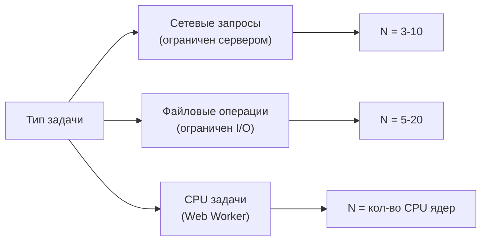
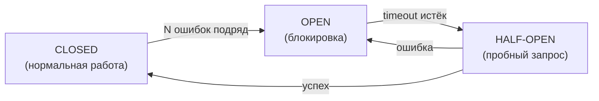

# Паттерны async/await — углублённо

## Retry: стратегии и нюансы

### Идемпотентность — главный вопрос

Перед тем как добавить retry, задайте себе вопрос: безопасно ли повторить этот запрос?

| Операция | Идемпотентна? | Retry безопасен? |
|---|---|---|
| GET /users/123 | Да | Да |
| PUT /users/123 (обновление) | Да | Да |
| POST /orders (создание) | Нет | Только с дедупликацией |
| DELETE /items/5 | Да (второй вызов вернёт 404, не ошибку) | Да, если 404 обрабатываете |

Для неидемпотентных операций применяйте **idempotency key** — уникальный токен в заголовке, который сервер запоминает и не дублирует операцию при повторе.

### Backoff стратегии

```js
// Linear: 100ms, 200ms, 300ms, 400ms
const linearDelay = (attempt, base) => base * attempt

// Exponential: 100ms, 200ms, 400ms, 800ms
const exponentialDelay = (attempt, base, factor = 2) => base * Math.pow(factor, attempt)

// Full jitter (рекомендует AWS)
const jitterDelay = (attempt, base, factor = 2) => {
  const cap = base * Math.pow(factor, attempt)
  return Math.random() * cap
}

// Decorrelated jitter (исследование Марка Брукса)
let prev = base
const decorrelatedDelay = () => {
  prev = Math.min(cap, Math.random() * (prev * 3 - base) + base)
  return prev
}
```

Исследование AWS (2015) показало: decorrelated jitter даёт наименьшую совокупную задержку и лучшее рассредоточение нагрузки.

### Полная реализация с опциями

```js
async function retry(fn, options = {}) {
  const {
    maxRetries = 3,
    baseDelay = 300,
    factor = 2,
    maxDelay = 30000,
    jitter = true,
    retryOn = (e) => true,  // предикат: какие ошибки повторять
    onRetry = () => {},     // хук для логирования
  } = options

  for (let attempt = 0; attempt <= maxRetries; attempt++) {
    try {
      return await fn()
    } catch (error) {
      if (attempt === maxRetries || !retryOn(error)) throw error

      let delay = Math.min(baseDelay * Math.pow(factor, attempt), maxDelay)
      if (jitter) delay = delay * (0.5 + Math.random() * 0.5)

      onRetry({ attempt, delay, error })
      await new Promise(r => setTimeout(r, delay))
    }
  }
}

// Пример: повторяем только 5xx, не 4xx
await retry(fetchUser, {
  retryOn: (e) => e.status >= 500,
  onRetry: ({ attempt, delay }) => console.log(`Retry ${attempt} in ${delay}ms`),
})
```

## Async Pool: реализация через Promise.race

Под капотом asyncPool работает иначе, чем кажется. Вот академическая реализация через Promise.race:

```js
async function asyncPool(concurrency, iterable, iteratorFn) {
  const executing = new Set()
  const results = []

  for (const [index, item] of iterable.entries()) {
    const p = Promise.resolve().then(() => iteratorFn(item, index))

    results.push(p)
    executing.add(p)

    const cleanup = () => executing.delete(p)
    p.then(cleanup, cleanup)

    if (executing.size >= concurrency) {
      // Ждём пока освободится хотя бы один слот
      await Promise.race(executing)
    }
  }

  return Promise.all(results)
}
```

`Promise.race(executing)` разрешается когда **любой** из текущих промисов завершается — тогда мы можем запустить следующую задачу. Элегантно!

### Когда какой N выбрать



## Debounce: leading vs trailing

Стандартный debounce — **trailing**: срабатывает в конце паузы. Но бывает нужен **leading** — мгновенное первое срабатывание, игнорирование последующих на время delay.

```js
function debounce(fn, delay, { leading = false, trailing = true } = {}) {
  let timer = null
  let leadingCalled = false

  return function(...args) {
    const callNow = leading && !timer

    clearTimeout(timer)
    timer = setTimeout(() => {
      timer = null
      leadingCalled = false
      if (trailing && !callNow) fn.apply(this, args)
    }, delay)

    if (callNow && !leadingCalled) {
      leadingCalled = true
      fn.apply(this, args)
    }
  }
}

// Leading debounce: мгновенный первый клик, игнорирование быстрых повторов
// Полезно для кнопки "Submit" — первый клик срабатывает, повторные игнорируются
const handleSubmit = debounce(sendForm, 1000, { leading: true, trailing: false })
```

## Mutex и Semaphore

Mutex — частный случай семафора с N=1.

**Semaphore** позволяет N одновременных обладателей блокировки:

```js
class AsyncSemaphore {
  #count
  #queue = []

  constructor(maxConcurrent) {
    this.#count = maxConcurrent
  }

  async acquire() {
    if (this.#count > 0) {
      this.#count--
      return
    }
    return new Promise(resolve => this.#queue.push(resolve))
  }

  release() {
    if (this.#queue.length > 0) {
      this.#queue.shift()()
    } else {
      this.#count++
    }
  }
}

// Ограничение: не более 3 одновременных DB-соединений
const dbSemaphore = new AsyncSemaphore(3)

async function queryDb(sql) {
  await dbSemaphore.acquire()
  try {
    return await db.query(sql)
  } finally {
    dbSemaphore.release()
  }
}
```

Разница: mutex — кто взял, тот и должен отпустить. Semaphore — счётчик, release может вызвать другой код.

## Circuit Breaker: продвинутая реализация



Ключевые решения при проектировании:

**1. Что считать ошибкой?**
- 5xx ошибки сервера — да
- 4xx ошибки клиента (404, 400) — нет, это корректное поведение
- Таймауты — да, критично

**2. Скользящее окно vs счётчик**
```js
// Простой счётчик (наш пример):
// 3 ошибки подряд → OPEN

// Скользящее окно (продакшн):
// Более 50% ошибок за последние 10 запросов → OPEN
class SlidingWindowBreaker {
  #window = []  // массив true/false (success/failure)
  #size

  constructor(windowSize, threshold) {
    this.#size = windowSize
    this.threshold = threshold  // доля ошибок (0.0 - 1.0)
  }

  record(success) {
    this.#window.push(success)
    if (this.#window.length > this.#size) this.#window.shift()
  }

  shouldOpen() {
    if (this.#window.length < this.#size) return false
    const failures = this.#window.filter(v => !v).length
    return failures / this.#size >= this.threshold
  }
}
```

**3. Half-open зондирование**

В HALF-OPEN пропускаем не все запросы, а лишь часть (например, 10%). Это позволяет не перегрузить восстанавливающийся сервис:

```js
if (state === 'HALF_OPEN' && Math.random() > 0.1) {
  throw new CircuitOpenError('Circuit is half-open, request sampled out')
}
```

## Deferred pattern

Иногда нужно создать промис "снаружи" и разрешить его "изнутри":

```js
function createDeferred() {
  let resolve, reject
  const promise = new Promise((res, rej) => {
    resolve = res
    reject = rej
  })
  return { promise, resolve, reject }
}

// Пример: ожидание ответа WebSocket с конкретным ID
const pending = new Map()

ws.onmessage = (event) => {
  const { id, data, error } = JSON.parse(event.data)
  const deferred = pending.get(id)
  if (!deferred) return

  if (error) deferred.reject(new Error(error))
  else deferred.resolve(data)
  pending.delete(id)
}

async function sendRequest(payload) {
  const id = crypto.randomUUID()
  const deferred = createDeferred()
  pending.set(id, deferred)
  ws.send(JSON.stringify({ id, ...payload }))
  return deferred.promise
}
```

Паттерн используется в библиотеках RxJS, SWR, React Query для управления состоянием асинхронных операций.

## Ключевые выводы

- Retry + exponential backoff + jitter — стандарт для нестабильных API
- Async Pool — не запускайте больше N задач одновременно
- Debounce (ввод) vs Throttle (прокрутка, resize) — разные задачи
- Mutex нужен там, где есть `await` между чтением и записью общего состояния
- Circuit Breaker — fail fast вместо ожидания таймаута при системных сбоях
- Deferred — когда нужно управлять промисом извне его создания
