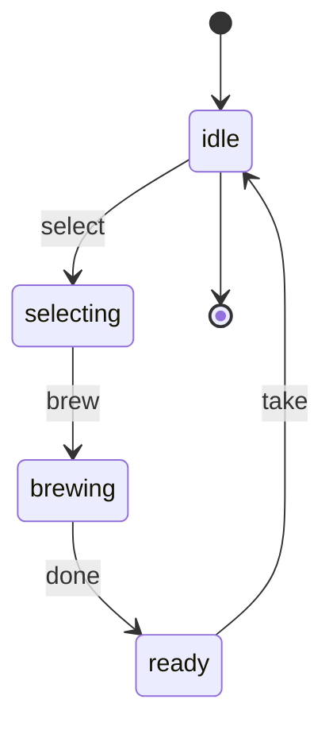
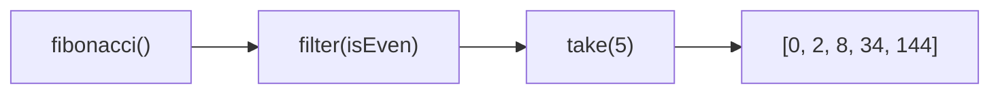

# Генераторы: расширенная теория

## Iterator Protocol и Iterable Protocol

JavaScript разделяет две вещи, которые новички часто путают:

**Iterator** — объект с методом `.next()`, возвращающим `{ value, done }`. Генераторы создают итераторы.

**Iterable** — объект с методом `[Symbol.iterator]()`, возвращающим итератор. Массивы, строки, Map, Set — все они итерируемые.

```js
// Итератор вручную (без генераторов)
const manualIterator = {
  current: 0,
  next() {
    return this.current < 3
      ? { value: this.current++, done: false }
      : { value: undefined, done: true }
  }
}

manualIterator.next() // { value: 0, done: false }
manualIterator.next() // { value: 1, done: false }
manualIterator.next() // { value: 2, done: false }
manualIterator.next() // { value: undefined, done: true }
```

Генераторы — это удобный синтаксис для создания итераторов. Вместо ручного хранения состояния (`this.current`) движок делает это сам, сохраняя стек фрейма генератора.

## Symbol.iterator: кастомные итерируемые объекты

Чтобы объект работал с `for...of`, оператором spread `[...obj]` и деструктуризацией, у него должен быть метод `[Symbol.iterator]`:

```js
class Range {
  constructor(from, to) {
    this.from = from
    this.to = to
  }

  // Делаем объект итерируемым через генератор
  [Symbol.iterator]() {
    return this._generator()
  }

  *_generator() {
    for (let i = this.from; i <= this.to; i++) {
      yield i
    }
  }
}

const range = new Range(1, 5)
[...range]              // [1, 2, 3, 4, 5]
for (const n of range) console.log(n) // 1, 2, 3, 4, 5
const [first, ...rest] = range        // first=1, rest=[2,3,4,5]
```

💡 Если объект одновременно итерируемый и итератор, он должен реализовать оба:

```js
const selfIteratable = {
  value: 0,
  [Symbol.iterator]() { return this },  // возвращает себя
  next() {
    return this.value < 3
      ? { value: this.value++, done: false }
      : { value: undefined, done: true }
  }
}
```

## for...of под капотом

```js
for (const x of iterable) {
  body(x)
}
```

Движок разворачивает это в:

```js
const iterator = iterable[Symbol.iterator]()
let result = iterator.next()

while (!result.done) {
  body(result.value)
  result = iterator.next()
}

// Если break/return/throw — вызывается iterator.return() для cleanup
```

📌 Именно поэтому `break` внутри `for...of` корректно завершает генератор (вызывает `return()`), и `try/finally` в генераторе сработает даже при прерывании:

```js
function* withCleanup() {
  try {
    yield 1
    yield 2
    yield 3
  } finally {
    console.log('очистка ресурсов')  // выполнится даже при break
  }
}

for (const n of withCleanup()) {
  console.log(n)
  if (n === 1) break  // → 'очистка ресурсов' в finally
}
```

## Генераторы как формальные конечные автоматы

Конечный автомат (FSM) — математическая модель: набор состояний, начальное состояние, переходы по событиям. Генераторы реализуют FSM элегантно:

- Каждый `yield` = состояние (пауза в точке)
- Аргумент `next(action)` = событие/входное значение
- Тело функции между `yield`-ами = логика перехода



```js
function* trafficFSM() {
  while (true) {
    const action = yield 'red'      // состояние red, ожидаем action
    if (action !== 'switch') continue

    yield 'green'
    yield 'yellow'
  }
}
```

Преимущество перед switch/case: состояния — это буквально позиции в коде, а не строки в таблице переходов. Трудно перепрыгнуть через состояние.

## Pipeline из генераторов



Генераторы можно соединять в цепочки. Каждый шаг вытягивает значения из предыдущего лениво:

```js
function* fibonacci() {
  let a = 0, b = 1
  while (true) { yield a; [a, b] = [b, a + b] }
}

function* filter(predicate, iterable) {
  for (const value of iterable) {
    if (predicate(value)) yield value
  }
}

function* take(n, iterable) {
  let count = 0
  for (const value of iterable) {
    if (count++ >= n) return
    yield value
  }
}

// Пайплайн
const pipeline = take(5, filter(n => n % 2 === 0, fibonacci()))
[...pipeline] // [0, 2, 8, 34, 144]
```

⚠️ Данные текут "pull-based" — потребитель (правый конец) вытягивает из источника (левый конец). Это противоположность push-based потокам (RxJS Observable).

## Сравнение с другими языками

| Язык | Синтаксис | Особенности |
|------|-----------|-------------|
| JavaScript | `function*`, `yield` | Двусторонняя связь через `next(value)`, `throw()`, `return()` |
| Python | `def` + `yield` | Аналогично JS, `send()` = `next(value)`, `throw()`, `close()` |
| C# | `IEnumerable<T>` + `yield return` | Только push, нет двусторонней связи, компилятор генерирует класс-автомат |
| Kotlin | `sequence { }` + `yield` | Ленивые последовательности, нет отправки значений обратно |
| Go | горутины + каналы | Настоящий параллелизм, не корутины в строгом смысле |

Python максимально похож на JS:

```python
def dialog():
    name = yield 'Как тебя зовут?'
    age  = yield f'Привет, {name}!'
    yield f'{name}, тебе {age} лет'

gen = dialog()
next(gen)            # 'Как тебя зовут?'
gen.send('Алиса')   # 'Привет, Алиса!'
gen.send(30)         # 'Алиса, тебе 30 лет'
```

## co library: генераторы + промисы = async/await

В 2013 году TJ Holowaychuk написал библиотеку `co`, которая позволяла писать асинхронный код как синхронный — через генераторы:

```js
// co v4 (2014)
co(function* () {
  const user = yield fetch('/api/user').then(r => r.json())
  const posts = yield fetch(`/api/posts?userId=${user.id}`).then(r => r.json())
  console.log(posts)
})
```

Как `co` работает внутри — упрощённо:

```js
function co(generatorFn) {
  return new Promise((resolve, reject) => {
    const gen = generatorFn()

    function step(nextFn, arg) {
      let result
      try {
        result = nextFn(arg)   // gen.next(value) или gen.throw(err)
      } catch (e) {
        return reject(e)
      }

      if (result.done) return resolve(result.value)

      // result.value — промис, ждём его
      Promise.resolve(result.value).then(
        (value) => step(gen.next.bind(gen), value),
        (err)   => step(gen.throw.bind(gen), err)
      )
    }

    step(gen.next.bind(gen), undefined)
  })
}
```

В 2017 году ES2017 принёс `async/await` — буквально этот паттерн, встроенный в язык. `async function` внутри реализован аналогично (через скрытый генератор в спецификации).

## IterableIterator: два протокола в одном

Генераторы одновременно реализуют оба протокола:

```js
function* gen() { yield 1 }
const iterator = gen()

// Это итератор:
iterator.next() // { value: 1, done: false }

// Это итерируемый объект (возвращает себя):
iterator[Symbol.iterator]() === iterator // true

// Поэтому можно писать:
for (const v of iterator) { /* ... */ }  // работает!
[...iterator]                             // работает!
```

Тип в TypeScript: `Generator<YieldType, ReturnType, NextType>`:

```ts
function* typed(): Generator<number, string, boolean> {
  const shouldStop = yield 42        // NextType = boolean
  if (shouldStop) return 'stopped'   // ReturnType = string
  yield 100
  return 'done'
}
```

## Продвинутые паттерны

### Генератор-наблюдатель (push в pull)

```js
function* logger() {
  const messages = []
  while (true) {
    const msg = yield messages  // получаем снаружи
    if (msg === null) return messages
    messages.push(`[${new Date().toISOString()}] ${msg}`)
  }
}

const log = logger()
log.next()              // инициализация
log.next('Старт')
log.next('Шаг 1')
log.next('Шаг 2')
log.next(null)          // { value: [...logs], done: true }
```

### Делегирование с перехватом return

```js
function* child() {
  yield 'a'
  yield 'b'
  return 42   // return-значение доступно через yield*
}

function* parent() {
  const childResult = yield* child()  // childResult = 42
  yield `ребёнок вернул: ${childResult}`
}

[...parent()] // ['a', 'b', 'ребёнок вернул: 42']
```

## Ключевые выводы расширенного уровня

- Iterable (`[Symbol.iterator]`) и Iterator (`.next()`) — разные протоколы; генераторы реализуют оба
- `for...of` вызывает `.return()` при прерывании — `finally` в генераторе выполнится
- Генераторы как FSM: состояния — позиции в коде, переходы — `next(action)`
- Pipeline через генераторы — pull-based, ленивый, без промежуточных массивов
- `co` + генераторы = исторический async/await; понимание этого объясняет, как устроен runtime
- TypeScript: `Generator<Yield, Return, Next>` — три типа-параметра
