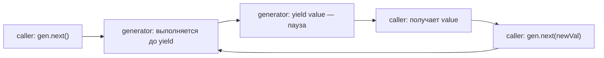

# Генераторы

## Книга с закладкой

Обычная функция — это рассказ без остановки: начал читать, дочитал до конца, закрыл. Генератор — это книга с закладкой. Можно прочитать страницу, вложить закладку, отложить книгу. Потом вернуться, вынуть закладку и продолжить с того же места. Кто-то снаружи решает, когда читать следующую страницу.

```js
function* book() {
  yield 'Страница 1'   // ← закладка, пауза
  yield 'Страница 2'   // ← закладка, пауза
  yield 'Страница 3'   // ← закладка, пауза
  // конец книги
}

const reader = book()
reader.next() // { value: 'Страница 1', done: false }
reader.next() // { value: 'Страница 2', done: false }
reader.next() // { value: 'Страница 3', done: false }
reader.next() // { value: undefined, done: true }
```

`function*` — специальный синтаксис для объявления генератора. `yield` — оператор паузы.

## Iterator Protocol: что возвращает .next()

Каждый вызов `.next()` возвращает объект `{ value, done }`:

- `value` — значение, переданное через `yield` (или `return` для финала)
- `done: false` — генератор ещё жив, можно звать дальше
- `done: true` — генератор исчерпан, `value` содержит результат `return` (или `undefined`)

```js
function* counter() {
  yield 1
  yield 2
  return 'финал'
}

const gen = counter()
gen.next() // { value: 1, done: false }
gen.next() // { value: 2, done: false }
gen.next() // { value: 'финал', done: true }
gen.next() // { value: undefined, done: true } — всегда после done: true
```

📌 `for...of` использует Iterator Protocol автоматически, но игнорирует `return`-значение (только `yield`-ы).

## Двусторонняя связь: next(value) передаёт значение В генератор

Это самая неочевидная часть. Аргумент, переданный в `.next(value)`, становится **результатом yield-выражения** внутри генератора — не следующего yield, а того, на котором генератор сейчас стоит на паузе.

```js
function* dialog() {
  const name = yield 'Как тебя зовут?'  // ← пауза 1
  const age  = yield `Привет, ${name}! Сколько тебе лет?` // ← пауза 2
  yield `${name}, тебе ${age} лет — отлично!` // ← пауза 3
}

const gen = dialog()
gen.next()           // { value: 'Как тебя зовут?', done: false }
gen.next('Алиса')   // { value: 'Привет, Алиса! Сколько тебе лет?', done: false }
gen.next(30)         // { value: 'Алиса, тебе 30 лет — отлично!', done: false }
```

⚠️ Первый вызов `next()` всегда без аргумента (или аргумент игнорируется): генератор ещё не стоит ни на каком `yield`.

## return() и throw(): досрочное завершение

**`gen.return(value)`** — принудительно завершает генератор:

```js
const gen = counter()
gen.next()           // { value: 1, done: false }
gen.return('стоп')   // { value: 'стоп', done: true }
gen.next()           // { value: undefined, done: true } — уже мёртв
```

**`gen.throw(err)`** — бросает исключение внутри генератора в точке текущей паузы:

```js
function* safe() {
  try {
    yield 'первый'
    yield 'второй'  // ← сюда прилетит ошибка
  } catch (e) {
    yield `поймал: ${e.message}`
  }
}

const gen = safe()
gen.next()                        // { value: 'первый', done: false }
gen.throw(new Error('упс'))       // { value: 'поймал: упс', done: false }
```

## yield*: делегирование другому генератору

`yield*` передаёт управление другому итерируемому объекту (генератору, массиву, строке):

```js
function* inner() {
  yield 'A'
  yield 'B'
}

function* outer() {
  yield 'start'
  yield* inner()   // делегируем — как будто A и B прямо здесь
  yield 'end'
}

[...outer()] // ['start', 'A', 'B', 'end']
```

💡 `yield*` возвращает значение `return` вложенного генератора:

```js
function* child() {
  yield 1
  return 'результат ребёнка'
}

function* parent() {
  const result = yield* child()
  console.log(result) // 'результат ребёнка'
}
```

## Ленивые вычисления: бесконечные последовательности

Генераторы вычисляют значения **по запросу** — только тогда, когда вызывают `.next()`. Это позволяет работать с бесконечными последовательностями без переполнения памяти:

```js
function* naturals() {
  let n = 0
  while (true) yield n++   // бесконечно, но не взрывает память
}

// Берём только первые 5
function take(n, gen) {
  const result = []
  for (const value of gen) {
    result.push(value)
    if (result.length >= n) break
  }
  return result
}

take(5, naturals()) // [0, 1, 2, 3, 4]
```

🔥 Сравните с жадным подходом:

```js
// Это зависнет — пытается создать бесконечный массив:
Array.from(naturals()).filter(n => n % 2 === 0).slice(0, 5)
```

## Генераторы как корутины

Генераторы — это **корутины**: функции, которые могут уступать управление и возобновляться. В отличие от обычных функций (которые запускаются и завершаются разом), корутины сохраняют свой контекст выполнения между вызовами.



## Историческая роль: co library и путь к async/await

До ES2017 (`async/await`) разработчики использовали генераторы + промисы для "плоского" асинхронного кода. Библиотека `co` от TJ Holowaychuk (2013) автоматически запускала генератор, ожидая каждый yielded промис:

```js
// Так выглядел "async/await" в 2014 году:
co(function* () {
  const user = yield fetch('/api/user')   // yield промиса → co ждёт
  const posts = yield fetch(`/api/posts/${user.id}`)
  return posts
})
```

`async/await` — это буквально синтаксический сахар над этой идеей. `async function` = генератор, `await` = `yield` промиса.

## Ключевые выводы

- `function*` + `yield` — функция с закладкой: пауза, возврат значения, возобновление
- `.next()` возвращает `{ value, done }` — heartbeat генератора
- `next(value)` передаёт данные **внутрь** — результатом текущего yield
- `return()` и `throw()` — досрочное управление жизненным циклом
- `yield*` делегирует другому итерируемому, прозрачно разворачивая его
- Ленивость генераторов = бесконечные структуры без взрыва памяти
- Генераторы — исторический предок `async/await`

## ⚠️ Частые ошибки новичков

**Ошибка 1: передавать значение в первый next()**

```js
// Плохо — первый аргумент игнорируется
function* gen() {
  const x = yield 'start'
  console.log(x) // будет undefined, если...
}
const g = gen()
g.next('ignored') // это значение выброшено — генератор ещё не на yield
g.next('hello')   // вот это дойдёт до x
```

✅ Первый `.next()` всегда без аргумента.

**Ошибка 2: ожидать, что yield* включает return-значение в for...of**

```js
function* child() {
  yield 1
  return 'finish'  // это НЕ попадёт в for...of родителя
}

function* parent() {
  yield* child()
  // 'finish' доступно только через: const r = yield* child()
}

for (const v of parent()) {
  console.log(v) // только '1', 'finish' не придёт
}
```

✅ `return`-значение вложенного генератора доступно только через `const result = yield* child()`.

**Ошибка 3: путать генераторную функцию и генератор**

```js
// function* = фабрика, каждый вызов создаёт новый генератор
function* counter() {
  yield 1; yield 2
}

const gen1 = counter()
const gen2 = counter() // независимы!

gen1.next() // { value: 1 }
gen1.next() // { value: 2 }
gen2.next() // { value: 1 } — свой счётчик
```

✅ `counter` — фабрика генераторов. `counter()` — конкретный генератор (итератор).
