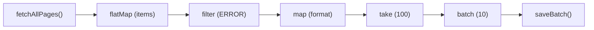

# Async-генераторы: глубокое погружение

## AsyncIterator и AsyncIterable протоколы

JavaScript определяет два тесно связанных протокола. Понять разницу — значит понять, как вся система собирается вместе.

**AsyncIterator** — объект с методом `next()`, который возвращает `Promise<IteratorResult>`:

```ts
interface AsyncIterator<T> {
  next(value?: unknown): Promise<IteratorResult<T>>
  return?(value?: unknown): Promise<IteratorResult<T>>  // опциональный
  throw?(error?: unknown): Promise<IteratorResult<T>>   // опциональный
}

interface IteratorResult<T> {
  value: T | undefined
  done: boolean
}
```

**AsyncIterable** — объект с методом `[Symbol.asyncIterator]()`, который возвращает AsyncIterator:

```ts
interface AsyncIterable<T> {
  [Symbol.asyncIterator](): AsyncIterator<T>
}
```

`for-await-of` работает с любым AsyncIterable. Сначала вызывает `[Symbol.asyncIterator]()`, получает итератор, затем в цикле вызывает `.next()` и ждёт каждый промис.

Async-генераторная функция (`async function*`) автоматически реализует оба протокола: объект-генератор сам является и AsyncIterator, и AsyncIterable.

```js
async function* gen() { yield 1; yield 2 }
const g = gen()

console.log(typeof g[Symbol.asyncIterator])  // 'function'
console.log(g[Symbol.asyncIterator]() === g) // true — возвращает сам себя
```

## Создание кастомных AsyncIterable

Иногда нужно создать объект, который ведёт себя как поток, но не является генератором:

```js
// Объект, который оборачивает WebSocket как AsyncIterable
function createWebSocketIterable(url) {
  return {
    [Symbol.asyncIterator]() {
      const ws = new WebSocket(url)
      const messageQueue = []
      let resolve = null
      let done = false

      ws.onmessage = (event) => {
        if (resolve) {
          const r = resolve
          resolve = null
          r({ value: event.data, done: false })
        } else {
          messageQueue.push(event.data)
        }
      }

      ws.onclose = () => {
        done = true
        if (resolve) resolve({ value: undefined, done: true })
      }

      return {
        next() {
          if (messageQueue.length > 0) {
            return Promise.resolve({ value: messageQueue.shift(), done: false })
          }
          if (done) {
            return Promise.resolve({ value: undefined, done: true })
          }
          return new Promise((r) => { resolve = r })
        },
        return() {
          ws.close()
          return Promise.resolve({ value: undefined, done: true })
        }
      }
    }
  }
}

// Использование:
for await (const message of createWebSocketIterable('wss://api.example.com')) {
  console.log(message)
}
```

Когда выходим из `for-await-of` через `break` — вызывается `.return()`, который закрывает WebSocket.

## Комбинирование async-генераторов: pipe и compose

Мощь async-генераторов раскрывается при создании конвейеров обработки:

```js
// Базовые трансформаторы
async function* map(iterable, fn) {
  for await (const item of iterable) {
    yield fn(item)
  }
}

async function* filter(iterable, predicate) {
  for await (const item of iterable) {
    if (predicate(item)) yield item
  }
}

async function* take(iterable, n) {
  let count = 0
  for await (const item of iterable) {
    yield item
    if (++count >= n) break  // вызывает .return() на upstream
  }
}

async function* batch(iterable, size) {
  let batch = []
  for await (const item of iterable) {
    batch.push(item)
    if (batch.length >= size) {
      yield batch
      batch = []
    }
  }
  if (batch.length > 0) yield batch
}

// Функция pipe для композиции:
function pipe(source, ...transforms) {
  return transforms.reduce((stream, transform) => transform(stream), source)
}

// Пример использования:
const result = pipe(
  fetchAllPages('/api/logs'),              // источник страниц
  (s) => flatMap(s, page => page.items),  // разворачиваем в отдельные записи
  (s) => filter(s, log => log.level === 'ERROR'),
  (s) => map(s, log => formatLog(log)),
  (s) => take(s, 100),                    // берём только первые 100
  (s) => batch(s, 10),                    // группируем по 10
)

for await (const batchOfLogs of result) {
  await saveBatch(batchOfLogs)
}
```



## Error handling в for-await-of

Ошибки в async-генераторах ведут себя как в обычных промисах:

```js
async function* resilientFetch(urls) {
  for (const url of urls) {
    try {
      const data = await fetch(url).then(r => r.json())
      yield { success: true, url, data }
    } catch (error) {
      // Локальная обработка — генератор продолжается
      yield { success: false, url, error: error.message }
    }
  }
}

// На стороне потребителя — глобальная обработка:
try {
  for await (const result of resilientFetch(urls)) {
    if (result.success) {
      processData(result.data)
    } else {
      logError(result.error)
    }
  }
} catch (fatalError) {
  // Только если генератор выбросил неперехваченную ошибку
  console.error('Фатальная ошибка потока:', fatalError)
}
```

Метод `gen.throw(error)` позволяет бросить ошибку прямо в генератор извне:

```js
async function* gen() {
  try {
    const val = yield 'ready'
    yield val
  } catch (e) {
    yield `error caught: ${e.message}`
  }
}

const g = gen()
await g.next()             // { value: 'ready', done: false }
await g.throw(new Error('boom'))  // { value: 'error caught: boom', done: false }
```

## Отмена через break и .return()

`break` в `for-await-of` не просто выходит из цикла — он вызывает `gen.return()`:

```js
async function* resourceStream() {
  const connection = await openDatabaseConnection()
  try {
    while (true) {
      const row = await connection.fetchNext()
      if (!row) break
      yield row
    }
  } finally {
    // Вызывается при: естественном завершении, break, return, исключении
    await connection.close()
    console.log('Соединение закрыто')
  }
}

// break → gen.return() → выполняется finally
for await (const row of resourceStream()) {
  if (row.id > 100) break  // закроет соединение через finally
}
```

Явный вызов `.return()`:

```js
const gen = resourceStream()
const iter = gen[Symbol.asyncIterator]()

await iter.next()   // получаем первую строку
await gen.return()  // принудительно завершаем, finally выполнится
```

## Node.js Readable streams как AsyncIterable

В Node.js 10+ все Readable потоки реализуют `Symbol.asyncIterator`:

```js
import { createReadStream } from 'fs'

async function countLines(filePath) {
  let lines = 0
  for await (const chunk of createReadStream(filePath, { encoding: 'utf8' })) {
    lines += chunk.split('\n').length - 1
  }
  return lines
}

// readline для построчного чтения:
import { createInterface } from 'readline'

async function* readCSV(filePath) {
  const rl = createInterface({
    input: createReadStream(filePath),
    crlfDelay: Infinity,
  })

  let isHeader = true
  let headers = []

  for await (const line of rl) {
    if (isHeader) {
      headers = line.split(',')
      isHeader = false
      continue
    }
    const values = line.split(',')
    yield Object.fromEntries(headers.map((h, i) => [h, values[i]]))
  }
}

for await (const row of readCSV('./data.csv')) {
  await insertIntoDb(row)
}
```

## Fetch API + ReadableStream + async iteration

В современных браузерах `response.body` — это ReadableStream, который тоже итерируемый:

```js
async function* streamJSON(url) {
  const response = await fetch(url)
  const reader = response.body.getReader()
  const decoder = new TextDecoder()
  let buffer = ''

  try {
    while (true) {
      const { done, value } = await reader.read()
      if (done) break

      buffer += decoder.decode(value, { stream: true })
      const lines = buffer.split('\n')
      buffer = lines.pop()  // неполная последняя строка — в буфер

      for (const line of lines) {
        if (line.startsWith('data: ')) {
          try {
            yield JSON.parse(line.slice(6))
          } catch {
            // пропускаем некорректный JSON
          }
        }
      }
    }
  } finally {
    reader.cancel()
  }
}

// Server-Sent Events через async generator:
for await (const event of streamJSON('/api/events')) {
  updateUI(event)
}
```

В Node.js 18+ можно использовать `ReadableStream.from()` для конвертации async-генератора в поток:

```js
const readableStream = ReadableStream.from(myAsyncGenerator())
```

## Координация нескольких потоков: merge

Стандартный `for-await-of` обрабатывает потоки последовательно. Для параллельного merge:

```js
async function* merge(...iterables) {
  const queue = []
  let resolve = null

  const push = (item) => {
    if (resolve) {
      const r = resolve
      resolve = null
      r(item)
    } else {
      queue.push(item)
    }
  }

  // Запускаем все потоки параллельно
  let activeCount = iterables.length
  for (const iterable of iterables) {
    ;(async () => {
      for await (const item of iterable) {
        push({ value: item, done: false })
      }
      if (--activeCount === 0) push({ done: true })
    })()
  }

  while (true) {
    const item = queue.length > 0
      ? queue.shift()
      : await new Promise((r) => { resolve = r })
    if (item.done) break
    yield item.value
  }
}

// Три параллельных источника:
for await (const event of merge(stream1(), stream2(), stream3())) {
  handle(event)
}
```

## Типизация в TypeScript

```ts
// Полная типизация async-генератора
async function* fetchUsers(): AsyncGenerator<User, void, undefined> {
  //                                         ^^^^^  ^^^^  ^^^^^^^^^
  //                                         yield  return  next()
  let page = 1
  while (true) {
    const users: User[] = await api.getUsers(page)
    if (users.length === 0) return  // done: true, value: void
    for (const user of users) yield user
    page++
  }
}

// AsyncIterable для объектов:
interface EventSource<T> extends AsyncIterable<T> {
  close(): void
}

// Утилитарные типы:
type AsyncIterableValue<T> = T extends AsyncIterable<infer V> ? V : never
// AsyncIterableValue<AsyncGenerator<User>> → User
```

## Производительность и подводные камни

```js
// Медленно: await в цикле — запросы последовательны
async function* slowPages() {
  for (let i = 1; i <= 5; i++) {
    yield await fetch(`/page/${i}`).then(r => r.json())  // 5 последовательных запросов
  }
}

// Быстрее: prefetch следующей страницы пока обрабатываем текущую
async function* prefetchPages() {
  let nextPage = fetch('/page/1').then(r => r.json())
  for (let i = 1; i <= 5; i++) {
    const current = await nextPage
    if (i < 5) nextPage = fetch(`/page/${i + 1}`).then(r => r.json())
    yield current
  }
}
```

```js
// Утечка памяти: генератор не завершён, ресурсы не освобождены
const gen = resourceIntensiveStream()
const first = await gen.next()  // взяли первое значение
// забыли вызвать gen.return() — соединение висит

// Правильно: всегда завершайте генератор
try {
  const first = await gen.next()
  // обработка
} finally {
  await gen.return()  // гарантированно освобождаем ресурсы
}
```
