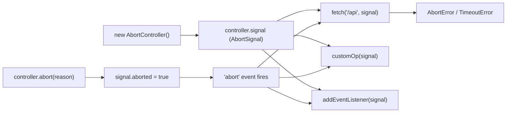

# AbortController: под капотом и продвинутые паттерны

## История: откуда взялся AbortController

До стандартизации AbortController (2017) у каждой библиотеки был свой механизм отмены. axios использовал CancelToken — специальный объект, который передавался в конфиг запроса. RxJS использовал Subscription с методом unsubscribe(). Каждый подход несовместим с другим.

AbortController появился в спецификации WHATWG Fetch как общий механизм отмены для Web API. Сегодня его поддерживают `fetch`, `addEventListener`, некоторые методы Web API и Node.js с версии 15.

## Под капотом: AbortSignal extends EventTarget

`AbortSignal` — это не просто флаг. Это полноценный `EventTarget`:

```js
const controller = new AbortController()
const signal = controller.signal

// Это стандартный EventTarget!
signal instanceof EventTarget // true

// Можно добавлять несколько обработчиков
signal.addEventListener('abort', () => console.log('первый'))
signal.addEventListener('abort', () => console.log('второй'))

controller.abort()
// 'первый'
// 'второй'
```

`fetch` внутри регистрирует обработчик `abort` на переданный сигнал. Когда `abort()` вызывается, событие распространяется, `fetch` получает уведомление и отменяет HTTP-запрос.

## Почему нельзя переиспользовать controller после abort()

`AbortSignal` — одноразовый. После того как `abort()` вызван:
- `signal.aborted` навсегда становится `true`
- повторный вызов `abort()` — безопасен (идемпотентен), но ничего не меняет
- любой `fetch` с этим сигналом немедленно упадёт с `AbortError`

```js
const ctrl = new AbortController()
ctrl.abort()

// Этот fetch упадёт немедленно — signal уже aborted
fetch('/api', { signal: ctrl.signal })
  .catch(err => console.log(err.name)) // 'AbortError'

// Правило: один контроллер = одна "жизнь"
// Для нового запроса — new AbortController()
```

## Паттерн: передача signal вглубь цепочки вызовов

Signal должен течь сквозь всю цепочку операций — как вода по трубам:

```js
async function loadUserProfile(userId, signal) {
  // Уровень 1: HTTP-запрос
  const userRes = await fetch(`/api/users/${userId}`, { signal })
  const user = await userRes.json()

  // Проверяем aborted перед тяжёлой обработкой
  if (signal.aborted) throw signal.reason

  // Уровень 2: зависимый запрос
  const postsRes = await fetch(`/api/users/${userId}/posts`, { signal })
  const posts = await postsRes.json()

  // Уровень 3: трансформация
  return transformUserData(user, posts, signal)
}

async function transformUserData(user, posts, signal) {
  // Длинная синхронная операция — проверяем сигнал периодически
  const result = []
  for (const post of posts) {
    if (signal.aborted) throw signal.reason
    result.push(expensiveTransform(post))
  }
  return result
}

// Вызов:
const controller = new AbortController()
loadUserProfile(42, controller.signal)
  .catch(err => {
    if (err.name === 'AbortError') console.log('Отменено')
  })

setTimeout(() => controller.abort(), 2000)
```

## AbortController для любых операций

Не только для `fetch` — для любых отменяемых операций:

### setTimeout с возможностью отмены

```js
function abortableTimeout(ms, signal) {
  return new Promise((resolve, reject) => {
    const timer = setTimeout(resolve, ms)
    signal?.addEventListener('abort', () => {
      clearTimeout(timer)
      reject(signal.reason)
    }, { once: true })
  })
}
```

### addEventListener с автоотпиской через signal

Малоизвестная возможность: `addEventListener` принимает `signal` в опциях — при `abort()` слушатель автоматически удаляется:

```js
const controller = new AbortController()

document.addEventListener('keydown', handler, {
  signal: controller.signal  // автоматически removeEventListener при abort!
})

// Вместо ручного removeEventListener:
controller.abort() // обработчик удалён
```

### Async generators с поддержкой отмены

```js
async function* generateWithAbort(items, signal) {
  for (const item of items) {
    if (signal.aborted) return  // завершаем генератор
    yield await processItem(item, signal)
  }
}

const ctrl = new AbortController()
for await (const result of generateWithAbort(data, ctrl.signal)) {
  if (shouldStop) ctrl.abort()
}
```

## Полная диаграмма flow отмены



## AbortSignal.any: как он работает внутри

`AbortSignal.any([s1, s2, s3])` создаёт новый AbortSignal, который срабатывает при первом срабатывании любого из переданных сигналов:

```js
const combined = AbortSignal.any([
  userSignal,
  AbortSignal.timeout(5000),
  parentSignal,
])

// combined.aborted === true когда первый из трёх сработал
// combined.reason === reason первого сработавшего
```

Это аналог `Promise.race`, но для сигналов.

## Node.js: AbortController с версии 15

В Node.js AbortController работает нативно начиная с v15, без полифиллов:

```js
import { setTimeout as setTimeoutPromise } from 'timers/promises'

const ctrl = new AbortController()

// Отменяемый sleep в Node.js
await setTimeoutPromise(5000, undefined, { signal: ctrl.signal })
  .catch(err => {
    if (err.name === 'AbortError') console.log('Прерван!')
  })

// fetch в Node.js 18+ тоже принимает signal
const response = await fetch('https://api.example.com', {
  signal: AbortSignal.timeout(3000)
})
```

## Миграция с axios CancelToken на AbortController

Старый axios (до v0.22) использовал CancelToken. Начиная с v0.22 axios поддерживает AbortController:

```js
// Старый способ (deprecated):
const source = axios.CancelToken.source()
axios.get('/api', { cancelToken: source.token })
source.cancel('Причина')

// Новый способ (axios >= 0.22):
const controller = new AbortController()
axios.get('/api', { signal: controller.signal })
controller.abort()
```

## AbortController + React Query / SWR

Современные библиотеки для fetching автоматически интегрируют AbortController:

```js
// React Query передаёт signal в queryFn:
const query = useQuery({
  queryKey: ['users'],
  queryFn: async ({ signal }) => {
    const res = await fetch('/api/users', { signal })
    return res.json()
  }
})
// При unmount компонента или при повторном запросе — signal автоматически aborted
```

## Продвинутый паттерн: AbortController как lifetime менеджер

AbortController можно использовать как сигнал "жизни" для целого компонента или модуля:

```js
class DataService {
  private controller = new AbortController()

  async loadData(url) {
    return fetch(url, { signal: this.controller.signal })
  }

  subscribeToEvents() {
    window.addEventListener('resize', this.handleResize, {
      signal: this.controller.signal  // автоотписка при dispose
    })
  }

  dispose() {
    // Отменяет все fetch, удаляет все addEventListener
    this.controller.abort()
  }
}
```

## Частые ошибки: продвинутый уровень

⚠️ **Ошибка: проверять только AbortError, игнорируя TimeoutError**

```js
// Плохо — TimeoutError от AbortSignal.timeout() не поймаем:
catch (err) {
  if (err.name === 'AbortError') { /* только это */ }
}

// Хорошо:
catch (err) {
  if (err.name === 'AbortError' || err.name === 'TimeoutError') {
    // обе причины отмены
  }
}
```

⚠️ **Ошибка: signal в then/catch, но не в вложенных fetch**

```js
// Плохо: только первый fetch отменяется
async function loadAll(signal) {
  const a = await fetch('/api/a', { signal })
  const b = await fetch('/api/b')  // забыли signal!
  return { a, b }
}

// Хорошо: signal везде
async function loadAll(signal) {
  const a = await fetch('/api/a', { signal })
  const b = await fetch('/api/b', { signal })
  return { a, b }
}
```
