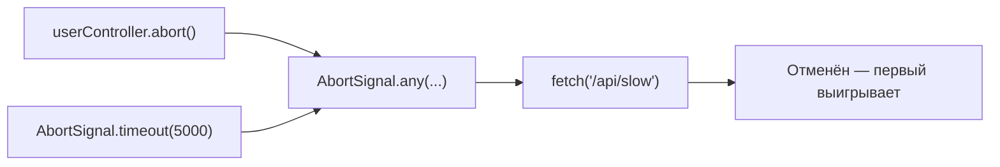

# AbortController и отмена асинхронных операций

## Проблема: как остановить то, что уже запущено?

Представьте пульт дистанционного управления для телевизора. Вы переключаете канал — телевизор начинает загружать передачу. Нажали снова — нужно прервать загрузку первой и начать вторую. Именно такой "пульт" для асинхронных операций — `AbortController`.

До его появления разработчики придумывали флаги-переменные, оборачивали Promise в гонку с таймерами. С AbortController всё стало структурированным и стандартным.

## AbortController и AbortSignal: базовые концепции

```js
const controller = new AbortController()
const signal = controller.signal   // AbortSignal

// signal.aborted → false (изначально)
// signal.reason  → undefined

controller.abort(new Error('Причина отмены'))

// signal.aborted → true
// signal.reason  → Error: Причина отмены
```

`AbortController` — это кнопка. `AbortSignal` — это провод, который идёт от кнопки к операции. Один контроллер, много слушателей.

## Отмена fetch

```js
const controller = new AbortController()

fetch('/api/data', { signal: controller.signal })
  .then(r => r.json())
  .then(data => console.log(data))
  .catch(err => {
    if (err.name === 'AbortError') {
      console.log('Запрос отменён')
    }
  })

// Где-то позже:
controller.abort()
```

`fetch` автоматически слушает `signal`. При вызове `abort()` промис отклоняется с `DOMException { name: 'AbortError' }`.

## controller.abort(reason): опциональная причина

```js
// Причиной может быть любое значение
controller.abort('timeout')
controller.abort(new DOMException('Пользователь нажал Стоп', 'AbortError'))
controller.abort(new Error('Превышен лимит попыток'))

// Читаем причину:
signal.addEventListener('abort', () => {
  console.log(signal.reason) // то, что передали в abort()
})
```

## signal.addEventListener('abort', handler)

Слушать событие отмены можно напрямую — полезно для пользовательских операций:

```js
function delayWithAbort(ms, signal) {
  return new Promise((resolve, reject) => {
    const timer = setTimeout(resolve, ms)
    signal.addEventListener('abort', () => {
      clearTimeout(timer)
      reject(signal.reason)
    })
  })
}
```

## AbortSignal.timeout(ms): встроенный таймаут

Не нужен `Promise.race` с таймером — есть готовый инструмент:

```js
// Раньше:
const result = await Promise.race([
  fetch('/api'),
  new Promise((_, reject) => setTimeout(() => reject(new Error('timeout')), 3000))
])

// Теперь:
const response = await fetch('/api', {
  signal: AbortSignal.timeout(3000)
})
// Если не ответит за 3с → выбросит TimeoutError (не AbortError!)
```

💡 Обратите внимание: `AbortSignal.timeout` бросает `TimeoutError`, а `controller.abort()` бросает `AbortError`. Это позволяет различить причину отмены.

## AbortSignal.any([...signals]): составные сигналы

Отмена при ПЕРВОМ срабатывании из нескольких источников:

```js
const userController = new AbortController()

const combined = AbortSignal.any([
  userController.signal,        // пользователь нажал "Отмена"
  AbortSignal.timeout(5000),    // или 5 секунд прошло
])

fetch('/api/slow', { signal: combined })
  .catch(err => {
    if (err.name === 'AbortError')   { /* пользователь */ }
    if (err.name === 'TimeoutError') { /* таймаут */ }
  })
```



## Обработка AbortError: try/catch + signal.aborted

```js
async function loadData(signal) {
  try {
    const response = await fetch('/api/data', { signal })
    const data = await response.json()
    return data
  } catch (err) {
    if (err.name === 'AbortError') {
      // Нормальная ситуация — не логировать как ошибку
      return null
    }
    throw err // Настоящие ошибки пробрасываем дальше
  }
}
```

⚠️ Никогда не проглатывайте все ошибки в `catch` — проверяйте `err.name === 'AbortError'` явно.

## React useEffect cleanup: зачем отменять запросы

```js
useEffect(() => {
  const controller = new AbortController()

  fetch(`/search?q=${query}`, { signal: controller.signal })
    .then(r => r.json())
    .then(setResults)
    .catch(err => {
      if (err.name !== 'AbortError') setError(err)
    })

  // Cleanup: вызывается при изменении query или размонтировании
  return () => controller.abort()
}, [query])
```

Без cleanup: если пользователь быстро меняет запрос, несколько fetch выполняются параллельно. Медленный старый запрос может вернуться позже быстрого нового — и перезаписать результаты. Это race condition.

## Частые ошибки новичков

⚠️ **Ошибка 1: Переиспользование контроллера после abort()**

```js
// Плохо:
const controller = new AbortController()
controller.abort()
controller.abort() // OK, но signal уже aborted — нельзя "сбросить"
fetch('/api', { signal: controller.signal }) // немедленно AbortError!

// Хорошо: создавайте новый контроллер для каждой операции
const controller = new AbortController()
```

⚠️ **Ошибка 2: Проглатывание всех ошибок**

```js
// Плохо:
catch (err) { /* молчим */ }

// Хорошо:
catch (err) {
  if (err.name !== 'AbortError') throw err // или логируем
}
```

⚠️ **Ошибка 3: Забытый cleanup в useEffect**

```js
// Плохо — race condition!
useEffect(() => {
  fetch(`/api?q=${query}`).then(setData)
}, [query])

// Хорошо:
useEffect(() => {
  const ctrl = new AbortController()
  fetch(`/api?q=${query}`, { signal: ctrl.signal }).then(setData)
  return () => ctrl.abort()
}, [query])
```
