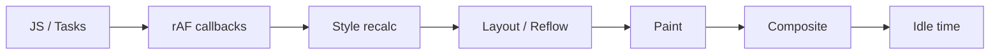

# requestAnimationFrame и requestIdleCallback: расширенная теория

## Анатомия кадра браузера

Каждый кадр браузер проходит чёткий конвейер. Нарушение любого этапа ломает плавность:



### Что происходит на каждом этапе

**JS / Tasks** — выполняются макрозадачи (setTimeout, события) и микрозадачи (Promise.then, queueMicrotask). Именно здесь обновляется состояние приложения.

**rAF callbacks** — все колбэки, зарегистрированные через `requestAnimationFrame`, вызываются в порядке регистрации. Это последний шанс изменить DOM перед рендером.

**Style recalculation** — браузер пересчитывает применённые CSS-правила для каждого элемента. Изменение классов или inline-стилей в rAF триггерит этот этап.

**Layout / Reflow** — вычисляются размеры и позиции элементов. Самый дорогой этап. Чтение `offsetWidth`, `getBoundingClientRect` в рамках того же кадра, что и запись стилей — вызывает **forced layout** (синхронный reflow).

**Paint** — пиксели отрисовываются в растровые буферы. Изменение `color`, `background`, `box-shadow` без изменения размеров — только paint, без layout.

**Composite** — слои (layers) объединяются GPU и выводятся на экран. Изменение только `transform` или `opacity` — только composite, без layout и paint. Это самые дешёвые анимации.

**Idle time** — время между завершением кадра и дедлайном следующего. Здесь работает `requestIdleCallback`.

## Long Tasks и их влияние на UX

**Long Task** — любая JS-задача, выполняющаяся дольше 50ms. Chrome DevTools выделяет их красными треугольниками в Performance панели.

Почему 50ms? Исследования UX показывают:
- до 100ms — отклик ощущается как мгновенный
- 100–300ms — заметна задержка, но приемлемо
- более 300ms — пользователь чувствует "зависание"

Правило 50ms даёт буфер: задача 50ms + рендер = ~66ms, что ещё в пределах приемлемого.

```js
// Измерение Long Tasks через PerformanceObserver
const observer = new PerformanceObserver((list) => {
  list.getEntries().forEach((entry) => {
    console.log('Long Task:', entry.duration, 'ms')
  })
})
observer.observe({ entryTypes: ['longtask'] })
```

## cancelIdleCallback

```js
const ricId = requestIdleCallback(work, { timeout: 2000 })

// Если задача больше не нужна (компонент размонтирован, запрос отменён):
cancelIdleCallback(ricId)
```

Важно в React — очищайте rIC в `useEffect` cleanup так же, как rAF:

```js
useEffect(() => {
  const ricId = requestIdleCallback(backgroundWork)
  return () => cancelIdleCallback(ricId)
}, [])
```

## scheduler.postTask() — современный API планирования

`scheduler.postTask()` — новый стандартный API (Chromium 94+) для явного управления приоритетами задач:

```js
// Три уровня приоритета:
scheduler.postTask(urgentWork, { priority: 'user-blocking' }) // как microtask
scheduler.postTask(normalWork, { priority: 'user-visible' })  // как rAF
scheduler.postTask(bgWork,     { priority: 'background' })    // как rIC

// Отмена через AbortController:
const controller = new TaskController({ priority: 'background' })
scheduler.postTask(work, { signal: controller.signal })
controller.abort() // отменить задачу
```

Преимущество над rIC: поддержка приоритетов, явная отмена, работа в контексте воркеров.

## scheduler.yield() — "уступить управление"

`scheduler.yield()` — экспериментальный API для кооперативной уступки управления прямо из async-функции:

```js
async function processItems(items) {
  for (let i = 0; i < items.length; i++) {
    process(items[i])

    // Каждые 50 элементов уступаем управление браузеру
    if (i % 50 === 0) {
      await scheduler.yield() // браузер может обработать события
    }
  }
}
```

Это элегантнее ручного `setTimeout(chunk, 0)` — не нужно разрывать логику на части.

## isInputPending() — проверка ожидающего ввода

`navigator.scheduling.isInputPending()` — API для проверки: есть ли пользовательские события (клик, ввод) в очереди? Позволяет прервать фоновую работу только когда это реально нужно:

```js
function processChunk(items, cursor) {
  const deadline = performance.now() + 5 // 5ms бюджет

  while (cursor < items.length) {
    // Прерваться если пользователь кликнул ИЛИ время вышло
    if (navigator.scheduling.isInputPending() || performance.now() > deadline) {
      setTimeout(() => processChunk(items, cursor), 0)
      return
    }
    process(items[cursor++])
  }
  onComplete()
}
```

Это лучше чем просто `setTimeout` — прерываемся только при реальной необходимости, не тратя время на лишние yield-ы.

## React Scheduler: аналог rIC изнутри

React не использует нативный `requestIdleCallback` — у него есть собственный планировщик `@react/scheduler`. Причины:

1. rIC не поддерживается в React Native и Node.js
2. rIC имеет ограниченный API — нет приоритетов
3. React нужен более точный контроль

React использует `MessageChannel` для постановки задач с высоким приоритетом и `setTimeout(fn, 1)` как fallback. Задачи делятся на 5 приоритетов:

```
ImmediatePriority    — синхронно (setState в обработчиках событий)
UserBlockingPriority — 250ms (hover, фокус)
NormalPriority       — 5000ms (обычные обновления)
LowPriority          — 10000ms (офлайн-данные)
IdlePriority         — никогда не истекает (prefetch)
```

React Fiber использует кооперативную многозадачность — рендеринг разбивается на "единицы работы" (fiber nodes), между которыми React проверяет, не нужно ли уступить управление.

## Cooperative Scheduling: философия

Идея кооперативного планирования пришла из операционных систем. В отличие от вытесняющей многозадачности (где ОС принудительно переключает задачи), кооперативная требует, чтобы задачи сами добровольно уступали управление.

JavaScript работает именно так: Event Loop не может прервать выполняющуюся задачу — только дождаться, пока она сама завершится или уступит управление через `await`, `yield`, `setTimeout`, `requestIdleCallback`.

```
Плохо: "Я возьму всё процессорное время и сделаю всё сразу"
Хорошо: "Я сделаю чуть-чуть, проверю нет ли срочных задач, сделаю ещё чуть-чуть"
```

Паттерн реализации:

```js
async function cooperativeTask(items) {
  const BUDGET_MS = 5    // ms бюджет на одну итерацию
  let cursor = 0

  while (cursor < items.length) {
    const start = performance.now()

    // Работаем в рамках бюджета
    while (cursor < items.length && performance.now() - start < BUDGET_MS) {
      process(items[cursor++])
    }

    // Уступаем управление
    if (cursor < items.length) {
      await new Promise(resolve => setTimeout(resolve, 0))
    }
  }
}
```

## Производительность анимаций: только transform и opacity

Самые дешёвые анимации — те, что не вызывают Layout и Paint:

```js
// Плохо — триггерит Layout + Paint каждый кадр
element.style.left = x + 'px'
element.style.width = w + 'px'

// Хорошо — только Composite (GPU layer)
element.style.transform = `translateX(${x}px)`
element.style.opacity = String(alpha)
```

`will-change: transform` — подсказка браузеру создать отдельный GPU-слой заранее:

```css
.animated {
  will-change: transform; /* создать layer заранее */
}
```

⚠️ Не злоупотребляйте `will-change` — каждый layer потребляет GPU-память.

## Forced Layout: скрытая ловушка

Чтение геометрических свойств DOM сразу после записи стилей (в том же кадре) вызывает синхронный reflow:

```js
// Плохо — thrashing: write → read → write → read
elements.forEach(el => {
  el.style.width = '100px'           // write
  const height = el.offsetHeight    // read → forced layout!
  el.style.height = height + 'px'   // write
})

// Хорошо — читаем всё, потом пишем всё
const heights = elements.map(el => el.offsetHeight) // read
elements.forEach((el, i) => {
  el.style.width = '100px'           // write
  el.style.height = heights[i] + 'px' // write
})
```

`requestAnimationFrame` помогает — все reads делать в начале колбэка, все writes — после:

```js
requestAnimationFrame(() => {
  // Read phase
  const rect = element.getBoundingClientRect()

  // Write phase (без forced layout)
  element.style.transform = `translateX(${rect.width}px)`
})
```

## Итог: когда что использовать

| Задача | Инструмент |
|---|---|
| Плавная анимация | `requestAnimationFrame` |
| Анимация без rAF | CSS animations / transitions |
| Тяжёлая обработка в фоне | `requestIdleCallback` |
| Срочные задачи | синхронно / `queueMicrotask` |
| Параллельные вычисления | `Web Worker` |
| Явные приоритеты (Chromium) | `scheduler.postTask()` |
| Yield в async-функции | `scheduler.yield()` |
