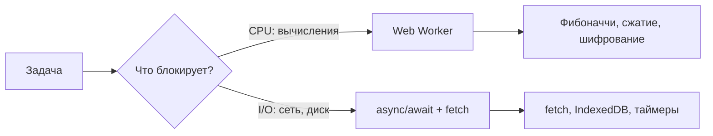

# Web Workers: углублённое изучение

## Три типа Worker'ов: в чём разница

В браузере существуют три вида воркеров, и их часто путают:

| Характеристика | Dedicated Worker | SharedWorker | ServiceWorker |
|---|---|---|---|
| Жизненный цикл | Пока страница открыта | Пока есть хоть одна вкладка | Независим от страниц |
| Доступ | Только одна страница | Несколько вкладок одного origin | Перехватывает fetch |
| Создание | `new Worker(url)` | `new SharedWorker(url)` | `navigator.serviceWorker.register()` |
| Главное применение | CPU-bound задачи | Кросс-вкладочный стейт | Оффлайн, push-уведомления |
| Связь | `postMessage` / `onmessage` | Через `MessagePort` | `postMessage` через `clients` |

**ServiceWorker** — не для вычислений, а для перехвата сетевых запросов и кэширования. Не путайте с Dedicated Worker.

## importScripts vs ES-модули в Worker

**Classic Worker** (старый способ) — загружает скрипты синхронно:

```js
// worker.js (classic)
importScripts('/lib/lodash.js', '/lib/math-utils.js')

self.onmessage = function(e) {
  // lodash и math-utils доступны
  const result = _.chunk(e.data, 10)
  self.postMessage(result)
}
```

**Module Worker** (современный) — поддерживает `import/export`, tree-shaking:

```js
// Создание Module Worker
const worker = new Worker('/worker.js', { type: 'module' })
```

```js
// worker.js (module)
import { heavyCalc } from './calc.js'  // ES import

self.onmessage = async (e) => {
  const result = await heavyCalc(e.data)
  self.postMessage(result)
}
```

Поддержка Module Workers: Chrome 80+, Firefox 114+, Safari 15+. Для legacy проектов используйте `importScripts`.

## OffscreenCanvas — рендеринг в Worker

Worker не имеет доступа к DOM и `<canvas>`, но `OffscreenCanvas` позволяет рисовать в Worker:

```js
// Главный поток
const canvas = document.getElementById('myCanvas')
const offscreen = canvas.transferControlToOffscreen()

const worker = new Worker('render-worker.js')
// Передаём контроль над canvas в Worker (Transferable!)
worker.postMessage({ canvas: offscreen }, [offscreen])
// После этого canvas.getContext() в главном потоке недоступен
```

```js
// render-worker.js
self.onmessage = function(e) {
  const canvas = e.data.canvas
  const ctx = canvas.getContext('2d')

  // Рендерим в Worker — главный поток свободен
  function renderFrame() {
    ctx.clearRect(0, 0, canvas.width, canvas.height)
    ctx.fillStyle = 'blue'
    ctx.fillRect(Math.random() * 400, Math.random() * 400, 50, 50)
    requestAnimationFrame(renderFrame) // rAF доступен в Worker!
  }
  renderFrame()
}
```

Применение: WebGL-игры, 3D-визуализации, тяжёлые canvas-анимации.

## MessageChannel и MessagePort — прямая связь между Worker'ами

По умолчанию Workers не могут общаться напрямую — только через главный поток. `MessageChannel` создаёт пару портов для прямой связи:

```js
// Главный поток
const channel = new MessageChannel()
// port1 — воркер 1, port2 — воркер 2
worker1.postMessage({ port: channel.port1 }, [channel.port1])
worker2.postMessage({ port: channel.port2 }, [channel.port2])

// Теперь worker1 и worker2 общаются напрямую, без главного потока
```

```js
// worker1.js
let directPort
self.onmessage = function(e) {
  if (e.data.port) {
    directPort = e.data.port
    directPort.onmessage = (msg) => console.log('От worker2:', msg.data)
  }
}

function sendToWorker2(data) {
  directPort.postMessage(data)
}
```


## Comlink — прозрачный RPC поверх postMessage

`postMessage` неудобен для сложных API. Библиотека [Comlink](https://github.com/GoogleChromeLabs/comlink) оборачивает Worker в Proxy, делая вызовы прозрачными:

```js
// worker.js
import * as Comlink from 'comlink'

const api = {
  async calculateFib(n) {
    return fib(n)
  },
  async processImage(imageData) {
    return applyFilter(imageData)
  }
}

Comlink.expose(api)
```

```js
// main.js
import * as Comlink from 'comlink'

const worker = new Worker('worker.js')
const api = Comlink.wrap(worker)

// Вызов выглядит как обычный async вызов!
const result = await api.calculateFib(42)
console.log(result) // 267914296

// Нет явного postMessage, нет слушателей onmessage
```

Comlink автоматически:
- Оборачивает вызовы в postMessage
- Передаёт аргументы и возвращает результат через Promise
- Поддерживает Transferable объекты через `Comlink.transfer()`

## Worker Threads в Node.js

Node.js реализует многопоточность через `worker_threads` (Node.js 10.5+):

```js
// main.js
import { Worker, isMainThread, parentPort, workerData } from 'worker_threads'

if (isMainThread) {
  // Запуск как основной поток
  const worker = new Worker('./worker.js', {
    workerData: { n: 42 }  // Данные передаются при создании (без postMessage)
  })

  worker.on('message', (result) => console.log('Результат:', result))
  worker.on('error', (err) => console.error('Ошибка:', err))
  worker.on('exit', (code) => console.log('Завершён с кодом:', code))
} else {
  // Запуск как Worker
  const { n } = workerData
  const result = fib(n)
  parentPort.postMessage(result)
}
```

Ключевые отличия от Browser Web Workers:

```js
// Node.js Worker: доступен весь Node.js API
const { readFileSync } = require('fs')  // ✅
const { createHash } = require('crypto') // ✅

// Передача данных запуска
new Worker(filename, { workerData: { key: 'value' } })
// Внутри: workerData.key === 'value' — без postMessage!

// SharedArrayBuffer без COOP/COEP заголовков (в отличие от браузера)
const sab = new SharedArrayBuffer(4)
```

## SharedArrayBuffer и Atomics

Для настоящей разделяемой памяти между потоками используется `SharedArrayBuffer`:

```js
// Главный поток
const sab = new SharedArrayBuffer(4) // 4 байта разделяемой памяти
const view = new Int32Array(sab)

worker.postMessage({ sab })

// Синхронное ожидание через Atomics (только в Worker, не в главном потоке!)
// В главном потоке: Atomics.wait() запрещён
```

```js
// worker.js
self.onmessage = function(e) {
  const view = new Int32Array(e.data.sab)
  Atomics.store(view, 0, 42)    // атомарная запись
  Atomics.notify(view, 0, 1)    // уведомить ждущих потоков
}
```

⚠️ Для использования `SharedArrayBuffer` в браузере необходимы HTTP-заголовки:
```
Cross-Origin-Opener-Policy: same-origin
Cross-Origin-Embedder-Policy: require-corp
```

## Когда использовать Worker: CPU-bound vs I/O-bound



**Используйте Worker для:**
- Тяжёлые математические вычисления (криптография, ML-инференс)
- Обработка больших массивов данных (сортировка, фильтрация)
- Сжатие/распаковка (gzip, zip)
- Парсинг больших JSON/CSV
- Обработка изображений (без GPU)
- Компиляция/трансформация кода

**НЕ используйте Worker для:**
- HTTP-запросы — `fetch` уже неблокирующий
- Таймеры — `setTimeout` не блокирует
- Работа с DOM — Worker не имеет доступа
- Простые операции (< 5ms) — overhead воркера не оправдан

## Производительность и накладные расходы

| Операция | Стоимость |
|---|---|
| Создание Worker | ~5-20ms (парсинг, инициализация) |
| postMessage (1KB) | ~0.01ms |
| postMessage (1MB, clone) | ~10ms |
| postMessage (1MB, transfer) | ~0.01ms (мгновенно) |
| postMessage (100MB, clone) | ~1000ms |
| postMessage (100MB, transfer) | ~0.1ms |

Выводы:
- Создавайте Worker один раз, используйте через пул
- Для больших ArrayBuffer всегда используйте Transfer
- Не создавайте Worker для задач < 50ms — overhead не оправдан

## Паттерн: обёртка Worker в Promise

```js
function runInWorker<T, R>(fn: (data: T) => R, data: T): Promise<R> {
  return new Promise((resolve, reject) => {
    const code = `
      self.onmessage = function(e) {
        try {
          const result = (${fn.toString()})(e.data)
          self.postMessage({ ok: true, result })
        } catch (err) {
          self.postMessage({ ok: false, error: err.message })
        }
      }
    `
    const blob = new Blob([code], { type: 'application/javascript' })
    const worker = new Worker(URL.createObjectURL(blob))

    worker.onmessage = (e) => {
      worker.terminate()
      if (e.data.ok) resolve(e.data.result)
      else reject(new Error(e.data.error))
    }

    worker.onerror = (e) => {
      worker.terminate()
      reject(new Error(e.message))
    }

    worker.postMessage(data)
  })
}

// Использование
const result = await runInWorker((n: number) => {
  // Этот код выполнится в Worker
  function fib(x: number): number {
    return x <= 1 ? x : fib(x-1) + fib(x-2)
  }
  return fib(n)
}, 42)
```
