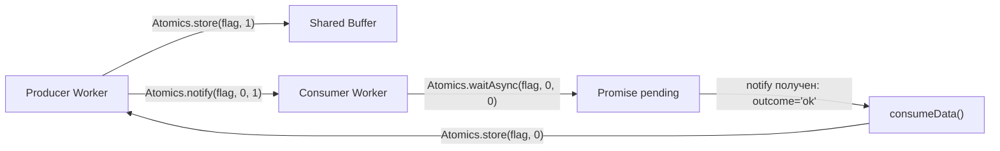

# SharedArrayBuffer и Atomics: углублённая теория

## История: от Spectre до COOP/COEP

В январе 2018 года исследователи раскрыли уязвимости **Spectre и Meltdown** — атаки на спекулятивное выполнение процессора. SharedArrayBuffer оказался ключевым инструментом для точного измерения времени (с точностью до наносекунд), необходимого для эксплойтов Spectre.

Браузеры немедленно отключили `SharedArrayBuffer` глобально. Вернули его только в 2020 году, когда появился механизм **Cross-Origin Isolation**:

```
HTTP/1.1 200 OK
Cross-Origin-Opener-Policy: same-origin
Cross-Origin-Embedder-Policy: require-corp
```

Эти заголовки изолируют страницу от других источников, делая атаки Spectre через высокоточные таймеры неэффективными.

```js
// Проверить, доступен ли SAB
if (self.crossOriginIsolated) {
  console.log('SharedArrayBuffer доступен')
  const sab = new SharedArrayBuffer(4)
} else {
  console.log('Нет COOP/COEP — SAB заблокирован')
}
```

## Модель памяти JavaScript: happens-before

JavaScript спецификация (ECMAScript) определяет **модель памяти** — правила, гарантирующие порядок видимости операций между потоками.

Ключевое понятие — **happens-before** (произошло-до): если операция A "happens-before" операцией B, то B видит результаты A.

Без специальных механизмов синхронизации порядок операций между потоками **не гарантирован**. Atomics обеспечивает **sequential consistency** — операции Atomics наблюдаются всеми потоками в одном порядке.

```
Поток A:                    Поток B:
Atomics.store(arr, 0, 1)    
                            Atomics.load(arr, 0)  // гарантированно видит 1
```

Обычная запись `arr[0] = 1` без Atomics не даёт таких гарантий — компилятор или процессор может переупорядочить инструкции.

## Atomics.wait() vs Atomics.waitAsync()

### Blocking wait — только в Worker

```js
// Только в Worker! Блокирует поток до получения notify или timeout
const outcome = Atomics.wait(arr, 0, 0, 5000)
// 'ok'          — получили Atomics.notify()
// 'not-equal'   — arr[0] уже не равно 0 в момент вызова
// 'timed-out'   — истекло 5000 мс
```

`Atomics.wait` реализует настоящий futex (fast userspace mutex) — ядро ОС паркует поток без busy waiting. Эффективно для длительного ожидания.

### Non-blocking waitAsync — для main thread и Worker'ов

```js
// Можно вызывать в главном потоке — не блокирует Event Loop
const { async: isAsync, value } = Atomics.waitAsync(arr, 0, 0)

if (!isAsync) {
  // Синхронный результат: 'not-equal'
  console.log(value) // arr[0] уже изменился до вызова
} else {
  // Асинхронный результат: Promise
  value.then(outcome => {
    // 'ok' или 'timed-out'
  })
}
```

`waitAsync` — более новый API (ES2024), доступен не во всех окружениях. В Node.js появился в версии 16.

## Lock-free vs Wait-free алгоритмы

### Lock-free

Алгоритм **lock-free**, если хотя бы один поток всегда продвигается вперёд, даже если другие заблокированы. Используется `compareExchange`:

```js
// Lock-free стек (push):
function push(stackTop, newNode) {
  let old
  do {
    old = Atomics.load(stackTop, 0)
    newNode.next = old
    // Повторяем, если другой поток успел изменить head
  } while (Atomics.compareExchange(stackTop, 0, old, newNode.id) !== old)
}
```

### Wait-free

**Wait-free** — каждый поток завершает операцию за ограниченное число шагов, независимо от других. Более строгая гарантия, сложнее реализовать. `Atomics.add` — пример wait-free операции.

```js
// Wait-free инкремент — всегда завершается за O(1)
Atomics.add(counter, 0, 1)
```

## Spinlock vs Mutex: trade-offs

### Spinlock (busy wait)

```js
// Активное ожидание — занимает CPU, но быстро реагирует
function acquireSpinlock(lock) {
  while (Atomics.compareExchange(lock, 0, 0, 1) !== 0) {
    // Крутимся в цикле, потребляя CPU
  }
}
```

**Pros:** минимальная задержка захвата (наносекунды), прост в реализации.
**Cons:** тратит CPU время ожидания, неэффективен при долгом ожидании.

### Mutex с parking (через wait/notify)

```js
// Поток "парковается" — ядро ОС снимает его с CPU
function acquireMutex(lock) {
  while (Atomics.compareExchange(lock, 0, 0, 1) !== 0) {
    Atomics.wait(lock, 0, 1)  // спим пока lock === 1
  }
}

function releaseMutex(lock) {
  Atomics.store(lock, 0, 0)
  Atomics.notify(lock, 0, 1)  // будим одного ждущего
}
```

**Pros:** не тратит CPU во время ожидания.
**Cons:** накладные расходы на переключение контекста (~microseconds).

**Правило выбора:** спинлок для критических секций короче ~100 нс, mutex — для всего остального.

## Producer-Consumer: flow диаграмма



## Практические use-cases

### Разделяемый кеш между Worker'ами

```js
// Главный поток создаёт общий кеш
const cacheSab = new SharedArrayBuffer(1024 * 1024)  // 1 MB
const cacheArr = new Uint8Array(cacheSab)

// Все Worker'ы видят один и тот же кеш без копирования
workers.forEach(w => w.postMessage({ cacheSab }))
```

### Параллельная обработка изображений

```js
// Разделить изображение на полосы — каждый Worker обрабатывает свою
const imageSab = new SharedArrayBuffer(width * height * 4)
const imageArr = new Uint8ClampedArray(imageSab)

// Worker 0 обрабатывает строки 0..height/2
// Worker 1 обрабатывает строки height/2..height
// Без конфликтов — разные области памяти!
```

### Счётчики производительности

```js
// Атомарные счётчики — несколько Worker'ов инкрементируют
const statsSab = new SharedArrayBuffer(32)
const stats = new Int32Array(statsSab)

// В каждом Worker:
Atomics.add(stats, 0, 1)  // requests processed
Atomics.add(stats, 1, responseTime)  // total response time
```

## Дебаг: почему shared memory сложнее отлаживать

**Недетерминизм:** Race conditions проявляются случайно. Код может работать 999 раз и упасть на 1000-й. В отладчике при наличии breakpoint'ов порядок выполнения меняется — ошибка исчезает (heisenbug).

**Нет стектрейса:** SharedArrayBuffer corruption не выбрасывает исключение — просто неверные данные, которые обнаруживаются позже.

**Инструменты:**
- ThreadSanitizer (tsan) в WASM/Emscripten
- `Atomics.load` везде вместо `arr[i]` — даёт чуть больше гарантий
- Детерминированное тестирование: фиксированный seed для порядка операций

```js
// Паттерн для отладки: логировать операции с Atomics
function atomicAddDebug(arr, idx, val) {
  const old = Atomics.add(arr, idx, val)
  console.log(`[Thread ${threadId}] add(${idx}, ${val}): ${old} -> ${old + val}`)
  return old
}
```

## Ограничения SharedArrayBuffer

- Только числовые типизированные массивы: `Int8Array`, `Uint8Array`, `Int16Array`, `Uint16Array`, `Int32Array`, `Uint32Array`, `BigInt64Array`, `BigUint64Array`
- `Atomics.wait` работает только с `Int32Array` и `BigInt64Array`
- Нет атомарных операций над Float (обходной путь — через Int32 и `DataView`)
- Нельзя хранить JS-объекты напрямую — только бинарные данные

## Сравнение с другими подходами

| Подход | Когда использовать |
|---|---|
| `postMessage` + clone | Небольшие данные, редкие обновления |
| `postMessage` + transfer | Большие буферы, данные нужны только одному потоку |
| SharedArrayBuffer + Atomics | Частые обновления, несколько читателей/писателей |
| WASM threads | Портирование C/C++ с pthreads |
