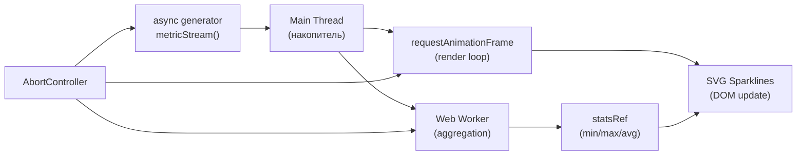

# Реальные паттерны — Расширенная теория

## Graceful Shutdown

Graceful shutdown — это паттерн корректного завершения работы: не убивать процесс мгновенно, а дождаться завершения текущих операций, закрыть соединения, сохранить состояние.

В Node.js:

```js
const server = http.createServer(app)
const activeRequests = new Set()

// Отслеживаем активные запросы
app.use((req, res, next) => {
  activeRequests.add(res)
  res.on('finish', () => activeRequests.delete(res))
  next()
})

async function shutdown(signal) {
  console.log(`Получен ${signal}, начинаю graceful shutdown...`)

  // 1. Перестаём принимать новые соединения
  server.close()

  // 2. Ждём завершения текущих запросов (не более 30 секунд)
  const deadline = Date.now() + 30_000
  while (activeRequests.size > 0 && Date.now() < deadline) {
    await new Promise(r => setTimeout(r, 100))
  }

  // 3. Принудительно закрываем оставшееся
  for (const res of activeRequests) {
    res.destroy()
  }

  // 4. Освобождаем ресурсы (БД, очереди и т.д.)
  await db.close()
  await queue.close()

  console.log('Shutdown complete')
  process.exit(0)
}

process.on('SIGTERM', () => shutdown('SIGTERM'))
process.on('SIGINT', () => shutdown('SIGINT'))
```

В браузере аналог — cleanup в React `useEffect` и обработка `beforeunload`:

```js
useEffect(() => {
  const ctrl = new AbortController()
  startBackgroundSync(ctrl.signal)

  const handleUnload = () => ctrl.abort()
  window.addEventListener('beforeunload', handleUnload)

  return () => {
    ctrl.abort()
    window.removeEventListener('beforeunload', handleUnload)
  }
}, [])
```

## Saga-like паттерны

В Redux-Saga и подобных библиотеках "сага" — это генератор, описывающий сложный async-процесс с явными шагами, откатами и компенсирующими транзакциями.

Реализовать упрощённую сагу можно без внешних библиотек:

```js
// Каждый шаг имеет действие и компенсацию (rollback)
const orderSaga = [
  {
    name: 'reserveInventory',
    execute: (ctx) => inventoryService.reserve(ctx.items),
    compensate: (ctx) => inventoryService.release(ctx.reservationId),
  },
  {
    name: 'chargePayment',
    execute: (ctx) => paymentService.charge(ctx.amount),
    compensate: (ctx) => paymentService.refund(ctx.chargeId),
  },
  {
    name: 'createShipment',
    execute: (ctx) => shippingService.create(ctx.orderId),
    compensate: (ctx) => shippingService.cancel(ctx.shipmentId),
  },
]

async function runSaga(steps, ctx) {
  const executed = []

  for (const step of steps) {
    try {
      const result = await step.execute(ctx)
      Object.assign(ctx, result)
      executed.push(step)
    } catch (err) {
      console.error(`Step ${step.name} failed, rolling back...`)

      // Компенсирующие транзакции в обратном порядке
      for (const done of executed.reverse()) {
        try {
          await done.compensate(ctx)
        } catch (compensateErr) {
          console.error(`Compensation failed for ${done.name}:`, compensateErr)
        }
      }
      throw err
    }
  }

  return ctx
}
```

Это аналог паттерна **Saga** из микросервисной архитектуры, реализованный в браузере.

## React Suspense и async

React Suspense позволяет декларативно обрабатывать async-загрузку данных. Компонент "приостанавливается" пока Promise не разрешится:

```jsx
// Suspense boundary
function App() {
  return (
    <Suspense fallback={<Skeleton />}>
      <UserProfile userId={1} />  {/* бросает Promise пока загружается */}
    </Suspense>
  )
}

// Компонент использует use() (React 19) или библиотеки типа SWR/React Query
function UserProfile({ userId }) {
  const user = use(fetchUser(userId))  // React 19
  return <div>{user.name}</div>
}
```

💡 Для использования Suspense с данными на практике лучше взять SWR или TanStack Query — они реализуют все edge cases (дедупликация, кеш, revalidation).

📌 `use()` в React 19 заменяет старый хак с `throw promise` и работает внутри условий и циклов.

## AsyncLocalStorage (Node.js)

`AsyncLocalStorage` позволяет передавать контекст через async-цепочки без явной передачи аргументов — аналог `Context` в React, но для Node.js:

```js
import { AsyncLocalStorage } from 'async_hooks'

const requestContext = new AsyncLocalStorage()

// Middleware: устанавливаем контекст запроса
app.use((req, res, next) => {
  const store = {
    requestId: crypto.randomUUID(),
    userId: req.headers['x-user-id'],
    startTime: Date.now(),
  }
  requestContext.run(store, next)
})

// В любой async-функции на любой глубине:
async function getUserOrders(userId) {
  const { requestId } = requestContext.getStore()  // контекст доступен!
  logger.info({ requestId, userId }, 'Fetching orders')
  return db.query('SELECT * FROM orders WHERE user_id = ?', [userId])
}

// Middleware логирования
app.use((req, res, next) => {
  res.on('finish', () => {
    const { requestId, startTime } = requestContext.getStore()
    metrics.record('http.request', Date.now() - startTime, { requestId })
  })
  next()
})
```

AsyncLocalStorage работает через механизм async_hooks — автоматически распространяет контекст через Promise, setTimeout, setImmediate и другие async-примитивы.

## TC39 Proposal: Async Context

TC39 (комитет стандартизации JavaScript) работает над встроенным аналогом AsyncLocalStorage для браузеров — **Async Context**:

```js
// Stage 2 (апрель 2025)
const ctx = new AsyncContext.Variable({ defaultValue: null })

async function main() {
  await ctx.run({ userId: 42 }, async () => {
    await step1()  // ctx.get() → { userId: 42 }
    await step2()  // ctx.get() → { userId: 42 }
  })
}

async function step1() {
  const { userId } = ctx.get()  // доступно без аргументов!
  await fetch(`/api/users/${userId}`)
}
```

Это решает проблему "prop drilling" для async-контекста: requestId, tracer, locale, текущий пользователь — всё это можно передавать неявно через цепочку async вызовов.

📌 Async Context пока не доступен в браузерах (API стабилизируется), но Node.js уже реализовал его через AsyncLocalStorage.

## Structured Concurrency: TaskGroup и nursery

Концепция Structured Concurrency была формализована в Python Trio (Nathaniel J. Smith, 2018). Ключевая идея — **nursery** (ясли): группа async-задач с общим временем жизни.

```python
# Python Trio — эталонная реализация
async with trio.open_nursery() as nursery:
    nursery.start_soon(task_a)
    nursery.start_soon(task_b)
    # Блок завершается только когда ВСЕ задачи завершатся
    # Если одна упала — все остальные отменяются
```

В JavaScript нет встроенного аналога, но паттерн можно эмулировать:

```js
class TaskGroup {
  #controller = new AbortController()
  #tasks = []

  spawn(task) {
    const p = task(this.#controller.signal).catch(err => {
      if (err.name !== 'AbortError') {
        this.#controller.abort()  // одна ошибка — отменяем всех
        throw err
      }
    })
    this.#tasks.push(p)
    return p
  }

  async join() {
    await Promise.all(this.#tasks)
  }

  cancel() {
    this.#controller.abort()
  }
}

// Использование:
async function main() {
  const group = new TaskGroup()

  group.spawn(signal => fetchUsers(signal))
  group.spawn(signal => fetchOrders(signal))
  group.spawn(signal => fetchStats(signal))

  await group.join()
  // Если любой упал — остальные отменены
}
```

📌 TC39 обсуждает `AsyncContext` как шаг к Structured Concurrency в JS, но полноценного TaskGroup в стандарте пока нет.

## Observables vs Async Generators vs Streams

Три разных подхода к работе с потоками данных:

| Характеристика | Observable (RxJS) | Async Generator | Web Streams |
|---|---|---|---|
| Многократное использование | ✅ multicasting | ❌ одноразовый | ✅ через tee() |
| Backpressure | ✅ встроенный | ✅ pull-based | ✅ встроенный |
| Операторы | ✅ 100+ встроенных | ❌ вручную | ⚠️ базовые |
| Интеграция с fetch | ❌ | ⚠️ через адаптер | ✅ нативная |
| Стандарт | ❌ библиотека | ✅ ES2018 | ✅ Web API |
| Синтаксис | `pipe(map, filter)` | `for await` | `pipeTo(transform)` |

```js
// Observable (RxJS) — для сложной трансформации потоков
const source$ = fromEvent(ws, 'message').pipe(
  map(e => JSON.parse(e.data)),
  filter(msg => msg.type === 'metric'),
  bufferTime(500),
  map(batch => aggregate(batch)),
  distinctUntilChanged()
)

// Async Generator — для простых последовательных потоков
async function* metricsGen(signal) {
  while (!signal.aborted) {
    yield await fetchLatestMetric()
    await sleep(500)
  }
}

// Web Streams — для работы с fetch/файлами
const response = await fetch('/large-file')
const reader = response.body.pipeThrough(new DecompressionStream('gzip'))
  .pipeThrough(new TextDecoderStream())
  .getReader()
```

💡 Правило выбора:
- **Простой polling или генерация данных** → async generator
- **Сложные трансформации потока** → Observable/RxJS
- **Работа с сетью, файлами, видео** → Web Streams

## Architecture diagram: Real-time Dashboard



Ключевые решения архитектуры:

1. **Разделение источника и рендера**: генератор работает в своём темпе (200ms), rAF — в своём (16ms). Они не блокируют друг друга.

2. **Worker только для агрегации**: тяжёлые математические операции (скользящее среднее, min/max по 60 точкам) вынесены в Worker, чтобы не блокировать UI.

3. **Один AbortController управляет всем pipeline**: при `ctrl.abort()` останавливается генератор, Worker получает сигнал, rAF отменяется.

4. **`ref` для горячих данных**: `pendingMetricsRef` и `statsRef` обновляются синхронно в каждом кадре без лишних ре-рендеров React.

## Итоговые рекомендации

🎯 **Для загрузки файлов**: `asyncPool` + `AbortController` на каждый файл + retry с exponential backoff.

🎯 **Для сложных UI-процессов**: явная state machine вместо флагов `isLoading/isConfirming/isPaying`.

🎯 **Для потоков данных**: async generator как источник + rAF как отображение — они живут в разных ритмах.

🎯 **Для контекста через async-цепочки**: `AsyncLocalStorage` в Node.js, в будущем — `AsyncContext` в браузере.

🎯 **Для координации нескольких async-задач**: один `AbortController` как "выключатель" для всей группы.

```
Финал: асинхронный JavaScript — это не просто синтаксис.
Это архитектура. Это управление временем, конкурентностью и отменой.
```
