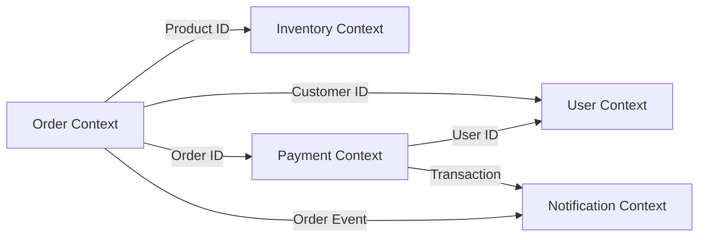
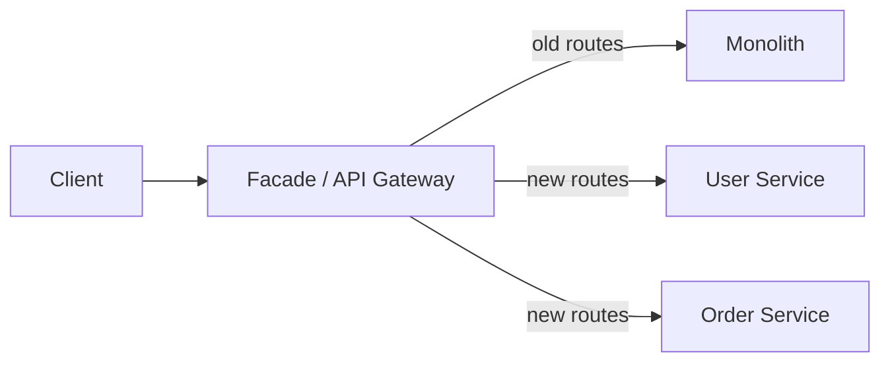
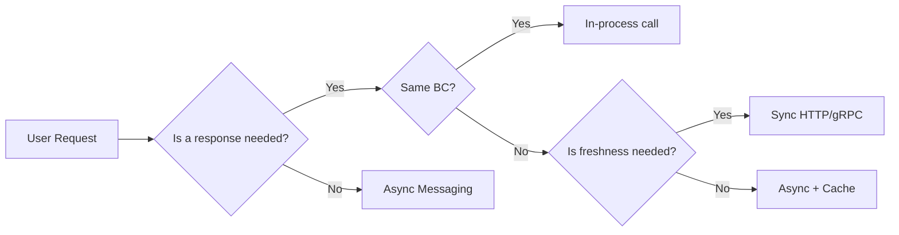

# Level 0: Introduction to Microservices — Deep Dive

## History: How We Got to Microservices

### The Monolith Era (1990s–2000s)

In the client-server era, monoliths were the only sensible architecture. Applications were relatively small, teams were small, and servers were expensive. Packing everything into one process and deploying to one server — plain common sense.

Amazon in the early 2000s had a single monolithic service called Obidos, written in C. All of Amazon.com — one deployment. As load grew exponentially, simply adding servers stopped helping: deploys took hours, any change required coordination across dozens of teams, and a bug in one component could take down the entire store.

### The Birth of SOA (2000s)

Service-Oriented Architecture (SOA) was the first attempt to break up the monolith. The idea was right: services communicate through standardized interfaces. But the implementation proved heavy: SOAP, XML, ESB (Enterprise Service Bus) created new complexity. The ESB became "smart" middleware that knew too much about services — violating the principle of loose coupling.

### Microservices as a Reaction to SOA (2010s)

The term "microservices" was popularized in 2012–2014 by Martin Fowler, Sam Newman, and the Netflix/Amazon teams. The key difference from SOA: **"smart endpoints, dumb pipes."** No ESB — just simple HTTP/queues. Logic lives in services, not middleware.

Netflix began transitioning from monolith to microservices in 2009 after a major outage caused by database corruption. By 2015, they had over 500 microservices. This forced them to invent many tools: Eureka (service discovery), Hystrix (circuit breaker), Zuul (API gateway) — all of which later became part of Spring Cloud and an industry standard.

---

## Conway's Law: Architecture Reflects Organization

> "Organizations which design systems are constrained to produce designs which are copies of the communication structures of these organizations."
> — Melvin Conway, 1967

Conway's Law is one of the most important observations in software development. If you have three development teams — expect a three-pass compiler. If frontend and backend are in different departments — expect a rigid API contract between them.

### Practical Implication

Want to adopt microservices? Reorganize teams first. **Inverse Conway Maneuver** — intentionally structure teams to match the desired architecture.

```
Bad (teams by technology):
┌─────────────┐  ┌─────────────┐  ┌─────────────┐
│  Frontend   │  │   Backend   │  │     DBA     │
│   Team      │  │   Team      │  │   Team      │
└─────────────┘  └─────────────┘  └─────────────┘
→ Each feature requires coordination across three teams

Good (teams by products/domains):
┌──────────────────┐  ┌──────────────────┐
│   Orders Team    │  │  Payments Team   │
│ (FE + BE + DB)   │  │  (FE + BE + DB)  │
└──────────────────┘  └──────────────────┘
→ Team owns the full stack of its domain
```

This is why Amazon adopted the "two-pizza teams" model — a team that can be fed with two pizzas (5-8 people) owns their service from development to production.

---

## Bounded Context and Domain-Driven Design

The hardest question in microservices design: **where to draw boundaries?**

Domain-Driven Design (DDD) answers this through the concept of **Bounded Context** — an explicit boundary within which the domain model is consistent.

### Example: the word "Customer" in Different Contexts

The word "Customer" means different things in different parts of an e-commerce system:

```
┌─────────────────────┐    ┌─────────────────────┐    ┌─────────────────────┐
│   Sales Context     │    │   Support Context   │    │  Shipping Context   │
│                     │    │                     │    │                     │
│  Customer:          │    │  Customer:          │    │  Customer:          │
│  - email            │    │  - tickets[]        │    │  - address          │
│  - preferredItems   │    │  - priority         │    │  - deliveryPrefs    │
│  - segment          │    │  - history          │    │  - contactPhone     │
└─────────────────────┘    └─────────────────────┘    └─────────────────────┘
```

In each context, "Customer" is a different entity with different attributes and behaviors. Trying to create one universal `Customer` model leads to bloated objects with dozens of fields and complex dependencies.

### Strategic DDD Patterns

**Context Map** — a map of all bounded contexts and their relationships:



**Relationships between contexts:**
- **Shared Kernel** — two contexts share part of the model (risky, tight coupling)
- **Customer/Supplier** — one context dictates the contract, the other follows
- **Anti-Corruption Layer (ACL)** — an adapter protecting your model's purity from another's
- **Open Host Service** — a public protocol for integration
- **Published Language** — a common language (usually JSON Schema or Protobuf)

---

## CAP Theorem and Its Impact on Architecture

The CAP Theorem (Eric Brewer, 2000) states: in a distributed system, it's impossible to simultaneously guarantee all three properties:

```
         Consistency
              /\
             /  \
            /    \
           /      \
          /  CAP   \
         /          \
        /____________\
  Availability    Partition
                  Tolerance
```

- **C (Consistency)** — all nodes see the same data at the same time
- **A (Availability)** — every request gets a response (not necessarily the latest data)
- **P (Partition Tolerance)** — the system continues to work despite network partitions

### Why P Cannot Be Disabled

In a distributed system, network partitions are inevitable. So the choice is always between **CP** and **AP**:

**CP systems** (sacrifice availability for consistency):
- ZooKeeper, etcd, HBase
- During a network split, requests are blocked or return errors

**AP systems** (sacrifice consistency for availability):
- Cassandra, DynamoDB, CouchDB
- During a network split, they continue responding, but data may be stale

### Eventual Consistency in Microservices

In practice, most microservice architectures choose **AP + Eventual Consistency** — data will eventually become consistent, but not instantly.

```
User updates email:

User Service          Order Service
    |                     |
    | UPDATE email        |
    |-------------------->|
    |                     | (doesn't know about the new email yet)
    |                     |
    ~ 100ms ~             ~ 200ms ~
    |                     |
    | Event: UserUpdated  |
    |-------------------->|
                          | (now it knows)
```

This is a fundamental mindset shift: **you cannot have ACID transactions across service boundaries**. Hence the Saga pattern (Level 13) and Outbox (Level 15).

---

## Monolith Decomposition Patterns

How do you break a monolith into microservices? Several strategies:

### 1. Decompose by Business Capability

Decomposition by business capabilities — the most recommended approach. A business capability is something the business does to create value.

```
E-commerce:
├── Product Catalog
├── Order Management
├── Payment Processing
├── Fulfillment
├── Customer Support
└── User Management
```

A key sign of good decomposition: changes in one capability don't require changes in others.

### 2. Decompose by Subdomain (DDD)

Uses DDD concepts: core domain, supporting subdomain, generic subdomain.

- **Core Domain** — the main competitive advantage (for Amazon — recommendation algorithms)
- **Supporting Subdomain** — supports the core, business-specific (order management)
- **Generic Subdomain** — standard functionality (email, authentication)

### 3. Strangler Fig Pattern

Gradual monolith replacement — the safest migration approach.



Steps:
1. Place a proxy (API Gateway) in front of the monolith
2. Extract one domain into a new service
3. Redirect routes through the proxy
4. Remove the module from the monolith
5. Repeat for the next domain

Named after the strangler fig tree, which wraps around its host and gradually replaces it.

### 4. Database per Service — Key Principle

If services share one database, they're still tightly coupled:

```
❌ Bad — shared database:
Order Service ──┐
                ├──► Shared Database
User Service  ──┘

✅ Good — each service has its own database:
Order Service ──► orders_db
User Service  ──► users_db
```

Problem: how to get data from another service?
- **API Composition** — aggregation via API calls
- **CQRS** — a separate read-model with denormalized data
- **Event-driven** — subscribe to events and maintain a local copy of needed data

---

## Anti-patterns: What Goes Wrong

### 1. Distributed Monolith (the most common anti-pattern)

You split the monolith into "services," but they deploy together and synchronously call each other.

```
❌ Distributed Monolith:
OrderService.createOrder() {
  const user = UserService.getUser(userId)        // synchronous call
  const inventory = InventoryService.check(items) // synchronous call
  const payment = PaymentService.charge(amount)   // synchronous call
  // if any of them fails — the order is not created
}
```

Symptoms: services can't be deployed independently, changing one service's API breaks others, one failed service takes down the chain.

### 2. Too Fine-Grained

Nano-services — 10-20 lines of code per service. Overhead from networking, management, monitoring exceeds the benefit.

```
❌ Excessive decomposition:
UserFirstNameService
UserLastNameService
UserEmailService
UserPasswordService
```

Rule: if a service can't work independently without constant synchronous calls to other tiny services — it's too small.

### 3. Direct SQL Queries to Another Service's Database

```
// ❌ Order Service directly reads the users table
const user = db.query('SELECT * FROM users WHERE id = ?', [userId])

// ✅ Correct — via API or own cache
const user = await userServiceClient.getUser(userId)
```

### 4. Synchronous Communication as the Only Option

When every service waits for another's response, the entire chain is no more reliable than its weakest link. Chain availability: 99.9% × 99.9% × 99.9% = 99.7%.

### 5. No Contract Testing

If each service lacks contract tests — any API change potentially breaks consumers.

---

## Real-World Cases

### Netflix: Microservices Pioneer

**Problem (2008):** outage due to database corruption. The entire monolith was down for several days. This triggered the transition to microservices.

**Journey:** 7 years of migration (2009-2016). Today — 1000+ microservices handling 100+ million subscribers.

**Key decisions:**
- **Chaos Monkey** — a tool that intentionally kills random services in production. If the system can't survive random failures — better to know earlier
- **Circuit Breaker (Hystrix)** — if a service doesn't respond, switch to fallback instead of waiting forever
- **Regional isolation** — each AWS region is independent, failure in one doesn't affect others

**Cost:** Netflix created an entire stack of tools (Eureka, Ribbon, Hystrix, Zuul, Archaius), most of which became open source. Operational complexity grew manyfold.

### Amazon: "You Build It, You Run It"

**Problem (2001):** a 3 million line monolith, 300 engineers — synchronization became the bottleneck.

**Transition:** Jeff Bezos issued the famous "API Mandate" (2002):
1. All teams must expose data and functionality through APIs
2. Teams communicate only through these APIs
3. Direct access to another team's database, memory, or internal components is forbidden
4. API technology doesn't matter (HTTP, Corba, Thrift)
5. All APIs must be designed as external (even for internal use)
6. Violators will be fired

This internal mandate at Amazon laid the foundation for AWS — every internal service could potentially become an external product.

### Uber: Monolith → Microservices → Problems → Back

Uber went through an interesting cycle:
1. Started with a monolith (Python)
2. Transitioned to microservices (2014-2016)
3. Faced thousands of services, nobody understood dependencies
4. Created "domain-oriented microservice architecture" — an intermediate layer between monolith and microservice chaos

Uber's lesson: without clear boundaries and dependency management, microservices turn into distributed disorder.

---

## Comparison Table: Full Picture

| Aspect | Monolith | Modular Monolith | Microservices |
|--------|---------|-------------------|--------------|
| Development complexity | Low | Medium | High |
| Time to first deploy | Hours | Hours-days | Weeks |
| Independent deploy | No | No | Yes |
| Scaling | Entire service | Entire service | Granular |
| Failure isolation | No | Partial | Yes |
| Latency (within system) | Minimal | Minimal | +network calls |
| Debugging | Simple | Simple | Distributed tracing |
| Technology diversity | No | No | Yes |
| Transactions | ACID | ACID | Only Saga/Outbox |
| Testing | Simple | Medium | Complex (contract tests) |
| Operational overhead | Low | Low | Very high |
| DevOps requirements | Minimal | Minimal | Kubernetes, Service Mesh, tracing |
| Team structure | Any | Any | By domain |

---

## When Microservices Are NOT Needed

Microservices solve scale and team coordination problems. If you don't have these problems — you're adding complexity without benefit.

**Clear signs of premature adoption:**

1. **Team under 10 people** — microservices are built for inter-team coordination
2. **Domains aren't settled** — if business requirements change every week, you'll constantly be redrawing boundaries
3. **No CI/CD** — manually deploying 20 services is impossible
4. **No observability** — without centralized logs, metrics, and tracing, you can't debug
5. **No distributed systems experience** — a team unfamiliar with CAP theorem, eventual consistency, and distributed tracing will create more problems than they solve

---

## Communication Patterns

Choosing a communication pattern follows from architectural decisions:



Synchronous communication (REST, gRPC) — when you need an immediate response. Asynchronous (RabbitMQ, Kafka) — when reliability and decoupling matter. These tools are the core of this course.

---

## Mature Microservices System Checklist

Before calling a system "microservices," ensure you have:

**Basic requirements:**
- [ ] Each service has its own database
- [ ] Services communicate only through explicit APIs/events
- [ ] Independent deploy of each service
- [ ] Health checks and graceful shutdown

**Reliability:**
- [ ] Circuit breakers (Resilience4j, Hystrix)
- [ ] Retry with exponential backoff
- [ ] Timeout on all external calls