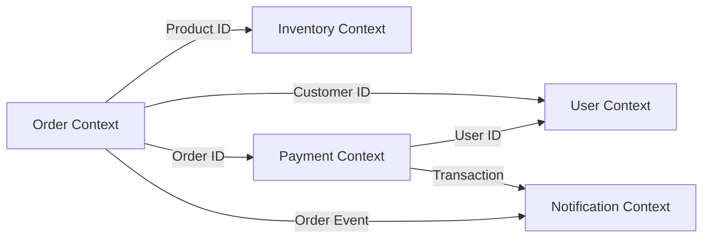
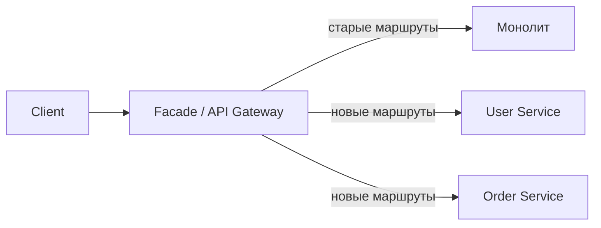
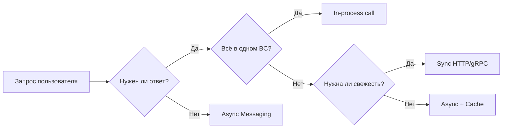

# Уровень 0: Введение в микросервисы — Глубокое погружение

## История: как мы дошли до микросервисов

### Эра монолитов (1990-е — 2000-е)

В эпоху клиент-серверных приложений монолит был единственной разумной архитектурой. Приложения были относительно небольшими, команды — маленькими, а серверы стоили дорого. Собрать всё в один процесс и задеплоить на один сервер — здравый смысл.

Amazon в начале 2000-х имел один монолитный сервис Obidos, написанный на C. Весь Amazon.com — один деплоймент. Когда нагрузка начала расти экспоненциально, простое добавление серверов перестало помогать: деплой занимал часы, любое изменение требовало координации десятков команд, а баг в одном компоненте мог положить весь магазин.

### Рождение SOA (2000-е)

Service-Oriented Architecture (SOA) была первой попыткой разбить монолит. Идея правильная: сервисы общаются через стандартизированные интерфейсы. Но реализация оказалась тяжёлой: SOAP, XML, ESB (Enterprise Service Bus) создали новую сложность. ESB превратился в «умный» middleware, который знал слишком много о сервисах — нарушая принцип слабой связанности.

### Микросервисы как реакция на SOA (2010-е)

Термин «микросервисы» popularized в 2012-2014 годах Мартином Фаулером, Сэмом Ньюманом и командами Netflix/Amazon. Ключевое отличие от SOA: **«умные конечные точки, тупые каналы»**. Никакого ESB — только простые HTTP/очереди. Логика в сервисах, а не в middleware.

Netflix начал переход с монолита на микросервисы в 2009 году после крупного аутажа из-за повреждения БД. К 2015 году у них было более 500 микросервисов. Это вынудило их изобрести массу инструментов: Eureka (service discovery), Hystrix (circuit breaker), Zuul (API gateway) — всё это позже вошло в Spring Cloud и стало индустриальным стандартом.

---

## Закон Конвея: архитектура отражает организацию

> «Организации, проектирующие системы, вынуждены создавать дизайны, которые являются копиями коммуникационных структур этих организаций.»
> — Мелвин Конвей, 1967

Закон Конвея — одно из самых важных наблюдений в разработке ПО. Если у вас три команды разработчиков — ждите трёхслойный компилятор. Если фронтенд и бэкенд в разных отделах — ждите жёсткого API-контракта между ними.

### Практическое следствие

Хотите внедрить микросервисы? Сначала реорганизуйте команды. **Обратный закон Конвея (Inverse Conway Maneuver)** — намеренно формировать командную структуру так, чтобы она соответствовала желаемой архитектуре.

```
Плохо (команды по технологиям):
┌─────────────┐  ┌─────────────┐  ┌─────────────┐
│  Frontend   │  │   Backend   │  │     DBA     │
│   команда   │  │   команда   │  │   команда   │
└─────────────┘  └─────────────┘  └─────────────┘
→ Каждая фича требует координации трёх команд

Хорошо (команды по продуктам/доменам):
┌──────────────────┐  ┌──────────────────┐
│   Orders Team    │  │  Payments Team   │
│ (FE + BE + DB)   │  │  (FE + BE + DB)  │
└──────────────────┘  └──────────────────┘
→ Команда владеет всем стеком своего домена
```

Именно поэтому Amazon перешёл на модель «two-pizza teams» — команда, которую можно накормить двумя пиццами (5-8 человек), владеет своим сервисом от разработки до продакшена.

---

## Bounded Context и Domain-Driven Design

Самый сложный вопрос в проектировании микросервисов: **где провести границы?**

Domain-Driven Design (DDD) даёт ответ через концепцию **Bounded Context** (ограниченный контекст). Это явная граница, внутри которой модель предметной области является единообразной.

### Пример: слово «Клиент» в разных контекстах

Слово «Клиент» (Customer) означает разные вещи в разных частях системы интернет-магазина:

```
┌─────────────────────┐    ┌─────────────────────┐    ┌─────────────────────┐
│   Sales Context     │    │   Support Context   │    │  Shipping Context   │
│                     │    │                     │    │                     │
│  Customer:          │    │  Customer:          │    │  Customer:          │
│  - email            │    │  - tickets[]        │    │  - address          │
│  - preferredItems   │    │  - priority         │    │  - deliveryPrefs    │
│  - segment          │    │  - history          │    │  - contactPhone     │
└─────────────────────┘    └─────────────────────┘    └─────────────────────┘
```

В каждом контексте «Клиент» — разная сущность с разными атрибутами и поведением. Попытка создать одну универсальную модель `Customer` приводит к раздутым объектам с десятками полей и сложными зависимостями.

### Стратегические паттерны DDD

**Context Map** — карта всех bounded contexts и отношений между ними:



**Отношения между контекстами:**
- **Shared Kernel** — два контекста разделяют часть модели (рискованно, сильная связность)
- **Customer/Supplier** — один контекст диктует контракт, другой следует
- **Anti-Corruption Layer (ACL)** — адаптер, защищающий чистоту вашей модели от чужой
- **Open Host Service** — публичный протокол для интеграции
- **Published Language** — общий язык (обычно JSON Schema или Protobuf)

---

## CAP теорема и её влияние на архитектуру

CAP теорема (Эрик Брюер, 2000) утверждает: в распределённой системе невозможно одновременно гарантировать все три свойства:

```
         Consistency
        (согласованность)
              /\
             /  \
            /    \
           /      \
          /  CAP   \
         /          \
        /____________\
  Availability    Partition
  (доступность)  Tolerance
                (устойчивость
                 к разделению)
```

- **C (Consistency)** — все узлы видят одинаковые данные в один момент времени
- **A (Availability)** — каждый запрос получает ответ (не обязательно свежие данные)
- **P (Partition Tolerance)** — система продолжает работать при разрыве сети

### Почему P нельзя отключить

В распределённой системе сетевые разрывы неизбежны. Поэтому выбор всегда между **CP** и **AP**:

**CP системы** (жертвуют доступностью ради согласованности):
- ZooKeeper, etcd, HBase
- При разрыве сети запросы блокируются или возвращают ошибку

**AP системы** (жертвуют согласованностью ради доступности):
- Cassandra, DynamoDB, CouchDB
- При разрыве сети продолжают отвечать, но данные могут быть устаревшими

### Eventual Consistency в микросервисах

На практике большинство микросервисных систем выбирают **AP + Eventual Consistency** — данные в итоге станут согласованными, но не мгновенно.

```
Пользователь обновляет email:
                                        
User Service          Order Service
    |                     |
    | UPDATE email        |
    |-------------------->|
    |                     | (ещё не знает о новом email)
    |                     |
    ~ 100ms ~             ~ 200ms ~
    |                     |
    | Event: UserUpdated  |
    |-------------------->|
                          | (теперь знает)
```

Это фундаментальный сдвиг мышления: **вы не можете иметь ACID-транзакции через границы сервисов**. Отсюда паттерны Saga (уровень 13) и Outbox (уровень 15).

---

## Паттерны декомпозиции монолита

Как разбить монолит на микросервисы? Несколько стратегий:

### 1. Decompose by Business Capability

Разбиение по бизнес-возможностям — наиболее рекомендуемый подход. Бизнес-возможность — это то, что бизнес делает для создания ценности.

```
E-commerce:
├── Управление каталогом (Product Catalog)
├── Управление заказами (Order Management)
├── Оплата (Payment Processing)
├── Доставка (Fulfillment)
├── Клиентская поддержка (Customer Support)
└── Управление пользователями (User Management)
```

Ключевой признак правильного разбиения: изменения в одной способности не требуют изменений в других.

### 2. Decompose by Subdomain (DDD)

Использует концепции DDD: core domain, supporting subdomain, generic subdomain.

- **Core Domain** — главная конкурентная ценность (для Amazon — алгоритмы рекомендаций)
- **Supporting Subdomain** — поддерживает core, специфично для бизнеса (управление заказами)
- **Generic Subdomain** — стандартная функциональность (email, аутентификация)

### 3. Strangler Fig Pattern

Постепенная замена монолита — самый безопасный способ миграции.



Шаги:
1. Поставить прокси (API Gateway) перед монолитом
2. Вытащить один домен в новый сервис
3. Перенаправить маршруты через прокси
4. Удалить модуль из монолита
5. Повторить для следующего домена

Название от дерева-удушителя (strangler fig), которое обвивает хозяина и постепенно заменяет его.

### 4. Database per Service — ключевой принцип

Если сервисы разделяют одну БД, они по-прежнему сильно связаны:

```
❌ Плохо — общая БД:
Order Service ──┐
                ├──► Shared Database
User Service  ──┘

✅ Хорошо — каждый сервис со своей БД:
Order Service ──► orders_db
User Service  ──► users_db
```

Проблема: как получить данные из другого сервиса?
- **API Composition** — агрегирование через вызовы API
- **CQRS** — отдельный read-model с денормализованными данными
- **Event-driven** — подписка на события и локальная копия нужных данных

---

## Anti-patterns: что идёт не так

### 1. Distributed Monolith (самый частый антипаттерн)

Вы разбили монолит на «сервисы», но они деплоятся вместе и синхронно вызывают друг друга.

```
❌ Distributed Monolith:
OrderService.createOrder() {
  const user = UserService.getUser(userId)        // синхронный вызов
  const inventory = InventoryService.check(items) // синхронный вызов
  const payment = PaymentService.charge(amount)   // синхронный вызов
  // если любой из них упал — заказ не создан
}
```

Симптомы: сервисы нельзя деплоить независимо, изменение API одного ломает другие, один упавший сервис роняет цепочку.

### 2. Слишком мелкая гранулярность

Нанофункции — сервисы из 10-20 строк кода. Overhead на сеть, управление, мониторинг превышает выгоду.

```
❌ Избыточная декомпозиция:
UserFirstNameService
UserLastNameService
UserEmailService
UserPasswordService
```

Правило: если сервис не может работать самостоятельно без постоянных синхронных вызовов других мелких сервисов — он слишком маленький.

### 3. Прямые SQL-запросы к чужой БД

```
// ❌ Order Service напрямую читает таблицу пользователей
const user = db.query('SELECT * FROM users WHERE id = ?', [userId])

// ✅ Правильно — через API или собственный кэш
const user = await userServiceClient.getUser(userId)
```

### 4. Синхронная коммуникация как единственный способ

Когда каждый сервис ждёт ответа от другого, вся цепочка не надёжнее самого слабого звена. Availability цепочки: 99.9% × 99.9% × 99.9% = 99.7%.

### 5. Отсутствие Contract Testing

Если у каждого сервиса нет тестов контракта — любое изменение API потенциально ломает потребителей.

---

## Реальные кейсы

### Netflix: пионер микросервисов

**Проблема (2008):** аутаж из-за повреждения БД. Весь монолит упал на несколько дней. Это запустило переход на микросервисы.

**Путь:** 7 лет миграции (2009-2016). Сегодня — 1000+ микросервисов, обрабатывающих 100+ млн подписчиков.

**Ключевые решения:**
- **Chaos Monkey** — инструмент, намеренно убивающий случайные сервисы в продакшене. Если система не может переживать случайные падения — лучше узнать об этом раньше
- **Circuit Breaker (Hystrix)** — если сервис не отвечает, переключайся на fallback вместо бесконечного ожидания
- **Regional isolation** — каждый регион AWS независим, падение одного не затрагивает другие

**Чего стоило:** Netflix создал целый стек инструментов (Eureka, Ribbon, Hystrix, Zuul, Archaius), большинство из которых стали open source. Operational complexity выросла многократно.

### Amazon: «You build it, you run it»

**Проблема (2001):** монолит из 3 млн строк кода, 300 инженеров — синхронизация стала узким местом.

**Переход:** Джефф Безос издал знаменитый «API Mandate» (2002):
1. Все команды должны предоставлять данные и функциональность через API
2. Команды общаются только через эти API
3. Прямой доступ к чужой БД, памяти или внутренним компонентам запрещён
4. Технология API не важна (HTTP, Corba, Thrift)
5. Все API должны быть спроектированы как внешние (даже для внутреннего использования)
6. Нарушители будут уволены

Это внутренний мандат для команд Amazon заложил фундамент AWS — каждый внутренний сервис потенциально мог стать внешним продуктом.

### Uber: монолит → микросервисы → проблемы → назад

Uber прошёл интересный цикл:
1. Начал с монолита (Python)
2. Перешёл на микросервисы (2014-2016)
3. Столкнулся с тысячами сервисов, никто не понимал зависимости
4. Создал «domain-oriented microservice architecture» — промежуточный уровень между монолитом и хаосом микросервисов

Урок Uber: без чётких границ и управления зависимостями микросервисы превращаются в распределённый беспорядок.

---

## Сравнительная таблица: полная картина

| Аспект | Монолит | Модульный монолит | Микросервисы |
|--------|---------|-------------------|--------------|
| Сложность разработки | Низкая | Средняя | Высокая |
| Время до первого деплоя | Часы | Часы-дни | Недели |
| Независимый деплой | Нет | Нет | Да |
| Масштабирование | Весь сервис | Весь сервис | Гранулярное |
| Изоляция отказов | Нет | Частичная | Да |
| Latency (внутри системы) | Минимальная | Минимальная | +сетевые вызовы |
| Отладка | Простая | Простая | Distributed tracing |
| Технологическое разнообразие | Нет | Нет | Да |
| Транзакции | ACID | ACID | Только Saga/Outbox |
| Тестирование | Просто | Средне | Сложно (contract tests) |
| Operational overhead | Низкий | Низкий | Очень высокий |
| Требования к DevOps | Минимальные | Минимальные | Kubernetes, Service Mesh, трейсинг |
| Командная структура | Любая | Любая | По доменам |

---

## Когда НЕ нужны микросервисы

Микросервисы решают проблемы масштаба и команд. Если у вас нет этих проблем — вы добавляете сложность без выгоды.

**Явные признаки преждевременности:**

1. **Команда меньше 10 человек** — микросервисы созданы для координации между командами
2. **Домены не устоялись** — если бизнес-требования меняются каждую неделю, вы будете постоянно перекраивать границы
3. **Нет CI/CD** — ручной деплой 20 сервисов невозможен
4. **Нет observability** — без централизованных логов, метрик и трейсинга вы не сможете дебажить
5. **Нет опыта с распределёнными системами** — команда, незнакомая с CAP теоремой, eventual consistency и distributed tracing, создаст больше проблем, чем решит

---

## Паттерны коммуникации

Выбор паттерна коммуникации — следствие архитектурных решений:



Синхронная коммуникация (REST, gRPC) — когда нужен немедленный ответ. Асинхронная (RabbitMQ, Kafka) — когда важна надёжность и decoupling. Именно эти инструменты — центр данного курса.

---

## Чеклист зрелой микросервисной системы

Перед тем как называть систему «микросервисной», убедитесь в наличии:

**Базовые требования:**
- [ ] Каждый сервис имеет свою БД
- [ ] Сервисы общаются только через явные API/события
- [ ] Независимый деплой каждого сервиса
- [ ] Health checks и graceful shutdown

**Надёжность:**
- [ ] Circuit breakers (Resilience4j, Hystrix)
- [ ] Retry с exponential backoff
- [ ] Timeout на все внешние вызовы
- [ ] Dead Letter Queue для неудачных сообщений

**Observability:**
- [ ] Централизованные логи (ELK, Grafana Loki)
- [ ] Метрики (Prometheus + Grafana)
- [ ] Distributed tracing (Jaeger, Zipkin)
- [ ] Alerts на SLO/SLA нарушения

**Безопасность:**
- [ ] Service-to-service аутентификация (mTLS или JWT)
- [ ] Secrets management (Vault, K8s Secrets)
- [ ] Network policies

**Разработка:**
- [ ] Contract testing (Pact)
- [ ] Consumer-driven contracts
- [ ] Локальная разработка без запуска всей системы

---

## Итог

Микросервисная архитектура — это не про технологии (Kafka, RabbitMQ, gRPC), а про **организационную модель** и **независимость**. Технологии — инструменты для реализации этой независимости.

Весь курс посвящён именно инструментам надёжной асинхронной коммуникации — RabbitMQ и Kafka, которые позволяют сервисам взаимодействовать без прямой зависимости и без потери сообщений.
