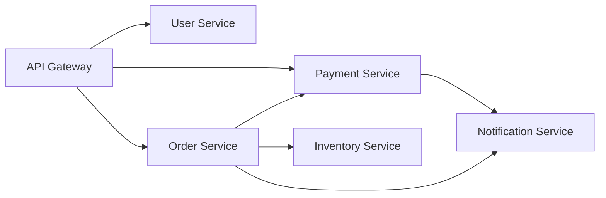

# Level 0: Introduction to Microservices

## What is a Monolith and Why "Break" It?

Imagine a restaurant where one cook does everything: takes the order, cooks the dish, delivers it, and calculates the bill. If the cook gets sick — the restaurant is closed. This is a **monolith**.

A monolith is a single application, a single deploy, one codebase. For a start, this is ideal: simple, fast, no distributed problems. But as you grow, pains emerge:

- Any change requires deploying the entire application
- An error in one module brings down the entire service
- You can only scale the whole thing
- Teams "step on each other's toes" in shared code

```
Monolithic Application
┌─────────────────────────────────┐
│  Users  │  Orders  │  Payments  │
│─────────────────────────────────│
│  Inventory  │  Notifications    │
└─────────────────────────────────┘
         One process
         One deploy
         One database
```

---

## Microservices Architecture

Microservices are the same restaurant, but with different departments: hot kitchen, cold kitchen, pastry shop. Each department works independently by its own rules, communicating through a "delivery window" (API or message queues).



**Key principles:**

1. **Single Responsibility** — each service does one thing, but does it well
2. **Independent Deploy** — releasing Order Service doesn't require restarting User Service
3. **Data Isolation** — each service has its own database (Database per Service)
4. **Communication via API** — only explicit contracts, no direct access to another service's database

---

## Pros and Cons Honestly

| Criterion | Monolith | Microservices |
|----------|---------|--------------|
| Startup complexity | Low | High |
| Scaling | All at once | Granular |
| Failure isolation | None | Present |
| Debugging | Simple | Complex (distributed tracing) |
| Deploy | One | Many independent |
| Latency | No network calls | Adds latency |
| DevOps maturity | Not needed | Mandatory |

> ⚠️ **Common misconception:** "Microservices = better." In reality, Netflix and Amazon didn't adopt them because they're "right," but because monoliths could no longer handle their scale and development speed.

---

## When to Choose What?

**Monolith is a good choice when:**
- MVP or startup, domains aren't settled yet
- Team is fewer than 10 people
- No clear understanding of module boundaries
- No DevOps culture

**Microservices are justified when:**
- Different parts of the system require different scaling
- Multiple teams, each owning their domain
- CI/CD, monitoring, and service mesh already exist
- Well-established bounded contexts

**Modular Monolith** — often the best starting point: clear modules with forbidden direct calls between them, single deploy. When the time comes — each module can be easily extracted into a separate service.

💡 **Martin Fowler's rule:** "Don't start with microservices. Start with a monolith, divide it well into modules, then split if it's really needed."

---

## Next Steps

After understanding the concepts, it's important to figure out:
- How do services communicate? → **Level 1: Synchronous Communication** (REST, gRPC)
- What to do when sync doesn't work? → **Level 2: Asynchronous Communication**
- How to reliably deliver messages? → **Levels 3-10: RabbitMQ and Kafka**