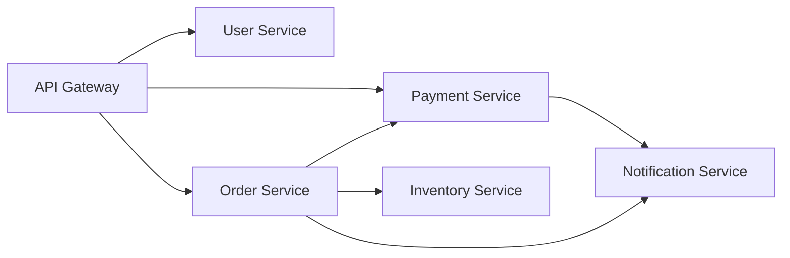

# Уровень 0: Введение в микросервисы

## Что такое монолит и зачем его «бить»?

Представьте ресторан, где один повар делает всё: принимает заказ, готовит, несёт блюдо и считает чек. Если повар заболел — ресторан закрыт. Это **монолит**.

Монолит — одно приложение, один деплой, одна кодовая база. Для старта это идеально: просто, быстро, нет распределённых проблем. Но по мере роста появляются боли:

- Любое изменение требует деплоя всего приложения
- Ошибка в одном модуле роняет весь сервис
- Масштабировать можно только всё целиком
- Команды «наступают друг другу на ноги» в общем коде

```
Монолитное приложение
┌─────────────────────────────────┐
│  Users  │  Orders  │  Payments  │
│─────────────────────────────────│
│  Inventory  │  Notifications    │
└─────────────────────────────────┘
         Один процесс
         Один деплой
         Одна БД
```

---

## Микросервисная архитектура

Микросервисы — это тот же ресторан, но с разными цехами: горячий, холодный, кондитерский. Каждый цех работает независимо по своим правилам, общается через «окошко выдачи» (API или очереди сообщений).



**Ключевые принципы:**

1. **Единственная ответственность** — каждый сервис делает одно, но хорошо
2. **Независимый деплой** — релиз Order Service не требует перезапуска User Service
3. **Изоляция данных** — у каждого сервиса своя БД (Database per Service)
4. **Коммуникация через API** — только явные контракты, никакого прямого доступа к чужой БД

---

## Плюсы и минусы честно

| Критерий | Монолит | Микросервисы |
|----------|---------|--------------|
| Сложность старта | Низкая | Высокая |
| Масштабирование | Целиком | Гранулярное |
| Изоляция отказов | Нет | Есть |
| Отладка | Просто | Сложно (distributed tracing) |
| Деплой | Один | Много независимых |
| Latency | Нет сетевых вызовов | Добавляет latency |
| DevOps зрелость | Не нужна | Обязательна |

> ⚠️ **Распространённое заблуждение:** «Микросервисы = лучше». На самом деле Netflix и Amazon пришли к ним не потому что это «правильно», а потому что монолит перестал справляться с их масштабом и скоростью разработки.

---

## Когда выбирать что?

**Монолит — хороший выбор когда:**
- MVP или стартап, домены ещё не устоялись
- Команда меньше 10 человек
- Нет чёткого понимания границ модулей
- Нет DevOps-культуры

**Микросервисы — оправданы когда:**
- Разные части системы требуют разного масштабирования
- Несколько команд, каждая владеет своим доменом
- Уже есть CI/CD, мониторинг, service mesh
- Устоявшиеся bounded contexts

**Модульный монолит** — часто лучший старт: чёткие модули с запрещёнными прямыми вызовами внутрь, единый деплой. Когда придёт время — каждый модуль легко вытащить в отдельный сервис.

💡 **Правило Мартина Фаулера:** «Не начинайте с микросервисов. Начните с монолита, хорошо разделите его на модули, а потом разбейте, если это реально нужно.»

---

## Следующие шаги

После понимания концепции важно разобраться:
- Как сервисы общаются? → **Уровень 1: Синхронная коммуникация** (REST, gRPC)
- Что делать когда синхрон не работает? → **Уровень 2: Асинхронная коммуникация**
- Как надёжно передавать сообщения? → **Уровни 3-10: RabbitMQ и Kafka**
