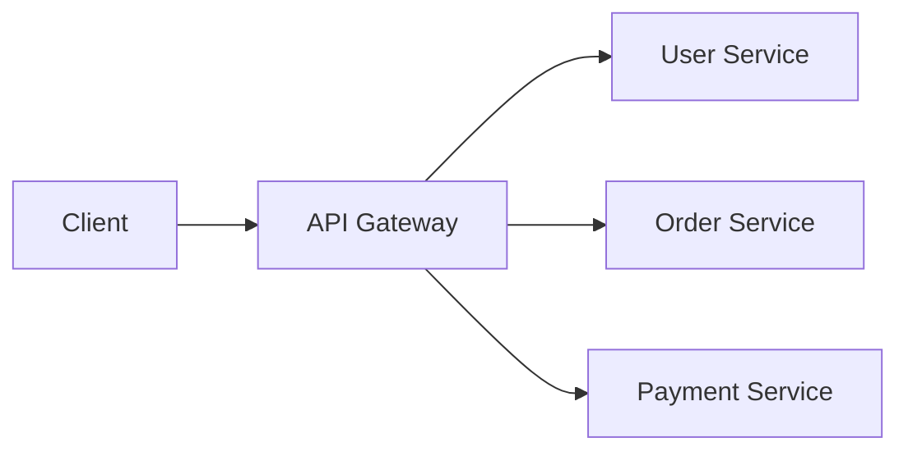
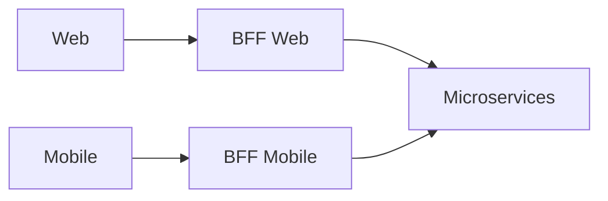
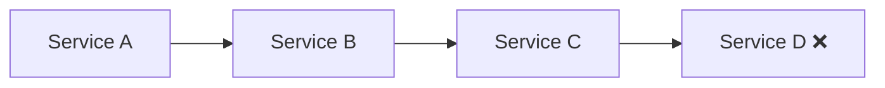
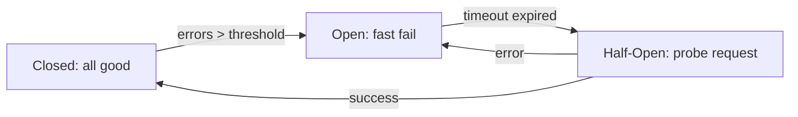
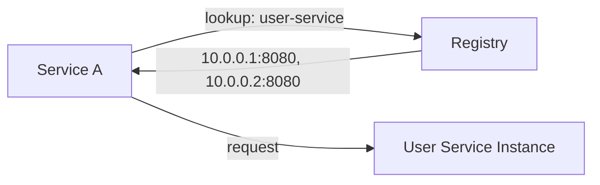

# Level 1: Synchronous Communication

## What is Synchronous Communication?

When Service A calls Service B and **waits for a response** before continuing — that's synchronous communication. The client blocks while the request is being processed. This is familiar and understandable (like a phone call), but creates tight coupling between services.

```
Client → HTTP request → Service B
Client ←←←← waits ←←←← (processing)
Client ← HTTP response  ← Service B
```

---

## REST API in Microservices

REST (Representational State Transfer) is an architectural style built on top of HTTP. Each resource has a URL, operations are expressed as HTTP methods.

```
GET    /users/42          → get user
POST   /orders            → create order
PUT    /orders/7/status   → update status
DELETE /sessions/abc      → delete session
```

**REST advantages:** human-readable JSON, cacheability, stateless, easy debugging via curl/browser.

**REST drawbacks in microservices:** JSON is text (large payload), no contract between services, API versioning is painful.

---

## gRPC and Protocol Buffers

gRPC is a framework from Google built on HTTP/2. Instead of JSON, it uses **Protobuf** (a binary format).

```protobuf
// Contract is described in a .proto file
service UserService {
  rpc GetUser(GetUserRequest) returns (UserResponse);
  rpc ListUsers(ListRequest) returns (stream UserResponse);
}

message GetUserRequest {
  string user_id = 1;
}
```

Protobuf encodes data compactly: the number `42` takes 2 bytes, the string `"Alice"` — 7 bytes. JSON for the same data takes 3-10x more.

```
Protobuf: [field_tag][wire_type][value]
          0x08 0x2A  → field 1, varint, value=42

JSON:     {"user_id": 42}  → 15 bytes
```

**gRPC advantages:** strict contract, client generation, streaming, HTTP/2 multiplexing.

**gRPC drawbacks:** harder to debug, requires protoc compiler, browsers don't support it natively.

---

## HTTP/1.1 vs HTTP/2

```
HTTP/1.1: one request per connection (or keep-alive, but no multiplexing)
┌─────────────────────────────────────────┐
│  REQ 1 → RSP 1 → REQ 2 → RSP 2 → ...   │
└─────────────────────────────────────────┘

HTTP/2: multiplexing on a single connection
┌────────────────────────────────────────────────┐
│  REQ 1 ──────────────────────────→ RSP 1       │
│  REQ 2 ────────────→ RSP 2                     │
│  REQ 3 ──→ RSP 3                               │
└────────────────────────────────────────────────┘
```

gRPC uses HTTP/2, so streaming and multiplexing are built in.

---

## Patterns: API Gateway and BFF

**API Gateway** — a single entry point for all clients:



Gateway handles: authentication, rate limiting, logging, routing.

**BFF (Backend for Frontend)** — a separate gateway for each client type:



The mobile app gets a trimmed-down response, the web gets the full one. Each BFF is optimized for its client.

---

## Problems with Synchronous Communication

### Cascading Failures

If Service D is unavailable, the entire chain A → B → C → D blocks until timeout:



A single failure at the end of the chain can block the entire system for the cumulative timeout: 3 services × 30 seconds = 90 seconds of waiting.

### Tight Coupling

Service A must know Service B's address. If B moves or scales — A needs to be updated.

---

## Circuit Breaker

Circuit Breaker is a cascading failure protection pattern. Like an automatic circuit breaker in electrical systems.



**States:**
- **Closed** — normal operation, requests pass through
- **Open** — fast failure without waiting (0ms instead of 30s timeout)
- **Half-Open** — a probe request to check if the service has recovered

```typescript
// Circuit Breaker pseudocode
class CircuitBreaker {
  state = 'closed'
  failures = 0
  threshold = 5

  async call(fn: () => Promise<unknown>) {
    if (this.state === 'open') {
      throw new Error('Circuit is open') // Fast fail
    }
    try {
      const result = await fn()
      this.onSuccess()
      return result
    } catch (e) {
      this.onFailure()
      throw e
    }
  }
}
```

---

## Service Discovery

Services need to find each other dynamically (instances are added/removed).

**Client-side discovery:** the client queries the registry itself and chooses an instance.



**Server-side discovery:** the client talks to a load balancer, which decides where to route.

Registries: **Consul**, **Eureka** (Netflix), **Kubernetes DNS** (built into k8s).

---

## ⚠️ Common Beginner Mistakes

### ❌ No timeouts on HTTP requests

```typescript
// ❌ Will hang forever if downstream is unavailable
const response = await fetch('http://user-service/users/42')

// ✅ Always set a timeout
const controller = new AbortController()
const timeout = setTimeout(() => controller.abort(), 5000)
const response = await fetch('http://user-service/users/42', {
  signal: controller.signal,
})
clearTimeout(timeout)
```

### ❌ Retry without backoff and jitter

```typescript
// ❌ All instances retry simultaneously → thundering herd
for (let i = 0; i < 3; i++) {
  await fetch(url)
  await sleep(1000) // everyone retries at the same time!
}

// ✅ Exponential backoff + jitter
const delay = Math.min(100 * 2 ** attempt + Math.random() * 100, 5000)
await sleep(delay)
```

### ❌ Synchronous chain where asynchronous is needed

```
// ❌ Order → Payment → Inventory → Notification — all synchronous
// If Notification is down, the order isn't created!

// ✅ Order sync → Payment, then asynchronously publishes an event
// Inventory and Notification subscribe to the event
```

---

## What's Next?

Synchronous communication works well for request-response interactions, but is poor for long-running operations and loosely coupled systems. In the next level, we'll explore **asynchronous communication** through message queues.