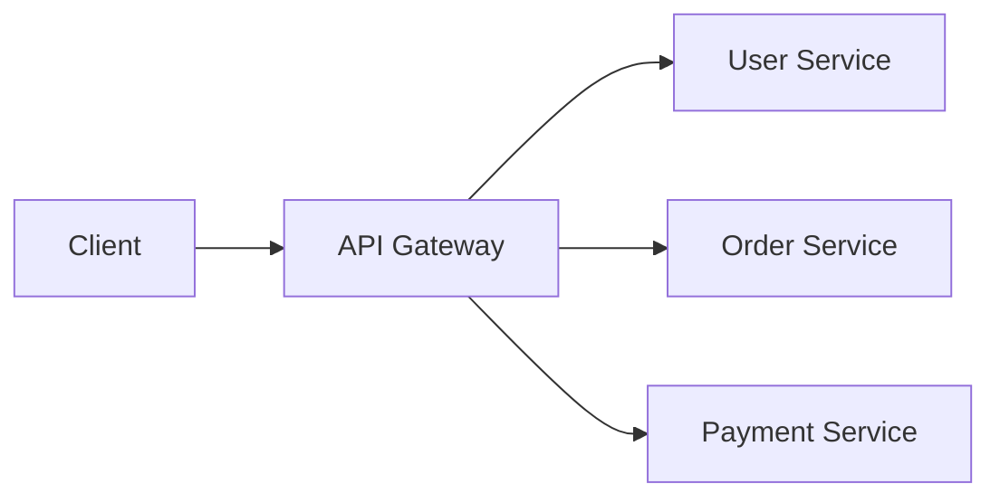
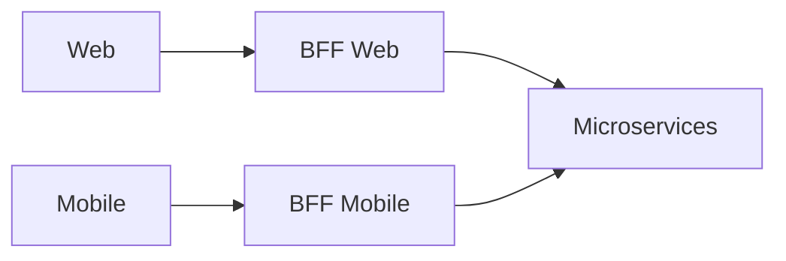
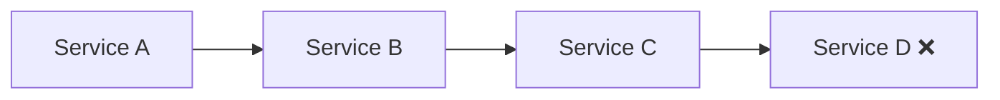
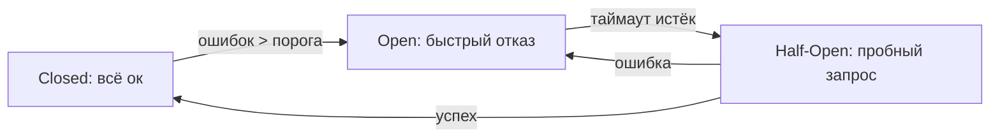
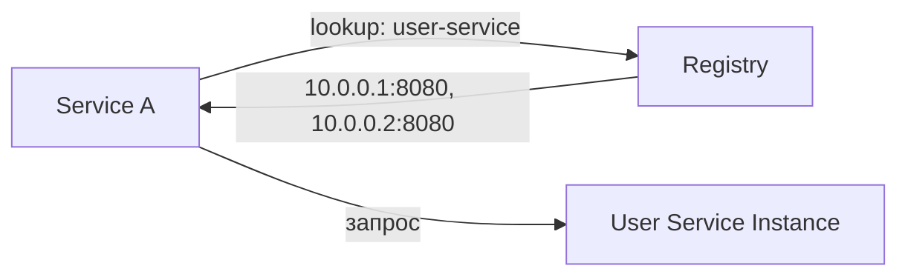

# Уровень 1: Синхронная коммуникация

## Что такое синхронная коммуникация?

Когда сервис A вызывает сервис B и **ждёт ответа**, прежде чем продолжить — это синхронная коммуникация. Клиент блокируется на время выполнения запроса. Это привычно и понятно (как телефонный звонок), но создаёт жёсткое связывание между сервисами.

```
Client → HTTP запрос → Service B
Client ←←←← ждёт ←←←← (обработка)
Client ← HTTP ответ  ← Service B
```

---

## REST API в микросервисах

REST (Representational State Transfer) — архитектурный стиль поверх HTTP. Каждый ресурс имеет URL, операции выражаются HTTP методами.

```
GET    /users/42          → получить пользователя
POST   /orders            → создать заказ
PUT    /orders/7/status   → обновить статус
DELETE /sessions/abc      → удалить сессию
```

**Плюсы REST:** человекочитаемый JSON, кешируемость, stateless, легко дебажить через curl/браузер.

**Минусы в микросервисах:** JSON — это текст (большой размер), нет контракта между сервисами, версионирование API — боль.

---

## gRPC и Protocol Buffers

gRPC — фреймворк от Google поверх HTTP/2. Вместо JSON использует **Protobuf** (бинарный формат).

```protobuf
// Контракт описывается в .proto файле
service UserService {
  rpc GetUser(GetUserRequest) returns (UserResponse);
  rpc ListUsers(ListRequest) returns (stream UserResponse);
}

message GetUserRequest {
  string user_id = 1;
}
```

Протобуф кодирует данные компактно: число `42` занимает 2 байта, строка `"Alice"` — 7 байт. JSON тех же данных занимает в 3-10 раз больше.

```
Protobuf: [field_tag][wire_type][value]
          0x08 0x2A  → field 1, varint, value=42

JSON:     {"user_id": 42}  → 15 байт
```

**Плюсы gRPC:** строгий контракт, генерация клиентов, streaming, HTTP/2 мультиплексирование.

**Минусы:** сложнее дебажить, нужен protoc компилятор, браузеры не поддерживают нативно.

---

## HTTP/1.1 vs HTTP/2

```
HTTP/1.1: один запрос на соединение (или keep-alive, но без мультиплексинга)
┌─────────────────────────────────────────┐
│  REQ 1 → RSP 1 → REQ 2 → RSP 2 → ...   │
└─────────────────────────────────────────┘

HTTP/2: мультиплексирование на одном соединении
┌────────────────────────────────────────────────┐
│  REQ 1 ──────────────────────────→ RSP 1       │
│  REQ 2 ────────────→ RSP 2                     │
│  REQ 3 ──→ RSP 3                               │
└────────────────────────────────────────────────┘
```

gRPC использует HTTP/2, поэтому streaming и мультиплексирование — встроены.

---

## Паттерны: API Gateway и BFF

**API Gateway** — единая точка входа для всех клиентов:



Gateway берёт на себя: аутентификацию, rate limiting, логирование, маршрутизацию.

**BFF (Backend for Frontend)** — отдельный gateway для каждого типа клиента:



Мобильное приложение получает урезанный ответ, веб — полный. Каждый BFF оптимизирован под своего клиента.

---

## Проблемы синхронной коммуникации

### Каскадные отказы

Если сервис D недоступен, весь chain A → B → C → D блокируется до таймаута:



Один отказ в конце цепочки может заблокировать всю систему на суммарное время таймаутов: 3 сервиса × 30 секунд = 90 секунд ожидания.

### Tight Coupling (жёсткое связывание)

Сервис A должен знать адрес сервиса B. Если B переезжает или масштабируется — A нужно обновлять.

---

## Circuit Breaker

Circuit Breaker — паттерн защиты от каскадных отказов. Как автоматический выключатель в электрике.



**Состояния:**
- **Closed** — нормальная работа, запросы проходят
- **Open** — быстрый отказ без ожидания (0ms вместо 30s timeout)
- **Half-Open** — пробный запрос для проверки восстановления

```typescript
// Псевдокод Circuit Breaker
class CircuitBreaker {
  state = 'closed'
  failures = 0
  threshold = 5

  async call(fn: () => Promise<unknown>) {
    if (this.state === 'open') {
      throw new Error('Circuit is open') // Быстрый отказ
    }
    try {
      const result = await fn()
      this.onSuccess()
      return result
    } catch (e) {
      this.onFailure()
      throw e
    }
  }
}
```

---

## Service Discovery

Сервисам нужно находить друг друга динамически (инстансы добавляются/удаляются).

**Client-side discovery:** клиент сам спрашивает реестр и выбирает инстанс.



**Server-side discovery:** клиент обращается к load balancer, тот решает куда маршрутизировать.

Реестры: **Consul**, **Eureka** (Netflix), **Kubernetes DNS** (встроен в k8s).

---

## ⚠️ Частые ошибки новичков

### ❌ Нет таймаутов на HTTP запросах

```typescript
// ❌ Зависнет навсегда если downstream недоступен
const response = await fetch('http://user-service/users/42')

// ✅ Всегда устанавливай таймаут
const controller = new AbortController()
const timeout = setTimeout(() => controller.abort(), 5000)
const response = await fetch('http://user-service/users/42', {
  signal: controller.signal,
})
clearTimeout(timeout)
```

### ❌ Retry без backoff и jitter

```typescript
// ❌ Все инстансы одновременно ретраят → thundering herd
for (let i = 0; i < 3; i++) {
  await fetch(url)
  await sleep(1000) // все ретраят в одно и то же время!
}

// ✅ Exponential backoff + jitter
const delay = Math.min(100 * 2 ** attempt + Math.random() * 100, 5000)
await sleep(delay)
```

### ❌ Синхронная цепочка там, где нужна асинхронная

```
// ❌ Order → Payment → Inventory → Notification — всё синхронно
// Если Notification упал, заказ не создаётся!

// ✅ Order синхронно → Payment, потом асинхронно публикует событие
// Inventory и Notification подписываются на событие
```

---

## Что дальше?

Синхронная коммуникация — это хорошо для запрос-ответ взаимодействия, но плохо для длительных операций и слабосвязанных систем. В следующем уровне разберём **асинхронную коммуникацию** через очереди сообщений.
