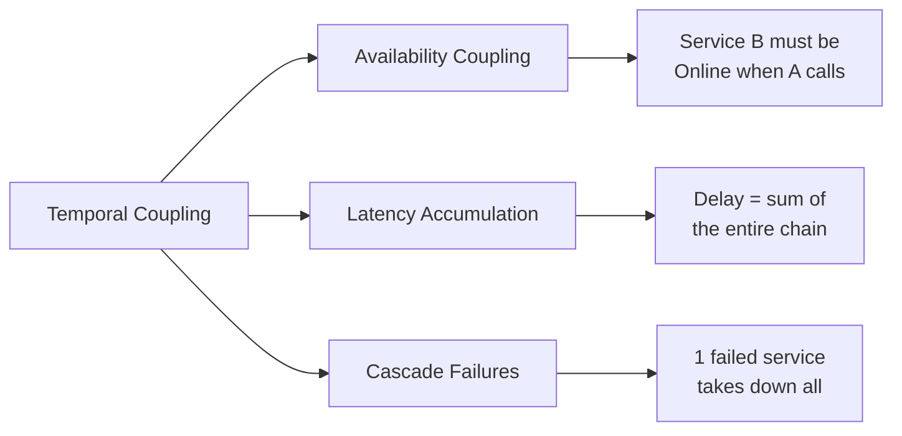
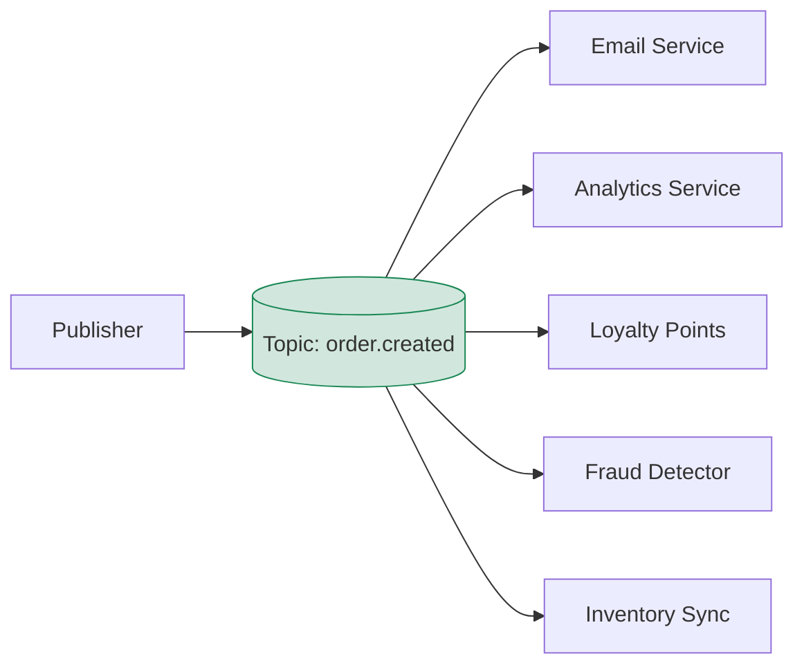
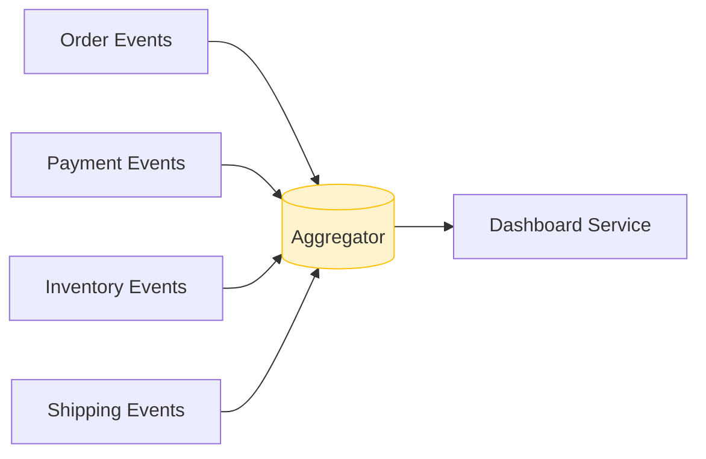
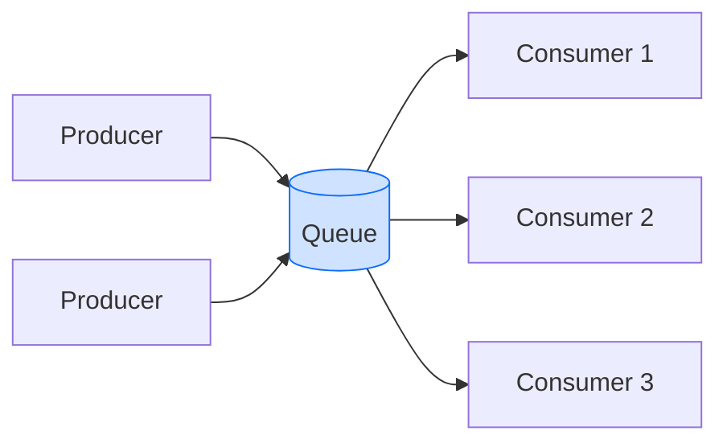
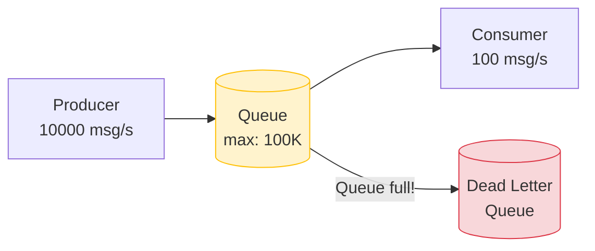
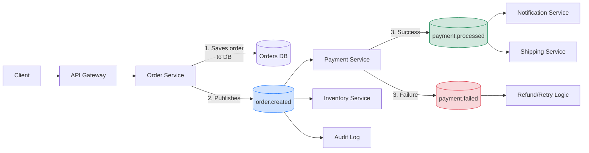

# Level 2: Asynchronous Communication and Queues — Detailed Theory

## Temporal Coupling and How to Break It

Temporal coupling is one of the hidden forms of dependency between services. Two components are temporally coupled if they must be **available at the same time** to interact.

### The Problem Illustrated

Imagine an e-commerce system on Black Friday:

```
Client sends order
    -> Order Service (50ms)
       -> Payment Service (200ms)
          -> Inventory Service (150ms)
             -> Email Service (300ms, temporarily unavailable!)
                -> ERROR!
```

The client gets a 503 error. Order not placed. Even though both money and product are available. One notification service let everyone down.

### Types of Coupling



### How Async Breaks It

```
Client sends order
    -> Order Service (50ms): creates order, publishes event
       -> RESPONSE TO CLIENT: "Order accepted, processing"

In parallel, asynchronously:
    Event: order.created
       -> Payment Worker: processes payment
       -> Inventory Worker: reserves product
       -> Email Worker: (unavailable) -> retry in 30 sec -> success
```

Order Service doesn't know or care that Email Worker is temporarily down. It did its part of the work.

---

## Message-Driven vs Event-Driven

These terms are often confused. The difference is fundamental.

### Message-Driven

The message is directed to a **specific recipient**. The sender knows who will process the message.

```typescript
// Message-Driven: directed message
interface ProcessPaymentCommand {
  type: 'PROCESS_PAYMENT'
  orderId: string
  amount: number
  destination: 'payment-service' // Explicit target
}

// Sender knows the message is going to payment-service
messageQueue.sendTo('payment-service', command)
```

Characteristics:
- One recipient (or competing consumers)
- Sender knows about the receiver
- Suitable for commands and requests

### Event-Driven

An event is a fact about something that happened. The publisher **doesn't know** and **doesn't care** who will react.

```typescript
// Event-Driven: publishing a fact
interface OrderCreatedEvent {
  type: 'order.created'
  orderId: string
  customerId: string
  items: OrderItem[]
  total: number
  occurredAt: string
}

// Publisher publishes the fact — whoever subscribes, publisher doesn't know
eventBus.publish('order.created', event)
```

Characteristics:
- Any number of subscribers (including zero)
- Publisher doesn't know about subscribers
- Suitable for domain events

> 💡 RabbitMQ supports both patterns. Kafka is primarily event-driven.

---

## Command vs Event vs Query

Three types of "messages" in distributed systems, each with its own semantics:

### Command
A request to **perform an action**. Can be rejected. One handler.

```typescript
interface CreateOrderCommand {
  type: 'CreateOrder'
  customerId: string
  items: CartItem[]
  // Imperative mood: "CREATE this order"
}

// Naming: verb in imperative mood
// CreateOrder, ProcessPayment, SendEmail, ReserveInventory
```

### Event
Notification that **something has already happened**. Cannot be rejected. Many handlers.

```typescript
interface OrderCreatedEvent {
  type: 'OrderCreated'
  orderId: string
  occurredAt: string
  // Past tense: "Order WAS CREATED"
}

// Naming: noun + past tense
// OrderCreated, PaymentProcessed, UserRegistered
```

### Query
A request for **data without changing state**. Rarely used directly in async systems, more often through the Request-Reply pattern.

```typescript
interface GetOrderStatusQuery {
  type: 'GetOrderStatus'
  orderId: string
  replyTo: string // Queue for response
  correlationId: string
}
```

---

## Fan-out and Fan-in Patterns

### Fan-out

One message -> many handlers. Key Pub/Sub pattern.



**Use cases:**
- Notifying multiple systems about one event
- Cache invalidation across multiple nodes
- Audit and logging
- Data denormalization for read-optimized stores

```typescript
// Publisher publishes once
await eventBus.publish('order.created', orderEvent)

// Each subscriber independently:
// EmailWorker -> sends email
// AnalyticsWorker -> writes to ClickHouse
// LoyaltyWorker -> accrues points
// FraudWorker -> checks for fraud
```

### Fan-in

Many sources -> one handler. Data aggregation from different streams.



**Use cases:**
- Aggregating metrics from different services
- Building materialized views
- Correlation: assembling related events into one workflow

---

## Competing Consumers

Classic scaling pattern for Point-to-Point queues.



Rules:
- Each message is processed by **exactly one** consumer
- The consumer that first takes the message (ACK lock) processes it
- Other consumers don't see this message until timeout
- If a consumer crashes — the message returns to the queue

```typescript
// RabbitMQ: prefetch = how many messages a consumer takes at once
channel.prefetch(1) // Take one at a time — fair distribution

// With this setting, load distributes evenly:
// Consumer 1 (fast): processed 60% of messages
// Consumer 2 (slow): processed 40% of messages
// Vs round-robin: each gets 50%, slow will fall behind
```

**Scaling:** add 3 consumers instead of 1 — throughput increases ~3x (assuming the bottleneck is consumer CPU/IO, not network or DB).

---

## Message Ordering: Challenges and Trade-offs

Message ordering seems simple until you have distributed consumers.

### The Problem

```
Producer sends:
  msg1: UserCreated(id=42)
  msg2: UserUpdated(id=42, email=new@email.com)
  msg3: UserDeleted(id=42)

Consumer A receives: msg1, msg3
Consumer B receives: msg2

Result: Consumer A created and deleted the user.
        Consumer B updated a non-existent user.
```

### Solutions

**Partitioning by key** (Kafka approach):
```
All messages with the same userId -> the same partition -> one consumer
Ordering guarantee within a single userId
```

**Event versioning** (optimistic locking):
```typescript
interface UserEvent {
  userId: string
  version: number // Monotonically increasing
  type: 'UserCreated' | 'UserUpdated' | 'UserDeleted'
  payload: unknown
}

// Consumer checks version before applying
async function applyEvent(event: UserEvent) {
  const currentVersion = await db.getUserVersion(event.userId)
  if (event.version !== currentVersion + 1) {
    // Out of order — put back in queue or dead-letter
    throw new OutOfOrderEventError(event)
  }
  await db.applyEvent(event)
}
```

**Sequence numbers and resequencing buffer**:
```
Received: msg3, msg1, msg2
Buffer: { 1: msg1, 2: msg2, 3: msg3 }
Deliver in order: msg1 -> msg2 -> msg3
Tradeoff: latency increases
```

> ⚠️ Don't require global ordering where ordering within a single entity is sufficient. Global ordering kills parallelism.

---

## Idempotent Consumers

With at-least-once delivery, the consumer **must** be idempotent — reprocessing the same message must not change the result.

### The Problem

```
1. Consumer receives: ProcessPayment(orderId=42, amount=1000)
2. Consumer processes: money deducted
3. Consumer sends ACK... network fails
4. Broker retries: ProcessPayment(orderId=42, amount=1000)
5. Consumer processes again: money deducted a second time!
```

### Solutions

**Idempotency key:**
```typescript
async function processPayment(event: ProcessPaymentEvent) {
  // Check if we've already processed this event
  const exists = await db.idempotencyKeys.findOne({
    key: event.messageId
  })
  if (exists) {
    console.log(`Already processed: ${event.messageId}`)
    return // Idempotent exit
  }

  // Process the payment
  await paymentGateway.charge(event.orderId, event.amount)

  // Save the key (in the same transaction!)
  await db.idempotencyKeys.insert({
    key: event.messageId,
    processedAt: new Date()
  })
}
```

**Natural idempotency:** some operations are idempotent by nature:
```typescript
// Idempotent: SET doesn't change result on repeat
await db.orders.update(
  { orderId: event.orderId },
  { $set: { status: 'paid', paidAt: event.occurredAt } }
)

// NOT idempotent: INCREMENT changes result on repeat
await db.orders.update(
  { orderId: event.orderId },
  { $inc: { paymentAttempts: 1 } } // Will be 2 instead of 1!
)
```

**Conditional updates:**
```typescript
// Update only if the status allows the transition
await db.orders.updateOne(
  { orderId: event.orderId, status: 'pending' }, // Guard
  { $set: { status: 'paid' } }
)
// If order is already 'paid' — update won't apply, no error
```

---

## Backpressure Strategies

Backpressure is a feedback mechanism from an overloaded consumer back to the producer. Without it, a fast producer will kill a slow consumer.



### Strategy 1: Buffering with Limits

```typescript
// RabbitMQ: set max queue length
await channel.assertQueue('orders', {
  durable: true,
  arguments: {
    'x-max-length': 10000,        // Max 10K messages
    'x-overflow': 'reject-publish', // Reject new ones on overflow
    'x-dead-letter-exchange': 'dlx' // Where to send rejected
  }
})
```

### Strategy 2: Producer Throttling

```typescript
async function throttledPublish(messages: Message[]) {
  for (const msg of messages) {
    await publisher.send(msg)

    // Check queue depth
    const queueInfo = await channel.checkQueue('orders')
    if (queueInfo.messageCount > 5000) {
      // Slow down: wait 100ms between messages
      await sleep(100)
    }
  }
}
```

### Strategy 3: Adaptive Scaling

```
Queue depth > 1000 -> spawn new consumer instances
Queue depth < 100  -> terminate excess consumers
```

Kubernetes HPA with custom metrics from Prometheus/CloudWatch does this automatically.

### Strategy 4: Drop + DLQ

```typescript
// On overflow — message goes to Dead Letter Queue
// DLQ — a "quarantine" for unprocessed messages
// An operator can replay or analyze them
```

> 📌 Always configure a Dead Letter Queue in production. Lost messages = lost money or data.

---

## Message Schemas and Evolution

Messages in queues live a long time. Today's consumer may process messages published 6 months ago.

### The Backward Compatibility Problem

```typescript
// v1: OrderCreated
interface OrderCreatedV1 {
  orderId: string
  amount: number
}

// v2: added currency field
interface OrderCreatedV2 {
  orderId: string
  amount: number
  currency: string // NEW FIELD
}

// Consumer v1 receives v2 message:
// currency = undefined -> error!
```

### Schema Evolution Rules

**Backward Compatible changes:**
```typescript
// OK: add an optional field
interface OrderCreatedV2 {
  orderId: string
  amount: number
  currency?: string // Optional — old consumer ignores it
}

// OK: add a new event instead of modifying an old one
// OrderCreated -> OrderCreatedV2 (new topic)
```

**Breaking changes:**
```typescript
// NOT OK: remove a field the consumer uses
// NOT OK: change field type (number -> string)
// NOT OK: rename a field without an alias
```

### Versioning Strategies

```typescript
// Strategy 1: version in topic/queue name
// orders.v1.created, orders.v2.created
// Drawback: need to migrate consumers

// Strategy 2: version in payload
interface BaseEvent {
  version: '1' | '2'
  type: string
}

// Consumer handles both versions
function handleOrderCreated(event: OrderCreatedV1 | OrderCreatedV2) {
  if (event.version === '2') {
    // Handle v2
  } else {
    // Handle v1 with defaults
  }
}

// Strategy 3: Schema Registry (Avro, Protobuf)
// Schema is stored centrally, consumer fetches it by schema ID
```

---

## Real-World Example: E-Commerce Order Processing

Let's look at a full order processing flow with asynchronous architecture.



### Step by Step

```typescript
// 1. Order Service accepts the request and returns immediately
async function createOrder(request: CreateOrderRequest): Promise<OrderResponse> {
  // Save order with 'pending' status
  const order = await orderRepository.save({
    ...request,
    status: 'pending',
    createdAt: new Date()
  })

  // Publish event (outbox pattern in production)
  await eventBus.publish('order.created', {
    orderId: order.id,
    customerId: order.customerId,
    items: order.items,
    total: order.total,
    occurredAt: new Date().toISOString()
  })

  // Return response immediately — don't wait for payment!
  return { orderId: order.id, status: 'pending' }
}

// 2. Payment Service processes asynchronously
async function handleOrderCreated(event: OrderCreatedEvent) {
  try {
    await paymentGateway.charge(event.customerId, event.total)

    await eventBus.publish('payment.processed', {
      orderId: event.orderId,
      amount: event.total,
      occurredAt: new Date().toISOString()
    })
  } catch (error) {
    await eventBus.publish('payment.failed', {
      orderId: event.orderId,
      reason: error.message,
      occurredAt: new Date().toISOString()
    })
  }
}

// 3. Shipping Service waits for payment.processed
async function handlePaymentProcessed(event: PaymentProcessedEvent) {
  await shippingService.scheduleDelivery(event.orderId)
}
```

### What to Show the Client While Processing?

```
Options:
1. Polling: client periodically checks order status
   GET /orders/{id}/status -> { status: 'pending' | 'paid' | 'failed' }

2. WebSocket: server pushes status updates in real time

3. Email/Push: notification after processing completes

Best UX: optimistic UI + real-time updates
"Your order has been accepted!" + WebSocket for status
```

---

## ⚠️ Typical Beginner Mistakes

### Mistake 1: Synchronous Call Inside a Consumer

```typescript
// ❌ Consumer makes a synchronous HTTP call to another service
async function handleOrderCreated(event: OrderCreatedEvent) {
  // If payment-service is unavailable — consumer is blocked!
  const paymentResult = await fetch('http://payment-service/charge', {
    method: 'POST',
    body: JSON.stringify({ amount: event.total })
  })
}

// ✅ Consumer publishes a command or uses another pattern
async function handleOrderCreated(event: OrderCreatedEvent) {
  // Publish command — Payment Service will process it
  await commandBus.send('payment-service', {
    type: 'ProcessPayment',
    orderId: event.orderId,
    amount: event.total
  })
}
```

### Mistake 2: No Idempotency Key

```typescript
// ❌ Consumer doesn't check for duplicates
async function processPayment(event: ProcessPaymentEvent) {
  await paymentGateway.charge(event.amount) // Will charge twice on retry!
}

// ✅ Always check idempotency key
async function processPayment(event: ProcessPaymentEvent) {
  if (await idempotencyStore.exists(event.messageId)) return

  await paymentGateway.charge(event.amount)
  await idempotencyStore.save(event.messageId)
}
```

### Mistake 3: Ignoring Event Ordering

```typescript
// ❌ Processing UserDeleted before UserCreated — consumer crashes
async function handleUserEvent(event: UserEvent) {
  const user = await db.users.findOne(event.userId)
  user.apply(event) // TypeError: Cannot read property of null
}

// ✅ Defensive processing with state checking
async function handleUserEvent(event: UserEvent) {
  if (event.type === 'UserDeleted') {
    // Idempotent: if not found — no problem
    await db.users.deleteOne({ userId: event.userId, status: { $ne: 'deleted' } })
    return
  }

  const user = await db.users.findOne(event.userId) ?? createDefaultUser(event.userId)
  await user.apply(event)
}
```

### Mistake 4: Oversized Messages in Queue

```typescript
// ❌ Putting the entire document in the message
await eventBus.publish('order.created', {
  orderId: order.id,
  items: order.items,      // Could be 1000 items!
  customer: fullCustomerObject, // All customer fields
  history: orderHistory    // Entire order history!
})

// ✅ Thin events: only IDs and minimally required data
await eventBus.publish('order.created', {
  orderId: order.id,
  customerId: order.customerId,
  total: order.total,
  occurredAt: new Date().toISOString()
  // Consumer fetches details itself if needed
})
```

### Mistake 5: No Dead Letter Queue

```typescript
// ❌ Without DLQ: broken message retries infinitely, blocking the queue
await channel.assertQueue('orders', { durable: true })

// ✅ With DLQ: after N attempts, message goes to quarantine
await channel.assertQueue('orders', {
  durable: true,
  arguments: {
    'x-dead-letter-exchange': 'orders.dlx',
    'x-message-ttl': 60000,      // TTL 1 minute
    'x-max-length': 50000,       // Queue size limit
  }
})
```

---

## Best Practices

1. **Thin events** — minimal necessary data in the message. Consumer fetches details itself.

2. **Versioned events** — include a version in every event from day one. It's harder to add later.

3. **Dead Letter Queue everywhere** — any message that couldn't be processed N times should go to a DLQ, not be lost.

4. **Correlation ID** — trace the event chain with a single correlation ID from the first request.

5. **Observability** — queue depth metrics, consumer lag, processing time — mandatory metrics for async systems.

6. **Backoff + Jitter** — on retry, don't use fixed intervals. Exponential backoff with jitter prevents thundering herd.

7. **Schema Registry** — for large systems, use centralized schema storage (Confluent Schema Registry, AWS Glue).

8. **Idempotency by default** — design every consumer as idempotent from day one, even if duplicates seem impossible.