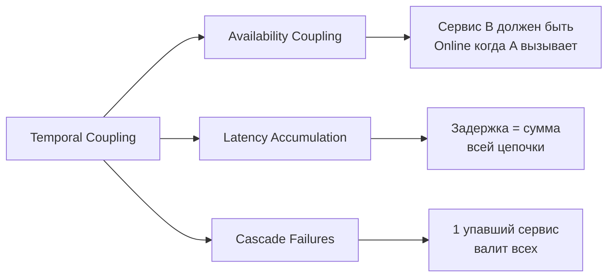
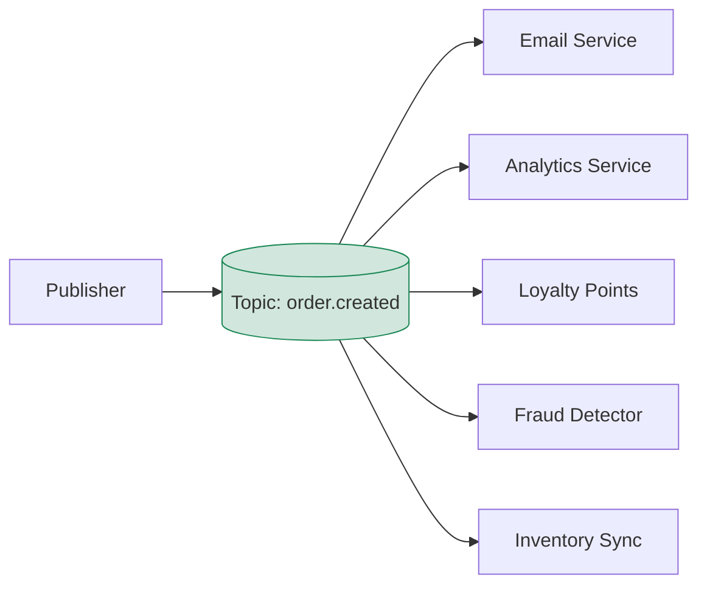
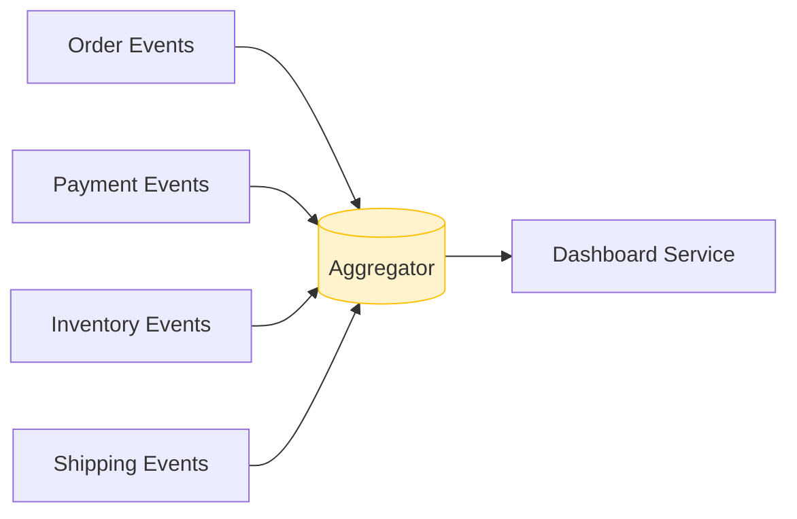
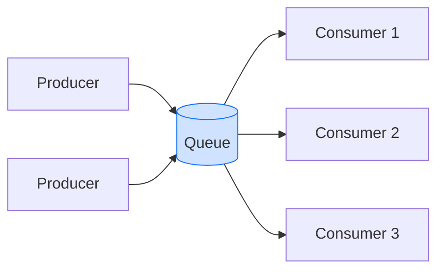
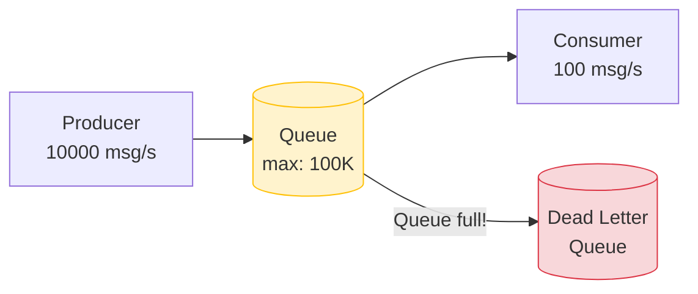
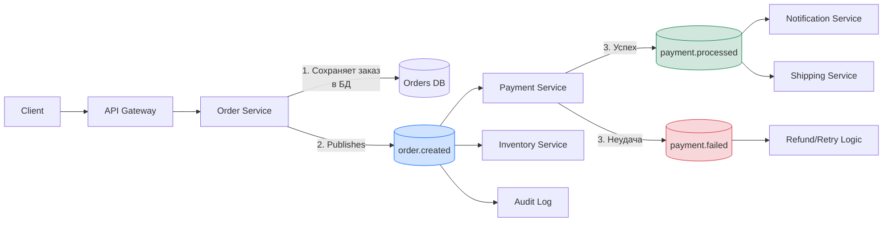

# Уровень 2: Асинхронная коммуникация и очереди — подробная теория

## Temporal Coupling и как его разрывать

Temporal coupling — одна из скрытых форм зависимости между сервисами. Два компонента temporally coupled, если они должны быть **доступны в одно и то же время** для взаимодействия.

### Проблема на примере

Представьте e-commerce систему в чёрную пятницу:

```
Клиент отправляет заказ
    -> Order Service (50ms)
       -> Payment Service (200ms)
          -> Inventory Service (150ms)
             -> Email Service (300ms, временно недоступен!)
                -> ОШИБКА!
```

Клиент получает ошибку 503. Заказ не оформлен. Хотя и деньги, и товар — всё есть. Подвёл один сервис уведомлений.

### Виды coupling



### Как разрывает async

```
Клиент отправляет заказ
    -> Order Service (50ms): создаёт заказ, публикует событие
       -> ОТВЕТ КЛИЕНТУ: "Заказ принят, обрабатывается"

Параллельно, асинхронно:
    Event: order.created
       -> Payment Worker: обрабатывает платёж
       -> Inventory Worker: резервирует товар
       -> Email Worker: (недоступен) -> retry через 30 сек -> успех
```

Order Service не знает и не заботится о том, что Email Worker временно лежит. Он выполнил свою часть работы.

---

## Message-Driven vs Event-Driven

Часто эти термины путают. Разница принципиальная.

### Message-Driven (сообщение-ориентированный)

Сообщение направлено **конкретному получателю**. Sender знает, кто обработает сообщение.

```typescript
// Message-Driven: направленное сообщение
interface ProcessPaymentCommand {
  type: 'PROCESS_PAYMENT'
  orderId: string
  amount: number
  destination: 'payment-service' // Explicit target
}

// Sender знает, что сообщение идёт в payment-service
messageQueue.sendTo('payment-service', command)
```

Характеристики:
- Один получатель (или competing consumers)
- Sender знает о receiver
- Подходит для команд и запросов

### Event-Driven (событие-ориентированный)

Событие — это факт того, что произошло. Publisher **не знает** и **не заботится**, кто будет реагировать.

```typescript
// Event-Driven: публикация факта
interface OrderCreatedEvent {
  type: 'order.created'
  orderId: string
  customerId: string
  items: OrderItem[]
  total: number
  occurredAt: string
}

// Publisher публикует факт — кто подпишется, publisher не знает
eventBus.publish('order.created', event)
```

Характеристики:
- Любое число subscribers (включая ноль)
- Publisher не знает о subscribers
- Подходит для доменных событий

> 💡 RabbitMQ поддерживает оба паттерна. Kafka — преимущественно event-driven.

---

## Command vs Event vs Query

Три вида "сообщений" в распределённых системах, каждый со своей семантикой:

### Command (команда)
Запрос на **выполнение действия**. Может быть отклонён. Один обработчик.

```typescript
interface CreateOrderCommand {
  type: 'CreateOrder'
  customerId: string
  items: CartItem[]
  // Imperativ mood: "CREATE this order"
}

// Именование: глагол в повелительном наклонении
// CreateOrder, ProcessPayment, SendEmail, ReserveInventory
```

### Event (событие)
Уведомление о том, что **что-то уже произошло**. Не может быть отклонено. Много обработчиков.

```typescript
interface OrderCreatedEvent {
  type: 'OrderCreated'
  orderId: string
  occurredAt: string
  // Past tense: "Order WAS CREATED"
}

// Именование: существительное + прошедшее время
// OrderCreated, PaymentProcessed, UserRegistered
```

### Query (запрос)
Запрос **данных без изменения состояния**. В async-системах редко используется напрямую, чаще через Request-Reply паттерн.

```typescript
interface GetOrderStatusQuery {
  type: 'GetOrderStatus'
  orderId: string
  replyTo: string // Queue для ответа
  correlationId: string
}
```

---

## Fan-out и Fan-in паттерны

### Fan-out

Одно сообщение -> множество обработчиков. Ключевой паттерн Pub/Sub.



**Применение:**
- Уведомление множества систем об одном событии
- Инвалидация кэшей в нескольких нодах
- Аудит и логирование
- Денормализация данных для read-оптимизированных хранилищ

```typescript
// Publisher публикует один раз
await eventBus.publish('order.created', orderEvent)

// Каждый subscriber независимо:
// EmailWorker -> отправляет email
// AnalyticsWorker -> пишет в ClickHouse
// LoyaltyWorker -> начисляет баллы
// FraudWorker -> проверяет на мошенничество
```

### Fan-in

Множество источников -> один обработчик. Агрегация данных из разных потоков.



**Применение:**
- Агрегация метрик из разных сервисов
- Построение материализованных представлений
- Correlation: сборка связанных событий в один workflow

---

## Competing Consumers

Классический паттерн масштабирования для Point-to-Point очередей.



Правила:
- Каждое сообщение обрабатывается **ровно одним** consumer
- Consumer, который первым взял сообщение (ACK lock), его и обрабатывает
- Другие consumers не видят это сообщение, пока не истечёт timeout
- Если consumer упал — сообщение возвращается в очередь

```typescript
// RabbitMQ: prefetch = сколько сообщений consumer берёт одновременно
channel.prefetch(1) // Брать одно за раз — честное распределение

// При такой настройке нагрузка распределяется равномерно:
// Consumer 1 (fast): обработал 60% сообщений
// Consumer 2 (slow): обработал 40% сообщений
// Vs round-robin: каждый получит 50%, slow будет отставать
```

**Масштабирование:** добавьте 3 consumer вместо 1 — пропускная способность вырастет в ~3 раза (при условии, что bottleneck — это CPU/IO consumer, а не сеть или БД).

---

## Message Ordering: вызовы и компромиссы

Порядок сообщений кажется простым, пока не появляются distributed consumers.

### Проблема

```
Producer отправляет:
  msg1: UserCreated(id=42)
  msg2: UserUpdated(id=42, email=new@email.com)
  msg3: UserDeleted(id=42)

Consumer A получает: msg1, msg3
Consumer B получает: msg2

Результат: Consumer A создал и удалил пользователя.
           Consumer B обновил несуществующего пользователя.
```

### Решения

**Партиционирование по ключу** (Kafka approach):
```
Все сообщения с одним userId -> одна и та же partition -> один consumer
Гарантия порядка в рамках одного userId
```

**Версионирование событий** (optimistic locking):
```typescript
interface UserEvent {
  userId: string
  version: number // Монотонно растущий
  type: 'UserCreated' | 'UserUpdated' | 'UserDeleted'
  payload: unknown
}

// Consumer проверяет версию перед применением
async function applyEvent(event: UserEvent) {
  const currentVersion = await db.getUserVersion(event.userId)
  if (event.version !== currentVersion + 1) {
    // Out of order — положить обратно в очередь или dead-letter
    throw new OutOfOrderEventError(event)
  }
  await db.applyEvent(event)
}
```

**Sequence numbers и resequencing buffer**:
```
Получили: msg3, msg1, msg2
Buffer: { 1: msg1, 2: msg2, 3: msg3 }
Deliver in order: msg1 -> msg2 -> msg3
Tradeoff: latency растёт
```

> ⚠️ Не требуйте глобального порядка там, где достаточно порядка в рамках одной сущности. Глобальный порядок убивает параллелизм.

---

## Idempotent Consumers

При at-least-once delivery consumer **обязан** быть идемпотентным — повторная обработка одного сообщения не должна менять результат.

### Проблема

```
1. Consumer получает: ProcessPayment(orderId=42, amount=1000)
2. Consumer обрабатывает: деньги списаны
3. Consumer отправляет ACK... сеть упала
4. Broker retry: ProcessPayment(orderId=42, amount=1000)
5. Consumer обрабатывает снова: деньги списаны второй раз!
```

### Решения

**Idempotency key:**
```typescript
async function processPayment(event: ProcessPaymentEvent) {
  // Проверяем, не обрабатывали ли уже это событие
  const exists = await db.idempotencyKeys.findOne({
    key: event.messageId
  })
  if (exists) {
    console.log(`Already processed: ${event.messageId}`)
    return // Идемпотентный выход
  }

  // Обрабатываем платёж
  await paymentGateway.charge(event.orderId, event.amount)

  // Сохраняем ключ (в той же транзакции!)
  await db.idempotencyKeys.insert({
    key: event.messageId,
    processedAt: new Date()
  })
}
```

**Natural idempotency:** некоторые операции идемпотентны по природе:
```typescript
// Идемпотентно: SET не меняет результат при повторе
await db.orders.update(
  { orderId: event.orderId },
  { $set: { status: 'paid', paidAt: event.occurredAt } }
)

// НЕ идемпотентно: INCREMENT меняет результат при повторе
await db.orders.update(
  { orderId: event.orderId },
  { $inc: { paymentAttempts: 1 } } // Будет 2 вместо 1!
)
```

**Conditional updates:**
```typescript
// Обновляем только если статус позволяет переход
await db.orders.updateOne(
  { orderId: event.orderId, status: 'pending' }, // Guard
  { $set: { status: 'paid' } }
)
// Если заказ уже 'paid' — update не применится, ошибки нет
```

---

## Стратегии Backpressure

Backpressure — механизм обратного давления от перегруженного consumer к producer. Без него быстрый producer убьёт медленный consumer.



### Стратегия 1: Buffering с limits

```typescript
// RabbitMQ: установить max queue length
await channel.assertQueue('orders', {
  durable: true,
  arguments: {
    'x-max-length': 10000,        // Максимум 10K сообщений
    'x-overflow': 'reject-publish', // Reject новые при переполнении
    'x-dead-letter-exchange': 'dlx' // Куда отправлять rejected
  }
})
```

### Стратегия 2: Producer throttling

```typescript
async function throttledPublish(messages: Message[]) {
  for (const msg of messages) {
    await publisher.send(msg)

    // Проверяем глубину очереди
    const queueInfo = await channel.checkQueue('orders')
    if (queueInfo.messageCount > 5000) {
      // Замедляемся: ждём 100ms между сообщениями
      await sleep(100)
    }
  }
}
```

### Стратегия 3: Adaptive scaling

```
Queue depth > 1000 -> spawn новые consumer instances
Queue depth < 100  -> terminate лишние consumers
```

Kubernetes HPA с custom metrics от Prometheus/CloudWatch делает это автоматически.

### Стратегия 4: Drop + DLQ

```typescript
// При переполнении — сообщение идёт в Dead Letter Queue
// DLQ — "карантин" для необработанных сообщений
// Оператор может их переиграть или проанализировать
```

> 📌 Всегда настраивайте Dead Letter Queue в production. Потерянные сообщения = потерянные деньги или данные.

---

## Message Schemas и Evolution

Сообщения в очередях живут долго. Сегодняшний consumer может обрабатывать сообщения, опубликованные 6 месяцев назад.

### Проблема обратной совместимости

```typescript
// v1: OrderCreated
interface OrderCreatedV1 {
  orderId: string
  amount: number
}

// v2: добавили поле currency
interface OrderCreatedV2 {
  orderId: string
  amount: number
  currency: string // НОВОЕ ПОЛЕ
}

// Consumer v1 получает сообщение v2:
// currency = undefined -> ошибка!
```

### Правила эволюции схем

**Обратно-совместимые изменения (Backward Compatible):**
```typescript
// МОЖНО: добавить опциональное поле
interface OrderCreatedV2 {
  orderId: string
  amount: number
  currency?: string // Optional — старый consumer игнорирует
}

// МОЖНО: добавить новое событие вместо изменения старого
// OrderCreated -> OrderCreatedV2 (новый topic)
```

**Несовместимые изменения (Breaking):**
```typescript
// НЕЛЬЗЯ: удалить поле, которое использует consumer
// НЕЛЬЗЯ: изменить тип поля (number -> string)
// НЕЛЬЗЯ: переименовать поле без alias
```

### Стратегии версионирования

```typescript
// Стратегия 1: версия в имени topic/queue
// orders.v1.created, orders.v2.created
// Минус: нужно мигрировать consumers

// Стратегия 2: версия в payload
interface BaseEvent {
  version: '1' | '2'
  type: string
}

// Consumer обрабатывает обе версии
function handleOrderCreated(event: OrderCreatedV1 | OrderCreatedV2) {
  if (event.version === '2') {
    // Handle v2
  } else {
    // Handle v1 with defaults
  }
}

// Стратегия 3: Schema Registry (Avro, Protobuf)
// Схема хранится централизованно, consumer получает её по schema ID
```

---

## Реальный пример: E-Commerce Order Processing

Рассмотрим полный flow обработки заказа с асинхронной архитектурой.



### Что происходит шаг за шагом

```typescript
// 1. Order Service принимает запрос и возвращает немедленно
async function createOrder(request: CreateOrderRequest): Promise<OrderResponse> {
  // Сохраняем заказ со статусом 'pending'
  const order = await orderRepository.save({
    ...request,
    status: 'pending',
    createdAt: new Date()
  })

  // Публикуем событие (outbox pattern в production)
  await eventBus.publish('order.created', {
    orderId: order.id,
    customerId: order.customerId,
    items: order.items,
    total: order.total,
    occurredAt: new Date().toISOString()
  })

  // Возвращаем ответ немедленно — не ждём payment!
  return { orderId: order.id, status: 'pending' }
}

// 2. Payment Service обрабатывает асинхронно
async function handleOrderCreated(event: OrderCreatedEvent) {
  try {
    await paymentGateway.charge(event.customerId, event.total)

    await eventBus.publish('payment.processed', {
      orderId: event.orderId,
      amount: event.total,
      occurredAt: new Date().toISOString()
    })
  } catch (error) {
    await eventBus.publish('payment.failed', {
      orderId: event.orderId,
      reason: error.message,
      occurredAt: new Date().toISOString()
    })
  }
}

// 3. Shipping Service ждёт payment.processed
async function handlePaymentProcessed(event: PaymentProcessedEvent) {
  await shippingService.scheduleDelivery(event.orderId)
}
```

### Что делать с клиентом, пока идёт обработка?

```
Варианты:
1. Polling: клиент периодически спрашивает статус заказа
   GET /orders/{id}/status -> { status: 'pending' | 'paid' | 'failed' }

2. WebSocket: сервер пушит обновления статуса в реальном времени

3. Email/Push: уведомление после завершения обработки

Лучший UX: optimistic UI + real-time updates
"Ваш заказ принят!" + WebSocket для статуса
```

---

## ⚠️ Типичные ошибки новичков

### Ошибка 1: Синхронный вызов внутри consumer

```typescript
// ❌ Consumer делает синхронный HTTP-вызов к другому сервису
async function handleOrderCreated(event: OrderCreatedEvent) {
  // Если payment-service недоступен — consumer заблокирован!
  const paymentResult = await fetch('http://payment-service/charge', {
    method: 'POST',
    body: JSON.stringify({ amount: event.total })
  })
}

// ✅ Consumer публикует команду или использует другой паттерн
async function handleOrderCreated(event: OrderCreatedEvent) {
  // Публикуем команду — Payment Service обработает сам
  await commandBus.send('payment-service', {
    type: 'ProcessPayment',
    orderId: event.orderId,
    amount: event.total
  })
}
```

### Ошибка 2: Отсутствие idempotency key

```typescript
// ❌ Consumer не проверяет дубликаты
async function processPayment(event: ProcessPaymentEvent) {
  await paymentGateway.charge(event.amount) // Зарядит дважды при retry!
}

// ✅ Всегда проверяйте idempotency key
async function processPayment(event: ProcessPaymentEvent) {
  if (await idempotencyStore.exists(event.messageId)) return

  await paymentGateway.charge(event.amount)
  await idempotencyStore.save(event.messageId)
}
```

### Ошибка 3: Игнорирование порядка событий

```typescript
// ❌ Обработка UserDeleted до UserCreated — consumer крашится
async function handleUserEvent(event: UserEvent) {
  const user = await db.users.findOne(event.userId)
  user.apply(event) // TypeError: Cannot read property of null
}

// ✅ Defensive обработка с проверкой состояния
async function handleUserEvent(event: UserEvent) {
  if (event.type === 'UserDeleted') {
    // Идемпотентно: если нет — не страшно
    await db.users.deleteOne({ userId: event.userId, status: { $ne: 'deleted' } })
    return
  }

  const user = await db.users.findOne(event.userId) ?? createDefaultUser(event.userId)
  await user.apply(event)
}
```

### Ошибка 4: Огромные сообщения в очереди

```typescript
// ❌ Кладём весь документ в сообщение
await eventBus.publish('order.created', {
  orderId: order.id,
  items: order.items,      // Может быть 1000 позиций!
  customer: fullCustomerObject, // Все поля клиента
  history: orderHistory    // Вся история заказов!
})

// ✅ Thin events: только ID и минимально необходимые данные
await eventBus.publish('order.created', {
  orderId: order.id,
  customerId: order.customerId,
  total: order.total,
  occurredAt: new Date().toISOString()
  // Consumer сам запросит нужные детали если надо
})
```

### Ошибка 5: Отсутствие Dead Letter Queue

```typescript
// ❌ Без DLQ: сломанное сообщение бесконечно retry-ится, блокируя очередь
await channel.assertQueue('orders', { durable: true })

// ✅ С DLQ: после N попыток сообщение идёт в карантин
await channel.assertQueue('orders', {
  durable: true,
  arguments: {
    'x-dead-letter-exchange': 'orders.dlx',
    'x-message-ttl': 60000,      // TTL 1 минута
    'x-max-length': 50000,       // Лимит размера очереди
  }
})
```

---

## Best Practices

1. **Thin events** — минимально необходимые данные в сообщении. Consumer запрашивает детали сам.

2. **Versioned events** — включайте версию в каждое событие с первого дня. Потом добавить сложнее.

3. **Dead Letter Queue everywhere** — любое сообщение, которое не удалось обработать N раз, должно попасть в DLQ, а не быть потеряно.

4. **Correlation ID** — трассируйте цепочку событий через единый correlation ID от первого запроса.

5. **Observability** — метрики глубины очереди, lag consumers, processing time — обязательные метрики для async систем.

6. **Backoff + Jitter** — при retry не используйте фиксированные интервалы. Exponential backoff с jitter предотвращает thundering herd.

7. **Schema Registry** — для больших систем используйте централизованное хранение схем (Confluent Schema Registry, AWS Glue).

8. **Idempotency by default** — проектируйте каждый consumer как идемпотентный с первого дня, даже если кажется, что дубликаты невозможны.
