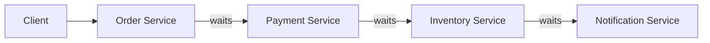
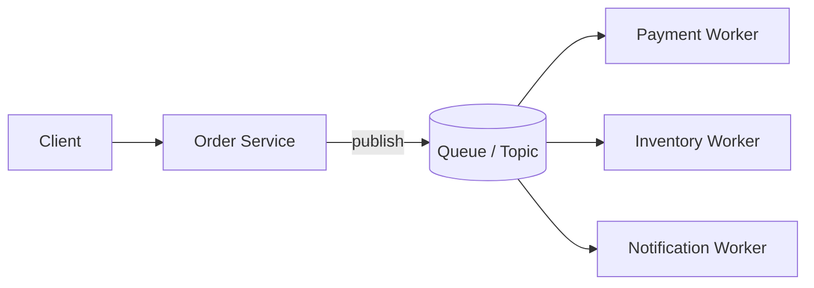
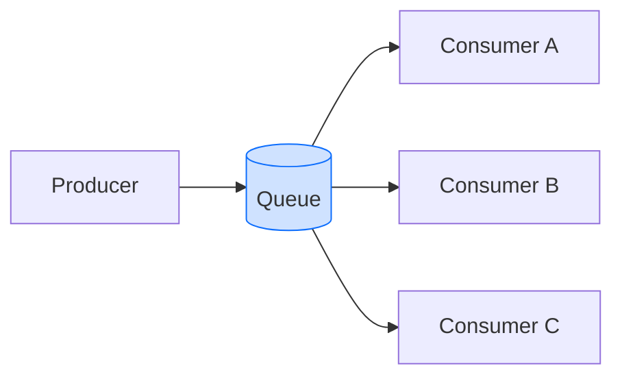
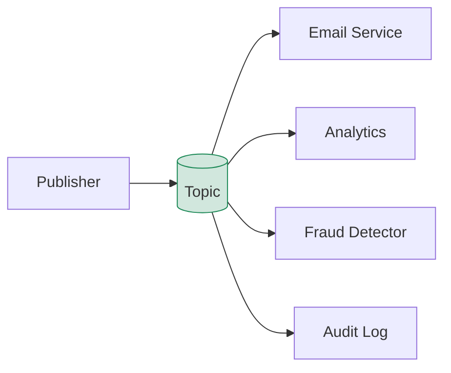
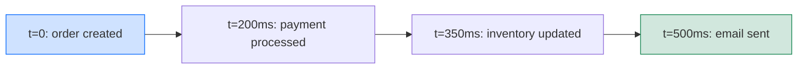
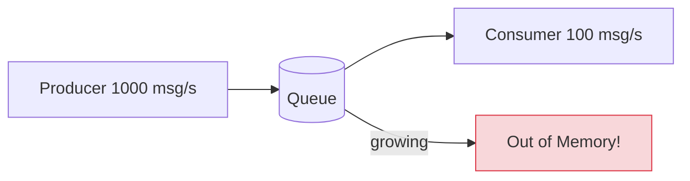

# Level 2: Asynchronous Communication and Queues

## Why Asynchronous Communication?

In the synchronous world, every call is a promise of an immediate response. Order Service calls Payment Service and waits. Payment Service calls Inventory Service and waits again. The user sees a spinner, and the chain can be down because of one unavailable link.



**Problems with synchronous chains:**
- ⏱️ Latency adds up: 100ms + 200ms + 150ms = 450ms minimum
- 💥 One failed service breaks the entire chain
- 🔗 Temporal coupling — services must be available simultaneously
- 📈 Scaling is complex: you need to scale the entire chain synchronously

Asynchronous communication breaks this coupling. Order Service publishes an event and immediately returns a response to the client. Workers process the event at their own pace.



---

## Sync vs Async: Trade-offs

| Characteristic | Sync (HTTP/gRPC) | Async (Queue) |
|---|---|---|
| Response latency | Sum of the entire chain | Only the first step |
| Availability | Requires all services online | Tolerates temporary failures |
| Coupling | Temporal coupling | Decoupled |
| Complexity | Simple tracing | Harder to debug |
| Guarantees | Synchronous response | Eventual consistency |

> 💡 Asynchronous doesn't mean "faster." It means "doesn't block the sender."

---

## Point-to-Point vs Pub/Sub

### Point-to-Point (Queue)

Each message is delivered to **exactly one** consumer. This is the basis for load balancing.



**Competing Consumers pattern:** multiple consumers compete for messages. The first free one takes the next. Horizontal scaling = add more consumers.

**Use cases:** processing tasks, background jobs, RPC-like requests.

### Pub/Sub (Topic)

One message is delivered to **all** subscribers. The publisher doesn't know who is subscribed.



**Fan-out:** the message is cloned for each subscriber. Adding a new subscriber requires no changes to the publisher.

**Use cases:** domain events, notifications, cache synchronization.

---

## Delivery Guarantees

### At-Most-Once
A message is delivered no more than once. If something fails — the message is lost.

```
Producer -> Broker -> Consumer
              |
           failed -> message lost
```

✅ Maximum speed | ❌ Data loss possible. Use case: metrics, logs.

### At-Least-Once
A message is delivered at least once. On failure — redelivery.

```
Producer -> Broker -> Consumer -> ACK
                         |
                      failed -> retry -> Consumer (duplicate!)
```

✅ No data loss | ⚠️ Duplicates possible. Consumer must be idempotent.

### Exactly-Once
A message is delivered exactly once. The most difficult to implement.

✅ No loss, no duplicates | ❌ High overhead, limited broker support.

> 📌 In practice, 90% of systems use at-least-once + idempotent consumers. This is simpler and more reliable than exactly-once at the broker level.

---

## Eventual Consistency

When Order Service publishes an event, Payment Service will process it in 200ms. All this time the system is in an **intermediate state**. This is called eventual consistency — the system will eventually reach a consistent state.



This is normal and acceptable for most business processes. What's not normal — showing inconsistent data to the client without warning.

---

## Backpressure

What happens when producers send messages faster than consumers can process?



**Backpressure strategies:**
- **Buffering** — accumulate messages in the queue (up to a limit)
- **Drop** — discard new messages on overflow
- **Throttling** — slow down the producer
- **Scale consumers** — add consumers dynamically

> ⚠️ Uncontrolled queue growth is a frequent cause of OOM in production. Always set a max queue size and a dead-letter queue for rejected messages.

---

## Key Takeaways

- 🎯 Async communication removes temporal coupling: services don't need to be available simultaneously
- 🔥 Point-to-Point = load for one consumer; Pub/Sub = fan-out to all subscribers
- 📌 At-least-once + idempotent consumer = pragmatic standard for most systems
- 💡 Eventual consistency is a trade-off, not a bug. Design your UI with intermediate states in mind
- ⚠️ Backpressure must be designed in advance — queues are not infinite