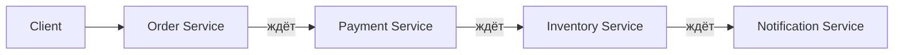
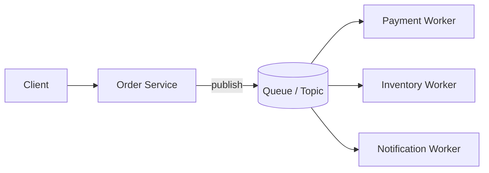
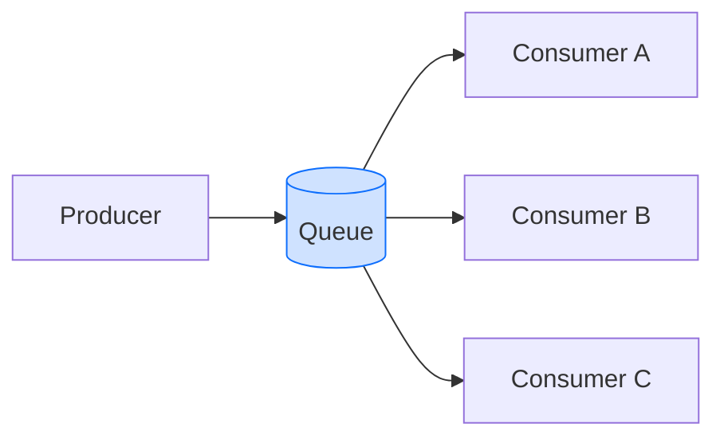
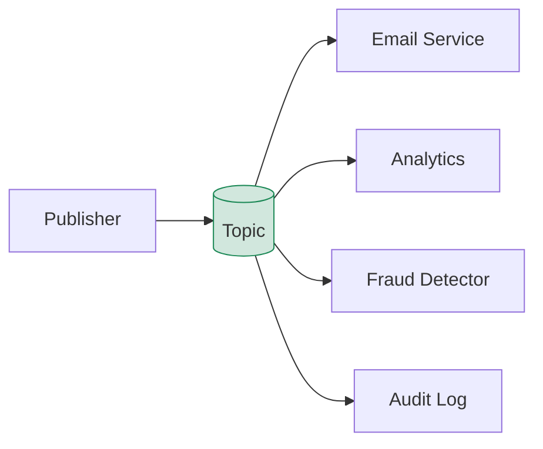
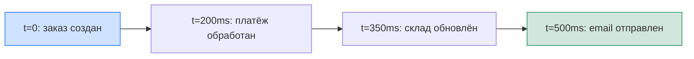
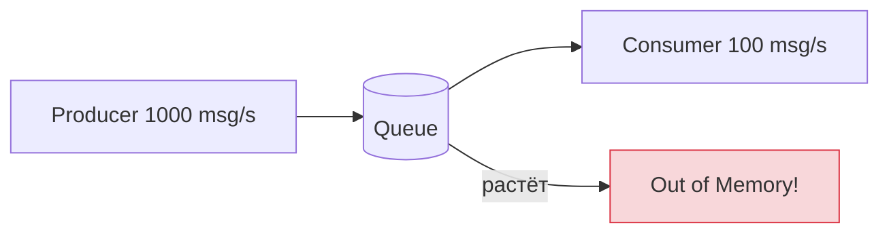

# Уровень 2: Асинхронная коммуникация и очереди

## Зачем нужна асинхронная коммуникация

В синхронном мире каждый вызов — это обещание немедленного ответа. Order Service вызывает Payment Service и ждёт. Payment Service вызывает Inventory Service и снова ждёт. Пользователь видит спиннер, а цепочка может лежать из-за одного недоступного звена.



**Проблемы синхронной цепочки:**
- ⏱️ Latency суммируется: 100ms + 200ms + 150ms = 450ms минимум
- 💥 Один упавший сервис ломает всю цепочку
- 🔗 Temporal coupling — сервисы должны быть доступны одновременно
- 📈 Масштабирование сложно: нужно масштабировать всю цепочку синхронно

Асинхронная коммуникация разрывает это coupling. Order Service публикует событие и сразу возвращает ответ клиенту. Workers обрабатывают событие в своём темпе.



---

## Sync vs Async: trade-offs

| Характеристика | Sync (HTTP/gRPC) | Async (Queue) |
|---|---|---|
| Latency ответа | Сумма всей цепочки | Только первый шаг |
| Доступность | Требует все сервисы онлайн | Tolerates временные отказы |
| Coupling | Temporal coupling | Decoupled |
| Сложность | Простая трассировка | Сложнее дебажить |
| Гарантии | Синхронный ответ | Eventual consistency |

> 💡 Асинхронность не означает "быстрее". Она означает "не блокирует отправителя".

---

## Point-to-Point vs Pub/Sub

### Point-to-Point (Queue)

Каждое сообщение доставляется **ровно одному** consumer. Это основа для балансировки нагрузки.



**Competing Consumers pattern:** несколько consumers конкурируют за сообщения. Первый свободный забирает следующее. Горизонтальное масштабирование = добавь больше consumers.

**Применение:** задачи обработки, background jobs, RPC-like запросы.

### Pub/Sub (Topic)

Одно сообщение доставляется **всем** subscribers. Publisher не знает, кто подписан.



**Fan-out:** сообщение клонируется для каждого subscriber. Добавление нового subscriber не требует изменений в publisher.

**Применение:** события домена, уведомления, синхронизация кэшей.

---

## Гарантии доставки

### At-Most-Once
Сообщение доставляется не более одного раза. Если что-то упало — сообщение теряется.

```
Producer -> Broker -> Consumer
              |
           упало -> сообщение потеряно
```

✅ Максимальная скорость | ❌ Возможна потеря данных. Применение: метрики, логи.

### At-Least-Once
Сообщение доставляется хотя бы один раз. При сбое — повторная доставка.

```
Producer -> Broker -> Consumer -> ACK
                         |
                      упало -> retry -> Consumer (дубликат!)
```

✅ Нет потери данных | ⚠️ Возможны дубликаты. Consumer должен быть идемпотентным.

### Exactly-Once
Сообщение доставляется ровно один раз. Самое сложное для реализации.

✅ Нет потерь, нет дубликатов | ❌ Высокие накладные расходы, ограниченная поддержка брокерами.

> 📌 В практике 90% систем используют at-least-once + idempotent consumers. Это проще и надёжнее, чем exactly-once на уровне брокера.

---

## Eventual Consistency

Когда Order Service публикует событие, Payment Service обработает его через 200мс. Всё это время система находится в **промежуточном состоянии**. Это называется eventual consistency — система в конечном счёте придёт к согласованному состоянию.



Это нормально и допустимо для большинства бизнес-процессов. Ненормально — показывать клиенту неконсистентные данные без предупреждения.

---

## Backpressure

Что происходит, когда producers отправляют сообщения быстрее, чем consumers успевают обрабатывать?



**Стратегии backpressure:**
- **Buffering** — накапливать сообщения в очереди (до лимита)
- **Drop** — выбрасывать новые сообщения при переполнении
- **Throttling** — замедлять producer
- **Scale consumers** — добавлять consumers динамически

> ⚠️ Неконтролируемый рост очереди — частая причина OOM в production. Всегда устанавливайте max queue size и dead-letter queue для отвергнутых сообщений.

---

## Ключевые выводы

- 🎯 Async коммуникация убирает temporal coupling: сервисы не обязаны быть доступны одновременно
- 🔥 Point-to-Point = нагрузка на одного consumer; Pub/Sub = fan-out ко всем subscribers
- 📌 At-least-once + idempotent consumer = прагматичный стандарт для большинства систем
- 💡 Eventual consistency — это компромисс, а не баг. Проектируйте UI с учётом промежуточных состояний
- ⚠️ Backpressure нужно проектировать заранее — очередь не бесконечна
