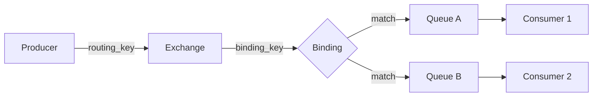
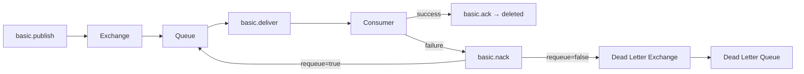

# Level 3: Message Broker Fundamentals

## What is a Message Broker

A message broker is an intermediary that receives messages from producers and delivers them to consumers. The key property: **the producer doesn't know who will receive its message**. This provides component independence and load buffering.

```
Producer ──► Exchange ──► Queue ──► Consumer
              (routing)     (storage)
```

Without a broker: if the consumer is unavailable — the message is lost. With a broker: the message is saved in a queue and delivered when the consumer recovers.

---

## AMQP Protocol: The Model

**AMQP (Advanced Message Queuing Protocol)** — a binary network protocol for message brokers. RabbitMQ implements AMQP 0-9-1.

The core entity model:



Rule: **Exchange routes, Queue stores.** The Exchange itself stores nothing.

---

## Connections, Channels, Virtual Hosts

**Connection** — a physical TCP connection between client and broker. Expensive: includes handshake, authentication, parameter negotiation.

**Channel** — a virtual channel within a Connection. Cheap: just an identifier with a number. All real operations (publish, consume, ack) go through a channel.

```
TCP Connection
├── Channel 1  ←── Producer (basic.publish)
├── Channel 2  ←── Consumer A (basic.consume)
└── Channel 3  ←── Consumer B (basic.consume)
```

💡 One channel per thread — standard practice. Channels are not thread-safe.

**Virtual Host (vhost)** — logical isolation within a single broker. Different vhosts don't see each other's exchanges and queues. Used to separate environments (production, staging) or teams.

---

## Exchanges, Queues, Bindings

### Exchange Types

| Type | Routing | Use Case |
|-----|-------------|---------------------|
| **direct** | routing_key == binding_key | Sending to a specific queue |
| **fanout** | All bound queues | Broadcast notifications |
| **topic** | Pattern `orders.*`, `#.error` | Flexible routing |
| **headers** | By message headers | Rarely, when composite keys are needed |

### Queue: Important Parameters

```python
channel.queue_declare(
    queue='orders',
    durable=True,          # Survives broker restart
    arguments={
        'x-message-ttl': 30000,           # Message TTL: 30 sec
        'x-dead-letter-exchange': 'dlx',  # Dead letter routing
        'x-max-length': 1000,             # Max messages
    }
)
```

### Binding: Exchange → Queue Connection

```python
# Bind queue 'orders' to exchange 'topic_orders'
# with routing key pattern 'orders.#'
channel.queue_bind(
    exchange='topic_orders',
    queue='orders',
    routing_key='orders.#'
)
```

---

## Message Lifecycle



**Acknowledgment modes:**
- **auto-ack (no-ack=true)**: broker deletes immediately after sending. Fast, but unreliable.
- **manual ack**: consumer explicitly sends `basic.ack` after successful processing.
- **NACK + requeue**: message returns to the queue for retry.
- **NACK + dead-letter**: message goes to DLX for error analysis.

⚠️ **Common mistake**: forgetting to call `ack` after processing. The message stays in `unacked` state and will be redelivered on consumer reconnect — but only if `no-ack=false`.

---

## Prefetch (QoS)

```python
# No more than 5 unprocessed messages per consumer simultaneously
channel.basic_qos(prefetch_count=5)
```

Without prefetch: the broker sends the entire queue to the consumer at once. The consumer gets overloaded. Prefetch limits the number of "in flight" (unacked) messages.

📌 **Rule**: prefetch_count = 1 guarantees strict ordering but reduces throughput. prefetch_count = 10-50 — a good balance for most scenarios.