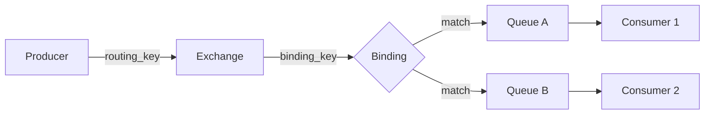
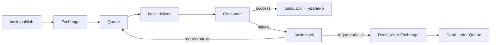

# Уровень 3: Основы брокеров сообщений

## Что такое брокер сообщений

Брокер сообщений — посредник, который принимает сообщения от producer'ов и доставляет их consumer'ам. Ключевое свойство: **producer не знает, кто получит его сообщение**. Это дает независимость компонентов и буферизацию нагрузки.

```
Producer ──► Exchange ──► Queue ──► Consumer
              (маршрутизация)  (хранение)
```

Без брокера: если consumer недоступен — сообщение потеряно. С брокером: сообщение сохранено в очереди и доставлено при восстановлении.

---

## Протокол AMQP: модель

**AMQP (Advanced Message Queuing Protocol)** — бинарный сетевой протокол для брокеров сообщений. RabbitMQ реализует AMQP 0-9-1.

Основная сущностная модель:



Правило: **Exchange — маршрутизирует, Queue — хранит**. Exchange сам по себе ничего не хранит.

---

## Connections, Channels, Virtual Hosts

**Connection** — физическое TCP-соединение клиента с брокером. Дорогое: включает рукопожатие, аутентификацию, согласование параметров.

**Channel** — виртуальный канал внутри Connection. Дешевый: просто идентификатор с номером. Все реальные операции (publish, consume, ack) выполняются через channel.

```
TCP Connection
├── Channel 1  ←── Producer (basic.publish)
├── Channel 2  ←── Consumer A (basic.consume)
└── Channel 3  ←── Consumer B (basic.consume)
```

💡 Один channel на поток — стандартная практика. Channels не потокобезопасны.

**Virtual Host (vhost)** — логическая изоляция внутри одного брокера. Разные vhost'ы не видят exchanges и queues друг друга. Используются для разделения окружений (production, staging) или команд.

---

## Exchanges, Queues, Bindings

### Типы Exchange

| Тип | Маршрутизация | Пример использования |
|-----|--------------|---------------------|
| **direct** | routing_key == binding_key | Отправка в конкретную очередь |
| **fanout** | Все привязанные queues | Broadcast-уведомления |
| **topic** | Шаблон `orders.*`, `#.error` | Гибкая маршрутизация |
| **headers** | По заголовкам сообщения | Редко, когда нужны составные ключи |

### Queue: важные параметры

```python
channel.queue_declare(
    queue='orders',
    durable=True,          # Переживает перезапуск брокера
    arguments={
        'x-message-ttl': 30000,           # TTL сообщения: 30 сек
        'x-dead-letter-exchange': 'dlx',  # Dead letter routing
        'x-max-length': 1000,             # Максимум сообщений
    }
)
```

### Binding: связь Exchange → Queue

```python
# Привязать queue 'orders' к exchange 'topic_orders'
# с routing key-паттерном 'orders.#'
channel.queue_bind(
    exchange='topic_orders',
    queue='orders',
    routing_key='orders.#'
)
```

---

## Жизненный цикл сообщения



**Acknowledgment modes:**
- **auto-ack (no-ack=true)**: брокер удаляет сразу после отправки. Быстро, но ненадежно.
- **manual ack**: consumer явно отправляет `basic.ack` после успешной обработки.
- **NACK + requeue**: сообщение возвращается в очередь для повторной попытки.
- **NACK + dead-letter**: сообщение направляется в DLX для анализа ошибок.

⚠️ **Частая ошибка**: забыть вызвать `ack` после обработки. Сообщение остаётся в состоянии `unacked` и при переподключении consumer'а будет доставлено повторно — но только если `no-ack=false`.

---

## Prefetch (QoS)

```python
# Не более 5 необработанных сообщений у consumer одновременно
channel.basic_qos(prefetch_count=5)
```

Без prefetch: брокер отправит consumer'у всю очередь сразу. Consumer будет перегружен. Prefetch ограничивает количество "в полёте" (unacked) сообщений.

📌 **Правило**: prefetch_count = 1 гарантирует строгую очередность, но снижает throughput. prefetch_count = 10–50 — хороший баланс для большинства сценариев.
