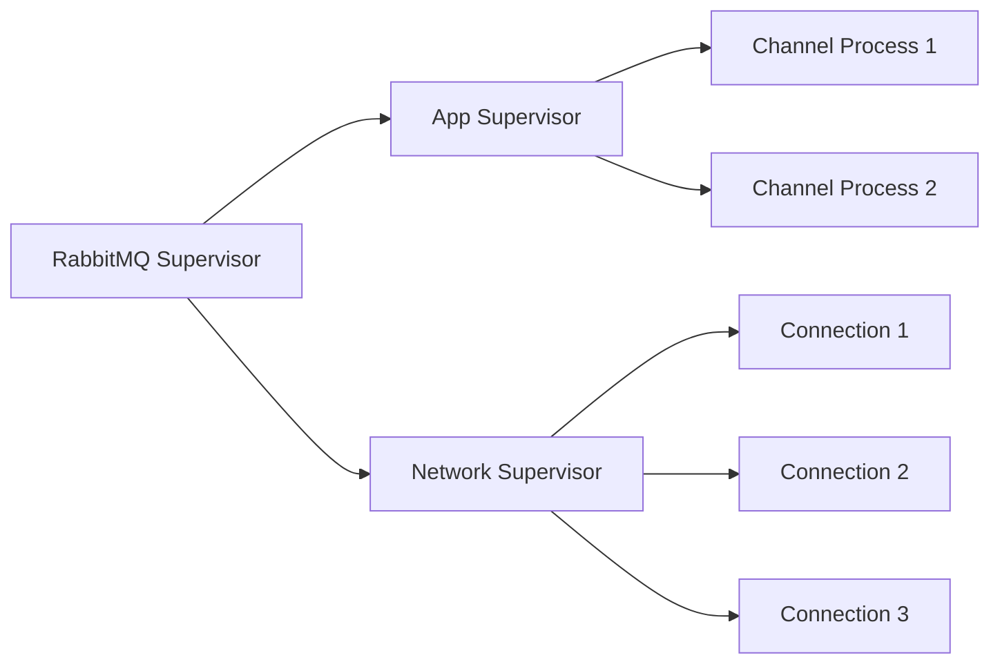
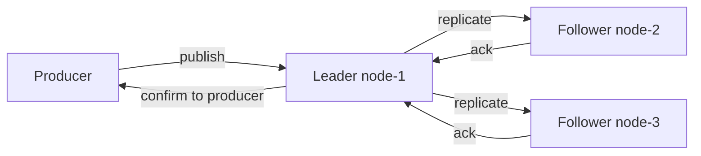
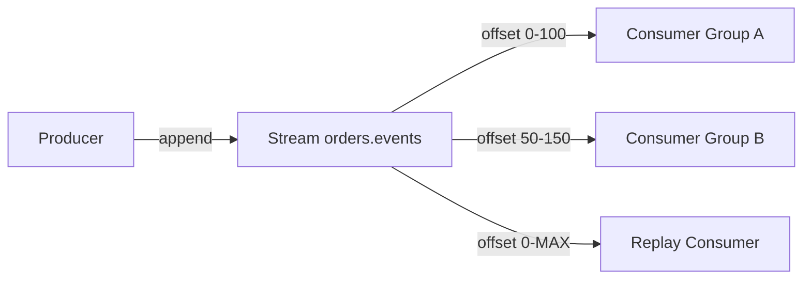

# Level 4: RabbitMQ — Architecture and Fundamentals (Detailed Theory)

## History of RabbitMQ

In 2006, Rabbit Technologies began developing a message broker capable of reliable operation in high-load telecommunication systems. Erlang was chosen — a language created by Ericsson engineers back in 1986 specifically for telephone exchanges: systems that must never go down.

In 2010, VMware acquired Rabbit Technologies. In 2013, Pivotal spun out of VMware and took the project under its wing. In 2019, RabbitMQ became part of the VMware Tanzu portfolio. Today it is one of the most popular message brokers in the world with tens of millions of downloads per year.

Key versions:
- **3.8** (2019) — Quorum Queues stable
- **3.9** (2021) — Streams (new queue type)
- **3.12** (2023) — Khepri (new Raft-based metadata store)
- **4.0** (2024) — classic queues deprecated, Quorum Queues as default

> Think of RabbitMQ as a smart postman. Kafka is a conveyor belt that stores everything. RabbitMQ is a sorting center: received, sorted, delivered to the right recipient, and deleted after confirmation.

---

## Erlang VM (BEAM): Foundation of Reliability

### Why Erlang

Choosing Erlang wasn't accidental — it was an architectural decision. Erlang was created for systems with requirements:
- **Nine nines** — 99.9999999% availability (less than 31ms of downtime per year)
- Millions of simultaneous connections
- Impossible to schedule planned downtime for updates

This is why RabbitMQ can handle tens of thousands of connections on a single node without performance degradation.

### Lightweight Processes

Erlang doesn't have threads in the classical sense. Instead — BEAM processes:

```
OS Thread:          ~2 MB stack, creation ~1-10 ms
Erlang process:     ~300 bytes, creation ~μs
```

Each TCP connection to RabbitMQ is a separate Erlang process. When a connection breaks — only that process dies, not affecting others.

```
Typical broker:
├── 10,000 connections × 300 bytes ≈ 3 MB memory for processes only
├── Each process is isolated
└── Failure of one doesn't affect others
```

### Supervision Trees

A supervision tree is a hierarchy of supervising processes. When a child process crashes, its supervisor automatically restarts it.



Restart strategies:
- `one_for_one` — restart only the crashed process
- `one_for_all` — if one crashes, restart all children
- `rest_for_one` — restart the crashed one and all that started after it

### Hot Code Loading

Erlang allows loading a new version of a module while the system is running. The system holds two versions simultaneously: current and old. After loading, new calls go to current, old lives out its cycle and is unloaded.

RabbitMQ uses this for zero-downtime upgrades between patch versions. That's why you can update RabbitMQ 3.12.3 → 3.12.4 without stopping the broker.

```erlang
%% Example of hot swapping in Erlang
code:load_file(my_module).           % load new version
code:soft_purge(my_module).          % clear old when free
```

### Error Isolation

In Erlang, errors don't propagate between processes. An exception in one process doesn't crash the system — it becomes a message to the supervising process.

❌ In Java: an uncaught RuntimeException in a thread can kill the entire service
✅ In Erlang: an exception in a process = a signal to the supervisor, which decides what to do

---

## Node Architecture: Single Node vs Cluster

### Single Node

```mermaid
graph LR
    P1[Producer 1] -->|AMQP 5672| RMQ[rabbit@node-1]
    P2[Producer 2] -->|AMQP 5672| RMQ
    RMQ -->|deliver| C1[Consumer 1]
    RMQ -->|deliver| C2[Consumer 2]
    RMQ -->|HTTP 15672| UI[Management UI]
```

A single node is suitable for:
- Development and testing
- Small loads (up to a few thousand messages/sec)
- Non-critical data where loss on failure is acceptable

### Cluster

```mermaid
graph LR
    LB[Load Balancer] --> N1[rabbit@node-1 disk]
    LB --> N2[rabbit@node-2 disk]
    LB --> N3[rabbit@node-3 disk]
    N1 <-->|cluster link| N2
    N2 <-->|cluster link| N3
    N1 <-->|cluster link| N3
```

In a cluster:
- **Metadata** (exchanges, queue declarations, users, permissions) is replicated to all nodes
- **Message data** is stored by default only on the node where the queue is declared
- Quorum Queues replicate data via Raft to a majority of nodes

📌 Common misconception: a RabbitMQ cluster itself doesn't provide high data availability. For that, you need Quorum Queues or Classic Mirrored Queues (deprecated).

### Disk Nodes vs RAM Nodes

| Parameter | Disk Node | RAM Node |
|---|---|---|
| Metadata storage | On disk | Memory only |
| Declare/delete speed | Slower | Faster |
| Survives restart | Yes | No (metadata lost) |
| Cluster requirement | Minimum 1 | Any number |

⚠️ RAM nodes are often misconceived as "fast nodes for messages" — this is wrong. A RAM node only stores metadata (queue declarations, exchanges). Messages in durable queues are always written to disk, regardless of node type.

Practical rule: **use only disk nodes**. RAM nodes are a specialized tool for clusters with thousands of temporary queues per second.

---

## Queue Types

### Classic Queues

The standard type since 2007. One master + optional mirrors.

```
Producer → Exchange → Queue (master on node-1) → Consumer
                             ↓ mirror (deprecated)
                           node-2 copy
```

Classic mirrored queue problems:
- When the master crashes, mirror promotion occurs — unsynchronized messages can be lost
- Synchronizing a new mirror blocks the queue
- Doesn't use Raft — no strict consistency guarantees

**Starting from RabbitMQ 4.0: Classic Queues without mirroring and Quorum Queues are the recommended types.**

### Quorum Queues

Introduced in 3.8 as a response to Classic Mirrored Queue problems. Based on the Raft algorithm.



How it works:
1. Write goes to the leader
2. Leader replicates to followers
3. After majority confirmation (quorum) — the message is considered saved
4. Producer receives confirm

Characteristics:
- ✅ Strict guarantees — data isn't lost on minority node failure
- ✅ Automatic leader election via Raft
- ✅ No "synchronization" operation — a new participant catches up gradually
- ⚠️ Requires odd number of replicas (3, 5, 7)
- ⚠️ Higher publish latency due to quorum confirmation wait

```bash
# Declare a Quorum Queue via rabbitmqadmin
rabbitmqadmin declare queue \
  name=orders.created \
  durable=true \
  arguments='{"x-queue-type": "quorum"}'
```

### Streams

A queue type added in 3.9. Essentially an immutable append-only log, like a Kafka topic.



Key differences from Classic/Quorum:
- Messages are **not deleted** after delivery — stored per retention policy
- Multiple consumer groups read independently from different offsets
- Consumer manages its own offset
- Optimized for high throughput (hundreds of thousands of messages/sec)

When to use Streams:
- Need to replay event history
- Multiple different services read the same stream
- Very high publish rate (>100k msg/s)

```bash
# Declare a Stream
rabbitmqadmin declare queue \
  name=audit.events \
  durable=true \
  arguments='{"x-queue-type": "stream", "x-max-age": "7D"}'
```

---

## Memory Management and Flow Control

### Thresholds

RabbitMQ monitors resource usage and applies backpressure:

```
Memory watermark (default 40% of RAM):
  < 40%  → Normal operation
  > 40%  → Flow control: publishers start slowing down
  > 40%  + doesn't decrease → Credit-based flow control at channel level
```

```ini
# rabbitmq.conf
vm_memory_high_watermark.relative = 0.4     # 40% of RAM
vm_memory_high_watermark.absolute = 2GB     # or absolute value
disk_free_limit.relative = 1.5              # 1.5× of RAM
disk_free_limit.absolute = 5GB             # or absolute
```

### Paging

When a queue grows and reaches the memory threshold, RabbitMQ starts **paging** — moving messages from memory to disk. This is normal but increases I/O load.

### Connection-Level Flow Control

If the broker is overloaded, it blocks publisher connections. The connection state changes from `running` to `blocked`. This is visible in the Management UI under Connections.

```
blocked = flow control active on this connection
flow    = temporary slowdown due to load
```

---

## Management HTTP API

The Management Plugin provides a full REST API on port 15672.

### Key Endpoints

```bash
# List queues
GET /api/queues
GET /api/queues/{vhost}/{name}

# Node statistics
GET /api/nodes
GET /api/nodes/{name}

# Manage vhosts
GET  /api/vhosts
PUT  /api/vhosts/{name}
DELETE /api/vhosts/{name}

# Permissions
GET /api/permissions
PUT /api/permissions/{vhost}/{user}

# Publish a message via API (for testing!)
POST /api/exchanges/{vhost}/{exchange}/publish
```

### Example Calls

```bash
# Get list of queues in /production
curl -u guest:guest \
  http://localhost:15672/api/queues/%2Fproduction

# Create a vhost
curl -u admin:password \
  -XPUT http://localhost:15672/api/vhosts/staging \
  -H 'content-type: application/json' \
  -d '{}'

# Assign permissions
curl -u admin:password \
  -XPUT http://localhost:15672/api/permissions/staging/app_user \
  -H 'content-type: application/json' \
  -d '{"configure":"","write":"orders\\..*","read":"orders\\..*"}'
```

📌 Authentication via Basic Auth. In production, use HTTPS and restrict access to port 15672.

---

## rabbitmqctl — Command Line

`rabbitmqctl` — the primary CLI tool for managing the broker.

### State Management

```bash
# Broker status
rabbitmqctl status

# List queues (in vhost /production)
rabbitmqctl list_queues -p /production \
  name messages consumers memory

# List exchanges
rabbitmqctl list_exchanges -p /production name type durable

# List bindings
rabbitmqctl list_bindings -p /production
```

### Users and Permissions

```bash
# Create a user
rabbitmqctl add_user app_user SecurePass123

# Assign tags (role)
rabbitmqctl set_user_tags app_user none

# Set access rights to vhost
rabbitmqctl set_permissions -p /production app_user \
  "" \                         # configure: nothing
  "orders\..*|payments\..*" \  # write: only orders and payments
  "orders\..*|payments\..*"    # read: only orders and payments

# View permissions
rabbitmqctl list_permissions -p /production

# Delete a user
rabbitmqctl delete_user old_user
```

### Cluster Management

```bash
# View cluster status
rabbitmqctl cluster_status

# Add a node to the cluster (run on the new node)
rabbitmqctl stop_app
rabbitmqctl join_cluster rabbit@node-1
rabbitmqctl start_app

# Remove a node from the cluster (run on the remaining node)
rabbitmqctl forget_cluster_node rabbit@dead-node
```

### Configuration Export/Import

```bash
# Export all configuration (definitions)
rabbitmqctl export_definitions /tmp/rabbit-defs.json

# Import
rabbitmqctl import_definitions /tmp/rabbit-defs.json
```

---

## Plugins

RabbitMQ has a rich plugin system. Managed via `rabbitmq-plugins`.

```bash
# List all plugins
rabbitmq-plugins list

# Enable a plugin
rabbitmq-plugins enable rabbitmq_shovel

# Enable multiple plugins
rabbitmq-plugins enable rabbitmq_shovel rabbitmq_federation
```

### rabbitmq_shovel

Shovel — a plugin for transferring messages between queues or brokers.

```
Scenario: transfer messages from dev broker to prod for testing
          or replicate between data centers without federation

Source Queue (broker-1) → Shovel → Destination Queue (broker-2)
```

```bash
# Configure shovel via Management API
curl -XPUT http://localhost:15672/api/parameters/shovel/%2F/my-shovel \
  -H 'content-type: application/json' \
  -u admin:pass \
  -d '{
    "value": {
      "src-uri": "amqp://",
      "src-queue": "source.queue",
      "dest-uri": "amqp://remote-host",
      "dest-queue": "target.queue"
    }
  }'
```

### rabbitmq_federation

Federation — loosely coupled replication of exchanges and queues between brokers. Unlike shovel, federation is pull-based and better handles network partitions.


### rabbitmq_delayed_message_exchange

Plugin for delayed message delivery (not built into RabbitMQ natively):

```python
# Send a message with a 30-second delay
channel.basic_publish(
    exchange='delayed.exchange',
    routing_key='orders',
    body=message,
    properties=pika.BasicProperties(
        headers={'x-delay': 30000}  # milliseconds
    )
)
```

---

## Installation and Configuration

### Docker (recommended for development)

```yaml
# docker-compose.yml
services:
  rabbitmq:
    image: rabbitmq:3.12-management
    ports:
      - "5672:5672"    # AMQP
      - "15672:15672"  # Management UI
    environment:
      RABBITMQ_DEFAULT_USER: admin
      RABBITMQ_DEFAULT_PASS: secret
      RABBITMQ_DEFAULT_VHOST: /production
    volumes:
      - rabbitmq_data:/var/lib/rabbitmq
      - ./rabbitmq.conf:/etc/rabbitmq/rabbitmq.conf

volumes:
  rabbitmq_data:
```

### Ubuntu/Debian Installation

```bash
# Add repository
curl -fsSL https://github.com/rabbitmq/signing-keys/releases/download/3.0/rabbitmq-release-signing-key.asc \
  | sudo gpg --dearmor -o /usr/share/keyrings/rabbitmq.gpg

# Install
sudo apt-get install rabbitmq-server

# Enable management plugin
sudo rabbitmq-plugins enable rabbitmq_management

# Start the service
sudo systemctl enable rabbitmq-server
sudo systemctl start rabbitmq-server
```

---

## rabbitmq.conf vs advanced.config

RabbitMQ supports two configuration formats.

### rabbitmq.conf (new format, preferred)

INI-like format, clear and readable:

```ini
# Network settings
listeners.tcp.default = 5672
management.listener.port = 15672

# Memory and disk
vm_memory_high_watermark.relative = 0.4
disk_free_limit.relative = 1.5

# Logging
log.file.level = info
log.console = true
log.console.level = warning

# Security
loopback_users = none
default_vhost = /production
default_user = admin
default_pass = changeme

# Heartbeat (seconds)
heartbeat = 60

# Max message size (bytes)
max_message_size = 134217728  # 128 MB
```

### advanced.config (legacy Erlang format)

Used for complex settings not available in rabbitmq.conf:

```erlang
% /etc/rabbitmq/advanced.config
[
  {rabbit, [
    {tcp_listen_options, [
      {backlog, 4096},
      {nodelay, true},
      {sndbuf, 196608},
      {recbuf, 196608}
    ]}
  ]},
  {rabbitmq_management, [
    {rates_mode, detailed}
  ]}
].
```

📌 Both files can be used simultaneously — they complement each other.

### Environment Variables

```bash
# Override node name
RABBITMQ_NODENAME=rabbit@my-server

# Data path
RABBITMQ_MNESIA_BASE=/data/rabbitmq

# Config path
RABBITMQ_CONFIG_FILE=/etc/rabbitmq/rabbitmq.conf

# AMQP port
RABBITMQ_NODE_PORT=5672
```

---

## Users, Virtual Hosts and Permissions

### Access Model

RabbitMQ uses a three-level permission model. Each permission is a regular expression applied to resource names.

```
User → has access to → VHost → with permissions → (configure, write, read)
```

| Right | Allowed Operations |
|---|---|
| **configure** | declare/delete queue, declare/delete exchange, purge queue |
| **write** | basic.publish, queue.bind (add binding via exchange) |
| **read** | basic.get, basic.consume, queue.bind (add binding via queue) |

### Regex Pattern Examples

```bash
# Full access to everything
configure: .*
write:     .*
read:      .*

# Read-only from orders.* queues
configure: (empty)
write:     (empty)
read:      orders\..*

# Publish and read only orders and payments, without creating resources
configure: (empty)
write:     (orders|payments)\..*
read:      (orders|payments)\..*

# Monitoring: only read metrics (read on all queues, but no write)
configure: (empty)
write:     (empty)
read:      .*
```

### User Tags

Tags determine capabilities in the Management Plugin:

| Tag | UI Rights |
|---|---|
| `administrator` | Full access: users, vhosts, policies, all nodes |
| `monitoring` | View statistics of all vhosts |
| `management` | Own vhosts and resources only |
| `policymaker` | Manage policies and parameters |
| `none` | No Management UI access |

```bash
# Create a monitoring user
rabbitmqctl add_user prometheus_user metrics_pass
rabbitmqctl set_user_tags prometheus_user monitoring
rabbitmqctl set_permissions -p / prometheus_user "" "" ".*"
```

---

## ⚠️ Typical Beginner Mistakes

### 1. Using default vhost "/" in production

❌ Bad:
```bash
# Everything in one vhost, no isolation
rabbitmqctl set_permissions -p / app_user ".*" ".*" ".*"
```

Problem: no isolation between environments, hard to manage permissions, a failure affects all applications.

✅ Correct:
```bash
# Separate vhosts
rabbitmqctl add_vhost /production
rabbitmqctl add_vhost /staging
rabbitmqctl set_permissions -p /production app_user "" "orders\..*" "orders\..*"
```

### 2. Granting .* rights to all users

❌ Bad:
```bash
rabbitmqctl set_permissions -p /production app_user ".*" ".*" ".*"
```

Problem: any compromised application can create/delete queues and exchanges.

✅ Correct: principle of least privilege.

### 3. Classic Mirrored Queues Instead of Quorum Queues

❌ Bad:
```python
channel.queue_declare(
    queue='orders',
    arguments={'x-ha-policy': 'all'}  # deprecated approach
)
```

✅ Correct:
```python
channel.queue_declare(
    queue='orders',
    durable=True,
    arguments={'x-queue-type': 'quorum'}
)
```

### 4. No disk_free_limit

❌ Bad: run RabbitMQ without `disk_free_limit` setting. When the disk fills, the broker enters alarm mode and blocks all publishers.

✅ Correct: always set an explicit limit and monitor disk space.

### 5. Connecting to Management UI from external network without authentication

❌ Bad: open port 15672 to the external interface with `guest:guest` password (default credentials).

✅ Correct:
```ini
# rabbitmq.conf — restrict Management UI access
management.listener.ip = 127.0.0.1
loopback_users = none
```

And use nginx/reverse proxy with TLS for external access.

---

## Diagnostics and Debugging

### Useful Commands

```bash
# General status
rabbitmqctl status
rabbitmqctl environment

# Queues with details
rabbitmqctl list_queues name messages consumers memory state \
  -p /production

# Connections and channels
rabbitmqctl list_connections user vhost state channels
rabbitmqctl list_channels connection number acks_uncommitted

# Unroutable messages (returned producers)
rabbitmqctl list_exchanges name type -p /production

# Check health
rabbitmq-diagnostics check_running
rabbitmq-diagnostics check_local_alarms
rabbitmq-diagnostics ping
```

### Alarms

RabbitMQ generates alarms when resource thresholds are exceeded:

```bash
# View active alarms
rabbitmqctl list_alarms

# Typical alarms:
# {resource_limit,memory,rabbit@node-1}  — memory watermark exceeded
# {resource_limit,disk,rabbit@node-1}    — low disk space
```

With an active alarm, all publishing connections are blocked (except admin).

---

## Monitoring: Key Metrics

| Metric | Normal | Warning |
|---|---|---|
| `messages_ready` | Stable or decreasing | Constantly growing |
| `messages_unacknowledged` | < 10× consumers | Growing without limit |
| `publish_rate` vs `deliver_rate` | deliver ≥ publish | deliver << publish |
| `mem_used` / `mem_limit` | < 60% | > 80% |
| `disk_free` | > disk_free_limit × 2 | Approaching the limit |
| `fd_used` / `fd_total` | < 70% | > 90% |
| `consumer_utilisation` | 80-95% | < 50% (inefficient) |

```bash
# Health check script via API
curl -s -u admin:pass http://localhost:15672/api/healthchecks/node \
  | jq '.status'
# "ok" — all good
```

---

## Level Summary

RabbitMQ is not just a "message queue." It's a full-fledged platform for building event-driven systems with:

- **Reliability** from the Erlang VM — supervision trees, error isolation, hot code loading
- **Routing flexibility** — exchanges, bindings, routing keys
- **Isolation** — virtual hosts for different environments and applications
- **Manageability** — Management UI, HTTP API, rabbitmqctl
- **Modern queue types** — Quorum Queues with Raft guarantees, Streams for replay

In the following levels, we'll explore exchange types (Direct, Fanout, Topic, Headers) in detail and build a real microservice architecture on RabbitMQ.