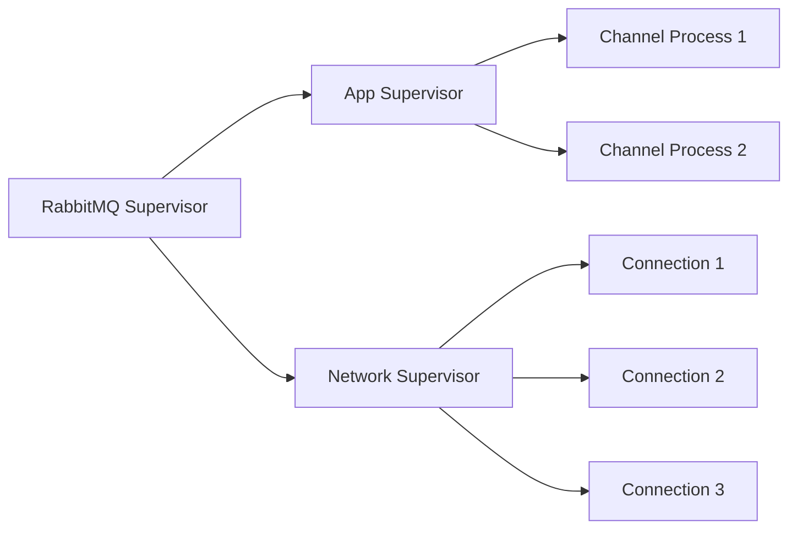
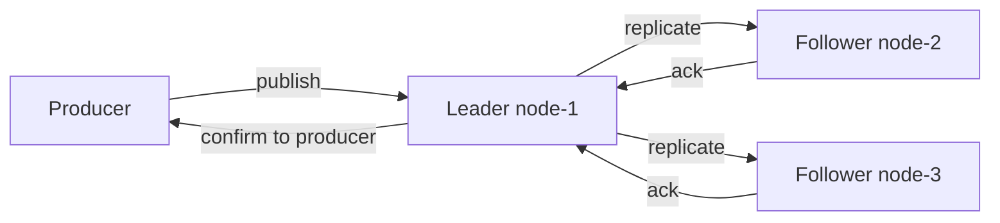
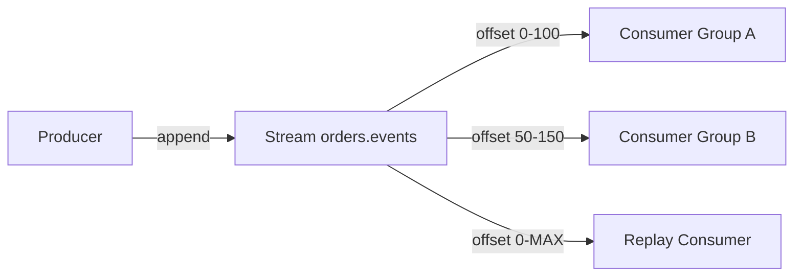

# Уровень 4: RabbitMQ — архитектура и основы (подробная теория)

## История RabbitMQ

В 2006 году компания Rabbit Technologies начала разработку брокера сообщений, способного надёжно работать в высоконагруженных телекоммуникационных системах. Для этого был выбран Erlang — язык, созданный инженерами Ericsson ещё в 1986 году именно для телефонных станций: систем, которые не имеют права падать.

В 2010 году VMware приобрела Rabbit Technologies, в 2013 Pivotal выделился из VMware и взял проект под своё крыло, а в 2019 году RabbitMQ вошёл в портфель VMware Tanzu. Сегодня это один из самых популярных брокеров сообщений в мире с десятками миллионов загрузок в год.

Ключевые версии:
- **3.8** (2019) — Quorum Queues стабильны
- **3.9** (2021) — Streams (новый тип очередей)
- **3.12** (2023) — Khepri (новый metadata store на Raft)
- **4.0** (2024) — классические очереди устаревают, Quorum Queues как умолчание

> Представьте RabbitMQ как умного почтальона. Kafka — это лента конвейера, которая хранит всё. RabbitMQ — это сортировочный центр: принял, разобрал, доставил нужному получателю и удалил после подтверждения.

---

## Erlang VM (BEAM): фундамент надёжности

### Почему Erlang

Выбор Erlang — это не случайность, а архитектурное решение. Erlang был создан для систем с требованиями:
- **Nine nines** — доступность 99.9999999% (менее 31 мс простоя в год)
- Одновременные миллионы соединений
- Невозможность плановой остановки для обновления

Именно поэтому RabbitMQ может обрабатывать десятки тысяч соединений на одном узле без деградации производительности.

### Легковесные процессы

В Erlang нет потоков в классическом понимании. Вместо этого — процессы BEAM:

```
ОС-поток (Thread):   ~2 MB стека, создание ~1-10 мс
Erlang-процесс:      ~300 байт, создание ~мкс
```

Каждое TCP-соединение к RabbitMQ — это отдельный Erlang-процесс. Когда соединение рвётся — умирает только этот процесс, не затрагивая остальные.

```
Типичный брокер:
├── 10 000 соединений × 300 байт ≈ 3 MB памяти только на процессы
├── Каждый процесс изолирован
└── Сбой одного не влияет на остальные
```

### Supervision Trees

Supervision tree — иерархия надзорных процессов. Когда дочерний процесс падает, его supervisor автоматически перезапускает.



Стратегии перезапуска:
- `one_for_one` — перезапускаем только упавший процесс
- `one_for_all` — если падает один, перезапускаем всех дочерних
- `rest_for_one` — перезапускаем упавший и всех, кто был запущен после него

### Горячая замена кода (Hot Code Loading)

Erlang позволяет загружать новую версию модуля прямо во время работы. Система одновременно держит две версии: current и old. После загрузки новые вызовы идут в current, old доживает свой цикл и выгружается.

RabbitMQ использует это для zero-downtime upgrades между patch-версиями. Именно поэтому вы можете обновить RabbitMQ 3.12.3 → 3.12.4 без остановки брокера.

```erlang
%% Пример горячей замены в Erlang
code:load_file(my_module).           % загрузить новую версию
code:soft_purge(my_module).          % очистить старую, когда освободится
```

### Изоляция ошибок

В Erlang ошибки не распространяются между процессами. Исключение в одном процессе не вызывает сбой системы — оно превращается в сообщение для надзорного процесса.

❌ В Java: непойманный RuntimeException в потоке может убить весь сервис  
✅ В Erlang: исключение в процессе = сигнал supervisor'у, который решает, что делать

---

## Архитектура узла: Single Node vs Cluster

### Single Node

```mermaid
graph LR
    P1[Producer 1] -->|AMQP 5672| RMQ[rabbit@node-1]
    P2[Producer 2] -->|AMQP 5672| RMQ
    RMQ -->|deliver| C1[Consumer 1]
    RMQ -->|deliver| C2[Consumer 2]
    RMQ -->|HTTP 15672| UI[Management UI]
```

Один узел подходит для:
- Разработки и тестирования
- Небольших нагрузок (до нескольких тысяч сообщений/сек)
- Некритичных данных, где допустима потеря при сбое

### Cluster

```mermaid
graph LR
    LB[Load Balancer] --> N1[rabbit@node-1 disk]
    LB --> N2[rabbit@node-2 disk]
    LB --> N3[rabbit@node-3 disk]
    N1 <-->|cluster link| N2
    N2 <-->|cluster link| N3
    N1 <-->|cluster link| N3
```

В кластере:
- **Метаданные** (exchanges, queues declarations, users, permissions) реплицируются на все ноды
- **Данные сообщений** по умолчанию хранятся только на ноде, где объявлена очередь
- Quorum Queues реплицируют данные через Raft на большинство нод

📌 Важное заблуждение: кластер RabbitMQ сам по себе не даёт высокой доступности данных. Для этого нужны Quorum Queues или Classic Mirrored Queues (устаревшие).

### Disk Nodes vs RAM Nodes

| Параметр | Disk Node | RAM Node |
|---|---|---|
| Хранение метаданных | На диске | Только в памяти |
| Скорость операций declare/delete | Медленнее | Быстрее |
| Выживаемость при перезапуске | Да | Нет (метаданные теряются) |
| Требования в кластере | Минимум 1 | Любое количество |

⚠️ RAM-ноды часто воспринимают как "быстрые ноды для сообщений" — это заблуждение. RAM-нода хранит только метаданные (объявления очередей, exchanges). Сами сообщения в durable-очередях всегда записываются на диск, независимо от типа ноды.

Практическое правило: **используйте только disk-ноды**. RAM-ноды — специализированный инструмент для кластеров с тысячами временных очередей в секунду.

---

## Типы очередей

### Classic Queues

Стандартный тип с 2007 года. Один master + опциональные mirrors.

```
Producer → Exchange → Queue (master on node-1) → Consumer
                             ↓ mirror (устарело)
                           node-2 copy
```

Проблемы classic mirrored queues:
- При падении master происходит promotion mirror — может потерять несинхронизированные сообщения
- Синхронизация новой mirror блокирует очередь
- Не использует Raft — нет строгих гарантий консистентности

**Начиная с RabbitMQ 4.0: Classic Queues без mirrorring и Quorum Queues — рекомендуемые типы.**

### Quorum Queues

Появились в 3.8 как ответ на проблемы Classic Mirrored Queues. Основаны на алгоритме Raft.



Принцип работы:
1. Запись идёт в leader
2. Leader реплицирует на followers
3. После подтверждения от большинства (quorum) — сообщение считается сохранённым
4. Producer получает confirm

Характеристики:
- ✅ Строгие гарантии — данные не теряются при падении меньшинства нод
- ✅ Автоматический leader election через Raft
- ✅ Нет операции "синхронизации" — новый участник догоняет постепенно
- ⚠️ Требует нечётное количество реплик (3, 5, 7)
- ⚠️ Выше латентность publish из-за ожидания quorum-подтверждения

```bash
# Объявить Quorum Queue через rabbitmqadmin
rabbitmqadmin declare queue \
  name=orders.created \
  durable=true \
  arguments='{"x-queue-type": "quorum"}'
```

### Streams

Тип очереди, добавленный в 3.9. По сути — immutable append-only log, как Kafka topic.



Ключевые отличия от Classic/Quorum:
- Сообщения **не удаляются** после доставки — хранятся по retention политике
- Несколько consumer groups читают независимо с разных offset'ов
- Consumer сам управляет своим offset
- Оптимизирован для высокого throughput (сотни тысяч сообщений/сек)

Когда использовать Streams:
- Нужен replay истории событий
- Несколько разных сервисов читают один поток
- Очень высокий publish rate (>100k msg/s)

```bash
# Объявить Stream
rabbitmqadmin declare queue \
  name=audit.events \
  durable=true \
  arguments='{"x-queue-type": "stream", "x-max-age": "7D"}'
```

---

## Memory Management и Flow Control

### Thresholds

RabbitMQ самостоятельно следит за использованием ресурсов и применяет механизм обратного давления (backpressure):

```
Memory watermark (по умолчанию 40% от RAM):
  < 40%  → Normal operation
  > 40%  → Flow control: publishers начинают замедляться
  > 40%  + не снижается → Credit-based flow control на уровне channels
```

```ini
# rabbitmq.conf
vm_memory_high_watermark.relative = 0.4     # 40% от RAM
vm_memory_high_watermark.absolute = 2GB     # или абсолютное значение
disk_free_limit.relative = 1.5              # 1.5× от RAM
disk_free_limit.absolute = 5GB             # или абсолютное
```

### Paging

Когда очередь растёт и достигает memory threshold, RabbitMQ начинает **paging** — перемещение сообщений из памяти на диск. Это нормальная операция, но она нагружает I/O.

### Flow Control на уровне соединения

Если брокер перегружен, он блокирует соединения издателей. Состояние соединения меняется с `running` на `blocked`. В Management UI это видно в разделе Connections.

```
blocked = flow control активен на этом соединении
flow    = временное замедление из-за нагрузки
```

---

## Management HTTP API

Management Plugin предоставляет полноценный REST API на порту 15672.

### Основные эндпоинты

```bash
# Список очередей
GET /api/queues
GET /api/queues/{vhost}/{name}

# Статистика ноды
GET /api/nodes
GET /api/nodes/{name}

# Управление vhosts
GET  /api/vhosts
PUT  /api/vhosts/{name}
DELETE /api/vhosts/{name}

# Права доступа
GET /api/permissions
PUT /api/permissions/{vhost}/{user}

# Публикация сообщения через API (для тестирования!)
POST /api/exchanges/{vhost}/{exchange}/publish
```

### Примеры вызовов

```bash
# Получить список очередей в /production
curl -u guest:guest \
  http://localhost:15672/api/queues/%2Fproduction

# Создать vhost
curl -u admin:password \
  -XPUT http://localhost:15672/api/vhosts/staging \
  -H 'content-type: application/json' \
  -d '{}'

# Назначить права
curl -u admin:password \
  -XPUT http://localhost:15672/api/permissions/staging/app_user \
  -H 'content-type: application/json' \
  -d '{"configure":"","write":"orders\\..*","read":"orders\\..*"}'
```

📌 Аутентификация через Basic Auth. В продакшне используйте HTTPS и ограничьте доступ к порту 15672.

---

## rabbitmqctl — командная строка

`rabbitmqctl` — основной CLI-инструмент для управления брокером.

### Управление состоянием

```bash
# Статус брокера
rabbitmqctl status

# Список очередей (в vhost /production)
rabbitmqctl list_queues -p /production \
  name messages consumers memory

# Список exchanges
rabbitmqctl list_exchanges -p /production name type durable

# Список bindings
rabbitmqctl list_bindings -p /production
```

### Пользователи и права

```bash
# Создать пользователя
rabbitmqctl add_user app_user SecurePass123

# Назначить теги (роль)
rabbitmqctl set_user_tags app_user none

# Задать права доступа к vhost
rabbitmqctl set_permissions -p /production app_user \
  "" \                         # configure: ничего
  "orders\..*|payments\..*" \  # write: только orders и payments
  "orders\..*|payments\..*"    # read: только orders и payments

# Просмотреть права
rabbitmqctl list_permissions -p /production

# Удалить пользователя
rabbitmqctl delete_user old_user
```

### Управление кластером

```bash
# Посмотреть состояние кластера
rabbitmqctl cluster_status

# Добавить ноду в кластер (выполняется на новой ноде)
rabbitmqctl stop_app
rabbitmqctl join_cluster rabbit@node-1
rabbitmqctl start_app

# Убрать ноду из кластера (выполняется на оставшейся ноде)
rabbitmqctl forget_cluster_node rabbit@dead-node
```

### Экспорт/импорт конфигурации

```bash
# Экспортировать всю конфигурацию (definitions)
rabbitmqctl export_definitions /tmp/rabbit-defs.json

# Импортировать
rabbitmqctl import_definitions /tmp/rabbit-defs.json
```

---

## Плагины

RabbitMQ имеет развитую систему плагинов. Управление через `rabbitmq-plugins`.

```bash
# Посмотреть все плагины
rabbitmq-plugins list

# Включить плагин
rabbitmq-plugins enable rabbitmq_shovel

# Включить несколько плагинов
rabbitmq-plugins enable rabbitmq_shovel rabbitmq_federation
```

### rabbitmq_shovel

Shovel — плагин для переноса сообщений между очередями или брокерами.

```
Сценарий: перенос сообщений из dev-брокера в prod для тестирования
          или репликация между датацентрами без federation

Source Queue (broker-1) → Shovel → Destination Queue (broker-2)
```

```bash
# Настройка shovel через Management API
curl -XPUT http://localhost:15672/api/parameters/shovel/%2F/my-shovel \
  -H 'content-type: application/json' \
  -u admin:pass \
  -d '{
    "value": {
      "src-uri": "amqp://",
      "src-queue": "source.queue",
      "dest-uri": "amqp://remote-host",
      "dest-queue": "target.queue"
    }
  }'
```

### rabbitmq_federation

Federation — слабосвязанная репликация exchanges и очередей между брокерами. В отличие от shovel, federation работает pull-based и лучше переносит разрывы сети.


### rabbitmq_delayed_message_exchange

Плагин для отложенной доставки сообщений (встроенно в RabbitMQ нет TTL per-message для задержки):

```python
# Отправить сообщение с задержкой 30 секунд
channel.basic_publish(
    exchange='delayed.exchange',
    routing_key='orders',
    body=message,
    properties=pika.BasicProperties(
        headers={'x-delay': 30000}  # миллисекунды
    )
)
```

---

## Установка и конфигурация

### Docker (рекомендуется для разработки)

```yaml
# docker-compose.yml
services:
  rabbitmq:
    image: rabbitmq:3.12-management
    ports:
      - "5672:5672"    # AMQP
      - "15672:15672"  # Management UI
    environment:
      RABBITMQ_DEFAULT_USER: admin
      RABBITMQ_DEFAULT_PASS: secret
      RABBITMQ_DEFAULT_VHOST: /production
    volumes:
      - rabbitmq_data:/var/lib/rabbitmq
      - ./rabbitmq.conf:/etc/rabbitmq/rabbitmq.conf

volumes:
  rabbitmq_data:
```

### Установка на Ubuntu/Debian

```bash
# Добавить репозиторий
curl -fsSL https://github.com/rabbitmq/signing-keys/releases/download/3.0/rabbitmq-release-signing-key.asc \
  | sudo gpg --dearmor -o /usr/share/keyrings/rabbitmq.gpg

# Установить
sudo apt-get install rabbitmq-server

# Включить management plugin
sudo rabbitmq-plugins enable rabbitmq_management

# Запустить сервис
sudo systemctl enable rabbitmq-server
sudo systemctl start rabbitmq-server
```

---

## rabbitmq.conf vs advanced.config

RabbitMQ поддерживает два формата конфигурации.

### rabbitmq.conf (новый формат, предпочтительный)

INI-подобный формат, понятный и легко читаемый:

```ini
# Сетевые настройки
listeners.tcp.default = 5672
management.listener.port = 15672

# Память и диск
vm_memory_high_watermark.relative = 0.4
disk_free_limit.relative = 1.5

# Логирование
log.file.level = info
log.console = true
log.console.level = warning

# Безопасность
loopback_users = none
default_vhost = /production
default_user = admin
default_pass = changeme

# Heartbeat (секунды)
heartbeat = 60

# Max message size (байты)
max_message_size = 134217728  # 128 MB
```

### advanced.config (legacy Erlang format)

Используется для сложных настроек, недоступных в rabbitmq.conf:

```erlang
% /etc/rabbitmq/advanced.config
[
  {rabbit, [
    {tcp_listen_options, [
      {backlog, 4096},
      {nodelay, true},
      {sndbuf, 196608},
      {recbuf, 196608}
    ]}
  ]},
  {rabbitmq_management, [
    {rates_mode, detailed}
  ]}
].
```

📌 Оба файла можно использовать одновременно — они дополняют друг друга.

### Переменные окружения

```bash
# Переопределить имя узла
RABBITMQ_NODENAME=rabbit@my-server

# Путь к данным
RABBITMQ_MNESIA_BASE=/data/rabbitmq

# Путь к конфигу
RABBITMQ_CONFIG_FILE=/etc/rabbitmq/rabbitmq.conf

# Порт AMQP
RABBITMQ_NODE_PORT=5672
```

---

## Пользователи, Virtual Hosts и Permissions

### Модель доступа

RabbitMQ использует трёхуровневую модель прав. Каждое разрешение — это регулярное выражение, применяемое к именам ресурсов.

```
Пользователь → имеет доступ к → VHost → с правами → (configure, write, read)
```

| Право | Разрешённые операции |
|---|---|
| **configure** | declare/delete queue, declare/delete exchange, purge queue |
| **write** | basic.publish (публикация), queue.bind (добавление binding через exchange) |
| **read** | basic.get, basic.consume, queue.bind (добавление binding через queue) |

### Примеры regex-паттернов

```bash
# Полный доступ ко всему
configure: .*
write:     .*
read:      .*

# Только чтение из очередей orders.*
configure: (пусто)
write:     (пусто)
read:      orders\..*

# Публикация и чтение только orders и payments, без создания ресурсов
configure: (пусто)
write:     (orders|payments)\..*
read:      (orders|payments)\..*

# Мониторинг: только читать метрики (read на все очереди, но не записывать)
configure: (пусто)
write:     (пусто)
read:      .*
```

### Теги пользователей

Теги определяют возможности пользователя в Management Plugin:

| Тег | Права в UI |
|---|---|
| `administrator` | Полный доступ: users, vhosts, policies, все ноды |
| `monitoring` | Просмотр статистики всех vhosts |
| `management` | Только собственные vhosts и ресурсы |
| `policymaker` | Управление policies и parameters |
| `none` | Нет доступа к Management UI |

```bash
# Создать monitoring-пользователя
rabbitmqctl add_user prometheus_user metrics_pass
rabbitmqctl set_user_tags prometheus_user monitoring
rabbitmqctl set_permissions -p / prometheus_user "" "" ".*"
```

---

## ⚠️ Типичные ошибки начинающих

### 1. Использование default vhost "/" в продакшне

❌ Плохо:
```bash
# Всё в одном vhost, нет изоляции
rabbitmqctl set_permissions -p / app_user ".*" ".*" ".*"
```

Проблема: нет изоляции между средами, сложно управлять правами, при сбое затронуты все приложения.

✅ Правильно:
```bash
# Отдельные vhosts
rabbitmqctl add_vhost /production
rabbitmqctl add_vhost /staging
rabbitmqctl set_permissions -p /production app_user "" "orders\..*" "orders\..*"
```

### 2. Выдача прав .* всем пользователям

❌ Плохо:
```bash
rabbitmqctl set_permissions -p /production app_user ".*" ".*" ".*"
```

Проблема: любое скомпрометированное приложение может создавать/удалять очереди и exchanges.

✅ Правильно: принцип минимальных привилегий.

### 3. Classic Mirrored Queues вместо Quorum Queues

❌ Плохо:
```python
channel.queue_declare(
    queue='orders',
    arguments={'x-ha-policy': 'all'}  # устаревший подход
)
```

✅ Правильно:
```python
channel.queue_declare(
    queue='orders',
    durable=True,
    arguments={'x-queue-type': 'quorum'}
)
```

### 4. Отсутствие disk_free_limit

❌ Плохо: запустить RabbitMQ без настройки `disk_free_limit`. При заполнении диска брокер перейдёт в режим alarm и заблокирует всех publishers.

✅ Правильно: всегда задавайте явный лимит и следите за дисковым пространством.

### 5. Подключение к Management UI из внешней сети без аутентификации

❌ Плохо: открыть порт 15672 на внешний интерфейс с паролем `guest:guest` (дефолтными данными).

✅ Правильно:
```ini
# rabbitmq.conf — ограничить доступ Management UI
management.listener.ip = 127.0.0.1
loopback_users = none
```

И использовать nginx/reverse proxy с TLS для внешнего доступа.

---

## Диагностика и отладка

### Полезные команды

```bash
# Общее состояние
rabbitmqctl status
rabbitmqctl environment

# Очереди с деталями
rabbitmqctl list_queues name messages consumers memory state \
  -p /production

# Connections и channels
rabbitmqctl list_connections user vhost state channels
rabbitmqctl list_channels connection number acks_uncommitted

# Unroutable messages (returned producers)
rabbitmqctl list_exchanges name type -p /production

# Проверить health
rabbitmq-diagnostics check_running
rabbitmq-diagnostics check_local_alarms
rabbitmq-diagnostics ping
```

### Alarms

RabbitMQ генерирует alarms при превышении resource thresholds:

```bash
# Просмотр активных alarms
rabbitmqctl list_alarms

# Типичные alarms:
# {resource_limit,memory,rabbit@node-1}  — превышен memory watermark
# {resource_limit,disk,rabbit@node-1}    — мало места на диске
```

При активном alarm все publishing connections блокируются (кроме admin).

---

## Мониторинг: ключевые метрики

| Метрика | Норма | Тревога |
|---|---|---|
| `messages_ready` | Стабильно или снижается | Постоянно растёт |
| `messages_unacknowledged` | < 10× consumers | Растёт без ограничения |
| `publish_rate` vs `deliver_rate` | deliver ≥ publish | deliver << publish |
| `mem_used` / `mem_limit` | < 60% | > 80% |
| `disk_free` | > disk_free_limit × 2 | Приближается к лимиту |
| `fd_used` / `fd_total` | < 70% | > 90% |
| `consumer_utilisation` | 80-95% | < 50% (inefficient) |

```bash
# Скрипт проверки health через API
curl -s -u admin:pass http://localhost:15672/api/healthchecks/node \
  | jq '.status'
# "ok" — всё хорошо
```

---

## Итоги уровня

RabbitMQ — это не просто "очередь сообщений". Это полноценная платформа для построения событийно-ориентированных систем с:

- **Надёжностью** от Erlang VM — supervision trees, изоляция ошибок, hot code loading
- **Гибкостью** маршрутизации — exchanges, bindings, routing keys
- **Изоляцией** — virtual hosts для разных сред и приложений
- **Управляемостью** — Management UI, HTTP API, rabbitmqctl
- **Современными типами очередей** — Quorum Queues с Raft-гарантиями, Streams для replay

На следующих уровнях подробно разберём типы exchanges (Direct, Fanout, Topic, Headers) и построим реальную микросервисную архитектуру на RabbitMQ.
