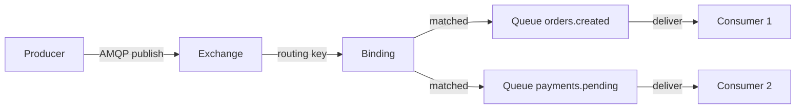

# Level 4: RabbitMQ — Architecture and Fundamentals

## What is RabbitMQ

RabbitMQ is an open-source message broker implementing the AMQP (Advanced Message Queuing Protocol) protocol. It sits between the producer and consumer, accepts messages, routes them by rules, and guarantees delivery.

If Kafka is an **event journal** (append-only log), then RabbitMQ is a **smart router** with queues. Kafka stores everything, RabbitMQ delivers and forgets (or stores until the consumer picks it up).



## Erlang/OTP and Reliability

RabbitMQ is written in **Erlang** — a language created for Ericsson telecommunication systems. Key properties:

| Property | What It Gives RabbitMQ |
|---|---|
| Lightweight processes | Millions of concurrent connections |
| Supervision trees | Failed components restart automatically |
| Hot code loading | Update without stopping the broker |
| Error isolation | One connection failure doesn't kill the entire broker |
| Built-in clustering | Distribution via Erlang distribution protocol |

💡 This is why RabbitMQ can handle tens of thousands of connections without degradation — each connection is a separate Erlang process weighing ~300 bytes.

## Architecture: Nodes and Clustering

```mermaid
graph LR
    subgraph Erlang VM
        subgraph rabbit@node-1
            VH1[vhost /production]
            VH2[vhost /staging]
        end
        subgraph rabbit@node-2
            VH3[vhost /production mirror]
        end
        rabbit@node-1 <-->|cluster link| rabbit@node-2
    end
    C1[Producer] -->|AMQP| rabbit@node-1
    C2[Consumer] -->|AMQP| rabbit@node-2
```

**Node types:**
- **Disk node** — stores metadata (queues, exchanges, bindings) on disk. At least one is required in a cluster.
- **RAM node** — memory only, faster, but loses metadata on restart.

📌 Important: message data in durable queues is stored on disk regardless of node type.

## Virtual Hosts — Isolation

Virtual Host (vhost) — a namespace within the broker. Think of it like a database in PostgreSQL: one server, multiple isolated spaces.

```mermaid
graph LR
    B[RabbitMQ Broker] --> VH1["/ (default)"]
    B --> VH2[/production]
    B --> VH3[/staging]
    VH2 --> E1[Exchange orders.direct]
    VH2 --> Q1[Queue orders.created]
    VH3 --> E2[Exchange orders.direct separate!]
    VH3 --> Q2[Queue orders.created separate!]
```

Each vhost contains its own exchanges, queues, and bindings. Resources from different vhosts don't see each other — complete isolation.

## Management Plugin — Monitoring

RabbitMQ Management Plugin provides:
- **Web UI** on port 15672 — dashboard with metrics
- **HTTP API** — REST API for automation
- **rabbitmqadmin** — CLI utility on top of the API

Key metrics:
- **Messages ready/unacked** — how many messages are waiting and being processed
- **Publish rate / Deliver rate** — speeds in messages/sec
- **Memory/disk** — node resource usage
- **Consumer utilisation** — how busy the consumer is (0-100%)

⚠️ If Deliver rate is significantly less than Publish rate — the queue is growing, you need to scale consumers.

## Users and Permissions

Access rights are set using three regex patterns at the vhost level:

| Right | What It Allows |
|---|---|
| **configure** | Create/delete/modify resources (declare queue, delete exchange) |
| **write** | Publish messages (basic.publish), bindings via exchange |
| **read** | Get messages (basic.get, basic.consume), bindings via queue |

Pattern `.*` — full access. Empty string — access denied.

```
# app_user in /production: only orders and payments
configure: (empty)
write:     orders\..*|payments\..*
read:      orders\..*|payments\..*
```

⚠️ Common beginner mistake: granting `.*` to all users — this violates the principle of least privilege.

## Next Level

In the next level, we'll explore Exchange types in detail: Direct, Fanout, Topic, Headers — and how to build proper routing.