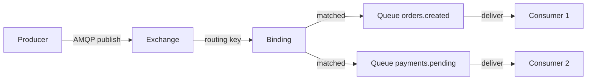

# Уровень 4: RabbitMQ — архитектура и основы

## Что такое RabbitMQ

RabbitMQ — брокер сообщений с открытым исходным кодом, реализующий протокол AMQP (Advanced Message Queuing Protocol). Он стоит между producer и consumer, принимает сообщения, маршрутизирует их по правилам и гарантирует доставку.

Если Kafka — это **журнал событий** (append-only log), то RabbitMQ — это **умный маршрутизатор** с очередями. Kafka хранит всё, RabbitMQ доставляет и забывает (или хранит, пока consumer не заберёт).



## Erlang/OTP и надёжность

RabbitMQ написан на **Erlang** — языке, созданном для телекоммуникационных систем Ericsson. Ключевые свойства:

| Свойство | Что это даёт RabbitMQ |
|---|---|
| Легковесные процессы | Миллионы одновременных соединений |
| Supervision trees | Упавший компонент перезапускается автоматически |
| Hot code loading | Обновление без остановки брокера |
| Изоляция ошибок | Сбой одного соединения не убивает весь брокер |
| Встроенный кластер | Распределение через Erlang distribution protocol |

💡 Именно поэтому RabbitMQ может держать десятки тысяч соединений без деградации — каждое соединение это отдельный Erlang-процесс весом ~300 байт.

## Архитектура: Nodes и Clustering

```mermaid
graph LR
    subgraph Erlang VM
        subgraph rabbit@node-1
            VH1[vhost /production]
            VH2[vhost /staging]
        end
        subgraph rabbit@node-2
            VH3[vhost /production mirror]
        end
        rabbit@node-1 <-->|cluster link| rabbit@node-2
    end
    C1[Producer] -->|AMQP| rabbit@node-1
    C2[Consumer] -->|AMQP| rabbit@node-2
```

**Типы нод:**
- **Disk node** — хранит метаданные (queues, exchanges, bindings) на диске. Нужна минимум одна в кластере.
- **RAM node** — только в памяти, быстрее, но при перезапуске теряет метаданные.

📌 Важно: данные сообщений в durable-очередях хранятся на диске независимо от типа ноды.

## Virtual Hosts — изоляция

Virtual Host (vhost) — пространство имён внутри брокера. Думайте о нём как о базе данных в PostgreSQL: один сервер, несколько изолированных пространств.

```mermaid
graph LR
    B[RabbitMQ Broker] --> VH1["/ (default)"]
    B --> VH2[/production]
    B --> VH3[/staging]
    VH2 --> E1[Exchange orders.direct]
    VH2 --> Q1[Queue orders.created]
    VH3 --> E2[Exchange orders.direct отдельный!]
    VH3 --> Q2[Queue orders.created отдельная!]
```

Каждый vhost содержит собственные exchanges, queues и bindings. Ресурсы из разных vhost не видят друг друга — полная изоляция.

## Management Plugin — мониторинг

RabbitMQ Management Plugin предоставляет:
- **Web UI** на порту 15672 — дашборд с метриками
- **HTTP API** — REST API для автоматизации
- **rabbitmqadmin** — CLI утилита поверх API

Ключевые метрики:
- **Messages ready/unacked** — сколько сообщений ждут и обрабатываются
- **Publish rate / Deliver rate** — скорости в сообщениях/сек
- **Memory/disk** — использование ресурсов нодой
- **Consumer utilisation** — насколько занят consumer (0-100%)

⚠️ Если Deliver rate значительно меньше Publish rate — очередь растёт, нужно масштабировать consumers.

## Пользователи и Permissions

Права доступа задаются тремя regex-паттернами на уровне vhost:

| Право | Что разрешает |
|---|---|
| **configure** | Создание/удаление/изменение ресурсов (declare queue, delete exchange) |
| **write** | Публикация сообщений (basic.publish), привязки через exchange |
| **read** | Получение сообщений (basic.get, basic.consume), привязки через queue |

Паттерн `.*` — полный доступ. Пустая строка — доступ запрещён.

```
# app_user в /production: только orders и payments
configure: (пусто)
write:     orders\..*|payments\..*
read:      orders\..*|payments\..*
```

⚠️ Распространённая ошибка начинающих: выдать всем пользователям `.*` — это нарушает принцип минимальных привилегий.

## Следующий уровень

На следующем уровне изучим типы Exchange подробнее: Direct, Fanout, Topic, Headers — и как правильно строить маршрутизацию.
