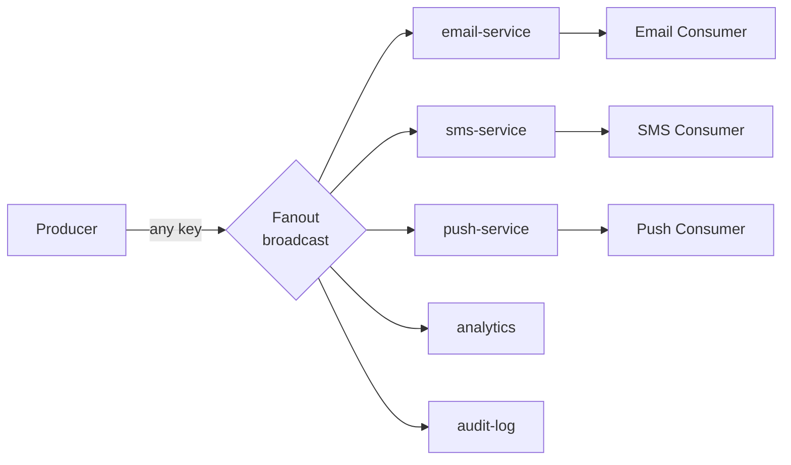
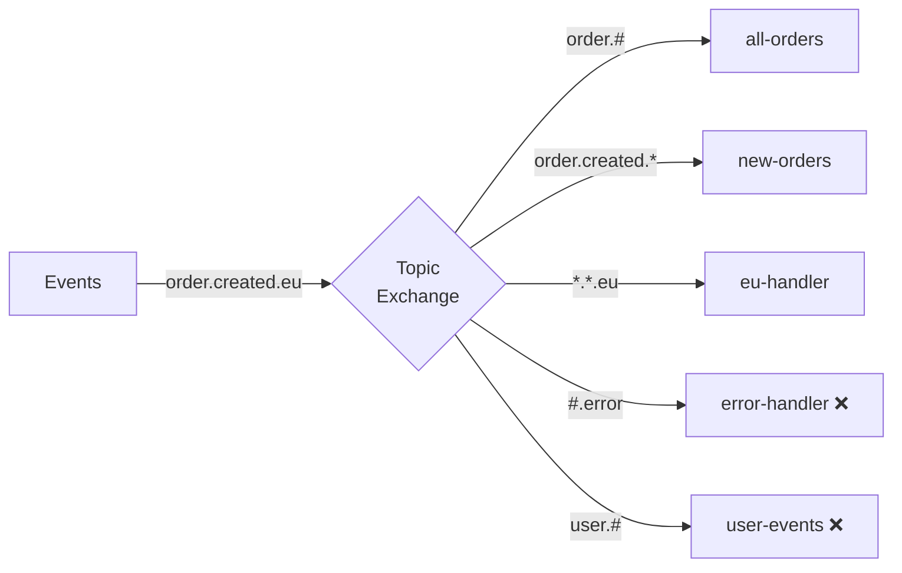
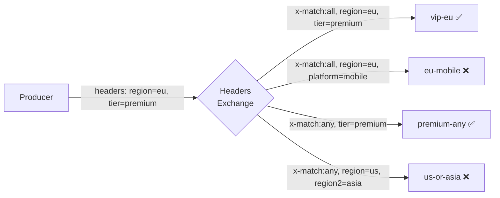
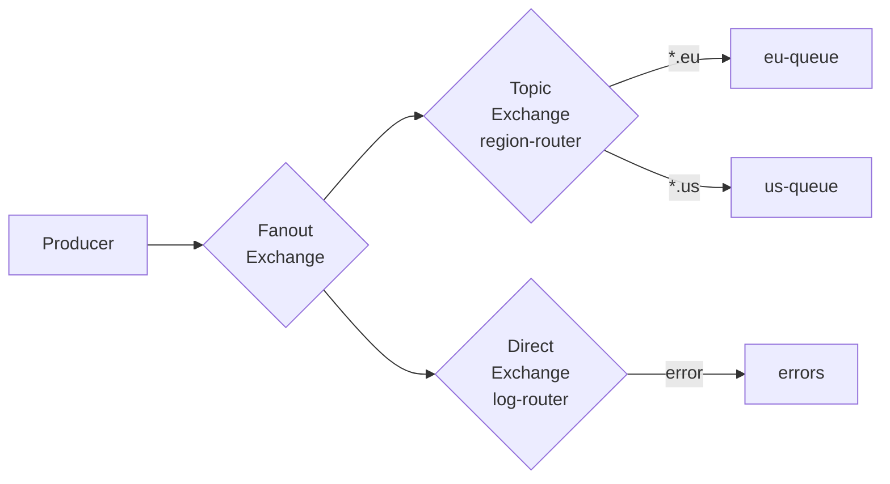
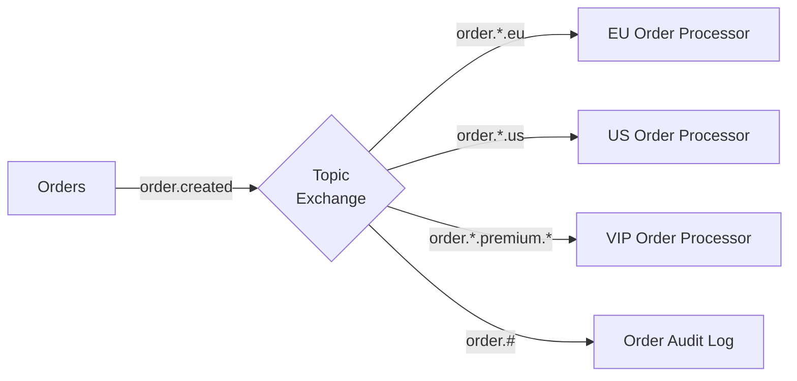
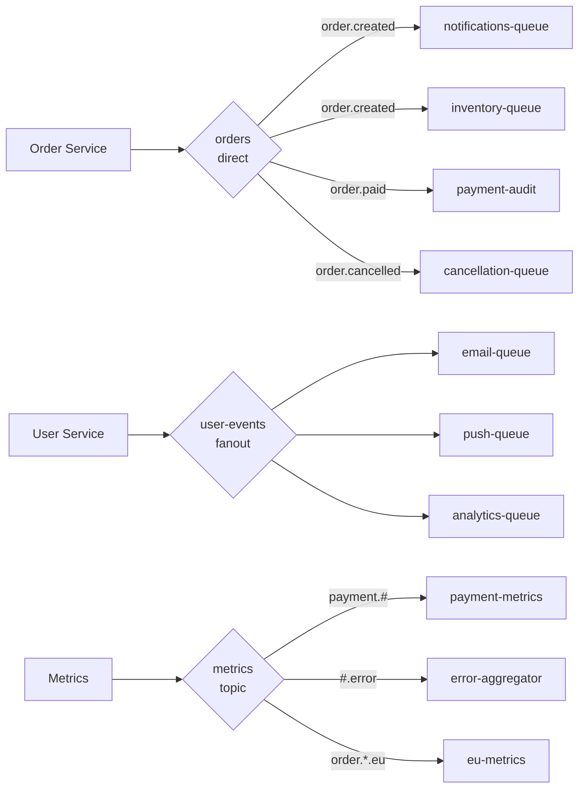

# RabbitMQ Exchange Types — Detailed Guide

## What is an Exchange and Why You Need It

In most queueing systems, producers write directly to a queue. RabbitMQ works differently: **the producer never knows which queue its message will end up in**. It only knows the Exchange name and routing key.

This separation provides important advantages:

- You can add a new queue/subscriber without changing producer code
- A single message can arrive in multiple queues simultaneously
- Routing logic is centralized and declarative
- Topology can be changed dynamically via AMQP commands

```
Producer → [Exchange] → routing → [Queue 1]
                               → [Queue 2]
                               → [Queue N]
                   ↓ no match
                 dropped / alternate exchange
```

Each Exchange has attributes:
- **name** — unique name (empty string for Default Exchange)
- **type** — routing algorithm
- **durable** — survives broker restart
- **auto-delete** — deleted when no bindings remain
- **arguments** — additional parameters (alternate-exchange, etc.)

---

## Direct Exchange — Exact Routing

### Algorithm

RabbitMQ iterates through all bindings of a given Exchange and for each checks:

```
binding_key == message.routing_key  →  deliver to queue
```

Complexity: **O(B)**, where B is the number of bindings. In practice, thanks to hash tables — O(1).

### Key Properties

```mermaid
graph LR
    P[Producer] -->|routing_key="error"| X{Direct\norders}
    X -->|binding: error| Q1[errors-queue]
    X -->|binding: error| Q2[alerts-queue]
    X -->|binding: info| Q3[logs-queue]
    X -->|binding: warning| Q4[warnings-queue]
```

- One Exchange — many bindings with different keys
- One key can route to multiple queues (fanout semantics for a single key)
- One queue can be bound with multiple keys

### Example: E-commerce System

```python
import pika

connection = pika.BlockingConnection(pika.ConnectionParameters('localhost'))
channel = connection.channel()

# Declare Exchange
channel.exchange_declare(exchange='orders', exchange_type='direct', durable=True)

# Declare queues
for queue_name in ['orders.new', 'orders.paid', 'orders.cancelled', 'notifications']:
    channel.queue_declare(queue=queue_name, durable=True)

# Bindings
channel.queue_bind(exchange='orders', queue='orders.new',       routing_key='order.created')
channel.queue_bind(exchange='orders', queue='orders.paid',      routing_key='order.paid')
channel.queue_bind(exchange='orders', queue='orders.cancelled', routing_key='order.cancelled')
channel.queue_bind(exchange='orders', queue='notifications',    routing_key='order.created')
channel.queue_bind(exchange='orders', queue='notifications',    routing_key='order.paid')

# Publish
channel.basic_publish(
    exchange='orders',
    routing_key='order.created',
    body='{"id": 42, "total": 99.99}',
    properties=pika.BasicProperties(delivery_mode=2)
)
# → goes to: orders.new, notifications
```

### Typical Use Cases

- **Worker queues** — distributing tasks by type
- **Event routing** — `user.created`, `user.deleted`, `user.updated`
- **Error handling** — different queues for `error`, `warning`, `info`
- **RPC pattern** — reply_to with unique correlation_id

---

## Fanout Exchange — Broadcast Delivery

### Algorithm

RabbitMQ copies the message **to all queues** bound to the given Exchange. The routing key is completely ignored — even if specified, it does not affect routing.

Complexity: **O(Q)**, where Q is the number of bound queues.

### Architecture



### Example: Notification System

```python
channel.exchange_declare(exchange='user.events', exchange_type='fanout', durable=True)

# Each service binds its queue
# Email service:
channel.queue_bind(exchange='user.events', queue='email.notifications', routing_key='')

# Push service:
channel.queue_bind(exchange='user.events', queue='push.notifications', routing_key='')

# Analytics:
channel.queue_bind(exchange='user.events', queue='analytics.events', routing_key='')

# Producer (does not care about subscribers):
channel.basic_publish(
    exchange='user.events',
    routing_key='',  # ignored
    body='{"event": "user.registered", "userId": 123}'
)
# → a copy goes to email.notifications, push.notifications, analytics.events
```

### Performance

⚠️ Fanout is the fastest Exchange type in terms of CPU, but it creates **N copies** of each message (N = number of bound queues). With 100 queues, each message is duplicated 100 times. Monitor memory usage.

### Use Cases

- **Pub/Sub notifications** — multiple services need to know about the same event
- **Cache invalidation** — notify all nodes about cache invalidation
- **Live data streaming** — broadcasting quotes, rates, metrics
- **Event sourcing fan-out** — writing an event to multiple projections

---

## Topic Exchange — Hierarchical Routing

### Algorithm and Trie Structure

Topic Exchange internally uses a **Trie (prefix tree)** for efficient pattern matching. Routing keys and binding keys are dot-separated words.

```
Binding patterns stored as trie:
order
├── created
│   └── * → queue: new-orders
│   └── eu → queue: eu-new-orders
├── # → queue: all-orders
└── paid
    └── * → queue: payments

Incoming: "order.created.eu"
Path: order → created → eu → match!
```

### Wildcard Rules

| Symbol | Meaning | Position |
|--------|---------|----------|
| `*` | Exactly one word (any) | Any |
| `#` | Zero or more words | Any, but usually at the end |

```
Pattern           Matches                    Does not match
-----------------------------------------------------------------
order.*           order.created              order.created.eu
                  order.paid                 order
order.#           order.created.eu           user.created
                  order                      (only order itself)
*.paid.*          order.paid.eu              order.paid
                  service.paid.us
#.error           system.db.error            system.warning
                  error                      error.system
```

### Example: Geo-distributed System



```python
channel.exchange_declare(exchange='events', exchange_type='topic', durable=True)

# Bindings with patterns
patterns = [
    ('order.#',          'all-orders'),
    ('order.created.*',  'new-orders'),
    ('*.*.eu',           'eu-events'),
    ('*.*.us',           'us-events'),
    ('#.error',          'error-handler'),
    ('user.#',           'user-events'),
]
for pattern, queue in patterns:
    channel.queue_bind(exchange='events', queue=queue, routing_key=pattern)

# A single message can land in multiple queues
channel.basic_publish(exchange='events', routing_key='order.created.eu', body='...')
# → all-orders ✅ (order.#)
# → new-orders ✅ (order.created.*)
# → eu-events  ✅ (*.*.eu)
# → error-handler ❌
# → user-events   ❌
```

### Best Practices for Topic Exchange

💡 **Routing key naming convention:**
```
<domain>.<action>.<optional-context>

order.created.eu
order.paid.premium.us
user.registered.mobile
payment.failed.timeout
```

💡 **Use hierarchy from general to specific** — this makes writing binding patterns easier.

⚠️ **Avoid `#` in the middle of a pattern** — it is hard to understand and can produce unexpected results. `order.#.eu` — bad pattern.

---

## Headers Exchange — Metadata-based Routing

### Algorithm

Headers Exchange examines **AMQP headers** of the message. The routing key is completely ignored.

Each binding has a set of conditions (key=value) and an `x-match` parameter:

```
x-match: all → all conditions must match (AND)
x-match: any → at least one condition matches (OR)
```



### Example: Content Routing

```python
channel.exchange_declare(exchange='content-router', exchange_type='headers', durable=True)

# Binding 1: VIP EU customers (ALL: region=eu AND tier=premium)
channel.queue_bind(
    exchange='content-router',
    queue='vip-eu-queue',
    routing_key='',
    arguments={
        'x-match': 'all',
        'region': 'eu',
        'tier': 'premium'
    }
)

# Binding 2: Any mobile platform (ANY: platform=mobile OR platform=tablet)
channel.queue_bind(
    exchange='content-router',
    queue='mobile-queue',
    routing_key='',
    arguments={
        'x-match': 'any',
        'platform': 'mobile',
        'platform2': 'tablet'  # non-standard name — cannot duplicate keys
    }
)

# Publishing with headers
import pika
props = pika.BasicProperties(headers={
    'region': 'eu',
    'tier': 'premium',
    'platform': 'desktop'
})
channel.basic_publish(
    exchange='content-router',
    routing_key='',
    properties=props,
    body='{"productId": 42}'
)
# → vip-eu-queue ✅ (all: eu=eu AND premium=premium)
# → mobile-queue ❌ (any: desktop!=mobile and no platform2)
```

### Headers Exchange Limitations

⚠️ **Performance:** Headers Exchange is significantly slower than other types because it analyzes headers of every message.

⚠️ **No support for duplicate keys:** AMQP headers are a map, so you cannot have two values for the same key. This limits `x-match: any`.

⚠️ **Harder to debug:** There is no simple way to understand why a message did or did not reach a queue without examining headers.

---

## Default Exchange

**Default Exchange** is a special Direct Exchange with an empty string name `""`. RabbitMQ automatically creates an **implicit binding** for every declared queue: `routing_key = queue_name`.

```mermaid
graph LR
    P[Producer] -->|routing_key="my-queue"| X{Default\nExchange\namq.direct}
    X -->|auto-binding: my-queue| Q[my-queue]
```

```python
# Send directly to a queue:
channel.basic_publish(
    exchange='',          # default exchange
    routing_key='my-queue',  # routing_key = queue name
    body='Hello!'
)
```

💡 Default Exchange is convenient for simple scenarios and quick start. In production, named Exchanges are typically used.

---

## Alternate Exchange

What happens to messages that find no matching binding?

By default: **the message is dropped**.

**Alternate Exchange** allows you to intercept such messages:

```python
channel.exchange_declare(
    exchange='orders',
    exchange_type='direct',
    arguments={'alternate-exchange': 'unrouted-messages'}
)

# Declare Alternate Exchange (usually Fanout or Direct)
channel.exchange_declare(exchange='unrouted-messages', exchange_type='fanout')
channel.queue_bind(exchange='unrouted-messages', queue='dead-messages')

# Message with unknown key → goes to dead-messages
channel.basic_publish(exchange='orders', routing_key='unknown.key', body='...')
```

---

## Exchange-to-Exchange Bindings

RabbitMQ supports binding one Exchange to another (an AMQP extension, non-standard):



```python
# Bind exchange to exchange
channel.exchange_bind(
    destination='region-router',   # receiving exchange
    source='broadcast',            # where messages come from
    routing_key='events.#'
)
```

💡 This is a powerful pattern for building multi-level routing topologies.

---

## Consistent Hash Exchange (plugin)

The `rabbitmq_consistent_hash_exchange` plugin allows distributing messages evenly across queues based on the routing key hash.

```python
# Enable the plugin: rabbitmq-plugins enable rabbitmq_consistent_hash_exchange

channel.exchange_declare(exchange='tasks', exchange_type='x-consistent-hash')

# Queues with weights (higher weight = more messages)
channel.queue_bind(exchange='tasks', queue='worker-1', routing_key='1')  # 1 part
channel.queue_bind(exchange='tasks', queue='worker-2', routing_key='3')  # 3 parts
# worker-2 gets ~75% of messages, worker-1 ~25%
```

Use case: queue sharding for horizontal scaling of consumers.

---

## Exchange Type Performance

| Type | Routing complexity | Binding complexity | Typical TPS |
|------|-------------------|-------------------|-------------|
| Direct | O(1) hash table | Low | 50k-100k msg/s |
| Fanout | O(Q) copy | Minimal | 30k-80k msg/s |
| Topic | O(B) trie matching | Medium | 40k-90k msg/s |
| Headers | O(B×H) comparison | High | 10k-40k msg/s |

Q = number of queues, B = number of bindings, H = number of headers.

⚠️ Figures are approximate and depend on hardware, message size, and configuration.

---

## Exchange Patterns

### Routing Slip

The message itself contains a list of Exchanges/queues for sequential processing:

```python
# Header with step list:
headers = {
    'routing-slip': 'validate,enrich,transform,store',
    'current-step': 'validate'
}
```

Each consumer performs its action and passes the message to the next step. Implements a dynamic pipeline.

### Content-Based Routing



### Dead Letter Exchange (DLX)

Messages that could not be processed are redirected to a special Exchange:

```python
channel.queue_declare(
    queue='main-queue',
    arguments={
        'x-dead-letter-exchange': 'dlx',
        'x-dead-letter-routing-key': 'failed.messages',
        'x-message-ttl': 30000
    }
)
```

---

## Real-world Topologies

### E-commerce Platform



### Microservice System with Sharding

```python
# Consistent hash for load distribution
channel.exchange_declare(exchange='tasks', exchange_type='x-consistent-hash')
for i in range(8):
    channel.queue_bind(
        exchange='tasks',
        queue=f'worker-{i}',
        routing_key='10'  # equal weights
    )

# Workers process their shards in parallel
```

---

## Best Practices for Choosing an Exchange Type

### When to Use Direct

✅ A finite set of event types is known in advance
✅ Simple routing without wildcards is needed
✅ High load, maximum performance required
✅ Worker queue — N consumers per task

### When to Use Fanout

✅ All subscribers must receive every message
✅ The number of consumers changes dynamically
✅ Implementing Observer/Pub-Sub pattern
⚠️ Not suitable if selective delivery is needed

### When to Use Topic

✅ Hierarchical events with context (region, version, environment)
✅ Routing key is structured and predictable
✅ Flexibility needed — different consumers subscribe to different subsets
✅ Multi-tenant system

### When to Use Headers

✅ Routing key is unsuitable — routing by multiple attributes is needed
✅ A/B testing (routing by experiment flags)
✅ Content-dependent routing by content type, language, version
⚠️ If high performance is needed — avoid

---

## Common Mistakes

### ❌ Publishing to a Non-existent Exchange

```python
# If the Exchange does not exist, the message is lost without an error (by default)
channel.basic_publish(exchange='non-existent', routing_key='key', body='...')
```

✅ Always use `passive=True` for initial checks, or declare the Exchange explicitly.

### ❌ Forgotten routing key with Direct

```python
# Error: empty routing key won't match any binding
channel.basic_publish(exchange='orders', routing_key='', body='...')
```

✅ Make sure the routing key matches at least one binding.

### ❌ Changing an Existing Exchange Type

```python
# If an Exchange is already declared as 'direct', it cannot be redeclared as 'fanout'
# This causes error 406 (PRECONDITION_FAILED)
channel.exchange_declare(exchange='events', exchange_type='fanout')  # ERROR!
```

✅ To change the type: delete the Exchange and recreate it.

### ❌ Incorrect Use of # in Patterns

```python
# Confusing pattern — # in the middle is hard to understand
channel.queue_bind(queue='q', exchange='e', routing_key='order.#.eu')
# It works, but the semantics are unclear
```

✅ Use `#` only at the beginning (`#.error`) or end (`order.#`) of the pattern.
