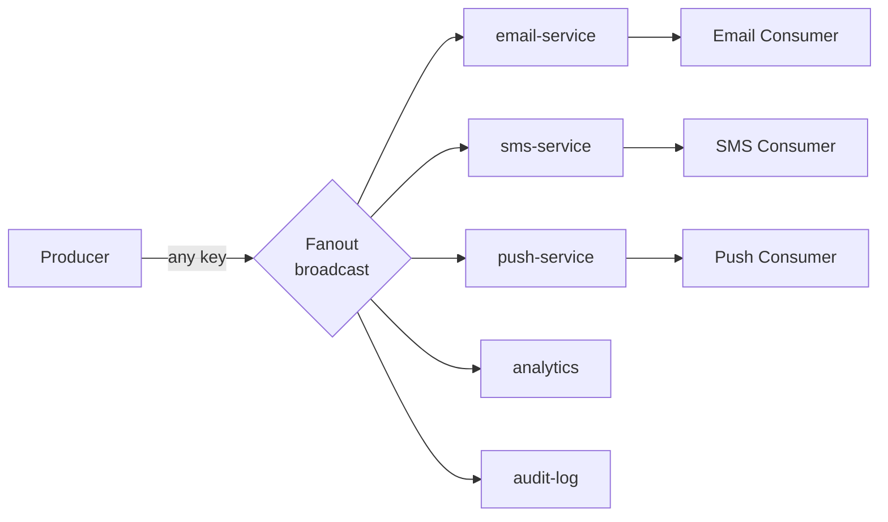
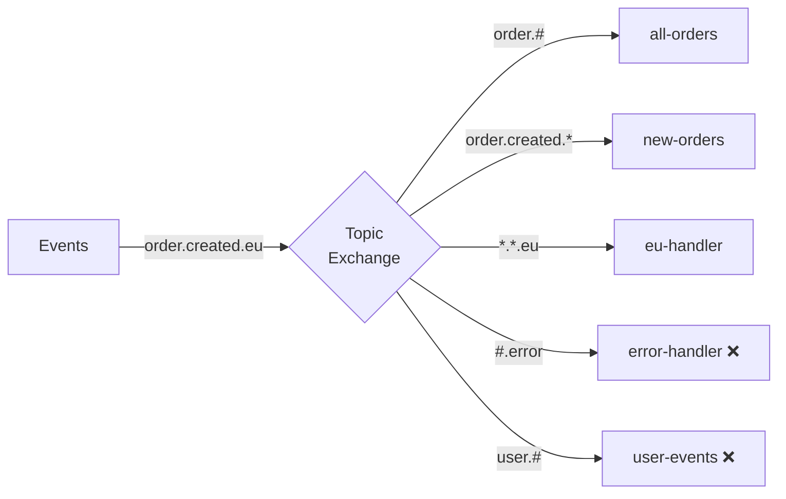
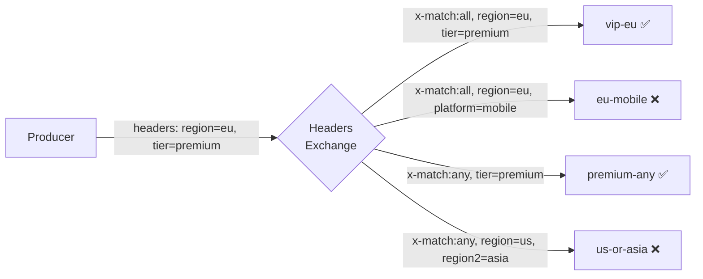
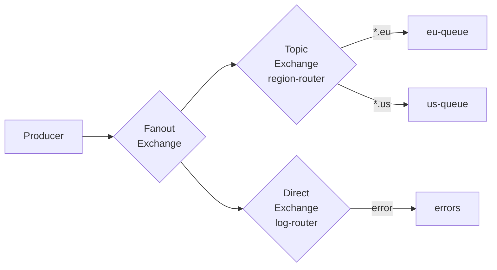
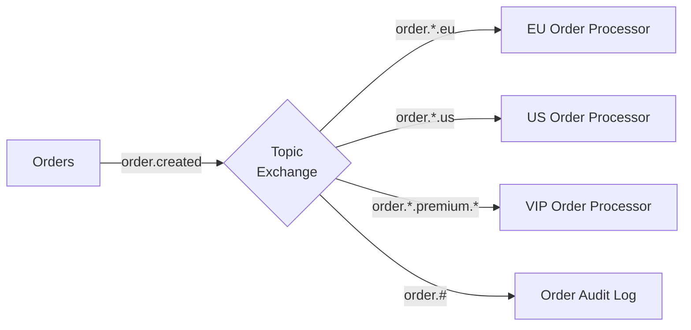
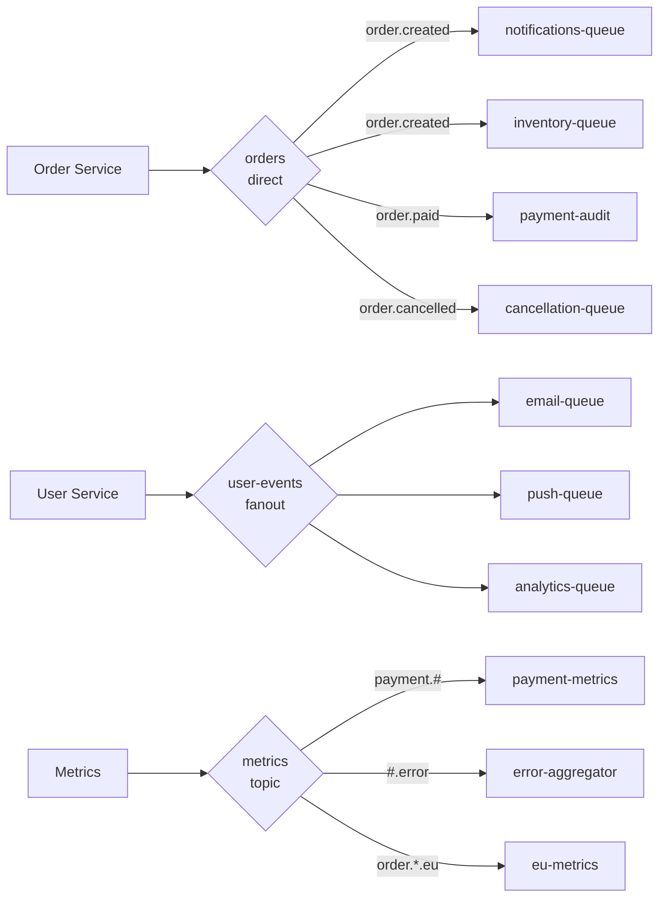

# RabbitMQ Exchange Types — Подробное руководство

## Что такое Exchange и зачем он нужен

В большинстве очередных систем производители пишут напрямую в очередь. RabbitMQ устроен иначе: **производитель никогда не знает, в каких очередях окажется его сообщение**. Он знает только имя Exchange и routing key.

Такое разделение даёт важные преимущества:

- Можно добавить новую очередь/подписчик без изменения кода producer
- Одно сообщение может попасть в несколько очередей одновременно
- Логика маршрутизации централизована и декларативна
- Топология изменяется динамически через AMQP-команды

```
Producer → [Exchange] → routing → [Queue 1]
                               → [Queue 2]
                               → [Queue N]
                   ↓ no match
                 dropped / alternate exchange
```

Каждый Exchange имеет атрибуты:
- **name** — уникальное имя (пустая строка для Default Exchange)
- **type** — алгоритм маршрутизации
- **durable** — переживает ли перезапуск брокера
- **auto-delete** — удаляется ли при отсутствии bindings
- **arguments** — дополнительные параметры (alternate-exchange, etc.)

---

## Direct Exchange — точная маршрутизация

### Алгоритм

RabbitMQ проходит по всем bindings данного Exchange и для каждого проверяет:

```
binding_key == message.routing_key  →  доставить в queue
```

Сложность: **O(B)**, где B — количество bindings. На практике за счёт хеш-таблицы — O(1).

### Ключевые свойства

```mermaid
graph LR
    P[Producer] -->|routing_key="error"| X{Direct\norders}
    X -->|binding: error| Q1[errors-queue]
    X -->|binding: error| Q2[alerts-queue]
    X -->|binding: info| Q3[logs-queue]
    X -->|binding: warning| Q4[warnings-queue]
```

- Один Exchange — много bindings с разными ключами
- Один ключ может вести в несколько очередей (семантика fanout для одного ключа)
- Одна очередь может привязана с несколькими ключами

### Пример: e-commerce система

```python
import pika

connection = pika.BlockingConnection(pika.ConnectionParameters('localhost'))
channel = connection.channel()

# Объявляем Exchange
channel.exchange_declare(exchange='orders', exchange_type='direct', durable=True)

# Объявляем очереди
for queue_name in ['orders.new', 'orders.paid', 'orders.cancelled', 'notifications']:
    channel.queue_declare(queue=queue_name, durable=True)

# Bindings
channel.queue_bind(exchange='orders', queue='orders.new',       routing_key='order.created')
channel.queue_bind(exchange='orders', queue='orders.paid',      routing_key='order.paid')
channel.queue_bind(exchange='orders', queue='orders.cancelled', routing_key='order.cancelled')
channel.queue_bind(exchange='orders', queue='notifications',    routing_key='order.created')
channel.queue_bind(exchange='orders', queue='notifications',    routing_key='order.paid')

# Publish
channel.basic_publish(
    exchange='orders',
    routing_key='order.created',
    body='{"id": 42, "total": 99.99}',
    properties=pika.BasicProperties(delivery_mode=2)
)
# → попадёт в: orders.new, notifications
```

### Типичные Use Cases

- **Worker queues** — распределение задач по типу
- **Событийный роутинг** — `user.created`, `user.deleted`, `user.updated`
- **Error handling** — разные очереди для `error`, `warning`, `info`
- **RPC pattern** — reply_to с уникальным correlation_id

---

## Fanout Exchange — широковещательная рассылка

### Алгоритм

RabbitMQ копирует сообщение **во все очереди**, привязанные к данному Exchange. Routing key полностью игнорируется — даже если он задан, он не влияет на маршрутизацию.

Сложность: **O(Q)**, где Q — количество привязанных очередей.

### Архитектура



### Пример: система уведомлений

```python
channel.exchange_declare(exchange='user.events', exchange_type='fanout', durable=True)

# Каждый сервис привязывает свою очередь
# Email service:
channel.queue_bind(exchange='user.events', queue='email.notifications', routing_key='')

# Push service:
channel.queue_bind(exchange='user.events', queue='push.notifications', routing_key='')

# Analytics:
channel.queue_bind(exchange='user.events', queue='analytics.events', routing_key='')

# Producer (не заботится о подписчиках):
channel.basic_publish(
    exchange='user.events',
    routing_key='',  # игнорируется
    body='{"event": "user.registered", "userId": 123}'
)
# → копия попадёт в email.notifications, push.notifications, analytics.events
```

### Производительность

⚠️ Fanout — самый быстрый тип Exchange по CPU, но создаёт **N копий** каждого сообщения (N = количество привязанных очередей). При 100 очередях каждое сообщение дублируется 100 раз. Следите за использованием памяти.

### Use Cases

- **Pub/Sub уведомления** — несколько сервисов должны знать об одном событии
- **Cache invalidation** — сообщить всем нодам об инвалидации кеша
- **Live data streaming** — трансляция котировок, курсов, метрик
- **Event sourcing fan-out** — записать событие в несколько проекций

---

## Topic Exchange — иерархическая маршрутизация

### Алгоритм и структура Trie

Topic Exchange внутри использует **Trie (prefix tree)** для эффективного матчинга паттернов. Routing key и binding key — это слова, разделённые точкой.

```
Binding patterns stored as trie:
order
├── created
│   └── * → queue: new-orders
│   └── eu → queue: eu-new-orders
├── # → queue: all-orders
└── paid
    └── * → queue: payments

Incoming: "order.created.eu"
Path: order → created → eu → match!
```

### Правила wildcards

| Символ | Значение | Позиция |
|--------|----------|---------|
| `*` | Ровно одно слово (любое) | Любая |
| `#` | Ноль или более слов | Любая, но обычно в конце |

```
Паттерн           Совпадает с              Не совпадает с
-----------------------------------------------------------------
order.*           order.created            order.created.eu
                  order.paid               order
order.#           order.created.eu         user.created
                  order                    (только сам order)
*.paid.*          order.paid.eu            order.paid
                  service.paid.us
#.error           system.db.error          system.warning
                  error                    error.system
```

### Пример: геораспределённая система



```python
channel.exchange_declare(exchange='events', exchange_type='topic', durable=True)

# Bindings с паттернами
patterns = [
    ('order.#',          'all-orders'),
    ('order.created.*',  'new-orders'),
    ('*.*.eu',           'eu-events'),
    ('*.*.us',           'us-events'),
    ('#.error',          'error-handler'),
    ('user.#',           'user-events'),
]
for pattern, queue in patterns:
    channel.queue_bind(exchange='events', queue=queue, routing_key=pattern)

# Одно сообщение может попасть в несколько очередей
channel.basic_publish(exchange='events', routing_key='order.created.eu', body='...')
# → all-orders ✅ (order.#)
# → new-orders ✅ (order.created.*)
# → eu-events  ✅ (*.*.eu)
# → error-handler ❌
# → user-events   ❌
```

### Best Practices для Topic Exchange

💡 **Соглашение об именовании routing keys:**
```
<domain>.<action>.<optional-context>

order.created.eu
order.paid.premium.us
user.registered.mobile
payment.failed.timeout
```

💡 **Используйте иерархию от общего к частному** — так проще писать binding patterns.

⚠️ **Избегайте `#` в середине паттерна** — это трудно для понимания и может дать неожиданные результаты. `order.#.eu` — плохой паттерн.

---

## Headers Exchange — маршрутизация по метаданным

### Алгоритм

Headers Exchange анализирует **AMQP-заголовки** (headers) сообщения. Routing key полностью игнорируется.

Каждый binding имеет набор условий (key=value) и параметр `x-match`:

```
x-match: all → все условия должны выполниться (AND)
x-match: any → хотя бы одно условие (OR)
```



### Пример: контент-роутинг

```python
channel.exchange_declare(exchange='content-router', exchange_type='headers', durable=True)

# Binding 1: VIP EU клиенты (ALL: region=eu AND tier=premium)
channel.queue_bind(
    exchange='content-router',
    queue='vip-eu-queue',
    routing_key='',
    arguments={
        'x-match': 'all',
        'region': 'eu',
        'tier': 'premium'
    }
)

# Binding 2: Любая мобильная платформа (ANY: platform=mobile OR platform=tablet)
channel.queue_bind(
    exchange='content-router',
    queue='mobile-queue',
    routing_key='',
    arguments={
        'x-match': 'any',
        'platform': 'mobile',
        'platform2': 'tablet'  # нестандартное имя - нельзя дублировать ключи
    }
)

# Публикация с заголовками
import pika
props = pika.BasicProperties(headers={
    'region': 'eu',
    'tier': 'premium',
    'platform': 'desktop'
})
channel.basic_publish(
    exchange='content-router',
    routing_key='',
    properties=props,
    body='{"productId": 42}'
)
# → vip-eu-queue ✅ (all: eu=eu AND premium=premium)
# → mobile-queue ❌ (any: desktop!=mobile AND нет platform2)
```

### Ограничения Headers Exchange

⚠️ **Производительность:** Headers Exchange значительно медленнее остальных типов, так как анализирует заголовки каждого сообщения.

⚠️ **Нет поддержки дублирующихся ключей:** В AMQP headers — это map, нельзя иметь два значения для одного ключа. Это ограничивает `x-match: any`.

⚠️ **Отладка сложнее:** Нет простого способа понять, почему сообщение попало или не попало в очередь, без анализа заголовков.

---

## Default Exchange

**Default Exchange** — специальный Direct Exchange с именем `""` (пустая строка). RabbitMQ автоматически создаёт **неявный binding** для каждой объявленной очереди: `routing_key = queue_name`.

```mermaid
graph LR
    P[Producer] -->|routing_key="my-queue"| X{Default\nExchange\namq.direct}
    X -->|auto-binding: my-queue| Q[my-queue]
```

```python
# Отправить напрямую в очередь:
channel.basic_publish(
    exchange='',          # default exchange
    routing_key='my-queue',  # routing_key = имя очереди
    body='Hello!'
)
```

💡 Default Exchange удобен для простых сценариев и быстрого старта. В production обычно используют именованные Exchanges.

---

## Alternate Exchange

Что происходит с сообщениями, для которых не нашлось ни одного matching binding?

По умолчанию: **сообщение удаляется** (dropped).

**Alternate Exchange** позволяет перехватить такие сообщения:

```python
channel.exchange_declare(
    exchange='orders',
    exchange_type='direct',
    arguments={'alternate-exchange': 'unrouted-messages'}
)

# Объявляем Alternate Exchange (обычно Fanout или Direct)
channel.exchange_declare(exchange='unrouted-messages', exchange_type='fanout')
channel.queue_bind(exchange='unrouted-messages', queue='dead-messages')

# Сообщение с неизвестным ключом → попадёт в dead-messages
channel.basic_publish(exchange='orders', routing_key='unknown.key', body='...')
```

---

## Exchange-to-Exchange Bindings

RabbitMQ поддерживает привязку одного Exchange к другому (расширение AMQP, нестандартное):



```python
# Bind exchange to exchange
channel.exchange_bind(
    destination='region-router',   # принимающий exchange
    source='broadcast',            # откуда приходят сообщения
    routing_key='events.#'
)
```

💡 Это мощный паттерн для построения многоуровневых топологий маршрутизации.

---

## Consistent Hash Exchange (plugin)

Плагин `rabbitmq_consistent_hash_exchange` позволяет равномерно распределять сообщения по очередям на основе хеша routing key.

```python
# Включить плагин: rabbitmq-plugins enable rabbitmq_consistent_hash_exchange

channel.exchange_declare(exchange='tasks', exchange_type='x-consistent-hash')

# Очереди с весами (больший вес = больше сообщений)
channel.queue_bind(exchange='tasks', queue='worker-1', routing_key='1')  # 1 часть
channel.queue_bind(exchange='tasks', queue='worker-2', routing_key='3')  # 3 части
# worker-2 получит ~75% сообщений, worker-1 ~25%
```

Use case: шардирование очередей для горизонтального масштабирования consumer'ов.

---

## Производительность типов Exchange

| Тип | Сложность routing | Сложность bindings | Typical TPS |
|-----|------------------|--------------------|-------------|
| Direct | O(1) хеш-таблица | Низкая | 50k-100k msg/s |
| Fanout | O(Q) копирование | Минимальная | 30k-80k msg/s |
| Topic | O(B) trie matching | Средняя | 40k-90k msg/s |
| Headers | O(B×H) сравнение | Высокая | 10k-40k msg/s |

Q = количество очередей, B = количество bindings, H = количество заголовков.

⚠️ Цифры приблизительные и зависят от hardware, размера сообщений и конфигурации.

---

## Паттерны с Exchange

### Routing Slip

Сообщение само содержит список Exchanges/очередей для последовательной обработки:

```python
# Заголовок со списком шагов:
headers = {
    'routing-slip': 'validate,enrich,transform,store',
    'current-step': 'validate'
}
```

Каждый consumer обрабатывает своё действие и передаёт сообщение следующему шагу. Реализует динамический pipeline.

### Content-Based Routing



### Dead Letter Exchange (DLX)

Сообщения, которые не удалось обработать, перенаправляются в специальный Exchange:

```python
channel.queue_declare(
    queue='main-queue',
    arguments={
        'x-dead-letter-exchange': 'dlx',
        'x-dead-letter-routing-key': 'failed.messages',
        'x-message-ttl': 30000
    }
)
```

---

## Реальные топологии

### E-commerce платформа



### Микросервисная система с шардированием

```python
# Consistent hash для распределения нагрузки
channel.exchange_declare(exchange='tasks', exchange_type='x-consistent-hash')
for i in range(8):
    channel.queue_bind(
        exchange='tasks',
        queue=f'worker-{i}',
        routing_key='10'  # равные веса
    )

# Работники обрабатывают свои шарды параллельно
```

---

## Best Practices выбора Exchange типа

### Когда Direct

✅ Конечный набор типов событий известен заранее
✅ Нужна простая маршрутизация без wildcard
✅ Высокая нагрузка, нужна максимальная производительность
✅ Worker queue — N consumers на одну задачу

### Когда Fanout

✅ Все подписчики должны получить каждое сообщение
✅ Количество потребителей меняется динамически
✅ Реализация паттерна Observer/Pub-Sub
⚠️ Не подходит, если нужна избирательная доставка

### Когда Topic

✅ Иерархические события с контекстом (регион, версия, среда)
✅ Routing key структурирован и предсказуем
✅ Нужна гибкость — разные consumer'ы подписываются на разные подмножества
✅ Мультитенантная система

### Когда Headers

✅ Routing key не подходит — нужна маршрутизация по нескольким атрибутам
✅ A/B тестирование (routing по флагам эксперимента)
✅ Контент-зависимая маршрутизация по типу контента, языку, версии
⚠️ Если нужна высокая производительность — избегайте

---

## Типичные ошибки

### ❌ Отправка в несуществующий Exchange

```python
# Если Exchange не объявлен, сообщение потеряется без ошибки (по умолчанию)
channel.basic_publish(exchange='non-existent', routing_key='key', body='...')
```

✅ Всегда используйте `passive=True` при первичной проверке или объявляйте Exchange явно.

### ❌ Забытый routing key при Direct

```python
# Ошибка: пустой routing key не совпадёт ни с одним binding
channel.basic_publish(exchange='orders', routing_key='', body='...')
```

✅ Убедитесь, что routing key соответствует хотя бы одному binding.

### ❌ Изменение типа существующего Exchange

```python
# Если Exchange уже объявлен с типом 'direct', нельзя переобъявить с 'fanout'
# Вызовет ошибку 406 (PRECONDITION_FAILED)
channel.exchange_declare(exchange='events', exchange_type='fanout')  # ОШИБКА!
```

✅ Для изменения типа: удалите Exchange и создайте заново.

### ❌ Неправильное использование # в паттерне

```python
# Запутанный паттерн — # посередине трудно понять
channel.queue_bind(queue='q', exchange='e', routing_key='order.#.eu')
# Это работает, но семантика неочевидна
```

✅ Используйте `#` только в начале (`#.error`) или конце (`order.#`) паттерна.
