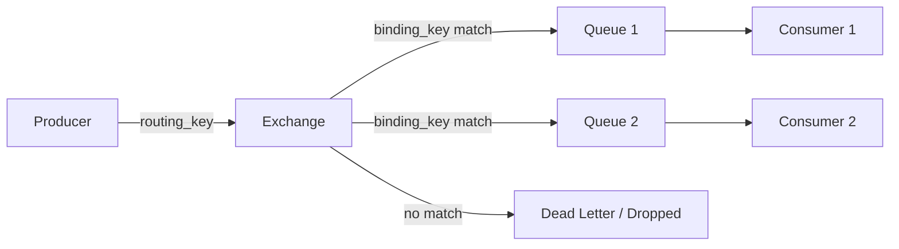
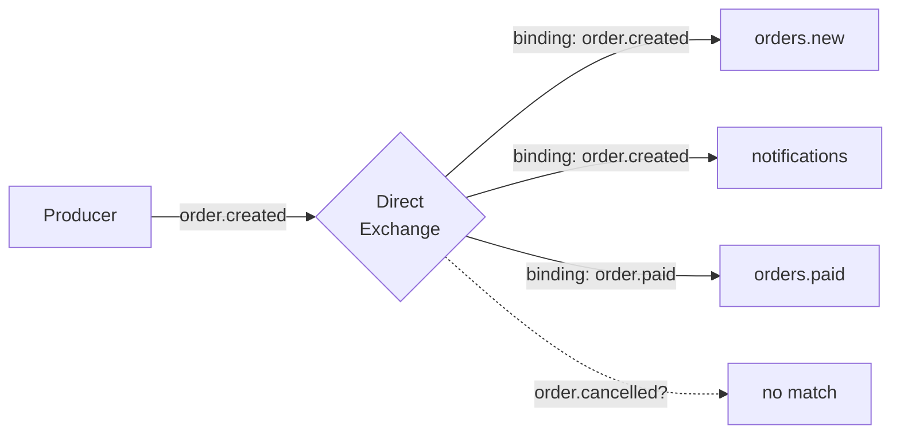
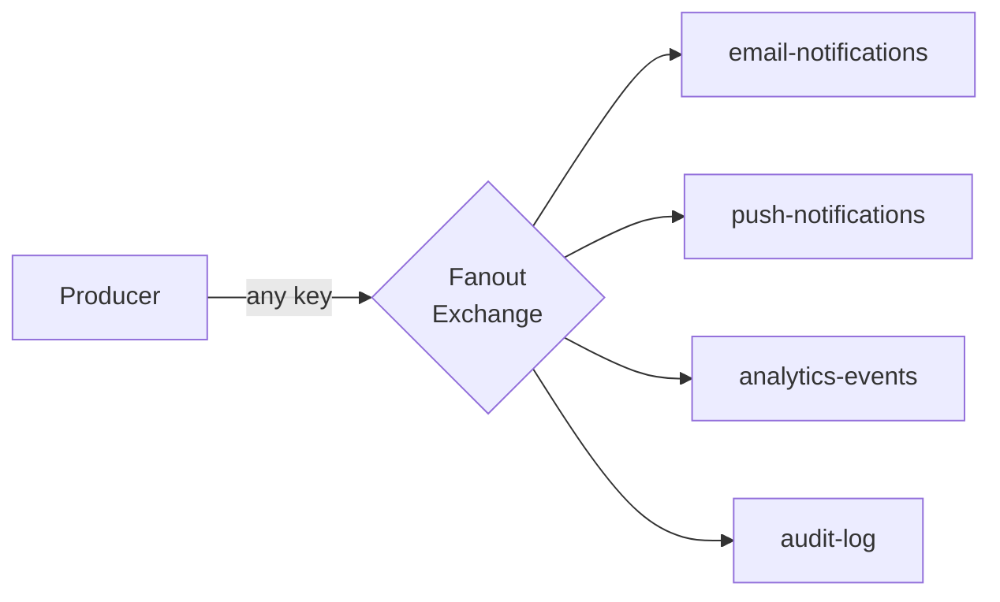
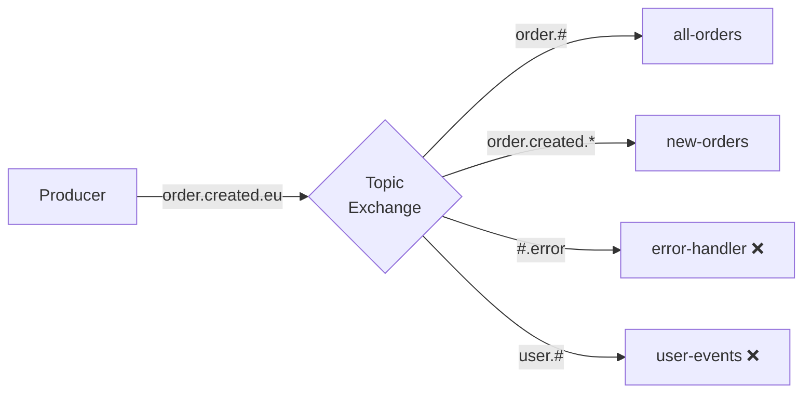

# Level 5: RabbitMQ — Exchange Types

## Exchange — The Message Entry Point

An Exchange is a router. A producer never sends a message directly to a queue. It sends to an Exchange, and the Exchange decides which queues to deliver the message to.



Exchange behavior is determined by its **type**. RabbitMQ supports 4 built-in types: `direct`, `fanout`, `topic`, `headers`.

---

## Direct Exchange — Exact Match

📌 Routes a message to a queue if its **binding key == routing key**.



```python
# Binding
channel.queue_bind(queue='orders.new',    exchange='orders', routing_key='order.created')
channel.queue_bind(queue='notifications', exchange='orders', routing_key='order.created')

# Publish
channel.basic_publish(exchange='orders', routing_key='order.created', body='...')
# → goes to orders.new AND notifications
```

✅ One queue can have multiple binding keys.
✅ Multiple queues can be bound with the same binding key.

---

## Fanout Exchange — Broadcast to All

📢 Ignores the routing key entirely. Copies every message to **all** bound queues.



```python
channel.exchange_declare(exchange='broadcast', exchange_type='fanout')
channel.basic_publish(exchange='broadcast', routing_key='', body='...')
# → goes to ALL bound queues
```

⚠️ The number of queues affects load: each message is duplicated N times.

---

## Topic Exchange — Wildcard Routing

🌿 Binding keys can contain wildcards. Routing keys are dot-separated words.

| Wildcard | Meaning | Example |
|----------|----------|--------|
| `*` | exactly one word | `order.*` → `order.created` ✅, `order.created.eu` ❌ |
| `#` | zero or more words | `order.#` → `order.created.eu` ✅, `order` ✅ |



```python
channel.queue_bind(queue='all-orders',  exchange='events', routing_key='order.#')
channel.queue_bind(queue='new-orders',  exchange='events', routing_key='order.created.*')
channel.queue_bind(queue='eu-orders',   exchange='events', routing_key='*.*.eu')

channel.basic_publish(exchange='events', routing_key='order.created.eu', body='...')
# → goes to all-orders, new-orders, eu-orders
```

---

## Headers Exchange — Routing by Headers

🏷️ Routing key is ignored. Routing is based on AMQP message headers.

The `x-match` parameter in binding determines the logic:
- `x-match: all` — all headers must match (AND)
- `x-match: any` — at least one header must match (OR)

```python
# Binding with condition: region=eu AND platform=mobile
channel.queue_bind(
    queue='eu-mobile',
    exchange='content-router',
    routing_key='',  # ignored
    arguments={'x-match': 'all', 'region': 'eu', 'platform': 'mobile'}
)

# Publish with headers
channel.basic_publish(
    exchange='content-router',
    routing_key='',
    properties=pika.BasicProperties(headers={'region': 'eu', 'platform': 'mobile', 'tier': 'premium'}),
    body='...'
)
# → goes to eu-mobile (all: eu=eu ✅ AND mobile=mobile ✅)
```

⚠️ Headers Exchange is slower than the others — it analyzes headers of every message.

---

## Default Exchange

💡 A special Direct Exchange with no name (`""`). RabbitMQ automatically binds every queue to it with a routing key equal to the queue name.

```python
# Send directly to queue "my-queue":
channel.basic_publish(exchange='', routing_key='my-queue', body='...')
```

---

## Bindings and Routing Keys

**Binding** — a connection between an Exchange and a queue. Created with the `queue.bind` command.

```mermaid
graph LR
    X[Exchange] -->|binding_key="info"| Q1[logs.info]
    X -->|binding_key="error"| Q2[logs.error]
    X -->|binding_key="error"| Q3[alerts]
```

📌 **Routing key** — a message attribute set by the Producer.
📌 **Binding key** — an Exchange-Queue connection attribute set when creating the binding.

---

## Quick Comparison

| Type | Routing by | Speed | Complexity | When |
|-----|-----------|----------|-----------|-------|
| Direct | Exact key | High | Simple | Task queues |
| Fanout | Ignores | Very high | Minimal | Broadcast, notifications |
| Topic | Wildcard pattern | High | Medium | Flexible routing |
| Headers | AMQP headers | Low | Complex | Content routing |