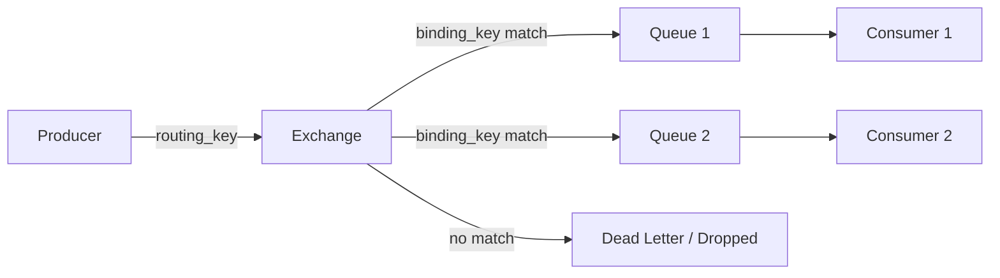
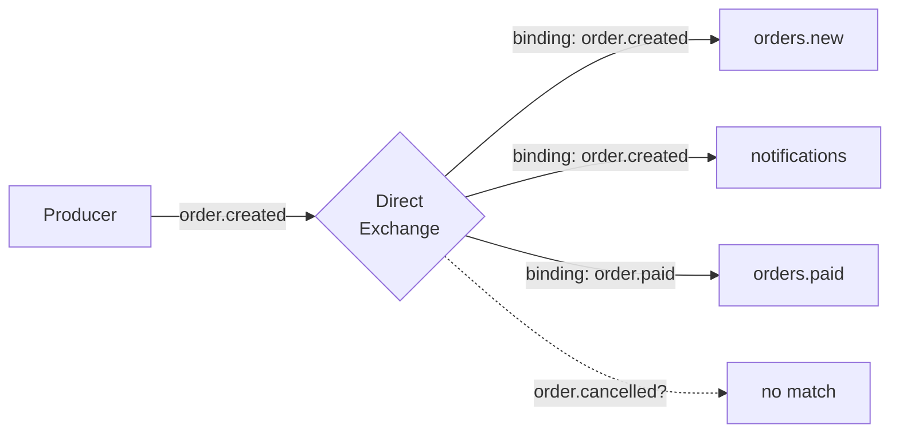
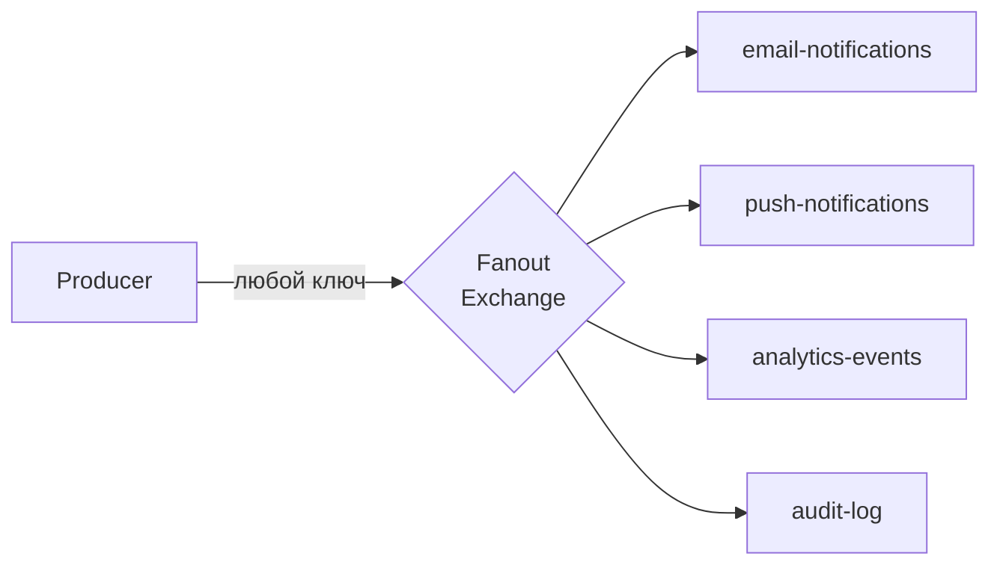
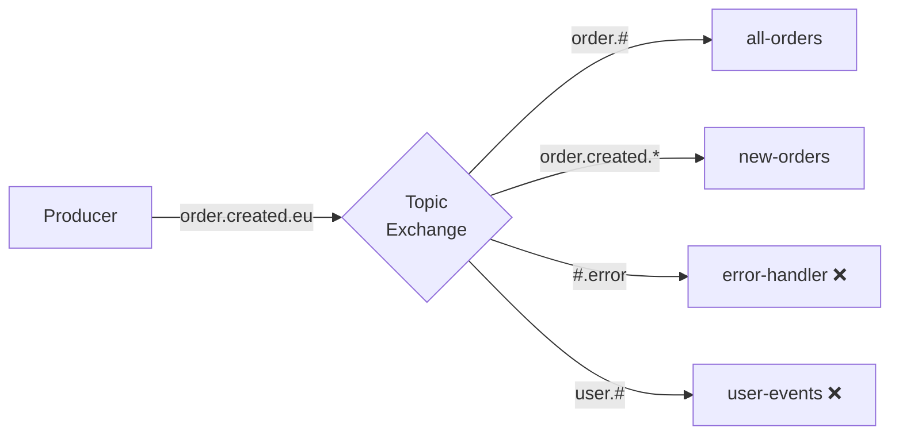

# Уровень 5: RabbitMQ — типы Exchange

## Exchange — точка входа сообщений

Exchange — это маршрутизатор. Producer никогда не отправляет сообщение напрямую в очередь. Он отправляет его в Exchange, а уже Exchange решает, в какие очереди доставить сообщение.



Поведение Exchange определяется его **типом**. RabbitMQ поддерживает 4 встроенных типа: `direct`, `fanout`, `topic`, `headers`.

---

## Direct Exchange — точное совпадение

📌 Маршрутизирует сообщение в очередь, если её **binding key == routing key** сообщения.



```python
# Binding
channel.queue_bind(queue='orders.new',    exchange='orders', routing_key='order.created')
channel.queue_bind(queue='notifications', exchange='orders', routing_key='order.created')

# Publish
channel.basic_publish(exchange='orders', routing_key='order.created', body='...')
# → попадёт в orders.new И notifications
```

✅ Одна очередь может иметь несколько binding keys.
✅ Несколько очередей могут быть привязаны с одним binding key.

---

## Fanout Exchange — broadcast всем

📢 Игнорирует routing key полностью. Копирует каждое сообщение во **все** привязанные очереди.



```python
channel.exchange_declare(exchange='broadcast', exchange_type='fanout')
channel.basic_publish(exchange='broadcast', routing_key='', body='...')
# → попадёт во ВСЕ привязанные очереди
```

⚠️ Количество очередей влияет на нагрузку: каждое сообщение дублируется N раз.

---

## Topic Exchange — wildcard маршрутизация

🌿 Binding key может содержать wildcards. Routing key — слова, разделённые точкой.

| Wildcard | Значение | Пример |
|----------|----------|--------|
| `*` | ровно одно слово | `order.*` → `order.created` ✅, `order.created.eu` ❌ |
| `#` | ноль или более слов | `order.#` → `order.created.eu` ✅, `order` ✅ |



```python
channel.queue_bind(queue='all-orders',  exchange='events', routing_key='order.#')
channel.queue_bind(queue='new-orders',  exchange='events', routing_key='order.created.*')
channel.queue_bind(queue='eu-orders',   exchange='events', routing_key='*.*.eu')

channel.basic_publish(exchange='events', routing_key='order.created.eu', body='...')
# → попадёт в all-orders, new-orders, eu-orders
```

---

## Headers Exchange — routing по заголовкам

🏷️ Routing key игнорируется. Маршрутизация по AMQP-заголовкам сообщения.

Параметр `x-match` в binding определяет логику:
- `x-match: all` — все заголовки должны совпасть (AND)
- `x-match: any` — хотя бы один заголовок должен совпасть (OR)

```python
# Binding с условием: region=eu AND platform=mobile
channel.queue_bind(
    queue='eu-mobile',
    exchange='content-router',
    routing_key='',  # игнорируется
    arguments={'x-match': 'all', 'region': 'eu', 'platform': 'mobile'}
)

# Публикация с заголовками
channel.basic_publish(
    exchange='content-router',
    routing_key='',
    properties=pika.BasicProperties(headers={'region': 'eu', 'platform': 'mobile', 'tier': 'premium'}),
    body='...'
)
# → попадёт в eu-mobile (all: eu=eu ✅ AND mobile=mobile ✅)
```

⚠️ Headers Exchange работает медленнее остальных — анализирует заголовки каждого сообщения.

---

## Default Exchange

💡 Специальный Direct Exchange без имени (`""`). RabbitMQ автоматически привязывает каждую очередь к нему с routing key равным имени очереди.

```python
# Отправить прямо в очередь "my-queue":
channel.basic_publish(exchange='', routing_key='my-queue', body='...')
```

---

## Bindings и Routing Keys

**Binding** — связь между Exchange и очередью. Создаётся командой `queue.bind`.

```mermaid
graph LR
    X[Exchange] -->|binding_key="info"| Q1[logs.info]
    X -->|binding_key="error"| Q2[logs.error]
    X -->|binding_key="error"| Q3[alerts]
```

📌 **Routing key** — атрибут сообщения, заданный Producer.
📌 **Binding key** — атрибут связи Exchange-Queue, заданный при создании binding.

---

## Быстрое сравнение

| Тип | Routing по | Скорость | Сложность | Когда |
|-----|-----------|----------|-----------|-------|
| Direct | Точный ключ | Высокая | Простой | Очереди задач |
| Fanout | Игнорирует | Очень высокая | Минимальный | Broadcast, уведомления |
| Topic | Wildcard паттерн | Высокая | Средний | Гибкая маршрутизация |
| Headers | Заголовки AMQP | Низкая | Сложный | Контент-роутинг |
