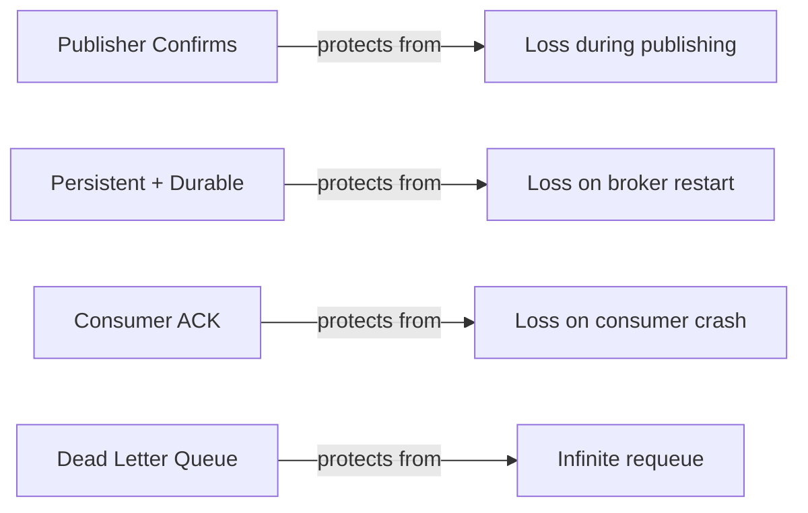
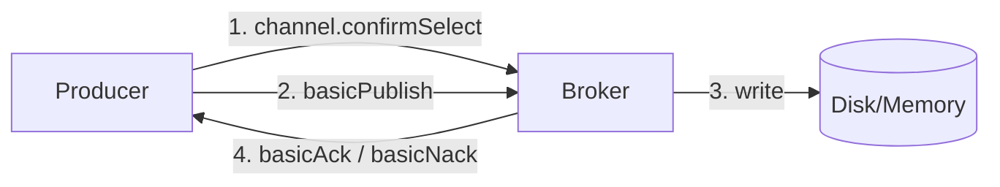
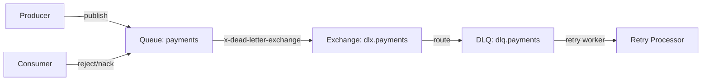
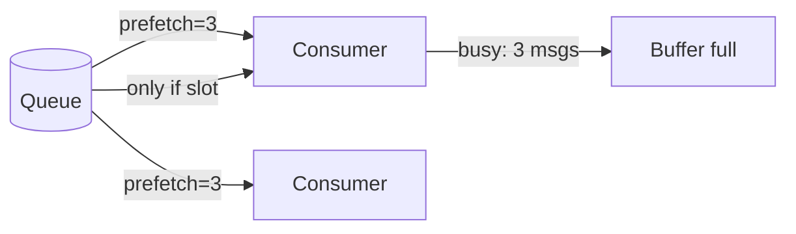
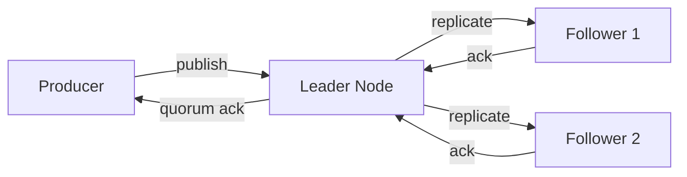

# Level 6: RabbitMQ — Reliability (detailed theory)

## Introduction: three layers of guarantees

Delivery reliability in RabbitMQ is not a single "make reliable" button, but a multi-layered system. Each layer addresses a specific class of failures:



Analogy: imagine a factory conveyor belt.
- **Publisher Confirms** — receipt from the warehouse receiver ("I got it")
- **Persistent storage** — logbook entry (won't be lost in a fire)
- **Consumer ACK** — worker's signature ("I processed it")
- **DLQ** — scrap bin (doesn't block the main flow)

---

## Publisher Confirms: in detail

### How it works

Publisher Confirms are an AMQP 0-9-1 protocol extension specific to RabbitMQ. The standard AMQP does not define this mechanism — it is a vendor-specific feature.



When `channel.confirmSelect()` is called, the channel enters "confirm mode". In this mode, each published message gets a monotonically increasing **delivery tag** (starting from 1). The broker sends a `basic.ack` or `basic.nack` for each tag.

### Individual Confirms

```java
channel.confirmSelect();

for (String message : messages) {
    channel.basicPublish(exchange, routingKey,
        MessageProperties.PERSISTENT_TEXT_PLAIN,
        message.getBytes());

    boolean confirmed = channel.waitForConfirms(5_000); // timeout 5s
    if (!confirmed) {
        // NACK or timeout — republish
        log.warn("Message not confirmed, retrying: {}", message);
    }
}
```

**Pros**: simplicity, easy to understand exactly what didn't arrive.
**Cons**: 1 RTT (round-trip time) per message. At 1ms latency — 1000 msg/s max.

### Batch Confirms

```java
channel.confirmSelect();
int batchSize = 100;
int count = 0;

for (String message : messages) {
    channel.basicPublish(exchange, routingKey, props, message.getBytes());
    count++;

    if (count % batchSize == 0) {
        channel.waitForConfirmsOrDie(5_000);
        // If NACK — exception, need to retry the entire batch
        count = 0;
    }
}
// Don't forget the "tail" smaller than batchSize
if (count > 0) {
    channel.waitForConfirmsOrDie(5_000);
}
```

⚠️ **Batch confirms problem**: on NACK it is unknown which specific message failed. The entire batch must be retried, which can lead to duplicates.

### Async Confirms (recommended approach)

```java
channel.confirmSelect();

// Register listener once
channel.addConfirmListener(
    (deliveryTag, multiple) -> {
        // ACK: message(s) confirmed
        if (multiple) {
            // All tags <= deliveryTag confirmed
            outstandingConfirms.headMap(deliveryTag, true).clear();
        } else {
            outstandingConfirms.remove(deliveryTag);
        }
    },
    (deliveryTag, multiple) -> {
        // NACK: need to retry
        String body = outstandingConfirms.get(deliveryTag);
        log.error("NACK for tag {}, message: {}", deliveryTag, body);
        // Add to retry queue
    }
);

// Publish without waiting
ConcurrentNavigableMap<Long, String> outstandingConfirms = new ConcurrentSkipListMap<>();

for (String message : messages) {
    long tag = channel.getNextPublishSeqNo();
    outstandingConfirms.put(tag, message);
    channel.basicPublish(exchange, routingKey, props, message.getBytes());
}
```

**Throughput**: easily achieves 10,000+ msg/s vs ~200 msg/s for individual.

---

## Mandatory Flag and Return Callbacks

What happens if a message cannot be routed to any queue?

```java
// mandatory=true: if no suitable queue → return to producer
channel.basicPublish(exchange, routingKey,
    true,  // mandatory
    props,
    body);

// Handler for "returned" messages
channel.addReturnListener((replyCode, replyText, exchange, routingKey, props, body) -> {
    log.warn("Message returned: {} {} routing_key={}", replyCode, replyText, routingKey);
    // Save to fallback storage
});
```

**When to use**: with dynamic routing keys, when the consumer may not have started yet.

⚠️ With `mandatory=false` (default) — unroutable messages are silently discarded!

---

## Persistent Messages and Durable Queues

### Durable Queue

```java
channel.queueDeclare(
    "payments",  // name
    true,        // durable — survives broker restart
    false,       // exclusive — only for this connection?
    false,       // auto-delete — delete when no consumers?
    null         // arguments
);
```

A durable queue stores its definition in Mnesia (Erlang's built-in database). On restart, RabbitMQ restores all durable queues.

❌ **BUT**: messages in a durable queue are NOT automatically persisted!

### Persistent Messages

```java
AMQP.BasicProperties persistent = new AMQP.BasicProperties.Builder()
    .deliveryMode(2)          // 1=transient, 2=persistent
    .contentType("application/json")
    .messageId(UUID.randomUUID().toString())
    .timestamp(new Date())
    .build();

channel.basicPublish("", "payments", persistent, body);
```

RabbitMQ writes persistent messages to disk files (`$RABBITMQ_MNESIA_DIR/msg_stores/`).

### Survival matrix

| Queue | Message | After restart |
|---|---|---|
| transient | transient | Everything lost |
| transient | persistent | Everything lost (no queue) |
| durable | transient | Queue exists, messages lost |
| **durable** | **persistent** | **Everything saved** |

### Performance impact

Persistence means writing to disk. Under high load this can become a bottleneck:

- RabbitMQ buffers writes (fsync not after every message)
- "Lazy queues" mode stores messages on disk immediately, saving RAM
- SSD gives 5-10x better performance vs HDD for RabbitMQ

---

## Consumer ACK: three response options

### basicAck — message processed

```java
channel.basicAck(
    deliveryTag,  // tag of this specific message
    false         // multiple: false = only this one, true = all up to this tag
);
```

With `multiple=true` — acknowledge all messages with delivery tag <= the specified one.

### basicNack — not processed (AMQP extension)

```java
channel.basicNack(
    deliveryTag,
    false,  // multiple
    true    // requeue: true = return to front of queue, false = discard/DLQ
);
```

⚠️ `requeue=true` with immediate nack = infinite loop! The message will be immediately delivered again.

### basicReject — reject a single message

```java
channel.basicReject(
    deliveryTag,
    false  // requeue
);
```

`basicReject` — equivalent to `basicNack(tag, false, requeue)`, but without `multiple` support.

### Poison Messages — protection from infinite loops

```java
channel.basicConsume(queue, false, (tag, delivery) -> {
    int retryCount = getRetryCount(delivery.getProperties().getHeaders());

    if (retryCount >= 3) {
        // Send to DLQ, no requeueing
        channel.basicReject(delivery.getEnvelope().getDeliveryTag(), false);
        return;
    }

    try {
        process(delivery);
        channel.basicAck(delivery.getEnvelope().getDeliveryTag(), false);
    } catch (Exception e) {
        channel.basicNack(delivery.getEnvelope().getDeliveryTag(), false, true);
    }
});
```

**x-death pattern**: RabbitMQ automatically adds an `x-death` header during dead-lettering, containing the message's death history.

---

## Dead Letter Exchange (DLX)

When a message "dies" (rejected, expired, overflow), it can go to a special exchange:

```java
// Declare DLX and DLQ
channel.exchangeDeclare("dlx.payments", "direct", true);
channel.queueDeclare("dlq.payments", true, false, false, null);
channel.queueBind("dlq.payments", "dlx.payments", "payments");

// Configure main queue to use DLX
Map<String, Object> args = new HashMap<>();
args.put("x-dead-letter-exchange", "dlx.payments");
args.put("x-dead-letter-routing-key", "payments"); // optional

channel.queueDeclare("payments", true, false, false, args);
```



Reasons for entering DLQ:
- `basicReject/basicNack` with `requeue=false`
- Message expired by TTL
- Queue overflowed (x-max-length)

---

## Prefetch: fine-tuning

### How prefetch works



```java
// Per-consumer prefetch (recommended)
channel.basicQos(
    5,     // prefetchCount — max unacked messages
    false  // global: false = per consumer, true = per channel
);

// Per-channel prefetch (all consumers on channel share the limit)
channel.basicQos(100, true);
```

### Choosing prefetchCount

| Scenario | Recommended prefetch |
|---|---|
| Fast processing (< 1ms) | 200-500 |
| Average processing (1-10ms) | 10-50 |
| Slow processing (> 100ms) | 1-5 |
| External API call | 1-3 |
| Batch processing | batchSize * 2 |

💡 **Rule of thumb**: prefetch = (desired in-flight count) / (number of consumers).

### Accumulation effect on slow consumer

With prefetch=10 and two consumers (fast 100ms, slow 1000ms):

```
t=0:    Fast gets 10 msgs, Slow gets 10 msgs
t=1s:   Fast processed 10, gets 10 more
        Slow processed 1, has 9 in-flight — gets no new ones
t=2s:   Fast processed 20 msgs, Slow — 2 msgs
```

Conclusion: with prefetch > 1, a slow consumer "captures" messages it cannot process quickly. For strict fair dispatch, prefetch=1 is needed.

---

## Message TTL and Queue TTL

### Message-level TTL

```java
AMQP.BasicProperties props = new AMQP.BasicProperties.Builder()
    .expiration("60000") // 60 seconds in milliseconds (string!)
    .build();

channel.basicPublish("", "tasks", props, body);
```

### Queue-level TTL

```java
Map<String, Object> args = new HashMap<>();
args.put("x-message-ttl", 300_000); // 5 minutes
args.put("x-dead-letter-exchange", "dlx"); // where on expiry

channel.queueDeclare("cache.tasks", true, false, false, args);
```

### Queue TTL (expire)

```java
args.put("x-expires", 1_800_000); // queue deleted after 30 min of inactivity
```

Useful for temporary queues in RPC pattern — no need to explicitly delete.

---

## HA Queues vs Quorum Queues

### Classic Mirrored Queues (deprecated in RabbitMQ 3.9+)

```java
// Via HTTP API or policy
// rabbitmqctl set_policy HA "^ha\." '{"ha-mode":"all"}'
```

Classic mirroring problems:
- Synchronization can block the queue
- Split-brain in cluster
- Poor performance with many mirrors

### Quorum Queues (recommended)

```java
Map<String, Object> args = new HashMap<>();
args.put("x-queue-type", "quorum");

channel.queueDeclare("payments.quorum", true, false, false, args);
```

Quorum Queues are based on the Raft algorithm:
- A message is considered saved when the majority (quorum) of nodes confirmed the write
- Automatic leader recovery on failure
- Does not support some features: x-max-priority, temporary queues



### Comparison

| Characteristic | Classic Mirror | Quorum Queue |
|---|---|---|
| Algorithm | Master/Mirror | Raft |
| Loss on failure | Possible | No (with quorum) |
| Performance | High | Slightly lower |
| Status | Deprecated | Recommended |
| Priorities support | Yes | No |
| Lazy mode | Yes | Always on disk |

---

## AMQP Transactions: why not to use them

```java
// AMQP transactions — outdated approach
channel.txSelect();
try {
    channel.basicPublish(exchange, routingKey, props, body1);
    channel.basicPublish(exchange, routingKey, props, body2);
    channel.txCommit();
} catch (Exception e) {
    channel.txRollback();
}
```

### Why transactions are slow

On txCommit RabbitMQ:
1. Writes all messages to disk
2. Waits for fsync
3. Only then returns the response

This is a synchronous operation. Benchmarks show: Publisher Confirms provide **250 times** greater throughput.

### When transactions might be useful

The only scenario — publishing multiple messages as an atomic operation (all or none). But even in this case, Outbox Pattern + Publisher Confirms is better.

---

## Pattern: reliable producer

```java
public class ReliableProducer {
    private final Channel channel;
    private final ConcurrentNavigableMap<Long, Message> pending =
        new ConcurrentSkipListMap<>();

    public ReliableProducer(Channel channel) throws IOException {
        this.channel = channel;
        channel.confirmSelect();

        channel.addConfirmListener(
            this::handleAck,
            this::handleNack
        );
    }

    public void publish(Message msg) throws IOException {
        long tag = channel.getNextPublishSeqNo();
        pending.put(tag, msg);
        channel.basicPublish("orders", msg.getRoutingKey(),
            MessageProperties.PERSISTENT_TEXT_PLAIN,
            msg.toBytes());
    }

    private void handleAck(long tag, boolean multiple) {
        if (multiple) {
            pending.headMap(tag, true).clear();
        } else {
            pending.remove(tag);
        }
    }

    private void handleNack(long tag, boolean multiple) {
        // Move to retry queue
        if (multiple) {
            pending.headMap(tag, true).forEach((t, msg) -> retry(msg));
            pending.headMap(tag, true).clear();
        } else {
            retry(pending.remove(tag));
        }
    }
}
```

---

## ⚠️ Common beginner mistakes

### 1. Durable without persistent

```java
// ❌ Thinking durable=true is enough
channel.queueDeclare("orders", true, false, false, null);
channel.basicPublish("", "orders", null, body); // deliveryMode=1 by default!

// ✅ Correct: durable queue + persistent message
channel.basicPublish("", "orders",
    MessageProperties.PERSISTENT_TEXT_PLAIN, body);
```

**Why it's a problem**: on broker restart, the queue is restored, but all messages are lost.

### 2. Auto-ACK with processing

```java
// ❌ Message deleted before processing
channel.basicConsume("orders", true, (tag, delivery) -> {
    orderService.process(delivery); // if it crashes — message is lost
});

// ✅ Manual ACK
channel.basicConsume("orders", false, (tag, delivery) -> {
    try {
        orderService.process(delivery);
        channel.basicAck(delivery.getEnvelope().getDeliveryTag(), false);
    } catch (Exception e) {
        channel.basicNack(delivery.getEnvelope().getDeliveryTag(), false, true);
    }
});
```

### 3. Infinite requeue

```java
// ❌ Infinite loop on a persistent error
catch (Exception e) {
    channel.basicNack(tag, false, true); // requeue=true always
}

// ✅ Limit the number of attempts
int retries = getRetryCount(delivery);
boolean shouldRequeue = retries < MAX_RETRIES;
channel.basicNack(tag, false, shouldRequeue);
if (!shouldRequeue) {
    // Already in DLQ
}
```

### 4. Redefining an existing queue with different parameters

```java
// ❌ PRECONDITION_FAILED exception if queue already exists as non-durable
channel.queueDeclare("orders", true, ...); // was non-durable

// ✅ Ensure parameter consistency across all producer/consumer
// or use passive declare for checking:
channel.queueDeclarePassive("orders"); // only checks, doesn't create
```

### 5. Prefetch=0 with slow consumers

```java
// ❌ All 10000 messages go to the consumer's buffer
// channel.basicQos(0); // default — no limits

// ✅ Always set a reasonable prefetch
channel.basicQos(10); // no more than 10 in-flight per consumer
```

---

## 💡 Best Practices

1. **Always use Publisher Confirms** for business-critical messages
2. **Async confirms** for high throughput
3. **Durable + Persistent** — always together for important data
4. **Manual ACK** — never use auto-ACK in production
5. **DLQ for every queue** — `x-dead-letter-exchange` by default
6. **Quorum Queues** instead of classic mirrored for clusters
7. **prefetchCount** — tune for real load, start with 10-20
8. **Message TTL** for tasks with deadlines (e.g., SMS code for 5 minutes)
9. **Monitor `messages_unacked`** — growing value = consumer is struggling
10. **Don't use AMQP transactions** — only Publisher Confirms
