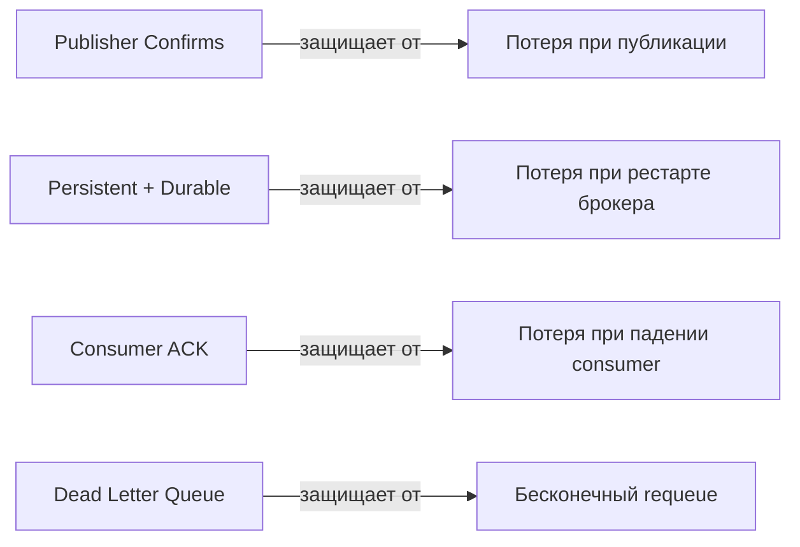
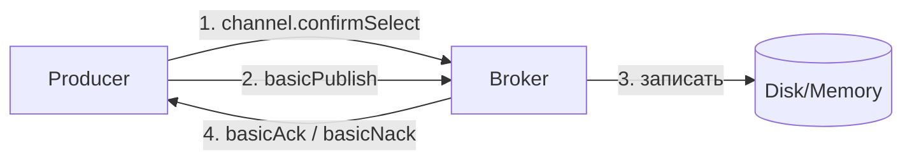
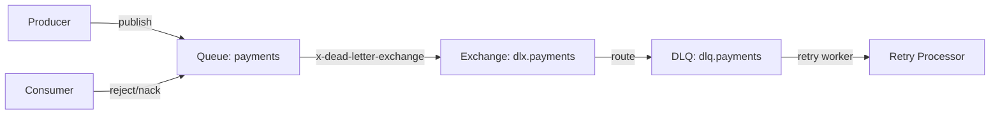
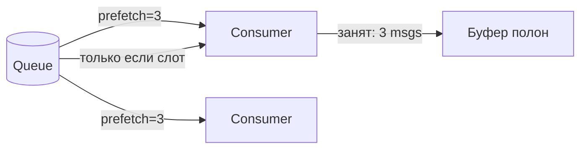
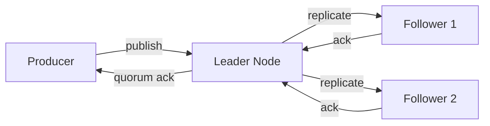

# Уровень 6: RabbitMQ — Надёжность (подробная теория)

## Введение: три слоя гарантий

Надёжность доставки в RabbitMQ — это не одна кнопка "сделать надёжно", а многоуровневая система. Каждый слой закрывает отдельный класс сбоев:



Аналогия: представь конвейер на заводе.
- **Publisher Confirms** — квитанция от приёмщика склада ("я получил")
- **Persistent storage** — запись в книгу учёта (не потеряется при пожаре)
- **Consumer ACK** — подпись рабочего ("я обработал")
- **DLQ** — корзина для брака (не блокирует основной поток)

---

## Publisher Confirms: детально

### Как это работает

Publisher Confirms — это расширение протокола AMQP 0-9-1, специфичное для RabbitMQ. Стандарт AMQP не определяет этот механизм — это vendor-specific фича.



При вызове `channel.confirmSelect()` канал переходит в "confirm mode". В этом режиме каждое опубликованное сообщение получает монотонно возрастающий **delivery tag** (начиная с 1). Брокер отправляет `basic.ack` или `basic.nack` для каждого тега.

### Individual Confirms

```java
channel.confirmSelect();

for (String message : messages) {
    channel.basicPublish(exchange, routingKey,
        MessageProperties.PERSISTENT_TEXT_PLAIN,
        message.getBytes());

    boolean confirmed = channel.waitForConfirms(5_000); // timeout 5s
    if (!confirmed) {
        // NACK или timeout — повторить публикацию
        log.warn("Message not confirmed, retrying: {}", message);
    }
}
```

**Плюсы**: простота, легко понять что именно не дошло.
**Минусы**: 1 RTT (round-trip time) на каждое сообщение. При latency 1ms — 1000 msg/s максимум.

### Batch Confirms

```java
channel.confirmSelect();
int batchSize = 100;
int count = 0;

for (String message : messages) {
    channel.basicPublish(exchange, routingKey, props, message.getBytes());
    count++;

    if (count % batchSize == 0) {
        channel.waitForConfirmsOrDie(5_000);
        // Если NACK — исключение, нужно повторить весь batch
        count = 0;
    }
}
// Не забыть про "хвост" меньше batchSize
if (count > 0) {
    channel.waitForConfirmsOrDie(5_000);
}
```

⚠️ **Проблема batch confirms**: при NACK неизвестно, какое именно сообщение не прошло. Нужно повторить весь batch целиком, что может привести к дубликатам.

### Async Confirms (рекомендуемый подход)

```java
channel.confirmSelect();

// Регистрируем listener один раз
channel.addConfirmListener(
    (deliveryTag, multiple) -> {
        // ACK: сообщение(-а) подтверждено
        if (multiple) {
            // Все теги <= deliveryTag подтверждены
            outstandingConfirms.headMap(deliveryTag, true).clear();
        } else {
            outstandingConfirms.remove(deliveryTag);
        }
    },
    (deliveryTag, multiple) -> {
        // NACK: нужно повторить
        String body = outstandingConfirms.get(deliveryTag);
        log.error("NACK for tag {}, message: {}", deliveryTag, body);
        // Добавить в очередь на повтор
    }
);

// Публикуем без ожидания
ConcurrentNavigableMap<Long, String> outstandingConfirms = new ConcurrentSkipListMap<>();

for (String message : messages) {
    long tag = channel.getNextPublishSeqNo();
    outstandingConfirms.put(tag, message);
    channel.basicPublish(exchange, routingKey, props, message.getBytes());
}
```

**Пропускная способность**: легко достигается 10 000+ msg/s против ~200 msg/s у individual.

---

## Mandatory Flag и Return Callbacks

Что происходит, если сообщение не может быть routed ни в одну очередь?

```java
// mandatory=true: если нет подходящей очереди → вернуть producer-у
channel.basicPublish(exchange, routingKey,
    true,  // mandatory
    props,
    body);

// Обработчик "возвращённых" сообщений
channel.addReturnListener((replyCode, replyText, exchange, routingKey, props, body) -> {
    log.warn("Message returned: {} {} routing_key={}", replyCode, replyText, routingKey);
    // Сохранить в fallback хранилище
});
```

**Когда использовать**: при динамических routing key, когда consumer может ещё не запустился.

⚠️ При `mandatory=false` (по умолчанию) — нероутируемое сообщение просто молча удаляется!

---

## Persistent Messages и Durable Queues

### Durable Queue

```java
channel.queueDeclare(
    "payments",  // name
    true,        // durable — переживёт рестарт брокера
    false,       // exclusive — только для этого соединения?
    false,       // auto-delete — удалить когда нет consumers?
    null         // arguments
);
```

Durable queue хранит своё определение в Mnesia (встроенная база данных Erlang). При рестарте RabbitMQ восстанавливает все durable queues.

❌ **НО**: сами сообщения в durable queue НЕ персистируются автоматически!

### Persistent Messages

```java
AMQP.BasicProperties persistent = new AMQP.BasicProperties.Builder()
    .deliveryMode(2)          // 1=transient, 2=persistent
    .contentType("application/json")
    .messageId(UUID.randomUUID().toString())
    .timestamp(new Date())
    .build();

channel.basicPublish("", "payments", persistent, body);
```

RabbitMQ записывает persistent-сообщения в файлы на диск (`$RABBITMQ_MNESIA_DIR/msg_stores/`).

### Матрица выживания

| Очередь | Сообщение | После рестарта |
|---|---|---|
| transient | transient | Потеряно всё |
| transient | persistent | Потеряно всё (нет очереди) |
| durable | transient | Очередь есть, сообщения потеряны |
| **durable** | **persistent** | **Всё сохранено** |

### Влияние на производительность

Persistence — это запись на диск. При высокой нагрузке это может стать узким местом:

- RabbitMQ буферизует записи (fsync не после каждого сообщения)
- Режим "lazy queues" хранит сообщения на диске сразу, экономя RAM
- SSD даёт в 5-10x лучшую производительность vs HDD для RabbitMQ

---

## Consumer ACK: три варианта ответа

### basicAck — сообщение обработано

```java
channel.basicAck(
    deliveryTag,  // тег конкретного сообщения
    false         // multiple: false = только это, true = все до этого тега
);
```

При `multiple=true` — подтверждаем все сообщения с delivery tag <= указанного.

### basicNack — не обработано (AMQP extension)

```java
channel.basicNack(
    deliveryTag,
    false,  // multiple
    true    // requeue: true = вернуть в начало очереди, false = отбросить/DLQ
);
```

⚠️ `requeue=true` с мгновенным nack = бесконечный цикл! Сообщение будет немедленно доставлено снова.

### basicReject — отклонить одно сообщение

```java
channel.basicReject(
    deliveryTag,
    false  // requeue
);
```

`basicReject` — аналог `basicNack(tag, false, requeue)`, но без поддержки `multiple`.

### Poison Messages — защита от бесконечного цикла

```java
channel.basicConsume(queue, false, (tag, delivery) -> {
    int retryCount = getRetryCount(delivery.getProperties().getHeaders());

    if (retryCount >= 3) {
        // Отправить в DLQ, не requeueing
        channel.basicReject(delivery.getEnvelope().getDeliveryTag(), false);
        return;
    }

    try {
        process(delivery);
        channel.basicAck(delivery.getEnvelope().getDeliveryTag(), false);
    } catch (Exception e) {
        channel.basicNack(delivery.getEnvelope().getDeliveryTag(), false, true);
    }
});
```

**Паттерн x-death**: RabbitMQ автоматически добавляет заголовок `x-death` при dead-lettering, содержащий историю смертей сообщения.

---

## Dead Letter Exchange (DLX)

Когда сообщение "умирает" (rejected, expired, overflow), оно может уйти в специальный exchange:

```java
// Объявить DLX и DLQ
channel.exchangeDeclare("dlx.payments", "direct", true);
channel.queueDeclare("dlq.payments", true, false, false, null);
channel.queueBind("dlq.payments", "dlx.payments", "payments");

// Настроить основную очередь на использование DLX
Map<String, Object> args = new HashMap<>();
args.put("x-dead-letter-exchange", "dlx.payments");
args.put("x-dead-letter-routing-key", "payments"); // опционально

channel.queueDeclare("payments", true, false, false, args);
```



Причины попадания в DLQ:
- `basicReject/basicNack` с `requeue=false`
- Сообщение истекло по TTL
- Очередь переполнена (x-max-length)

---

## Prefetch: тонкая настройка

### Как работает prefetch



```java
// Per-consumer prefetch (рекомендуется)
channel.basicQos(
    5,     // prefetchCount — макс. unacked messages
    false  // global: false = per consumer, true = per channel
);

// Per-channel prefetch (все consumers на канале делят лимит)
channel.basicQos(100, true);
```

### Подбор prefetchCount

| Сценарий | Рекомендуемый prefetch |
|---|---|
| Быстрая обработка (< 1ms) | 200-500 |
| Средняя обработка (1-10ms) | 10-50 |
| Медленная обработка (> 100ms) | 1-5 |
| Внешний API call | 1-3 |
| Батчевая обработка | batchSize * 2 |

💡 **Эмпирическое правило**: prefetch = (желаемое кол-во in-flight) / (кол-во consumers).

### Эффект накопления у медленного consumer

При prefetch=10 и двух consumers (быстрый 100ms, медленный 1000ms):

```
t=0:    Fast получает 10 msgs, Slow получает 10 msgs
t=1s:   Fast обработал 10, получает ещё 10
        Slow обработал 1, имеет 9 in-flight — не получает новых
t=2s:   Fast обработал 20 msgs, Slow — 2 msgs
```

Вывод: при prefetch > 1 медленный consumer "захватывает" сообщения, которые не может быстро обработать. Для строгого fair dispatch нужен prefetch=1.

---

## Message TTL и Queue TTL

### TTL на уровне сообщения

```java
AMQP.BasicProperties props = new AMQP.BasicProperties.Builder()
    .expiration("60000") // 60 секунд в миллисекундах (строка!)
    .build();

channel.basicPublish("", "tasks", props, body);
```

### TTL на уровне очереди

```java
Map<String, Object> args = new HashMap<>();
args.put("x-message-ttl", 300_000); // 5 минут
args.put("x-dead-letter-exchange", "dlx"); // куда при истечении

channel.queueDeclare("cache.tasks", true, false, false, args);
```

### Queue TTL (expire)

```java
args.put("x-expires", 1_800_000); // очередь удалится через 30 мин неактивности
```

Полезно для временных очередей в RPC-паттерне — не нужно явно удалять.

---

## HA Queues vs Quorum Queues

### Classic Mirrored Queues (deprecated в RabbitMQ 3.9+)

```java
// Через HTTP API или политику
// rabbitmqctl set_policy HA "^ha\." '{"ha-mode":"all"}'
```

Проблемы classic mirroring:
- Синхронизация может заблокировать очередь
- Split-brain в кластере
- Плохая производительность при большом числе зеркал

### Quorum Queues (рекомендуется)

```java
Map<String, Object> args = new HashMap<>();
args.put("x-queue-type", "quorum");

channel.queueDeclare("payments.quorum", true, false, false, args);
```

Quorum Queues основаны на алгоритме Raft:
- Сообщение считается сохранённым, когда большинство (quorum) нод подтвердило запись
- Автоматическое восстановление лидера при отказе
- Не поддерживает некоторые функции: x-max-priority, temporary queues



### Сравнение

| Характеристика | Classic Mirror | Quorum Queue |
|---|---|---|
| Алгоритм | Master/Mirror | Raft |
| Потеря при отказе | Возможна | Нет (при quorum) |
| Производительность | Высокая | Немного ниже |
| Статус | Deprecated | Рекомендуется |
| Поддержка priorities | Да | Нет |
| Lazy mode | Да | Всегда на диске |

---

## Транзакции AMQP: почему не использовать

```java
// AMQP transactions — устаревший подход
channel.txSelect();
try {
    channel.basicPublish(exchange, routingKey, props, body1);
    channel.basicPublish(exchange, routingKey, props, body2);
    channel.txCommit();
} catch (Exception e) {
    channel.txRollback();
}
```

### Почему транзакции медленные

При txCommit RabbitMQ:
1. Записывает все сообщения на диск
2. Ждёт fsync
3. Только потом возвращает ответ

Это синхронная операция. Бенчмарки показывают: Publisher Confirms дают **в 250 раз** большую пропускную способность.

### Когда транзакции могут быть полезны

Единственный сценарий — публикация нескольких сообщений как атомарная операция (все или никто). Но даже в этом случае лучше использовать Outbox Pattern + Publisher Confirms.

---

## Паттерн: надёжный producer

```java
public class ReliableProducer {
    private final Channel channel;
    private final ConcurrentNavigableMap<Long, Message> pending =
        new ConcurrentSkipListMap<>();

    public ReliableProducer(Channel channel) throws IOException {
        this.channel = channel;
        channel.confirmSelect();

        channel.addConfirmListener(
            this::handleAck,
            this::handleNack
        );
    }

    public void publish(Message msg) throws IOException {
        long tag = channel.getNextPublishSeqNo();
        pending.put(tag, msg);
        channel.basicPublish("orders", msg.getRoutingKey(),
            MessageProperties.PERSISTENT_TEXT_PLAIN,
            msg.toBytes());
    }

    private void handleAck(long tag, boolean multiple) {
        if (multiple) {
            pending.headMap(tag, true).clear();
        } else {
            pending.remove(tag);
        }
    }

    private void handleNack(long tag, boolean multiple) {
        // Переместить в очередь на повтор
        if (multiple) {
            pending.headMap(tag, true).forEach((t, msg) -> retry(msg));
            pending.headMap(tag, true).clear();
        } else {
            retry(pending.remove(tag));
        }
    }
}
```

---

## ⚠️ Распространённые ошибки начинающих

### 1. Durable без persistent

```java
// ❌ Думают, что durable=true достаточно
channel.queueDeclare("orders", true, false, false, null);
channel.basicPublish("", "orders", null, body); // deliveryMode=1 по умолчанию!

// ✅ Правильно: durable queue + persistent message
channel.basicPublish("", "orders",
    MessageProperties.PERSISTENT_TEXT_PLAIN, body);
```

**Почему проблема**: при рестарте брокера очередь восстановится, но все сообщения потеряются.

### 2. Auto-ACK с обработкой

```java
// ❌ Сообщение удалено до обработки
channel.basicConsume("orders", true, (tag, delivery) -> {
    orderService.process(delivery); // если упадёт — сообщение потеряно
});

// ✅ Manual ACK
channel.basicConsume("orders", false, (tag, delivery) -> {
    try {
        orderService.process(delivery);
        channel.basicAck(delivery.getEnvelope().getDeliveryTag(), false);
    } catch (Exception e) {
        channel.basicNack(delivery.getEnvelope().getDeliveryTag(), false, true);
    }
});
```

### 3. Бесконечный requeue

```java
// ❌ Бесконечный цикл при постоянной ошибке
catch (Exception e) {
    channel.basicNack(tag, false, true); // requeue=true всегда
}

// ✅ Ограничить количество попыток
int retries = getRetryCount(delivery);
boolean shouldRequeue = retries < MAX_RETRIES;
channel.basicNack(tag, false, shouldRequeue);
if (!shouldRequeue) {
    // Уже в DLQ
}
```

### 4. Переопределение уже существующей очереди с другими параметрами

```java
// ❌ Исключение PRECONDITION_FAILED если очередь уже существует как non-durable
channel.queueDeclare("orders", true, ...); // была non-durable

// ✅ Убедиться в согласованности параметров на всех producer/consumer
// или использовать passive declare для проверки:
channel.queueDeclarePassive("orders"); // только проверка, без создания
```

### 5. Prefetch=0 при медленных consumers

```java
// ❌ Все 10000 сообщений уйдут в буфер consumer-а
// channel.basicQos(0); // default — без ограничений

// ✅ Всегда устанавливать разумный prefetch
channel.basicQos(10); // не более 10 in-flight на consumer
```

---

## 💡 Best Practices

1. **Всегда используй Publisher Confirms** для business-critical сообщений
2. **Async confirms** для высокой пропускной способности
3. **Durable + Persistent** — всегда вместе для важных данных
4. **Manual ACK** — никогда не используй auto-ACK в production
5. **DLQ для каждой очереди** — `x-dead-letter-exchange` по умолчанию
6. **Quorum Queues** вместо classic mirrored для кластера
7. **prefetchCount** — подбирать под реальную нагрузку, начинай с 10-20
8. **Message TTL** для задач с дедлайном (например, SMS-код на 5 минут)
9. **Мониторь `messages_unacked`** — растущее значение = consumer не справляется
10. **Не используй AMQP-транзакции** — только Publisher Confirms
