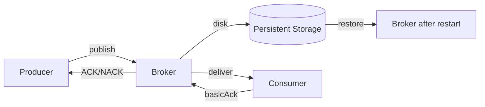
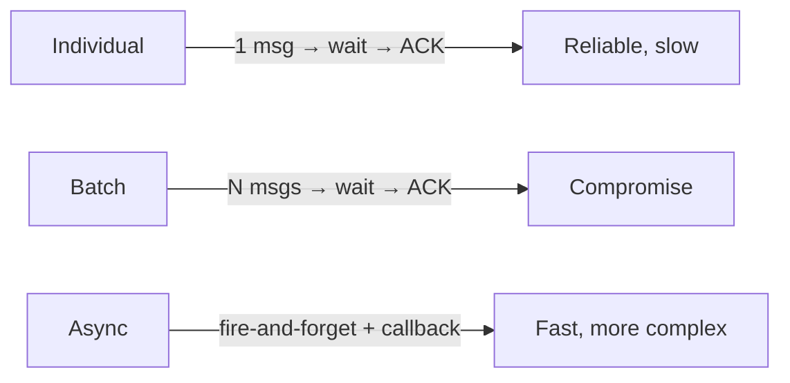
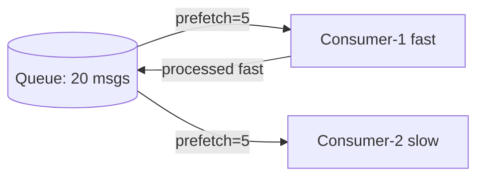

# Level 6: RabbitMQ — Reliability

## Why is reliability needed?

Imagine you send a message to RabbitMQ and think: "it got there". But the server crashed a millisecond before writing to disk. Order lost. Client is angry. This is the problem that reliability solves.

RabbitMQ offers three levels of protection:
1. **Publisher Confirms** — broker acknowledges receipt
2. **Persistent messages + Durable queues** — data survives restart
3. **Consumer ACK** — broker knows the message was processed



---

## Publisher Confirms

By default, RabbitMQ does not notify the producer about message receipt. Publisher Confirms enable "acknowledgment":

```java
channel.confirmSelect(); // enable confirms

channel.basicPublish(exchange, routingKey, props, body);

if (channel.waitForConfirms()) {
    // message accepted by broker
} else {
    // NACK — need to retry
}
```

### Three modes

| Mode | Description | Throughput |
|---|---|---|
| **Individual** | wait for ACK after each | Low |
| **Batch** | send N, wait for ACK all at once | Medium |
| **Async** | listen to callback, non-blocking | High |



---

## Durable Queues and Persistent Messages

To ensure messages survive a broker restart, **both** conditions are required:

```java
// 1. Declare durable queue
channel.queueDeclare("orders", true, false, false, null);
//                            ^^^^ durable = true

// 2. Publish with persistent delivery mode
AMQP.BasicProperties props = new AMQP.BasicProperties.Builder()
    .deliveryMode(2) // 1 = transient, 2 = persistent
    .build();
channel.basicPublish("", "orders", props, body);
```

📌 **Important**: durable queue + transient message = message will be lost on restart!

---

## Consumer ACK and Prefetch

### ACK Modes

```java
// Auto ACK — dangerous! Message deleted immediately upon delivery
channel.basicConsume(queue, true, callback);

// Manual ACK — safe
channel.basicConsume(queue, false, (tag, delivery) -> {
    try {
        process(delivery);
        channel.basicAck(delivery.getEnvelope().getDeliveryTag(), false);
    } catch (Exception e) {
        channel.basicNack(deliveryTag, false, true); // requeue=true
    }
});
```

### Prefetch — load balancing

```java
// No more than 5 messages simultaneously per consumer
channel.basicQos(5);
```



⚠️ With prefetch=0 (no limit), all messages go to one consumer and may overflow its memory.

---

## Transactions — why they are not used

RabbitMQ supports AMQP transactions, but they are **250 times slower** than Publisher Confirms:

```java
// ❌ Don't do this in production
channel.txSelect();
channel.basicPublish(...);
channel.txCommit(); // very slow
```

✅ Use Publisher Confirms — they provide the same guarantees with incomparably better performance.

---

## ⚠️ Common mistakes

| Mistake | Consequence | Solution |
|---|---|---|
| Confirms not enabled | Message loss under load | `confirmSelect()` |
| durable=true, but deliveryMode=1 | Messages lost on restart | `deliveryMode=2` |
| Auto ACK | Loss on consumer crash | Manual ACK |
| prefetch=0 | One consumer gets everything | `basicQos(N)` |
| Transactions in production | Performance degradation | Publisher Confirms |
