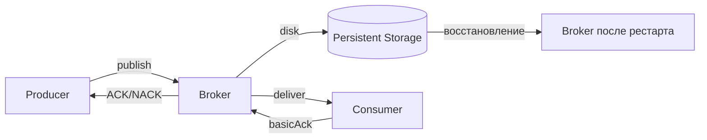
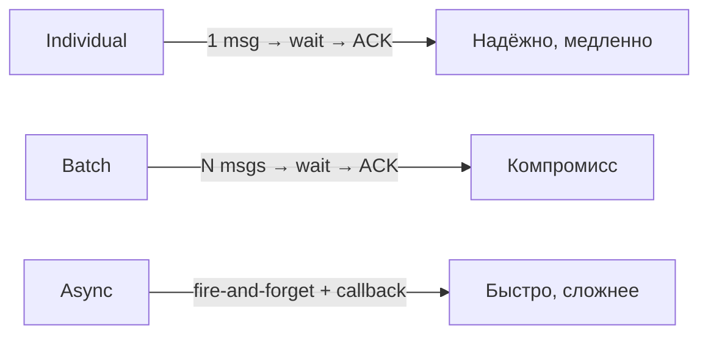
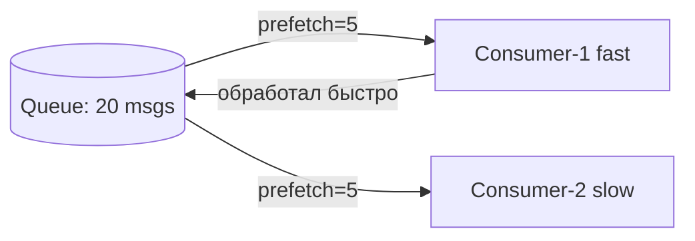

# Уровень 6: RabbitMQ — Надёжность

## Зачем нужна надёжность?

Представь, что ты отправляешь сообщение в RabbitMQ и думаешь: "оно дошло". Но сервер упал за миллисекунду до записи на диск. Заказ потерян. Клиент злится. Это и есть проблема, которую решает надёжность.

RabbitMQ предлагает три уровня защиты:
1. **Publisher Confirms** — брокер подтверждает получение
2. **Persistent messages + Durable queues** — данные выживают после перезапуска
3. **Consumer ACK** — брокер знает, что сообщение обработано



---

## Publisher Confirms

По умолчанию RabbitMQ не сообщает producer-у о получении сообщения. Publisher Confirms включают "квитирование":

```java
channel.confirmSelect(); // включить confirms

channel.basicPublish(exchange, routingKey, props, body);

if (channel.waitForConfirms()) {
    // сообщение принято брокером
} else {
    // NACK — нужно повторить
}
```

### Три режима

| Режим | Описание | Пропускная способность |
|---|---|---|
| **Individual** | ждём ACK после каждого | Низкая |
| **Batch** | отправляем N, ждём ACK разом | Средняя |
| **Async** | слушаем callback, не блокируем | Высокая |



---

## Durable Queues и Persistent Messages

Чтобы сообщения пережили перезапуск брокера, нужны **оба** условия:

```java
// 1. Объявить durable очередь
channel.queueDeclare("orders", true, false, false, null);
//                            ^^^^ durable = true

// 2. Публиковать с persistent delivery mode
AMQP.BasicProperties props = new AMQP.BasicProperties.Builder()
    .deliveryMode(2) // 1 = transient, 2 = persistent
    .build();
channel.basicPublish("", "orders", props, body);
```

📌 **Важно**: durable очередь + transient сообщение = сообщение потеряется при рестарте!

---

## Consumer ACK и Prefetch

### ACK Modes

```java
// Auto ACK — опасно! Сообщение удаляется сразу после доставки
channel.basicConsume(queue, true, callback);

// Manual ACK — безопасно
channel.basicConsume(queue, false, (tag, delivery) -> {
    try {
        process(delivery);
        channel.basicAck(delivery.getEnvelope().getDeliveryTag(), false);
    } catch (Exception e) {
        channel.basicNack(deliveryTag, false, true); // requeue=true
    }
});
```

### Prefetch — балансировка нагрузки

```java
// Не более 5 сообщений одновременно у одного consumer
channel.basicQos(5);
```



⚠️ При prefetch=0 (без ограничения) все сообщения уйдут одному consumer и могут переполнить его память.

---

## Транзакции — почему их не используют

RabbitMQ поддерживает AMQP-транзакции, но они **в 250 раз медленнее** Publisher Confirms:

```java
// ❌ Не делайте так в production
channel.txSelect();
channel.basicPublish(...);
channel.txCommit(); // очень медленно
```

✅ Используйте Publisher Confirms — они дают те же гарантии при несравнимо лучшей производительности.

---

## ⚠️ Типичные ошибки

| Ошибка | Последствие | Решение |
|---|---|---|
| Не включены confirms | Потеря сообщений при перегрузке | `confirmSelect()` |
| durable=true, но deliveryMode=1 | Сообщения пропадают при рестарте | `deliveryMode=2` |
| Auto ACK | Потеря при падении consumer | Manual ACK |
| prefetch=0 | Один consumer получает всё | `basicQos(N)` |
| Транзакции в production | Деградация производительности | Publisher Confirms |
