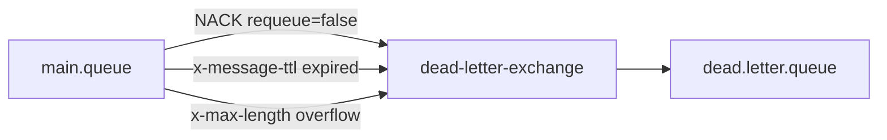
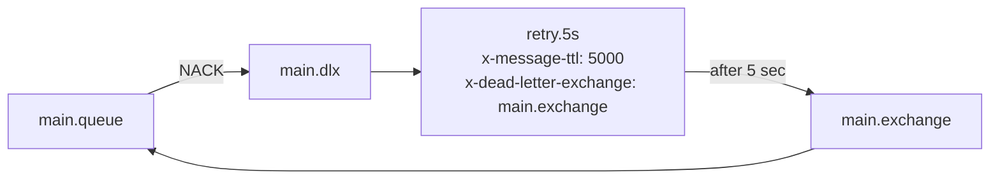
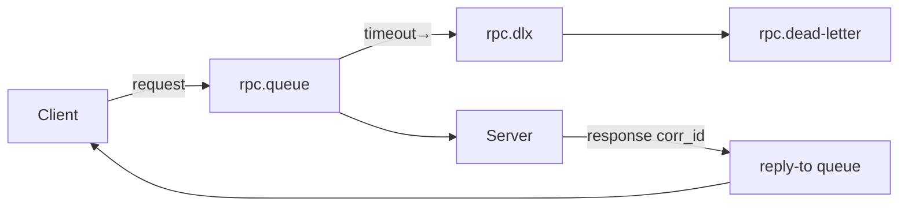
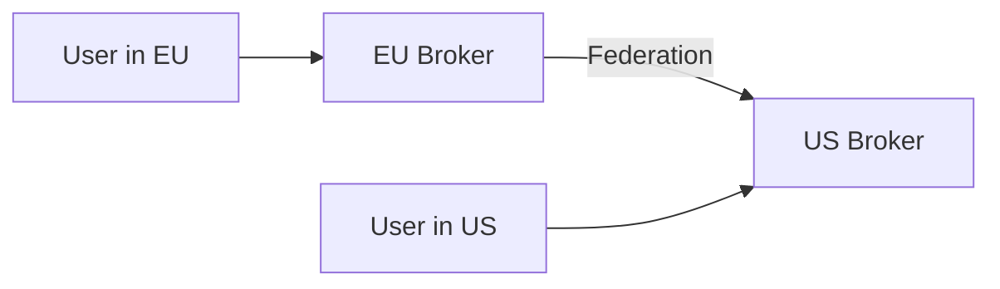
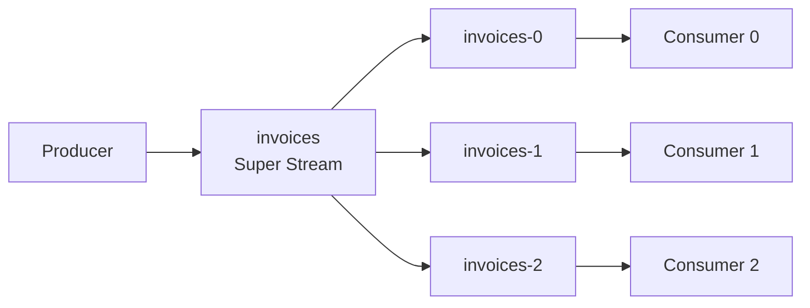

# Level 7: RabbitMQ — advanced patterns (detailed theory)

## 1. Dead Letter Exchange: the full picture

### The problem

Imagine an e-commerce store. The order processing service crashes on a specific order. Without DLX, the message will hang in the queue forever or be lost. With DLX, it goes to a special queue where it can be analyzed, retried, or used to alert the team.

### Three paths to the Dead Letter Queue



**1. NACK with requeue=false**

The consumer explicitly says: "I cannot process this message, don't return it."

```python
# Consumer received the message but cannot process it
def on_message(ch, method, properties, body):
    try:
        process(body)
        ch.basic_ack(method.delivery_tag)
    except ProcessingError as e:
        # requeue=False — send to DLX
        ch.basic_nack(method.delivery_tag, requeue=False)
```

❌ Beginner mistake:
```python
# NACK with requeue=True creates an infinite loop!
ch.basic_nack(method.delivery_tag, requeue=True)
```

✅ Correct: use `requeue=False` or `basic_reject`.

**2. TTL expired**

```python
channel.queue_declare('orders.queue', arguments={
    'x-dead-letter-exchange': 'orders.dlx',
    'x-message-ttl': 60000,  # 60 seconds
})
```

If nobody takes the message within 60 seconds — it moves to DLX.

**3. Queue overflow**

```python
channel.queue_declare('orders.queue', arguments={
    'x-dead-letter-exchange': 'orders.dlx',
    'x-max-length': 1000,
    'x-overflow': 'reject-publish',  # or 'drop-head'
})
```

With `drop-head`, the oldest message is thrown into DLX. With `reject-publish`, new messages are rejected.

### x-death Headers

When a message hits DLX, RabbitMQ adds an `x-death` header — an array of objects with history:

```json
{
  "x-death": [
    {
      "count": 1,
      "exchange": "orders.exchange",
      "queue": "orders.queue",
      "reason": "rejected",
      "routing-keys": ["order.new"],
      "time": "2024-01-15T10:30:00Z"
    }
  ],
  "x-first-death-exchange": "orders.exchange",
  "x-first-death-queue": "orders.queue",
  "x-first-death-reason": "rejected"
}
```

💡 The `count` counter increases each time the message goes through DLX. Use it for retry logic.

### Retry with exponential backoff via DLX

Classic pattern: rejected message goes to "parking queue" with TTL, then through DLX returns to the main queue.



```python
# Create queues with different delays
delays = [5000, 30000, 300000]  # 5s, 30s, 5min
for delay in delays:
    channel.queue_declare(f'retry.{delay}ms', arguments={
        'x-message-ttl': delay,
        'x-dead-letter-exchange': 'main.exchange',
        'x-dead-letter-routing-key': 'orders',
    })

# Consumer analyzes attempt count
def on_message(ch, method, properties, body):
    x_death = (properties.headers or {}).get('x-death', [])
    retry_count = x_death[0]['count'] if x_death else 0

    if retry_count >= 3:
        # Finally to DLQ
        ch.basic_nack(method.delivery_tag, requeue=False)
        return

    try:
        process(body)
        ch.basic_ack(method.delivery_tag)
    except Exception:
        delay = delays[min(retry_count, len(delays) - 1)]
        # Publish to retry queue with the needed delay
        ch.basic_publish(
            exchange='',
            routing_key=f'retry.{delay}ms',
            body=body,
            properties=properties
        )
        ch.basic_ack(method.delivery_tag)
```

---

## 2. RPC Pattern: implementation details

### Two approaches to reply-to queues

**Approach 1: Exclusive queue per client**

```python
result = channel.queue_declare('', exclusive=True)
reply_queue = result.method.queue  # amq.gen-xYz...

# One client — one queue
channel.basic_consume(reply_queue, on_response, auto_ack=True)

def call(request_body):
    corr_id = str(uuid.uuid4())
    channel.basic_publish(
        exchange='',
        routing_key='rpc.queue',
        properties=pika.BasicProperties(
            reply_to=reply_queue,
            correlation_id=corr_id,
        ),
        body=request_body
    )
    return corr_id
```

✅ Simple, automatically deleted on connection disconnect.
❌ One queue per client, doesn't scale to multiple threads.

**Approach 2: Direct Reply-To (recommended)**

RabbitMQ has a pseudo-queue `amq.rabbitmq.reply-to` — the response goes directly to the connection without creating a queue:

```python
channel.basic_consume(
    'amq.rabbitmq.reply-to',
    on_response,
    auto_ack=True  # required!
)

channel.basic_publish(
    exchange='',
    routing_key='rpc.queue',
    properties=pika.BasicProperties(
        reply_to='amq.rabbitmq.reply-to',
        correlation_id=str(uuid.uuid4()),
    ),
    body=request_body
)
```

✅ Zero overhead on queue creation/deletion.
✅ Response delivered to the same TCP connection.
❌ Only works within a single connection.

### Managing Correlation IDs

```python
class RpcClient:
    def __init__(self, channel):
        self.channel = channel
        self.pending: dict[str, asyncio.Future] = {}

        channel.basic_consume(
            'amq.rabbitmq.reply-to',
            self._on_response,
            auto_ack=True
        )

    def _on_response(self, ch, method, props, body):
        future = self.pending.pop(props.correlation_id, None)
        if future:
            future.set_result(body)

    async def call(self, routing_key: str, body: bytes, timeout: float = 5.0) -> bytes:
        corr_id = str(uuid.uuid4())
        future: asyncio.Future = asyncio.get_event_loop().create_future()
        self.pending[corr_id] = future

        self.channel.basic_publish(
            exchange='',
            routing_key=routing_key,
            properties=pika.BasicProperties(
                reply_to='amq.rabbitmq.reply-to',
                correlation_id=corr_id,
            ),
            body=body
        )

        try:
            return await asyncio.wait_for(future, timeout=timeout)
        except asyncio.TimeoutError:
            self.pending.pop(corr_id, None)
            raise RpcTimeoutError(f'No reply for {corr_id} within {timeout}s')
```

### RPC with timeouts

⚠️ Always set a timeout! The server may crash and the client will hang.



```python
# Set TTL on the request so it doesn't hang forever
channel.basic_publish(
    exchange='',
    routing_key='rpc.queue',
    properties=pika.BasicProperties(
        reply_to='amq.rabbitmq.reply-to',
        correlation_id=corr_id,
        expiration='5000',  # 5 second TTL on the request
    ),
    body=request
)
```

---

## 3. Priority Queue: details and limitations

### Configuration

```python
channel.queue_declare('tasks.priority', arguments={
    'x-max-priority': 10  # 0-10, recommended no more than 5-10
})

# Publishing with priority
for priority in [3, 9, 1, 7, 5]:
    channel.basic_publish(
        exchange='',
        routing_key='tasks.priority',
        body=f'task-p{priority}',
        properties=pika.BasicProperties(priority=priority)
    )

# Consumption order: 9, 7, 5, 3, 1
```

### Important limitations

📌 **Prioritization only works when there are multiple messages in the queue.** If messages arrive one at a time and the consumer picks them up immediately, priority has no effect.

📌 **Memory:** each priority level requires additional data structures in Erlang memory. Don't use `x-max-priority: 255` — that creates 256 sub-queues.

```
x-max-priority: 5  → 5 sub-queues, reasonable memory usage
x-max-priority: 10 → 10 sub-queues, acceptable
x-max-priority: 100 → 100 sub-queues, NOT RECOMMENDED
```

📌 **Prefetch and priority:** with `basic_qos(prefetch_count=N)` the consumer can grab N messages ahead. This reduces the effectiveness of prioritization. Use `prefetch_count=1` for strict order compliance.

### Pattern: separate queues instead of priorities

For high-load systems, it's sometimes better to create separate queues:

```python
# Instead of a single priority queue
queues = ['tasks.critical', 'tasks.high', 'tasks.normal', 'tasks.low']

# Consumer checks in priority order
while True:
    for queue in queues:
        msg = channel.basic_get(queue, auto_ack=False)
        if msg:
            process(msg)
            break
```

---

## 4. Delayed Messages: advanced configuration

### Installing the plugin

```bash
rabbitmq-plugins enable rabbitmq_delayed_message_exchange
```

### Delayed Exchange types

```python
# Direct: exact routing key
channel.exchange_declare('delayed.direct', 'x-delayed-message',
    arguments={'x-delayed-type': 'direct'})

# Topic: wildcard routing
channel.exchange_declare('delayed.topic', 'x-delayed-message',
    arguments={'x-delayed-type': 'topic'})

# Fanout: all subscribers with delay
channel.exchange_declare('delayed.fanout', 'x-delayed-message',
    arguments={'x-delayed-type': 'fanout'})
```

### Practical applications

**Retry with exponential backoff:**
```python
def retry_with_backoff(body, attempt: int):
    delays = [0, 5000, 30000, 300000, 3600000]  # 0s, 5s, 30s, 5m, 1h
    if attempt >= len(delays):
        send_to_dlq(body)
        return

    delay = delays[attempt]
    headers = dict(properties.headers or {})
    headers['retry-attempt'] = attempt + 1
    headers['x-delay'] = delay

    channel.basic_publish(
        exchange='delayed.direct',
        routing_key='tasks',
        body=body,
        properties=pika.BasicProperties(headers=headers)
    )
```

**Reminders and deadlines:**
```python
# Schedule a notification in 24 hours
channel.basic_publish(
    exchange='delayed.direct',
    routing_key='notifications',
    body=json.dumps({'userId': 123, 'type': 'reminder'}),
    properties=pika.BasicProperties(
        headers={'x-delay': 86400000}  # 24 hours in ms
    )
)
```

---

## 5. Lazy Queues

Regular queues store messages in RAM, spilling to disk under memory pressure. Lazy Queue writes to disk immediately.

```python
channel.queue_declare('lazy.queue', arguments={
    'x-queue-mode': 'lazy'
})
```

**When to use:**
- Queues with large accumulation (millions of messages)
- When it's important to reduce RAM consumption
- Consumer is slow or periodically unavailable

```
Regular queue:
  RAM: 1M messages × 1KB = ~1GB RAM
  Disk I/O: only on memory pressure

Lazy Queue:
  RAM: only index (~16 bytes/msg)
  Disk I/O: always, but predictable
```

⚠️ With RabbitMQ 3.12+ all queues behave like lazy by default (Classic Queue v2).

---

## 6. Shovel and Federation

### Shovel: transferring messages between brokers


Shovel is a plugin that reads from a source (queue or exchange) and publishes to a destination on the same or different broker.

```bash
rabbitmq-plugins enable rabbitmq_shovel rabbitmq_shovel_management

# Configuration via API
curl -XPUT http://localhost:15672/api/parameters/shovel/%2f/my-shovel \
  -d '{
    "value": {
      "src-uri": "amqp://",
      "src-queue": "source-queue",
      "dest-uri": "amqp://remote-host",
      "dest-queue": "destination-queue"
    }
  }'
```

**When to use Shovel:**
- Data migration between brokers
- Duplicating a queue to another data center
- Moving messages from DLQ after a fix

### Federation: connecting clusters



Federation allows an exchange or queue to "receive" messages from a remote broker. Unlike Shovel, Federation works at the policy level and doesn't require per-queue configuration.

```bash
rabbitmq-plugins enable rabbitmq_federation rabbitmq_federation_management
```

| Characteristic | Shovel | Federation |
|---------------|--------|------------|
| Configuration | Per-queue | Policies |
| Direction | Unidirectional | Bidirectional |
| Guarantees | At-least-once | At-least-once |
| Use case | Migration | Geo-distribution |

---

## 7. Stream Plugin and Super Streams

### RabbitMQ Streams

Since version 3.9, RabbitMQ supports a Stream storage type — a persistent append-only log (like Kafka).

```python
# Requires: rabbitmq-plugins enable rabbitmq_stream
from rabbitmq_stream_python.client import Client, AMQPError

async def main():
    client = await Client.create(host='localhost', port=5552)
    await client.create_stream('sensor-events', max_age='7D')

    producer = await client.create_producer('sensor-events')
    await producer.send(b'{"temp": 23.5}')

    consumer = await client.create_consumer(
        'sensor-events',
        stream='sensor-events',
        offset_specification=OffsetType.FIRST,
        callback=on_message
    )
```

**Stream vs Classic Queue:**

| Characteristic | Classic Queue | Stream |
|---------------|---------------|--------|
| Storage | Deleted after ACK | Persistent log |
| Re-reading | No | Yes (by offset) |
| Performance | ~50K msg/s | ~1M msg/s |
| Protocol | AMQP 0-9-1 | AMQP 1.0 / Stream |

### Super Streams (Partitioned Streams)

Super Stream is a set of standard Streams working as a single partitioned queue:



```bash
# Create Super Stream with 3 partitions
rabbitmq-streams add_super_stream invoices --partitions 3
```

💡 Super Streams solve the same problem as Kafka Partitions — horizontal scaling while preserving order by key.

---

## Errors and antipatterns

### ❌ DLX on DLX

```python
# DO NOT: dead letters will loop
channel.queue_declare('dead.queue', arguments={
    'x-dead-letter-exchange': 'another.dlx'
})
```

✅ Correct: DLQ must be the final endpoint without further DLX.

### ❌ RPC without correlation_id check

```python
# DO NOT: accept any response
def on_response(ch, method, props, body):
    self.result = body  # This could be a stale response!
```

✅ Correct:
```python
def on_response(ch, method, props, body):
    if props.correlation_id == self.expected_corr_id:
        self.result = body
```

### ❌ Priority Queue with high x-max-priority

```python
# DO NOT: 255 levels will create 255 sub-queues
channel.queue_declare('q', arguments={'x-max-priority': 255})
```

✅ Correct: use 5-10 levels max.

### ❌ Delayed Messages without the plugin

```python
# Imitation via TTL + DLX (works but unpredictably)
# TTL only triggers when the message is at the head of the queue!
# If a message without TTL is ahead, the delay will be incorrect
```

✅ Correct: always use `rabbitmq_delayed_message_exchange` for precise delays.

---

## Pattern selection: cheat sheet

```
Message failed to process?
  → Need retry?  → DLX + retry queues with TTL
  → Only log? → DLX + dead letter queue → alerting

Need a synchronous response from a service via broker?
  → RPC pattern with correlation_id
  → Direct Reply-To for minimal overhead

Some tasks are more important than others?
  → Priority Queue (x-max-priority ≤ 10)
  → Or separate queues for different levels

Task must execute in X minutes/hours?
  → Delayed Message Exchange plugin
  → Or TTL + DLX (less precise)

Very large queues (millions)?
  → Lazy Queue (or Classic Queue v2 in 3.12+)

Need Kafka-like semantics (re-reading, offset)?
  → RabbitMQ Streams
  → Or real Kafka
```
