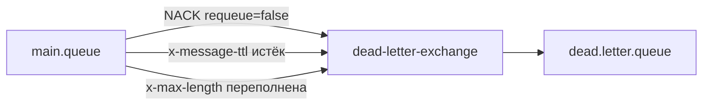
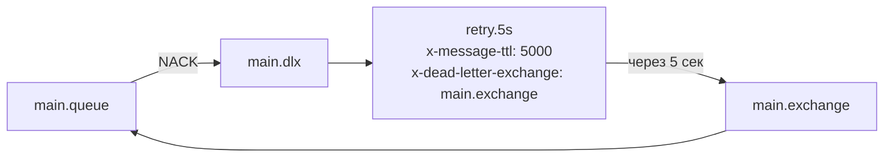
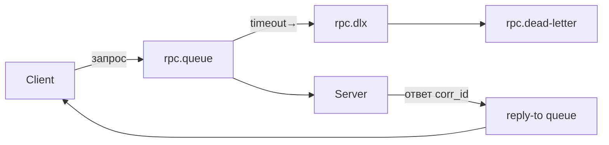
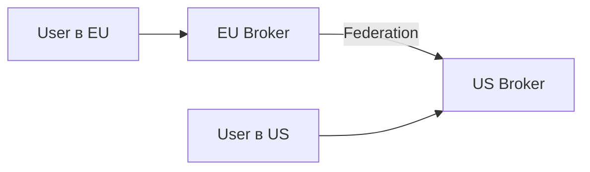
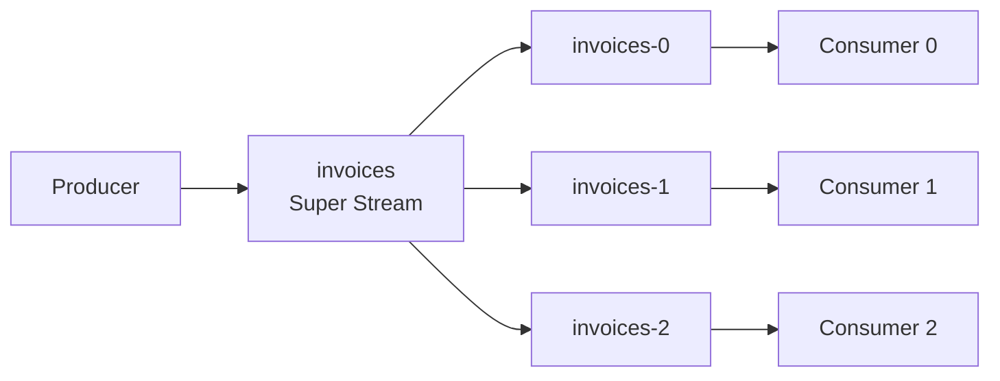

# Уровень 7: RabbitMQ — продвинутые паттерны (подробная теория)

## 1. Dead Letter Exchange: полная картина

### Проблема

Представьте интернет-магазин. Сервис обработки заказов падает с ошибкой на конкретном заказе. Без DLX сообщение зависнет в очереди навечно или будет потеряно. С DLX оно попадёт в специальную очередь, откуда его можно проанализировать, повторить или уведомить команду.

### Три пути в Dead Letter Queue



**1. NACK с requeue=false**

Потребитель явно говорит: "Я не могу обработать это сообщение, не возвращай его".

```python
# Consumer получил сообщение, но не может обработать
def on_message(ch, method, properties, body):
    try:
        process(body)
        ch.basic_ack(method.delivery_tag)
    except ProcessingError as e:
        # requeue=False — отправить в DLX
        ch.basic_nack(method.delivery_tag, requeue=False)
```

❌ Ошибка новичка:
```python
# NACK с requeue=True создаёт бесконечный цикл!
ch.basic_nack(method.delivery_tag, requeue=True)
```

✅ Правильно: используй `requeue=False` или `basic_reject`.

**2. TTL истёк**

```python
channel.queue_declare('orders.queue', arguments={
    'x-dead-letter-exchange': 'orders.dlx',
    'x-message-ttl': 60000,  # 60 секунд
})
```

Если за 60 секунд никто не взял сообщение — оно перейдёт в DLX.

**3. Переполнение очереди**

```python
channel.queue_declare('orders.queue', arguments={
    'x-dead-letter-exchange': 'orders.dlx',
    'x-max-length': 1000,
    'x-overflow': 'reject-publish',  # или 'drop-head'
})
```

При `drop-head` самое старое сообщение выбрасывается в DLX. При `reject-publish` — новые сообщения отклоняются.

### x-death Headers

Когда сообщение попадает в DLX, RabbitMQ добавляет заголовок `x-death` — массив объектов с историей:

```json
{
  "x-death": [
    {
      "count": 1,
      "exchange": "orders.exchange",
      "queue": "orders.queue",
      "reason": "rejected",
      "routing-keys": ["order.new"],
      "time": "2024-01-15T10:30:00Z"
    }
  ],
  "x-first-death-exchange": "orders.exchange",
  "x-first-death-queue": "orders.queue",
  "x-first-death-reason": "rejected"
}
```

💡 Счётчик `count` увеличивается при каждом прохождении через DLX. Используй его для retry-логики.

### Retry с экспоненциальной задержкой через DLX

Классический паттерн: отклонённое сообщение идёт в "parking queue" с TTL, оттуда через DLX возвращается в основную очередь.



```python
# Создаём очереди с разными задержками
delays = [5000, 30000, 300000]  # 5s, 30s, 5min
for delay in delays:
    channel.queue_declare(f'retry.{delay}ms', arguments={
        'x-message-ttl': delay,
        'x-dead-letter-exchange': 'main.exchange',
        'x-dead-letter-routing-key': 'orders',
    })

# Consumer анализирует счётчик попыток
def on_message(ch, method, properties, body):
    x_death = (properties.headers or {}).get('x-death', [])
    retry_count = x_death[0]['count'] if x_death else 0

    if retry_count >= 3:
        # Финально в DLQ
        ch.basic_nack(method.delivery_tag, requeue=False)
        return

    try:
        process(body)
        ch.basic_ack(method.delivery_tag)
    except Exception:
        delay = delays[min(retry_count, len(delays) - 1)]
        # Публикуем в retry-очередь с нужной задержкой
        ch.basic_publish(
            exchange='',
            routing_key=f'retry.{delay}ms',
            body=body,
            properties=properties
        )
        ch.basic_ack(method.delivery_tag)
```

---

## 2. RPC Pattern: детали реализации

### Два подхода к reply-to очередям

**Подход 1: Эксклюзивная очередь на клиента**

```python
result = channel.queue_declare('', exclusive=True)
reply_queue = result.method.queue  # amq.gen-xYz...

# Один клиент — одна очередь
channel.basic_consume(reply_queue, on_response, auto_ack=True)

def call(request_body):
    corr_id = str(uuid.uuid4())
    channel.basic_publish(
        exchange='',
        routing_key='rpc.queue',
        properties=pika.BasicProperties(
            reply_to=reply_queue,
            correlation_id=corr_id,
        ),
        body=request_body
    )
    return corr_id
```

✅ Просто, автоматически удаляется при разрыве соединения.
❌ Одна очередь на одного клиента, не масштабируется на несколько потоков.

**Подход 2: Direct Reply-To (рекомендуется)**

RabbitMQ имеет псевдо-очередь `amq.rabbitmq.reply-to` — ответ приходит напрямую в соединение, без создания очереди:

```python
channel.basic_consume(
    'amq.rabbitmq.reply-to',
    on_response,
    auto_ack=True  # обязательно!
)

channel.basic_publish(
    exchange='',
    routing_key='rpc.queue',
    properties=pika.BasicProperties(
        reply_to='amq.rabbitmq.reply-to',
        correlation_id=str(uuid.uuid4()),
    ),
    body=request_body
)
```

✅ Нулевые накладные расходы на создание/удаление очередей.
✅ Ответ доставляется в то же TCP-соединение.
❌ Работает только в пределах одного соединения.

### Управление Correlation IDs

```python
class RpcClient:
    def __init__(self, channel):
        self.channel = channel
        self.pending: dict[str, asyncio.Future] = {}

        channel.basic_consume(
            'amq.rabbitmq.reply-to',
            self._on_response,
            auto_ack=True
        )

    def _on_response(self, ch, method, props, body):
        future = self.pending.pop(props.correlation_id, None)
        if future:
            future.set_result(body)

    async def call(self, routing_key: str, body: bytes, timeout: float = 5.0) -> bytes:
        corr_id = str(uuid.uuid4())
        future: asyncio.Future = asyncio.get_event_loop().create_future()
        self.pending[corr_id] = future

        self.channel.basic_publish(
            exchange='',
            routing_key=routing_key,
            properties=pika.BasicProperties(
                reply_to='amq.rabbitmq.reply-to',
                correlation_id=corr_id,
            ),
            body=body
        )

        try:
            return await asyncio.wait_for(future, timeout=timeout)
        except asyncio.TimeoutError:
            self.pending.pop(corr_id, None)
            raise RpcTimeoutError(f'No reply for {corr_id} within {timeout}s')
```

### RPC с таймаутами

⚠️ Всегда устанавливай таймаут! Сервер может упасть, и клиент зависнет.



```python
# Устанавливаем TTL на запрос, чтобы он не висел вечно
channel.basic_publish(
    exchange='',
    routing_key='rpc.queue',
    properties=pika.BasicProperties(
        reply_to='amq.rabbitmq.reply-to',
        correlation_id=corr_id,
        expiration='5000',  # 5 секунд TTL на запрос
    ),
    body=request
)
```

---

## 3. Priority Queue: детали и ограничения

### Конфигурация

```python
channel.queue_declare('tasks.priority', arguments={
    'x-max-priority': 10  # 0-10, рекомендуется не более 5-10
})

# Публикация с приоритетом
for priority in [3, 9, 1, 7, 5]:
    channel.basic_publish(
        exchange='',
        routing_key='tasks.priority',
        body=f'task-p{priority}',
        properties=pika.BasicProperties(priority=priority)
    )

# Порядок потребления: 9, 7, 5, 3, 1
```

### Важные ограничения

📌 **Приоритизация работает только когда в очереди есть несколько сообщений.** Если сообщения поступают по одному и consumer успевает их сразу брать, приоритет не влияет.

📌 **Память:** каждый уровень приоритета требует дополнительных структур данных в памяти Erlang. Не используй `x-max-priority: 255` — это создаст 256 sub-queues.

```
x-max-priority: 5  → 5 sub-queues, разумное потребление памяти
x-max-priority: 10 → 10 sub-queues, приемлемо
x-max-priority: 100 → 100 sub-queues, NOT RECOMMENDED
```

📌 **Prefetch и приоритет:** при `basic_qos(prefetch_count=N)` consumer может забрать N сообщений наперёд. Это снижает эффективность приоритизации. Используй `prefetch_count=1` для точного соблюдения порядка.

### Паттерн: отдельные очереди вместо приоритетов

Для высоконагруженных систем иногда лучше заводить отдельные очереди:

```python
# Вместо одной priority queue
queues = ['tasks.critical', 'tasks.high', 'tasks.normal', 'tasks.low']

# Consumer проверяет в порядке приоритета
while True:
    for queue in queues:
        msg = channel.basic_get(queue, auto_ack=False)
        if msg:
            process(msg)
            break
```

---

## 4. Delayed Messages: расширенная конфигурация

### Установка плагина

```bash
rabbitmq-plugins enable rabbitmq_delayed_message_exchange
```

### Типы Delayed Exchange

```python
# Direct: точный routing key
channel.exchange_declare('delayed.direct', 'x-delayed-message',
    arguments={'x-delayed-type': 'direct'})

# Topic: wildcard routing
channel.exchange_declare('delayed.topic', 'x-delayed-message',
    arguments={'x-delayed-type': 'topic'})

# Fanout: всем подписчикам с задержкой
channel.exchange_declare('delayed.fanout', 'x-delayed-message',
    arguments={'x-delayed-type': 'fanout'})
```

### Практические применения

**Retry с нарастающей задержкой:**
```python
def retry_with_backoff(body, attempt: int):
    delays = [0, 5000, 30000, 300000, 3600000]  # 0s, 5s, 30s, 5m, 1h
    if attempt >= len(delays):
        send_to_dlq(body)
        return

    delay = delays[attempt]
    headers = dict(properties.headers or {})
    headers['retry-attempt'] = attempt + 1
    headers['x-delay'] = delay

    channel.basic_publish(
        exchange='delayed.direct',
        routing_key='tasks',
        body=body,
        properties=pika.BasicProperties(headers=headers)
    )
```

**Напоминания и дедлайны:**
```python
# Запланировать уведомление через 24 часа
channel.basic_publish(
    exchange='delayed.direct',
    routing_key='notifications',
    body=json.dumps({'userId': 123, 'type': 'reminder'}),
    properties=pika.BasicProperties(
        headers={'x-delay': 86400000}  # 24 часа в мс
    )
)
```

---

## 5. Lazy Queues

Обычные очереди хранят сообщения в RAM, вытесняя на диск при нехватке памяти. Lazy Queue сразу пишет на диск.

```python
channel.queue_declare('lazy.queue', arguments={
    'x-queue-mode': 'lazy'
})
```

**Когда использовать:**
- Очереди с большим накоплением (millions of messages)
- Когда важно снизить потребление RAM
- Consumer медленный или периодически недоступен

```
Обычная очередь:
  RAM: 1M сообщений × 1KB = ~1GB RAM
  Disk I/O: только при memory pressure

Lazy Queue:
  RAM: только индекс (~16 bytes/msg)
  Disk I/O: всегда, но предсказуемо
```

⚠️ С RabbitMQ 3.12+ все очереди ведут себя как lazy по умолчанию (Classic Queue v2).

---

## 6. Shovel и Federation

### Shovel: перенос сообщений между брокерами


Shovel — плагин, который читает из источника (queue или exchange) и публикует в цель на том же или другом брокере.

```bash
rabbitmq-plugins enable rabbitmq_shovel rabbitmq_shovel_management

# Конфигурация через API
curl -XPUT http://localhost:15672/api/parameters/shovel/%2f/my-shovel \
  -d '{
    "value": {
      "src-uri": "amqp://",
      "src-queue": "source-queue",
      "dest-uri": "amqp://remote-host",
      "dest-queue": "destination-queue"
    }
  }'
```

**Когда использовать Shovel:**
- Миграция данных между брокерами
- Дублирование очереди в другой дата-центр
- Перемещение сообщений из DLQ после починки

### Federation: связь кластеров



Federation позволяет exchange или queue "принимать" сообщения от удалённого брокера. В отличие от Shovel, Federation работает на уровне политик и не требует конфигурации для каждой очереди.

```bash
rabbitmq-plugins enable rabbitmq_federation rabbitmq_federation_management
```

| Характеристика | Shovel | Federation |
|---------------|--------|------------|
| Конфигурация | Per-queue | Политики |
| Направление | Однонаправленный | Двунаправленный |
| Гарантии | At-least-once | At-least-once |
| Применение | Миграция | Geo-distribution |

---

## 7. Stream Plugin и Super Streams

### RabbitMQ Streams

С версии 3.9 RabbitMQ поддерживает тип хранилища Stream — постоянный append-only лог (как Kafka).

```python
# Требует: rabbitmq-plugins enable rabbitmq_stream
from rabbitmq_stream_python.client import Client, AMQPError

async def main():
    client = await Client.create(host='localhost', port=5552)
    await client.create_stream('sensor-events', max_age='7D')

    producer = await client.create_producer('sensor-events')
    await producer.send(b'{"temp": 23.5}')

    consumer = await client.create_consumer(
        'sensor-events',
        stream='sensor-events',
        offset_specification=OffsetType.FIRST,
        callback=on_message
    )
```

**Stream vs Classic Queue:**

| Характеристика | Classic Queue | Stream |
|---------------|---------------|--------|
| Хранение | Удаление после ACK | Постоянный лог |
| Повторное чтение | Нет | Да (по offset) |
| Производительность | ~50K msg/s | ~1M msg/s |
| Протокол | AMQP 0-9-1 | AMQP 1.0 / Stream |

### Super Streams (Partitioned Streams)

Super Stream — это набор стандартных Stream'ов, работающих как единая партиционированная очередь:



```bash
# Создать Super Stream с 3 партициями
rabbitmq-streams add_super_stream invoices --partitions 3
```

💡 Super Streams решают ту же проблему, что Kafka Partitions — горизонтальное масштабирование при сохранении порядка по ключу.

---

## Ошибки и антипаттерны

### ❌ DLX на DLX

```python
# НЕЛЬЗЯ: мёртвые письма зациклятся
channel.queue_declare('dead.queue', arguments={
    'x-dead-letter-exchange': 'another.dlx'
})
```

✅ Правильно: DLQ должна быть конечной точкой без дальнейшего DLX.

### ❌ RPC без correlation_id проверки

```python
# НЕЛЬЗЯ: принять любой ответ
def on_response(ch, method, props, body):
    self.result = body  # Это может быть устаревший ответ!
```

✅ Правильно:
```python
def on_response(ch, method, props, body):
    if props.correlation_id == self.expected_corr_id:
        self.result = body
```

### ❌ Priority Queue с высоким x-max-priority

```python
# НЕЛЬЗЯ: 255 уровней создадут 255 sub-queues
channel.queue_declare('q', arguments={'x-max-priority': 255})
```

✅ Правильно: используй 5-10 уровней максимум.

### ❌ Delayed Messages без плагина

```python
# Имитация через TTL + DLX (работает, но непредсказуемо)
# TTL срабатывает только когда сообщение в head очереди!
# Если впереди стоит сообщение без TTL, задержка будет неверной
```

✅ Правильно: всегда используй `rabbitmq_delayed_message_exchange` для точных задержек.

---

## Выбор паттерна: шпаргалка

```
Сообщение не удалось обработать?
  → Нужен retry?  → DLX + retry queues с TTL
  → Только логировать? → DLX + dead letter queue → alerting

Нужен синхронный ответ от сервиса через брокер?
  → RPC pattern с correlation_id
  → Direct Reply-To для минимального overhead

Некоторые задачи важнее других?
  → Priority Queue (x-max-priority ≤ 10)
  → Или отдельные очереди для разных уровней

Задача должна выполниться через X минут/часов?
  → Delayed Message Exchange plugin
  → Или TTL + DLX (менее точно)

Очень большие очереди (millions)?
  → Lazy Queue (или Classic Queue v2 в 3.12+)

Нужна Kafka-like семантика (повторное чтение, offset)?
  → RabbitMQ Streams
  → Или настоящая Kafka
```
