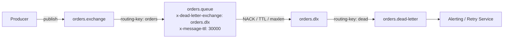
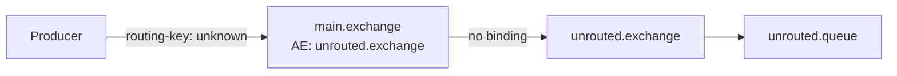
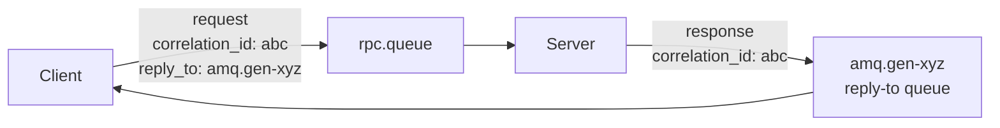
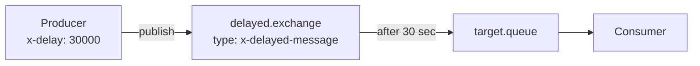

# Level 7: RabbitMQ — advanced patterns

## Dead Letter Exchange (DLX)

When a message cannot be processed, it doesn't disappear — it goes to a special exchange.

**Three reasons to end up in DLX:**
- Consumer sends `NACK` with `requeue=false`
- `x-message-ttl` expired on the queue or the message itself
- Queue is full (`x-max-length`)



**Queue configuration:**
```python
channel.queue_declare(
    'orders.queue',
    arguments={
        'x-dead-letter-exchange': 'orders.dlx',
        'x-dead-letter-routing-key': 'dead',
        'x-message-ttl': 30000,   # 30 seconds
    }
)
```

💡 DLX is a regular exchange. Dead letter queue is a regular queue bound to it.

---

## Alternate Exchange

Where does a message go if no binding matches?



```python
channel.exchange_declare(
    'main.exchange',
    arguments={'alternate-exchange': 'unrouted.exchange'}
)
```

---

## RPC Pattern

Synchronous request-response over an asynchronous broker.



**Key message fields:**
| Field | Purpose |
|------|-----------|
| `correlation_id` | Unique ID for request/response matching |
| `reply_to` | Name of the queue to send the response to |

📌 `amq.gen-*` — exclusive temporary queues, deleted on connection disconnect.

---

## Priority Queue

Messages with high priority are processed first.

```python
channel.queue_declare(
    'priority.queue',
    arguments={'x-max-priority': 10}
)
# Sending with priority
channel.basic_publish(
    exchange='',
    routing_key='priority.queue',
    body='critical-task',
    properties=pika.BasicProperties(priority=9)
)
```

⚠️ `x-max-priority` increases memory consumption. Recommended range: 1–5.

---

## Delayed Messages

Message is delivered to the consumer after a specified delay.



Requires the `rabbitmq-delayed-message-exchange` plugin:

```python
channel.exchange_declare(
    'delayed.exchange',
    exchange_type='x-delayed-message',
    arguments={'x-delayed-type': 'direct'}
)
# Delay header
channel.basic_publish(
    exchange='delayed.exchange',
    routing_key='tasks',
    body='run-report',
    properties=pika.BasicProperties(
        headers={'x-delay': 30000}  # milliseconds
    )
)
```

---

## When to use what

| Pattern | Task |
|---------|--------|
| DLX | Error handling, retries, alerts |
| RPC | Synchronous calls via broker |
| Priority Queue | SLA-critical messages, VIP users |
| Delayed Messages | Delayed retry, scheduled tasks, reminders |
