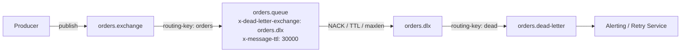
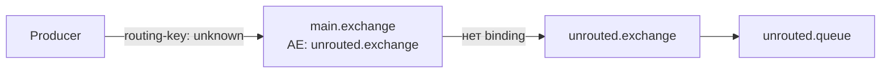
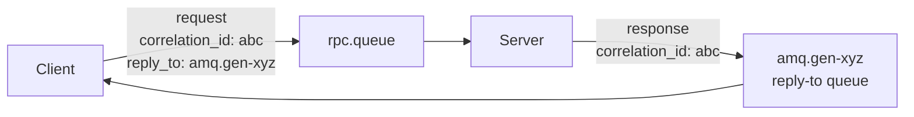
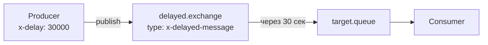

# Уровень 7: RabbitMQ — продвинутые паттерны

## Dead Letter Exchange (DLX)

Когда сообщение не может быть обработано, оно не исчезает — оно идёт в специальный обменник.

**Три причины попасть в DLX:**
- Consumer отправил `NACK` с `requeue=false`
- Истёк `x-message-ttl` очереди или самого сообщения
- Очередь переполнена (`x-max-length`)



**Конфигурация очереди:**
```python
channel.queue_declare(
    'orders.queue',
    arguments={
        'x-dead-letter-exchange': 'orders.dlx',
        'x-dead-letter-routing-key': 'dead',
        'x-message-ttl': 30000,   # 30 секунд
    }
)
```

💡 DLX — обычный exchange. Dead letter queue — обычная очередь, привязанная к нему.

---

## Alternate Exchange

Куда идёт сообщение, если ни одна binding не совпала?



```python
channel.exchange_declare(
    'main.exchange',
    arguments={'alternate-exchange': 'unrouted.exchange'}
)
```

---

## RPC Pattern

Синхронный запрос-ответ поверх асинхронного брокера.



**Ключевые поля сообщения:**
| Поле | Назначение |
|------|-----------|
| `correlation_id` | Уникальный ID для сопоставления запрос/ответ |
| `reply_to` | Имя очереди, куда слать ответ |

📌 `amq.gen-*` — эксклюзивные временные очереди, удаляются при разрыве соединения.

---

## Priority Queue

Сообщения с высоким приоритетом обрабатываются первыми.

```python
channel.queue_declare(
    'priority.queue',
    arguments={'x-max-priority': 10}
)
# Отправка с приоритетом
channel.basic_publish(
    exchange='',
    routing_key='priority.queue',
    body='critical-task',
    properties=pika.BasicProperties(priority=9)
)
```

⚠️ `x-max-priority` увеличивает потребление памяти. Рекомендуемый диапазон: 1–5.

---

## Delayed Messages

Сообщение доставляется потребителю через заданное время.



Требуется плагин `rabbitmq-delayed-message-exchange`:

```python
channel.exchange_declare(
    'delayed.exchange',
    exchange_type='x-delayed-message',
    arguments={'x-delayed-type': 'direct'}
)
# Заголовок задержки
channel.basic_publish(
    exchange='delayed.exchange',
    routing_key='tasks',
    body='run-report',
    properties=pika.BasicProperties(
        headers={'x-delay': 30000}  # миллисекунды
    )
)
```

---

## Когда что применять

| Паттерн | Задача |
|---------|--------|
| DLX | Обработка сбоев, повторные попытки, алерты |
| RPC | Синхронные вызовы через брокер |
| Priority Queue | SLA-критичные сообщения, VIP-пользователи |
| Delayed Messages | Retry с задержкой, отложенные задачи, напоминания |
