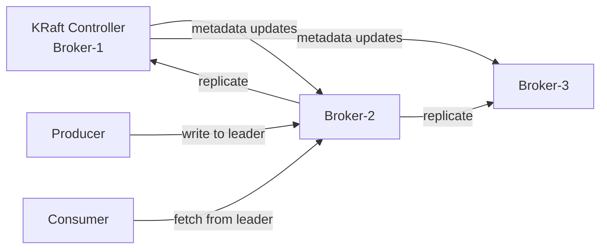
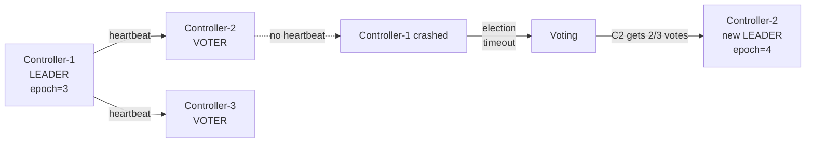

# Level 8: Apache Kafka — detailed theory

## History: LinkedIn and the birth of Kafka

In 2010-2011, LinkedIn faced an architectural problem. Data about user actions (clicks, views, searches) needed to be delivered to multiple systems simultaneously: analytics, recommendations, monitoring, search. Existing solutions — ActiveMQ, RabbitMQ — could not handle the load and did not allow "rewinding" the stream.

Engineer Jay Kreps together with Neha Narkhede and Jun Rao created Kafka, naming it after the writer Franz Kafka ("a system optimized for writing"). Their insight: a **filesystem log** is the most efficient data structure for streaming.

In 2011, Kafka was released as an Apache open-source project. Today Kafka processes more than **7 trillion messages per day** at LinkedIn alone. Over 80% of Fortune 100 companies use Kafka.

---

## Distributed Commit Log — the fundamental idea

Traditional queues (RabbitMQ, ActiveMQ) work on a "delete after reading" principle. Kafka works differently: an **append-only journal**.

Imagine an accounting ledger: records are only added, old ones are not deleted, any page can be re-read. This is a commit log.

```
Physical representation on disk:

/kafka-data/
  orders-0/                    ← partition 0 folder of topic "orders"
    00000000000000000000.log   ← segment file (data)
    00000000000000000000.index ← offset index (offset → position in file)
    00000000000000000000.timeindex ← time index
    00000000000000001500.log   ← next segment (after rotation)
    00000000000000001500.index
```

### Segment files

Kafka doesn't store the entire log in one file. A partition is split into **segment files** — fixed-size chunks (default `segment.bytes=1GB`). There is always only one active segment (writing goes to it). The rest are closed, read-only.

Why segments:
- **Time-based retention**: delete segments older than 7 days
- **Size-based retention**: delete old segments if the partition exceeds 1GB
- **Compaction**: instead of deleting — keep only the latest record for each key

### Index files

Each `.log` file has a corresponding `.index` — a sparse offset index. Kafka doesn't store a position for every message, only every N bytes (default every 4KB). When searching by offset:

1. Binary search through `.index` → nearest file position
2. Linear scan of `.log` to the needed offset

This gives O(log N) search instead of O(N) without an index.

---

## Log-Structured Storage and Performance

### Sequential I/O — the key to speed

Traditional databases do random I/O. Kafka uses only sequential I/O.

```
Random I/O vs Sequential I/O (typical numbers for HDD):
  Random write:      ~100 IOPS = ~0.4 MB/s
  Sequential write:  ~200 MB/s (500x faster!)

For SSD the difference is smaller but still significant:
  Random write:      ~50,000 IOPS = ~200 MB/s
  Sequential write:  ~500 MB/s
```

Kafka **never** updates existing data — only appends to the end. This makes write operations maximally cheap.

### Page Cache — working with OS memory

Kafka doesn't implement its own cache in JVM heap. Instead, it fully relies on the **operating system's page cache**. The OS automatically caches filesystem pages in RAM.

Advantages:
- No JVM GC pauses (cache lives outside heap)
- Page cache survives Kafka process restart
- OS efficiently manages page eviction (LRU)

In practice: if partition data fits in RAM — reading happens from memory (without disk access), even though the data is technically "on disk".

### Zero-Copy Transfer

When delivering data to a consumer, Kafka uses the `sendfile()` system call (Linux), which passes data from page cache directly to the network buffer, **bypassing user space**.

```
Without zero-copy (traditional path):
  Disk → kernel buffer → user space → kernel socket buffer → network
  (2 data copies + 4 context switches)

With zero-copy (sendfile):
  Disk → kernel buffer → network
  (0 copies in user space + 2 context switches)
```

In practice, zero-copy gives a 2-4x throughput boost.

### Batching and Compression

Producers don't send each message separately — they accumulate batches (batches):

```java
props.put("batch.size", 16384);          // 16KB — accumulate a batch
props.put("linger.ms", 5);               // wait 5ms to fill the batch
props.put("compression.type", "snappy"); // compress the batch as a whole
```

Compression works especially well because messages in one batch are usually similar (same data schema) — compression ratio of 5-10x for JSON data.

---

## Cluster Architecture

### Brokers

Each broker is a separate JVM process. A minimum production cluster: **3 brokers** (for tolerating one failure with replication.factor=3).



Each broker contains:
- A set of partitions (leader or replica)
- Network layer (Acceptor + Processor threads)
- Request handler threads (I/O pool)
- Log manager (segment management)

### Controller

At any given time, exactly one broker is the **Controller**. Its tasks:
- Track live brokers (heartbeat)
- Assign partition leaders
- Handle topic creation/deletion requests
- Manage ISR (In-Sync Replicas)

In **KRaft** mode, the controller stores all metadata in its own Raft log (not in ZooKeeper).

---

## Replication: details

### ISR (In-Sync Replicas)

ISR is the list of replicas synchronized with the leader. A replica leaves ISR if:
- It hasn't sent fetch requests to the leader for more than `replica.lag.time.max.ms` (default 30s)
- It has fallen behind by more than `replica.lag.max.messages` (deprecated, removed in newer versions)

```
ISR scenario:

Broker-1 (Leader): offset=[0,1,2,3,4,5]  ISR=[1,2,3]
Broker-2 (Replica): offset=[0,1,2,3,4]   ← 1 record behind, still in ISR
Broker-3 (Replica): offset=[0,1,2]        ← 3 records behind, left ISR

Producer sends with acks=all:
  → Kafka waits for ACK from all ISR (only Broker-1 and Broker-2)
  → Broker-3 doesn't participate in confirmation
```

### min.insync.replicas

A critically important parameter — minimum number of replicas in ISR to accept writes:

```bash
# Topic configuration:
min.insync.replicas=2

# With replication.factor=3:
# - Minimum 2 brokers in ISR → write allowed
# - 1 broker in ISR → NotEnoughReplicasException (with acks=all)
```

**Golden rule**: `min.insync.replicas = replication.factor / 2 + 1`

### Unclean Leader Election

What to do if all ISR replicas are unavailable, but there is a lagging replica?

```
unclean.leader.election.enable=false (default):
  → Partition is unavailable. Data is not lost. Waiting for ISR replica recovery.
  ✅ Consistency > Availability (CP in CAP terms)

unclean.leader.election.enable=true:
  → Lagging replica becomes leader. Data loss!
  ❌ Availability > Consistency (AP in CAP terms)
```

For financial systems, event sourcing — only `false`. For logging/metrics, where data loss is acceptable — `true`.

### Rack Awareness

To protect against rack/datacenter loss:

```bash
# In server.properties of each broker:
broker.rack=rack-a  # or us-east-1a for AWS AZ

# Kafka automatically distributes replicas across different racks:
# Partition 0: Leader=Broker-1(rack-a), Follower=Broker-3(rack-b)
# Partition 1: Leader=Broker-2(rack-b), Follower=Broker-4(rack-a)
```

---

## KRaft: Raft Consensus in Kafka

Before Kafka 2.8, all metadata was stored in ZooKeeper. In Kafka 4.0, ZooKeeper is completely removed.

### How KRaft works

KRaft uses a subset of brokers as **controllers** (usually 3 or 5). They store metadata in a special topic `__cluster_metadata`.

```
KRaft Controller Quorum (3 nodes):

  Controller-1 (Leader) ←→ Controller-2 ←→ Controller-3
        ↓ writes
  __cluster_metadata log

If Controller-1 goes down:
  Controller-2 and Controller-3 conduct an election via Raft
  → Controller-2 gets majority of votes (2/3)
  → Becomes the new Controller Leader
  Time: < 1 second (vs 30-60s with ZooKeeper)
```

### Advantages of KRaft

1. **No external dependency** — one type of process instead of two
2. **Fast recovery** — controller starts and reads metadata from local log
3. **Scalability** — supports millions of partitions (vs ~200K with ZooKeeper)
4. **Consistency** — metadata stored atomically via Raft

---

## Topic Configuration

### Retention Policy

```bash
# By time (default 7 days):
retention.ms=604800000    # 7 days

# By size (default -1 = unlimited):
retention.bytes=1073741824  # 1GB

# Check interval:
log.retention.check.interval.ms=300000  # every 5 minutes
```

### cleanup.policy

```bash
cleanup.policy=delete    # (default) delete old segments
cleanup.policy=compact   # keep only the latest value for each key
cleanup.policy=delete,compact  # first compact, then delete by time
```

**Compacted topics** are ideal for storing state: dictionaries, reference data, latest values. Example — Kafka changelog in Kafka Streams.

```
Before compaction:
  offset: 0  key=user-1  value={"name":"Alice"}
  offset: 1  key=user-2  value={"name":"Bob"}
  offset: 2  key=user-1  value={"name":"Alice Smith"}  ← update
  offset: 3  key=user-3  value={"name":"Carol"}

After compaction:
  offset: 2  key=user-1  value={"name":"Alice Smith"}  ← latest only
  offset: 1  key=user-2  value={"name":"Bob"}
  offset: 3  key=user-3  value={"name":"Carol"}
```

### Segment Configuration

```bash
segment.bytes=1073741824      # 1GB — size of one segment
segment.ms=604800000          # 7 days — forced rotation by time
segment.index.bytes=10485760  # 10MB — maximum index size

# Practice: small segment.ms speeds up old data deletion
# (only closed segments can be deleted)
```

---

## Partitioning: strategies

### Default Partitioner

```java
// If key != null:
partition = murmur2_hash(key) % num_partitions

// If key == null:
// Before Kafka 2.4: round-robin
// Since Kafka 2.4+: sticky partitioner (fill one partition's batch)
```

### Why the key matters

```
With key "user-1":
  → hash("user-1") % 3 = 2
  → All events from user-1 go to partition=2
  → Guaranteed ordering for user-1

Without key:
  → round-robin / sticky
  → Ordering between messages NOT guaranteed
```

### Custom Partitioner

```java
public class RegionPartitioner implements Partitioner {
    @Override
    public int partition(String topic, Object key, byte[] keyBytes,
                         Object value, byte[] valueBytes, Cluster cluster) {
        String region = extractRegion((String) key);
        return switch (region) {
            case "EU" -> 0;
            case "US" -> 1;
            default   -> 2;
        };
    }
}
```

---

## Performance: numbers

Kafka is one of the most performant message brokers:

| Metric | Value |
|---------|---------|
| Write (single broker) | 800 MB/s+ |
| Read (single broker) | 2 GB/s+ (zero-copy) |
| Latency (end-to-end) | 2–5 ms (low-latency config) |
| Messages/second | Millions per broker |
| Retention | Terabytes per cluster |

Achieved through:
1. Sequential I/O (no random seek)
2. Page cache (no extra copies in heap)
3. Zero-copy sendfile (no user↔kernel copying)
4. Batching + Compression (fewer I/O operations)
5. Partition parallelism (horizontal scaling)

---

## Controller Election: KRaft details



Each leader change increases the **epoch**. Brokers reject requests from a controller with an old epoch — this protects against "split-brain" scenarios.

---

## ⚠️ Common mistakes and antipatterns

### Too many partitions

```bash
# Antipattern:
kafka-topics.sh --create --topic orders --partitions 1000

# Problem: each partition = file descriptors on each broker
# With 1000 topics × 100 partitions × 3 replicas = 300,000 file descriptors
# Recommendation: start with 3-6 partitions, increase as load grows
```

✅ Rule: throughput / (consumer throughput per partition)

### Not configuring min.insync.replicas

```bash
# Antipattern: using only replication.factor without min.insync.replicas
# If 2 of 3 replicas fail — partition will accept writes with potential data loss

# Correct:
replication.factor=3
min.insync.replicas=2  # at least 2 brokers must confirm the write
```

### Storing large messages in Kafka

```
# Antipattern: message.max.bytes=50000000 (50MB images)
# Kafka is not designed for large binary files

# Correct — "Claim Check" pattern:
1. Upload the file to S3 / MinIO
2. Send only the URL to Kafka: {"imageUrl": "s3://bucket/img-123.jpg"}
3. Consumer downloads the file by URL from Kafka
```

### Ignoring consumer lag

```bash
# Critically important monitoring:
kafka-consumer-groups.sh --bootstrap-server localhost:9092 \
  --group my-consumer-group --describe

# Output:
# GROUP           TOPIC  PARTITION  CURRENT-OFFSET  LOG-END-OFFSET  LAG
# my-group        orders 0          1000            1050            50   ← 50 messages behind
```

✅ Set up an alert: consumer_lag > threshold → scale consumer group

### Incorrect retention time

```bash
# Antipattern: retention.ms=-1 (forever)
# Disk will fill up, Kafka will stop working

# Correct: tune retention to business requirements
# For real-time events: 24-72 hours
# For event sourcing: retention.ms=-1 + cleanup.policy=compact
# For logs: 7-30 days
```

---

## Comparison with RabbitMQ

| Criterion | Kafka | RabbitMQ |
|----------|-------|----------|
| **Storage** | Log (retention policy) | Queue (delete after ACK) |
| **Consumer** | Pull (requests itself) | Push (broker delivers) |
| **Ordering** | Guaranteed in partition | Only in queue (with 1 consumer) |
| **Re-reading** | Yes (seek offset) | No (dead-letter queue) |
| **Throughput** | Millions msg/s | Tens of thousands msg/s |
| **Latency** | 2-5ms | < 1ms (at low load) |
| **Routing** | None (by key / partition) | Powerful (exchange patterns) |
| **Use case** | Streaming, event sourcing, log aggregation | RPC, task queues, request/reply |

💡 Kafka and RabbitMQ solve different problems. Many production systems use **both** brokers: RabbitMQ for commands/tasks, Kafka for events/streaming.
