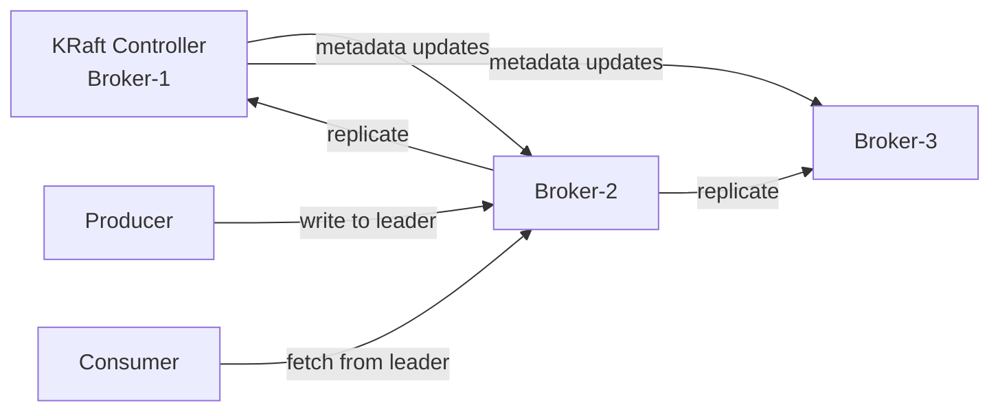
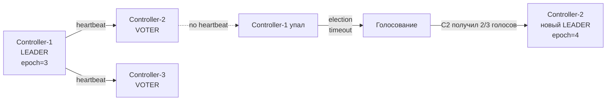

# Уровень 8: Apache Kafka — подробная теория

## История: LinkedIn и рождение Kafka

В 2010–2011 годах LinkedIn столкнулся с архитектурной проблемой. Данные о действиях пользователей (клики, просмотры, поиски) нужно было доставлять в несколько систем одновременно: аналитику, рекомендации, мониторинг, поиск. Существующие решения — ActiveMQ, RabbitMQ — не справлялись с нагрузкой и не давали возможности "перемотать" поток назад.

Инженер Jay Kreps вместе с Neha Narkhede и Jun Rao создали Kafka, назвав его в честь писателя Франца Кафки ("система оптимизированная для записи"). Их инсайт: **лог файловой системы** — самая эффективная структура данных для стриминга.

В 2011 году Kafka открыли как open-source проект Apache. Сегодня Kafka обрабатывает более **7 триллионов сообщений в сутки** только в LinkedIn. Более 80% компаний из Fortune 100 используют Kafka.

---

## Distributed Commit Log — фундаментальная идея

Традиционные очереди (RabbitMQ, ActiveMQ) работают по принципу "удалить после прочтения". Kafka работает иначе: **append-only журнал**.

Представьте бухгалтерскую книгу: записи только добавляются, старые не удаляются, любую страницу можно перечитать. Это и есть commit log.

```
Физическое представление на диске:

/kafka-data/
  orders-0/                    ← папка партиции 0 топика "orders"
    00000000000000000000.log   ← сегментный файл (данные)
    00000000000000000000.index ← индекс смещений (offset → позиция в файле)
    00000000000000000000.timeindex ← временной индекс
    00000000000000001500.log   ← следующий сегмент (после rotation)
    00000000000000001500.index
```

### Сегментные файлы

Kafka не хранит весь лог в одном файле. Партиция разбита на **segment files** — куски фиксированного размера (по умолчанию `segment.bytes=1GB`). Активный сегмент всегда только один (в него идёт запись). Остальные — закрытые, только для чтения.

Зачем сегменты:
- **Retention по времени**: удалить сегменты старше 7 дней
- **Retention по размеру**: удалить старые сегменты, если раздел > 1GB
- **Compaction**: вместо удаления — оставить только последнюю запись для каждого ключа

### Индексные файлы

К каждому `.log` файлу прилагается `.index` — разреженный индекс смещений. Kafka не хранит позицию для каждого сообщения, а только для каждых N байт (по умолчанию каждые 4KB). При поиске по offset:

1. Бинарный поиск по `.index` → ближайшая позиция файла
2. Линейное сканирование `.log` до нужного offset

Это даёт O(log N) поиск вместо O(N) без индекса.

---

## Log-Structured Storage и производительность

### Sequential I/O — ключ к скорости

Традиционные базы данных делают случайные операции ввода-вывода (random I/O). Kafka — только последовательные (sequential I/O).

```
Random I/O vs Sequential I/O (типичные числа для HDD):
  Random write:      ~100 IOPS = ~0.4 MB/s
  Sequential write:  ~200 MB/s (в 500 раз быстрее!)

Для SSD разница меньше, но всё равно существенна:
  Random write:      ~50,000 IOPS = ~200 MB/s
  Sequential write:  ~500 MB/s
```

Kafka **никогда** не обновляет существующие данные — только дописывает в конец. Это делает операции записи максимально дешёвыми.

### Page Cache — работа с памятью ОС

Kafka не реализует собственный кеш в heap JVM. Вместо этого он полностью полагается на **page cache операционной системы**. ОС автоматически кеширует страницы файловой системы в RAM.

Преимущества:
- Нет GC-пауз JVM (кеш живёт вне heap)
- Page cache переживает перезапуск Kafka-процесса
- ОС эффективно управляет вытеснением страниц (LRU)

Практически: если данные партиции помещаются в RAM — чтение идёт из памяти (без обращения к диску), даже если данные технически "на диске".

### Zero-Copy Transfer

При отдаче данных consumer Kafka использует системный вызов `sendfile()` (Linux), который передаёт данные из page cache напрямую в сетевой буфер, **минуя user space**.

```
Без zero-copy (традиционный путь):
  Диск → kernel buffer → user space → kernel socket buffer → сеть
  (2 копии данных + 4 переключения контекста)

С zero-copy (sendfile):
  Диск → kernel buffer → сеть
  (0 копий в user space + 2 переключения контекста)
```

На практике zero-copy даёт 2-4x прирост пропускной способности.

### Batching и Compression

Producers не отправляют каждое сообщение отдельно — они накапливают пачки (batches):

```java
props.put("batch.size", 16384);          // 16KB — накопить пачку
props.put("linger.ms", 5);               // подождать 5ms для заполнения пачки
props.put("compression.type", "snappy"); // сжать пачку целиком
```

Компрессия работает особенно хорошо, потому что сообщения в одном batch обычно похожи (одна схема данных) — коэффициент сжатия 5-10x для JSON-данных.

---

## Архитектура кластера

### Brokers

Каждый брокер — это отдельный JVM-процесс. Минимальный production-кластер: **3 брокера** (для tolerating одного отказа при replication.factor=3).



Каждый брокер содержит:
- Набор партиций (лидер или реплика)
- Сетевой уровень (Acceptor + Processor threads)
- Request handler threads (I/O pool)
- Log manager (управление сегментами)

### Controller

В любой момент времени ровно один брокер является **Controller**. Его задачи:
- Отслеживать живые брокеры (heartbeat)
- Назначать лидеров партиций
- Обрабатывать запросы на создание/удаление топиков
- Управлять ISR (In-Sync Replicas)

В режиме **KRaft** контроллер хранит все метаданные в собственном Raft-журнале (не в ZooKeeper).

---

## Репликация: детали

### ISR (In-Sync Replicas)

ISR — это список реплик, которые синхронизированы с лидером. Реплика покидает ISR если:
- Не отправляла fetch-запросы лидеру более `replica.lag.time.max.ms` (по умолчанию 30s)
- Отстала на более чем `replica.lag.max.messages` (устарело, удалено в новых версиях)

```
Сценарий с ISR:

Broker-1 (Leader): offset=[0,1,2,3,4,5]  ISR=[1,2,3]
Broker-2 (Replica): offset=[0,1,2,3,4]   ← отстал на 1 запись, всё ещё в ISR
Broker-3 (Replica): offset=[0,1,2]        ← отстал на 3 записи, вышел из ISR

Producer отправил с acks=all:
  → Kafka ждёт ACK от всех ISR (только Broker-1 и Broker-2)
  → Broker-3 не участвует в подтверждении
```

### min.insync.replicas

Критически важный параметр — минимальное количество реплик в ISR для приёма записей:

```bash
# Конфигурация топика:
min.insync.replicas=2

# При replication.factor=3:
# - Минимум 2 брокера в ISR → запись разрешена
# - 1 брокер в ISR → NotEnoughReplicasException (с acks=all)
```

**Золотое правило**: `min.insync.replicas = replication.factor / 2 + 1`

### Unclean Leader Election

Что делать, если все ISR-реплики недоступны, а есть только отставшая реплика?

```
unclean.leader.election.enable=false (по умолчанию):
  → Партиция недоступна. Данные не теряются. Ждём восстановления ISR-реплики.
  ✅ Консистентность > Доступность (CP в терминах CAP)

unclean.leader.election.enable=true:
  → Отставшая реплика становится лидером. Потеря данных!
  ❌ Доступность > Консистентность (AP в терминах CAP)
```

Для финансовых систем, event sourcing — только `false`. Для логирования/метрик, где потеря данных допустима — `true`.

### Rack Awareness

Для защиты от потери стойки/датацентра:

```bash
# В server.properties каждого брокера:
broker.rack=rack-a  # или us-east-1a для AWS AZ

# Kafka автоматически распределит реплики по разным rack:
# Partition 0: Leader=Broker-1(rack-a), Follower=Broker-3(rack-b)
# Partition 1: Leader=Broker-2(rack-b), Follower=Broker-4(rack-a)
```

---

## KRaft: Raft Consensus в Kafka

До Kafka 2.8 все метаданные хранились в ZooKeeper. В Kafka 4.0 ZooKeeper полностью удалён.

### Как работает KRaft

KRaft использует подмножество брокеров в роли **controllers** (обычно 3 или 5). Они хранят метаданные в специальном топике `__cluster_metadata`.

```
KRaft Controller Quorum (3 узла):

  Controller-1 (Leader) ←→ Controller-2 ←→ Controller-3
        ↓ записывает
  __cluster_metadata log

Если Controller-1 упал:
  Controller-2 и Controller-3 проводят выборы по Raft
  → Controller-2 получает большинство голосов (2/3)
  → Становится новым Controller Leader
  Время: < 1 секунды (vs 30-60s с ZooKeeper)
```

### Преимущества KRaft

1. **Нет внешней зависимости** — один тип процессов вместо двух
2. **Быстрое восстановление** — контроллер стартует и читает метаданные из локального лога
3. **Масштабируемость** — поддержка миллионов партиций (vs ~200K с ZooKeeper)
4. **Согласованность** — метаданные хранятся атомарно через Raft

---

## Конфигурация топиков

### Retention Policy

```bash
# По времени (по умолчанию 7 дней):
retention.ms=604800000    # 7 дней

# По размеру (по умолчанию -1 = без ограничения):
retention.bytes=1073741824  # 1GB

# Период проверки:
log.retention.check.interval.ms=300000  # каждые 5 минут
```

### cleanup.policy

```bash
cleanup.policy=delete    # (по умолчанию) удалять старые сегменты
cleanup.policy=compact   # оставлять только последнее значение для каждого ключа
cleanup.policy=delete,compact  # сначала compact, потом delete по времени
```

**Compacted topics** идеальны для хранения состояния (state): словари, справочники, последние значения. Пример — Kafka changelog в Kafka Streams.

```
До компактации:
  offset: 0  key=user-1  value={"name":"Alice"}
  offset: 1  key=user-2  value={"name":"Bob"}
  offset: 2  key=user-1  value={"name":"Alice Smith"}  ← обновление
  offset: 3  key=user-3  value={"name":"Carol"}

После компактации:
  offset: 2  key=user-1  value={"name":"Alice Smith"}  ← только последнее
  offset: 1  key=user-2  value={"name":"Bob"}
  offset: 3  key=user-3  value={"name":"Carol"}
```

### Конфигурация сегментов

```bash
segment.bytes=1073741824      # 1GB — размер одного сегмента
segment.ms=604800000          # 7 дней — принудительная ротация по времени
segment.index.bytes=10485760  # 10MB — максимальный размер индекса

# Практика: маленькие segment.ms ускоряют удаление старых данных
# (можно удалить только закрытый сегмент)
```

---

## Партиционирование: стратегии

### Default Partitioner

```java
// Если key != null:
partition = murmur2_hash(key) % num_partitions

// Если key == null:
// До Kafka 2.4: round-robin
// С Kafka 2.4+: sticky partitioner (заполнить batch одной партиции)
```

### Почему ключ важен

```
С ключом "user-1":
  → hash("user-1") % 3 = 2
  → Все события user-1 попадают в partition=2
  → Гарантированный порядок для user-1

Без ключа:
  → round-robin / sticky
  → Порядок между сообщениями НЕ гарантирован
```

### Custom Partitioner

```java
public class RegionPartitioner implements Partitioner {
    @Override
    public int partition(String topic, Object key, byte[] keyBytes,
                         Object value, byte[] valueBytes, Cluster cluster) {
        String region = extractRegion((String) key);
        return switch (region) {
            case "EU" -> 0;
            case "US" -> 1;
            default   -> 2;
        };
    }
}
```

---

## Производительность: числа

Kafka один из самых производительных брокеров сообщений:

| Метрика | Значение |
|---------|---------|
| Запись (один брокер) | 800 MB/s+ |
| Чтение (один брокер) | 2 GB/s+ (zero-copy) |
| Задержка (end-to-end) | 2–5 ms (low-latency config) |
| Сообщений/секунду | Миллионы на один брокер |
| Retention | Терабайты на кластер |

Достигается за счёт:
1. Sequential I/O (нет random seek)
2. Page cache (нет лишних копий в heap)
3. Zero-copy sendfile (нет копирования user↔kernel)
4. Batching + Compression (меньше I/O операций)
5. Partition parallelism (горизонтальное масштабирование)

---

## Controller Election: детали KRaft



Каждая смена лидера увеличивает **epoch** (эпоху). Брокеры отклоняют запросы от контроллера со старой эпохой — это защита от "split-brain" сценария.

---

## ⚠️ Типичные ошибки и антипаттерны

### Слишком много партиций

```bash
# Антипаттерн:
kafka-topics.sh --create --topic orders --partitions 1000

# Проблема: каждая партиция = файловые дескрипторы на каждом брокере
# При 1000 топиков × 100 партиций × 3 реплики = 300,000 файловых дескрипторов
# Рекомендация: начинать с 3-6 партиций, увеличивать по мере роста нагрузки
```

✅ Правило: throughput / (consumer throughput per partition)

### Не настроить min.insync.replicas

```bash
# Антипаттерн: использовать только replication.factor без min.insync.replicas
# При падении 2 из 3 реплик — партиция будет принимать записи с потенциальной потерей

# Правильно:
replication.factor=3
min.insync.replicas=2  # хотя бы 2 брокера должны подтвердить запись
```

### Хранить большие сообщения в Kafka

```
# Антипаттерн: message.max.bytes=50000000 (50MB изображения)
# Kafka не предназначена для больших бинарников

# Правильно — паттерн "Claim Check":
1. Загрузить файл в S3 / MinIO
2. В Kafka отправить только URL: {"imageUrl": "s3://bucket/img-123.jpg"}
3. Consumer скачивает файл по URL из Kafka
```

### Игнорировать consumer lag

```bash
# Критически важный мониторинг:
kafka-consumer-groups.sh --bootstrap-server localhost:9092 \
  --group my-consumer-group --describe

# Output:
# GROUP           TOPIC  PARTITION  CURRENT-OFFSET  LOG-END-OFFSET  LAG
# my-group        orders 0          1000            1050            50   ← 50 сообщений отставание
```

✅ Настроить алерт: consumer_lag > threshold → масштабировать consumer group

### Неправильное время retention

```bash
# Антипаттерн: retention.ms=-1 (бесконечно)
# Диск переполнится, Kafka перестанет работать

# Правильно: подобрать retention под бизнес-требования
# Для событий реального времени: 24-72 часа
# Для event sourcing: retention.ms=-1 + cleanup.policy=compact
# Для логов: 7-30 дней
```

---

## Сравнение с RabbitMQ

| Критерий | Kafka | RabbitMQ |
|----------|-------|----------|
| **Хранение** | Лог (retention policy) | Очередь (удаление после ACK) |
| **Consumer** | Pull (сам запрашивает) | Push (брокер доставляет) |
| **Порядок** | Гарантирован в партиции | Только в очереди (при 1 consumer) |
| **Перечитывание** | Да (seek offset) | Нет (dead-letter queue) |
| **Пропускная способность** | Миллионы msg/s | Десятки тысяч msg/s |
| **Задержка** | 2-5ms | < 1ms (при низкой нагрузке) |
| **Routing** | Нет (по ключу / партиции) | Мощный (exchange patterns) |
| **Применение** | Стриминг, event sourcing, log aggregation | RPC, task queues, request/reply |

💡 Kafka и RabbitMQ решают разные задачи. Многие production-системы используют **оба** брокера: RabbitMQ для команд/задач, Kafka для событий/стриминга.
