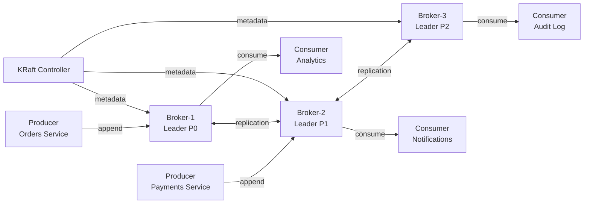
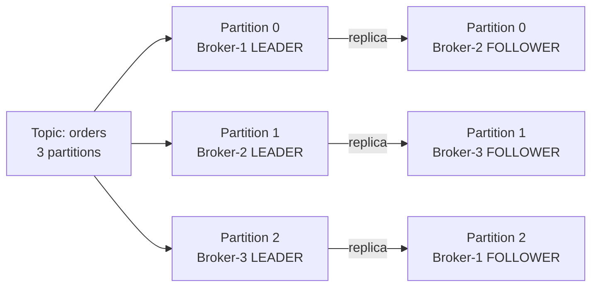
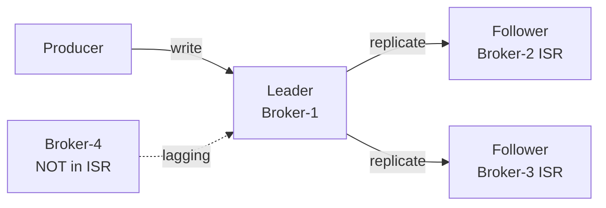

# Level 8: Apache Kafka — Architecture and Fundamentals

## What is Apache Kafka

Kafka is a **distributed commit log** (distributed commit log). Created at LinkedIn in 2011 to process over 1 trillion messages per day. Today it is the standard for high-performance data streaming.

Key idea: instead of a message queue (like RabbitMQ), Kafka stores an **immutable ordered log**, from which different consumers can read independently and at any time.



---

## Brokers and Cluster

**Broker** — a single instance of a Kafka server. A cluster consists of multiple brokers.

One of the brokers is the **Controller** — it manages metadata: tracks live brokers, assigns partition leaders, handles configuration changes.

| Component | Role |
|-----------|------|
| **Broker** | Stores partitions, accepts records from producers, serves records to consumers |
| **Controller** | Manages cluster metadata, conducts leader elections |
| **KRaft** | Built-in Raft consensus for metadata (replaced ZooKeeper in Kafka 4.0) |

---

## Topics and Partitions

**Topic** — a named stream of messages. Analogous to a pub/sub subscription topic.

**Partition** — a physical division of a topic. Each partition is a separate append-only log on disk.



Why partitions are needed:
- **Scalability** — different partitions on different brokers, parallel writes
- **Parallel reading** — each partition is read by a separate consumer in a group
- **Ordering** — guaranteed only within a single partition

---

## Offsets

**Offset** — a monotonically increasing number of a record within a partition. Starts from 0, never decreases.

```
Partition 0:
offset:  [0]       [1]         [2]          [3]      → (next)
data:  order-1   order-3     order-5      order-7
key:   user-1    user-3      user-1       user-5
```

💡 The consumer manages its own offset — it can re-read data starting from any offset. This is a fundamental difference from RabbitMQ, where a message is deleted after ACK.

---

## Replication and ISR

Each partition is replicated to `replication.factor` brokers.

- **Leader** — accepts all writes and reads (by default)
- **Follower** — synchronously copies data from the leader
- **ISR (In-Sync Replicas)** — the set of replicas that are not lagging behind the leader



When the leader fails — a new leader is chosen only from ISR (if `unclean.leader.election.enable=false`).

---

## ZooKeeper vs KRaft

| | ZooKeeper | KRaft |
|-|-----------|-------|
| **Type** | External service (Apache ZooKeeper) | Built into Kafka |
| **Protocol** | ZAB consensus | Raft consensus |
| **Status** | Deprecated, removed in Kafka 4.0 | Only mode since Kafka 4.0 |
| **Advantages** | Mature, battle-tested | No external dependencies, faster startup |

---

## ⚠️ Common beginner mistakes

**❌ Thinking topic = RabbitMQ queue**
```
# Wrong: "message read → it's deleted"
```
✅ Kafka stores messages by retention policy (default 7 days). Different consumer groups read independently.

**❌ Creating a topic with 1 partition**
```bash
# Bad:
kafka-topics.sh --create --topic orders --partitions 1
```
✅ One partition — no parallelism. For production, use at least 3 partitions.

**❌ Ignoring the message key**
```
# producer.send(new ProducerRecord<>("orders", null, value))
```
✅ Without a key — round-robin across partitions. With a key — all messages of the same key are guaranteed to land in the same partition (ordering).

**❌ Confusing partition offset with message ID**
```
# offset=5 in partition=0 ≠ offset=5 in partition=1
```
✅ Offset is unique only within the pair (partition, offset). Offsets across partitions are unrelated.
