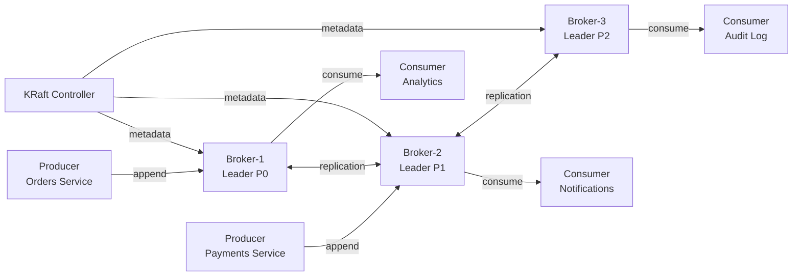
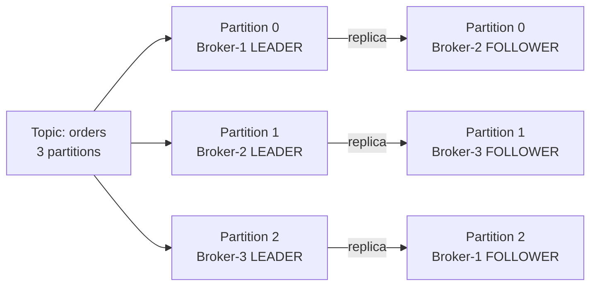
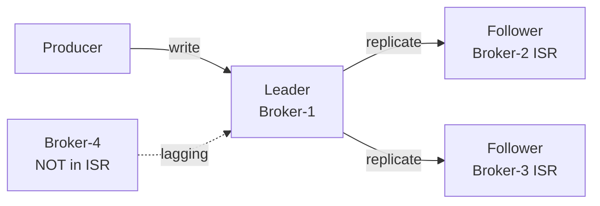

# Уровень 8: Apache Kafka — архитектура и основы

## Что такое Apache Kafka

Kafka — это **распределённый журнал фиксации событий** (distributed commit log). Создан в LinkedIn в 2011 году для обработки более 1 триллиона сообщений в день. Сегодня является стандартом для высокопроизводительного стриминга данных.

Ключевая идея: вместо очереди сообщений (как в RabbitMQ) Kafka хранит **неизменяемый упорядоченный лог**, из которого разные потребители могут читать независимо и в любое время.



---

## Брокеры и кластер

**Broker** — один экземпляр Kafka-сервера. Кластер состоит из нескольких брокеров.

Один из брокеров является **Controller** — он управляет метаданными: следит за живыми брокерами, назначает лидеров партиций, обрабатывает изменения конфигурации.

| Компонент | Роль |
|-----------|------|
| **Broker** | Хранит партиции, принимает записи от producers, отдаёт записи consumers |
| **Controller** | Управляет метаданными кластера, проводит выборы лидеров |
| **KRaft** | Встроенный Raft-консенсус для метаданных (заменил ZooKeeper в Kafka 4.0) |

---

## Topics и Partitions

**Topic** — именованный поток сообщений. Аналог темы подписки в pub/sub.

**Partition** — физическое разделение топика. Каждая партиция — это отдельный append-only лог на диске.



Зачем нужны партиции:
- **Масштабируемость** — разные партиции на разных брокерах, параллельная запись
- **Параллельное чтение** — каждую партицию читает отдельный consumer в группе
- **Порядок** — гарантируется только внутри одной партиции

---

## Offsets

**Offset** — монотонно возрастающий номер записи внутри партиции. Начинается с 0, никогда не уменьшается.

```
Partition 0:
offset:  [0]       [1]         [2]          [3]      → (следующий)
data:  order-1   order-3     order-5      order-7
key:   user-1    user-3      user-1       user-5
```

💡 Consumer сам управляет своим offset — он может перечитать данные, начиная с любого offset. Это принципиальное отличие от RabbitMQ, где сообщение удаляется после ACK.

---

## Репликация и ISR

Каждая партиция реплицируется на `replication.factor` брокеров.

- **Leader** — принимает все записи и чтения (по умолчанию)
- **Follower** — синхронно копирует данные от лидера
- **ISR (In-Sync Replicas)** — набор реплик, которые не отстают от лидера



Когда лидер падает — новый лидер выбирается только из ISR (если `unclean.leader.election.enable=false`).

---

## ZooKeeper vs KRaft

| | ZooKeeper | KRaft |
|-|-----------|-------|
| **Тип** | Внешний сервис (Apache ZooKeeper) | Встроенный в Kafka |
| **Протокол** | ZAB consensus | Raft consensus |
| **Статус** | Deprecated, удалён в Kafka 4.0 | Единственный режим с Kafka 4.0 |
| **Преимущества** | Зрелость, проверен годами | Нет внешних зависимостей, быстрее старт |

---

## ⚠️ Типичные ошибки новичков

**❌ Думать, что топик = очередь RabbitMQ**
```
# Неправильно: "сообщение прочитали → оно удалено"
```
✅ Kafka хранит сообщения по retention policy (по умолчанию 7 дней). Разные consumer groups читают независимо.

**❌ Создавать топик с 1 партицией**
```bash
# Плохо:
kafka-topics.sh --create --topic orders --partitions 1
```
✅ Одна партиция — нет параллелизма. Для production используй хотя бы 3 партиции.

**❌ Игнорировать ключ сообщения**
```
# producer.send(new ProducerRecord<>("orders", null, value))
```
✅ Без ключа — round-robin по партициям. С ключом — все сообщения одного ключа гарантированно попадают в одну партицию (порядок).

**❌ Путать offset партиции с ID сообщения**
```
# offset=5 в partition=0 ≠ offset=5 в partition=1
```
✅ Offset уникален только в паре (partition, offset). Между партициями offset не связаны.
