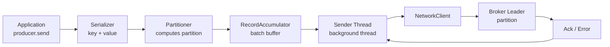
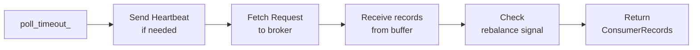
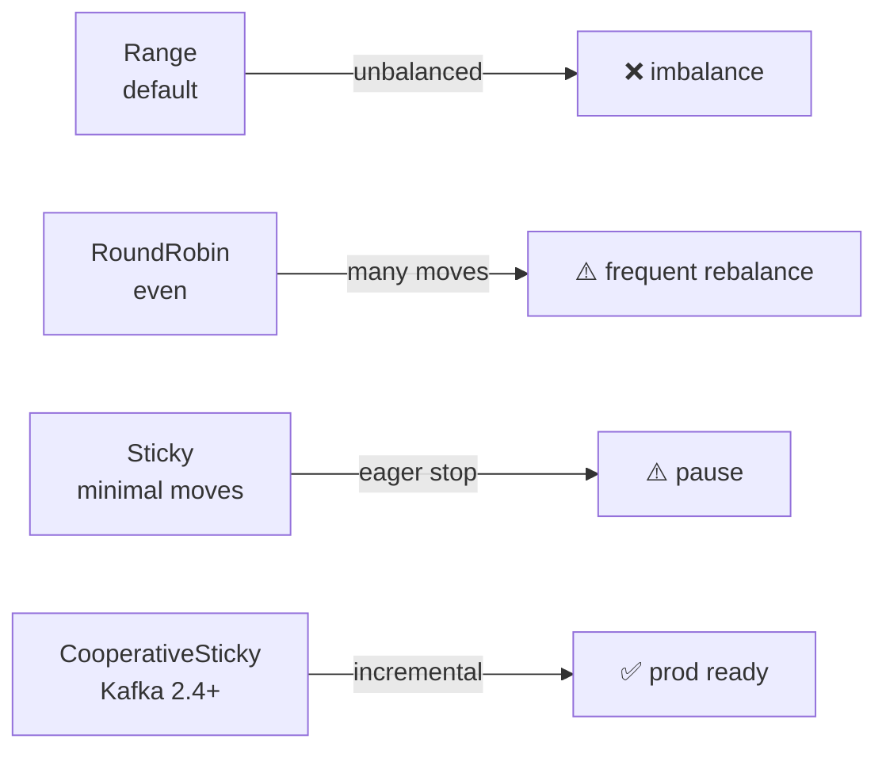
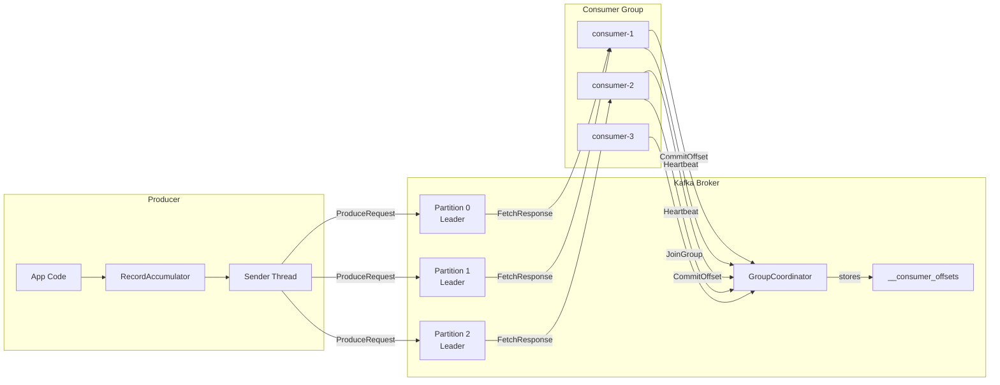

# Level 9: Kafka Producers and Consumers — Detailed Theory

## 1. Producer Internals: how a message gets into Kafka

### Message path inside the Producer



The `producer.send()` call **does not block** the main thread — the record goes into `RecordAccumulator` and a `Future<RecordMetadata>` is returned.

### RecordAccumulator and Batching

`RecordAccumulator` — a memory buffer, split by partitions. Each partition has its own queue of `ProducerBatch` objects.

```
RecordAccumulator (32MB by default):
  Partition 0 → [Batch(16KB)] [Batch(16KB partial)]
  Partition 1 → [Batch(16KB)]
  Partition 2 → [Batch(partial)]
```

Batching parameters:

| Parameter | Default | Description |
|----------|-------------|----------|
| `batch.size` | 16,384 bytes | Maximum batch size |
| `linger.ms` | 0 | Wait time to fill the batch |
| `buffer.memory` | 33,554,432 (32MB) | Total buffer size |
| `max.block.ms` | 60,000 | Blocking when buffer is full |

💡 `linger.ms=5` at high throughput significantly improves compression and reduces network load.

### Sender Thread

The background `Sender` thread polls `RecordAccumulator` and sends ready batches to the broker. It manages:
- Connections to brokers (via `NetworkClient`)
- Awaiting ack (`in-flight requests`)
- Retries on errors

The `max.in.flight.requests.per.connection=5` parameter controls parallelism. For idempotent producer, 1-5 is recommended, no more than 5.

## 2. Compression

Producer can compress batches before sending. The broker stores compressed data, the consumer decompresses on receipt.

```java
props.put("compression.type", "lz4"); // none, gzip, snappy, lz4, zstd
```

| Algorithm | Ratio | Speed | CPU |
|----------|-------------|---------|-----------|
| gzip     | High | Low | High |
| snappy   | Medium | High | Low |
| lz4      | Medium | Very high | Low |
| zstd     | High | High | Medium |

🔥 **lz4** — best choice for most production systems. **zstd** — if storage size is critical.

❌ Common mistake — enabling compression on the broker (`compression.type` in server.properties) instead of producer. This causes double compression/decompression on the broker.

## 3. Idempotent and Transactional Producer

### The problem: duplicates on retry

```
Producer → send → timeout → retry → Broker saved both!
           seq=0                    seq=0 (duplicate!)
```

With `acks=all` and retry, duplicates are possible if the ack was lost in the network.

### Idempotent Producer

```java
props.put("enable.idempotence", "true");
// Automatically sets: acks=all, retries=MAX_INT, max.in.flight=5
```

Each producer gets a unique `ProducerID (PID)`. Each message gets a `sequence number`. The broker stores the last sequence number for each (PID, partition) pair and discards duplicates.

**Limitation**: duplicate protection only within one producer session. Producer restart → new PID.

### Transactional Producer

Allows atomically writing to multiple partitions and/or topics:

```java
props.put("transactional.id", "order-service-producer-1");
producer.initTransactions();

try {
    producer.beginTransaction();
    producer.send(new ProducerRecord<>("orders", key, orderJson));
    producer.send(new ProducerRecord<>("inventory", key, updateJson));
    // Commit offset for input topic in the same transaction:
    producer.sendOffsetsToTransaction(offsets, consumerGroupMetadata);
    producer.commitTransaction();
} catch (Exception e) {
    producer.abortTransaction();
}
```

Transactional producer provides **exactly-once** semantics in a consumer → process → produce chain.

⚠️ `transactional.id` must be unique per producer instance (usually includes hostname or pod ID).

## 4. Consumer Poll Loop

Consumer works on a pull principle — it requests data from the broker itself.

```java
KafkaConsumer<String, String> consumer = new KafkaConsumer<>(props);
consumer.subscribe(List.of("orders"));

while (true) {
    // Simultaneously: sends heartbeat, receives new records
    ConsumerRecords<String, String> records = consumer.poll(Duration.ofMillis(100));

    for (ConsumerRecord<String, String> record : records) {
        process(record);
    }

    consumer.commitSync(); // or commitAsync()
}
```

### What happens inside poll()



`poll()` performs multiple tasks simultaneously: maintains heartbeat with the group coordinator, receives new data, and checks rebalancing commands.

### Heartbeat Thread

Starting with Kafka 0.10.1, heartbeat is sent in a **separate background thread** independent of `poll()`. This allowed separating two timeouts:

| Parameter | Description | Typical value |
|----------|----------|-------------------|
| `heartbeat.interval.ms` | Heartbeat interval | 3,000 ms |
| `session.timeout.ms` | Considered dead if no heartbeat | 10,000–45,000 ms |
| `max.poll.interval.ms` | Maximum time between poll() | 300,000 ms |

💡 `session.timeout.ms` — fast detection of network/process failure.
`max.poll.interval.ms` — slow batch processing (heavy computation, DB access).

🐛 Typical mistake: slow processing exceeds `max.poll.interval.ms` → consumer is excluded from the group → rebalancing → consumer rejoins → cycle. Solution: reduce `max.poll.records` or increase `max.poll.interval.ms`.

## 5. Partition Assignment Strategies

Partitions are assigned by the `Group Leader` (first consumer in the group) according to the selected strategy.

### Range Assignor (default before Kafka 2.4)

```
Topics: orders (3 partitions), payments (3 partitions)
Consumers: C1, C2

Range per topic separately:
orders:   C1→[P0,P1],   C2→[P2]
payments: C1→[P0,P1],   C2→[P2]

Result: C1 handles 4 partitions, C2 — 2 partitions (unbalanced!)
```

❌ With multiple topics of the same size, first consumers get more partitions.

### RoundRobin Assignor

```
All partitions of all topics are shuffled and distributed in a circle:
orders-P0 → C1, orders-P1 → C2, orders-P2 → C1
payments-P0 → C2, payments-P1 → C1, payments-P2 → C2

Result: C1→3, C2→3 (even)
```

✅ Even distribution, but during rebalancing many partitions "jump" between consumers.

### Sticky Assignor

On each rebalancing, tries to **preserve** the previous partition assignment, moving the minimum. Minimizes the number of moves when a consumer joins/leaves.

### CooperativeStickyAssignor (Kafka 2.4+)

Combines sticky behavior with cooperative (incremental) rebalancing. **Recommended for production**.

```java
props.put("partition.assignment.strategy",
    "org.apache.kafka.clients.consumer.CooperativeStickyAssignor");
```



## 6. Offset Storage: the __consumer_offsets topic

Committed offsets are stored in an internal compacted topic `__consumer_offsets`.

```
Key:   <group.id, topic, partition>
Value: <offset, metadata, timestamp>
```

The topic has 50 partitions by default (`offsets.topic.num.partitions`). The partition for storing a specific group's offset is determined by:

```
partition = Math.abs(group.id.hashCode()) % 50
```

Managed by **GroupCoordinator** — the broker responsible for that partition.

### Auto Commit

```java
props.put("enable.auto.commit", "true");
props.put("auto.commit.interval.ms", "5000");
```

⚠️ Auto commit runs at the beginning of the next `poll()`. Between the last processing and the next poll, up to `auto.commit.interval.ms` may pass. On a crash during this interval, messages will be re-read (at-least-once).

### Manual Commit

```java
props.put("enable.auto.commit", "false");

// Synchronous — blocks until ack is received from the broker
consumer.commitSync();

// Asynchronous — non-blocking, has a callback
consumer.commitAsync((offsets, exception) -> {
    if (exception != null) log.error("Commit failed", exception);
});

// Commit a specific offset
Map<TopicPartition, OffsetAndMetadata> offsets = new HashMap<>();
offsets.put(new TopicPartition("orders", 0), new OffsetAndMetadata(record.offset() + 1));
consumer.commitSync(offsets);
```

💡 **Pattern**: `commitAsync()` in the main loop + `commitSync()` in the shutdown handler for reliability.

## 7. Consumer Lag Monitoring

**Consumer Lag** = Log-End Offset − Committed Offset for each partition.

High lag means consumers are falling behind producers — likely resource shortage or slow processing.

### kafka-consumer-groups.sh

```bash
# View lag for a group
kafka-consumer-groups.sh \
  --bootstrap-server broker:9092 \
  --describe \
  --group orders-processor

# Output:
# TOPIC     PARTITION  CURRENT-OFFSET  LOG-END-OFFSET  LAG  CONSUMER-ID
# orders    0          1250            1250            0    consumer-1
# orders    1          1180            1250            70   consumer-2   ← lagging!
# orders    2          1250            1250            0    consumer-3
```

### JMX Metrics

```
kafka.consumer:type=consumer-fetch-manager-metrics,
  attribute=records-lag-max         ← max lag across all partitions
  attribute=records-lag             ← lag for a specific partition
  attribute=fetch-rate              ← fetch request rate
```

For lag monitoring from external systems (Prometheus), **Kafka Lag Exporter** or the built-in Confluent exporter is recommended.

## 8. Static Group Membership

By default, on every restart a consumer gets a new `member.id` and triggers rebalancing. With frequent restarts (rolling update), this creates many rebalancing events.

**Static Membership** allows a consumer to have a permanent identifier:

```java
props.put("group.instance.id", "orders-consumer-pod-1");
// Now on restart the consumer doesn't trigger rebalancing
// Broker waits for session.timeout.ms before reassigning partitions
```

✅ Ideal for Kubernetes with stable pod names (StatefulSet).
✅ Rolling updates without rebalancing.
⚠️ If the consumer doesn't return within `session.timeout.ms` — partitions will still be reassigned.

## 9. Common mistakes

### Mistake 1: Commit before processing (at-most-once)

```java
// ❌ Bad — message loss on crash after commit
for (ConsumerRecord<String, String> record : records) {
    consumer.commitSync();  // commit BEFORE processing
    processRecord(record);  // if it crashes here — message is lost
}
```

```java
// ✅ Good — at-least-once
for (ConsumerRecord<String, String> record : records) {
    processRecord(record);
    consumer.commitSync();  // commit AFTER processing
}
```

### Mistake 2: Ignoring max.poll.interval.ms

```java
// ❌ Bad — slow processing kicks consumer out of the group
ConsumerRecords<String, String> records = consumer.poll(Duration.ofMillis(100));
for (ConsumerRecord<String, String> record : records) {
    Thread.sleep(10_000); // heavy operation > max.poll.interval.ms
    processRecord(record);
}
```

```java
// ✅ Good — async processing or reduced max.poll.records
props.put("max.poll.records", "10");       // process fewer at a time
props.put("max.poll.interval.ms", "600000"); // or increase the timeout
```

### Mistake 3: Consumer without group.id (standalone)

```java
// ❌ Bad — manual partition assignment without offset management
consumer.assign(List.of(new TopicPartition("orders", 0)));
// No automatic rebalancing, no group offset management
```

Use `subscribe()` instead of `assign()`, unless you need full manual partition control.

### Mistake 4: Too large a buffer (fetch.max.bytes)

```
fetch.max.bytes=50MB + 100 consumers = 5GB RAM on buffers alone!
```

Tune `fetch.min.bytes`, `fetch.max.wait.ms`, `max.partition.fetch.bytes` to the actual message size.

## 10. Producer and Consumer — full interaction diagram



## 11. Production parameter tuning

### Producer (high throughput)

```properties
acks=all
enable.idempotence=true
compression.type=lz4
linger.ms=20
batch.size=65536
buffer.memory=67108864
retries=2147483647
max.in.flight.requests.per.connection=5
```

### Consumer (reliable processing)

```properties
enable.auto.commit=false
max.poll.records=500
max.poll.interval.ms=300000
session.timeout.ms=30000
heartbeat.interval.ms=10000
fetch.min.bytes=1
fetch.max.wait.ms=500
partition.assignment.strategy=org.apache.kafka.clients.consumer.CooperativeStickyAssignor
```

### Consumer (low latency)

```properties
fetch.min.bytes=1
fetch.max.wait.ms=0
max.poll.records=10
enable.auto.commit=false
```

## 12. Delivery Guarantees Cheat Sheet

| Scenario | At-most-once | At-least-once | Exactly-once |
|----------|-------------|--------------|--------------|
| Producer acks | acks=0 | acks=1/all + retry | enable.idempotence=true |
| Consumer commit | before processing | after processing | transactional |
| Producer crash | loss | duplicates | no duplicates |
| Consumer crash | loss uncommitted | re-read uncommitted | no duplicates |

🎯 For most business tasks, **at-least-once + idempotent processing** on the consumer side is sufficient. Exactly-once in transactions requires more resources and reduces throughput.
