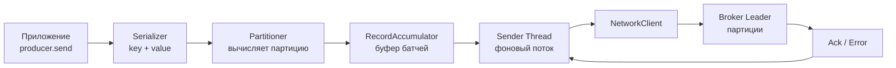
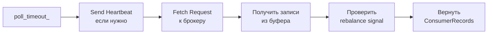
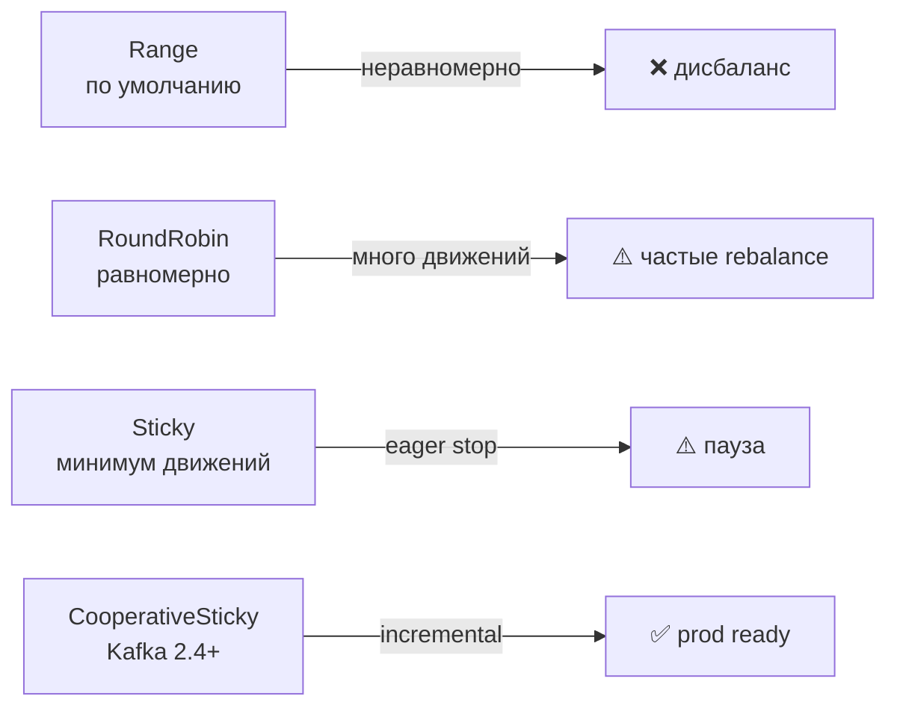
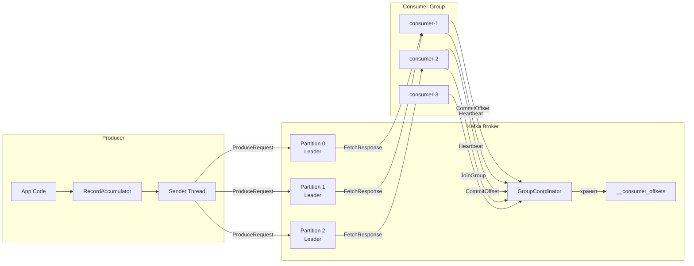

# Уровень 9: Kafka Producers и Consumers — Подробная теория

## 1. Producer Internals: как сообщение попадает в Kafka

### Путь сообщения внутри Producer



Вызов `producer.send()` **не блокирует** основной поток — запись попадает в `RecordAccumulator` и возвращается `Future<RecordMetadata>`.

### RecordAccumulator и батчинг

`RecordAccumulator` — буфер в памяти, разбитый по партициям. Каждая партиция имеет свою очередь из `ProducerBatch` объектов.

```
RecordAccumulator (32MB по умолчанию):
  Partition 0 → [Batch(16KB)] [Batch(16KB partial)]
  Partition 1 → [Batch(16KB)] 
  Partition 2 → [Batch(partial)]
```

Параметры батчинга:

| Параметр | По умолчанию | Описание |
|----------|-------------|----------|
| `batch.size` | 16 384 байт | Максимальный размер батча |
| `linger.ms` | 0 | Время ожидания для заполнения батча |
| `buffer.memory` | 33 554 432 (32MB) | Общий размер буфера |
| `max.block.ms` | 60 000 | Блокировка при заполненном буфере |

💡 `linger.ms=5` при высоком throughput значительно повышает компрессию и снижает нагрузку на сеть.

### Sender Thread

Фоновый поток `Sender` опрашивает `RecordAccumulator` и отправляет готовые батчи брокеру. Он управляет:
- Соединениями к брокерам (через `NetworkClient`)
- Ожиданием ack (`in-flight requests`)
- Ретраями при ошибках

Параметр `max.in.flight.requests.per.connection=5` контролирует параллелизм. При идемпотентном producer рекомендуется значение 1–5, не более 5.

## 2. Компрессия

Producer может сжимать батчи перед отправкой. Брокер хранит сжатые данные, consumer декомпрессирует при получении.

```java
props.put("compression.type", "lz4"); // none, gzip, snappy, lz4, zstd
```

| Алгоритм | Коэффициент | Скорость | Процессор |
|----------|-------------|---------|-----------|
| gzip     | Высокий | Низкая | Высокий |
| snappy   | Средний | Высокая | Низкий |
| lz4      | Средний | Очень высокая | Низкий |
| zstd     | Высокий | Высокая | Средний |

🔥 **lz4** — лучший выбор для большинства продакшн-систем. **zstd** — если критичен размер хранилища.

❌ Распространённая ошибка — включать компрессию на брокере (`compression.type` в server.properties) вместо producer. Это приводит к двойной компрессии/декомпрессии на брокере.

## 3. Идемпотентный и транзакционный Producer

### Проблема: дубликаты при ретрае

```
Producer → send → timeout → retry → Broker сохранил оба!
           seq=0                    seq=0 (duplicate!)
```

При `acks=all` и ретрае возможны дубликаты если ack потерялся в сети.

### Идемпотентный Producer

```java
props.put("enable.idempotence", "true");
// Автоматически устанавливает: acks=all, retries=MAX_INT, max.in.flight=5
```

Каждый producer получает уникальный `ProducerID (PID)`. Каждое сообщение получает `sequence number`. Брокер хранит последний sequence number для каждой (PID, partition) пары и отбрасывает дубликаты.

**Ограничение**: защита от дублей только в рамках одной producer-сессии. Перезапуск producer → новый PID.

### Транзакционный Producer

Позволяет атомарно записать в несколько партиций и/или топиков:

```java
props.put("transactional.id", "order-service-producer-1");
producer.initTransactions();

try {
    producer.beginTransaction();
    producer.send(new ProducerRecord<>("orders", key, orderJson));
    producer.send(new ProducerRecord<>("inventory", key, updateJson));
    // Commit offset для input topic в той же транзакции:
    producer.sendOffsetsToTransaction(offsets, consumerGroupMetadata);
    producer.commitTransaction();
} catch (Exception e) {
    producer.abortTransaction();
}
```

Транзакционный producer обеспечивает **exactly-once** семантику в связке consumer → process → produce.

⚠️ `transactional.id` должен быть уникальным на каждый экземпляр producer (обычно включает hostname или pod ID).

## 4. Consumer Poll Loop

Consumer работает по принципу pull — сам запрашивает данные у брокера.

```java
KafkaConsumer<String, String> consumer = new KafkaConsumer<>(props);
consumer.subscribe(List.of("orders"));

while (true) {
    // Одновременно: отправляет heartbeat, получает новые записи
    ConsumerRecords<String, String> records = consumer.poll(Duration.ofMillis(100));
    
    for (ConsumerRecord<String, String> record : records) {
        process(record);
    }
    
    consumer.commitSync(); // или commitAsync()
}
```

### Что происходит внутри poll()



`poll()` выполняет несколько задач одновременно: поддерживает heartbeat с координатором группы, получает новые данные и проверяет команды rebalancing.

### Heartbeat Thread

Начиная с Kafka 0.10.1, heartbeat отправляется в **отдельном фоновом потоке** независимо от `poll()`. Это позволило разделить два таймаута:

| Параметр | Описание | Типичное значение |
|----------|----------|-------------------|
| `heartbeat.interval.ms` | Интервал heartbeat | 3 000 ms |
| `session.timeout.ms` | Считается мёртвым если нет heartbeat | 10 000–45 000 ms |
| `max.poll.interval.ms` | Максимальное время между poll() | 300 000 ms |

💡 `session.timeout.ms` — быстрое определение сбоя сети/процесса.
`max.poll.interval.ms` — медленная обработка батча (тяжёлые вычисления, обращение к БД).

🐛 Типичная ошибка: медленная обработка превышает `max.poll.interval.ms` → consumer исключается из группы → rebalancing → consumer снова join → цикл. Решение: уменьшить `max.poll.records` или увеличить `max.poll.interval.ms`.

## 5. Стратегии назначения партиций

Назначает партиции `Group Leader` (первый consumer в группе) согласно выбранной стратегии.

### Range Assignor (по умолчанию до Kafka 2.4)

```
Topics: orders (3 partitions), payments (3 partitions)
Consumers: C1, C2

Range по каждому топику отдельно:
orders:   C1→[P0,P1],   C2→[P2]
payments: C1→[P0,P1],   C2→[P2]

Результат: C1 обрабатывает 4 партиции, C2 — 2 партиции (неравномерно!)
```

❌ При нескольких топиках одинакового размера первые consumers получают больше партиций.

### RoundRobin Assignor

```
Все партиции всех топиков перемешиваются и раздаются по кругу:
orders-P0 → C1, orders-P1 → C2, orders-P2 → C1
payments-P0 → C2, payments-P1 → C1, payments-P2 → C2

Результат: C1→3, C2→3 (равномерно)
```

✅ Равномерное распределение, но при rebalancing много партиций "прыгает" между consumers.

### Sticky Assignor

При каждом rebalancing старается **сохранить** предыдущее назначение партиций, перемещая минимум. Минимизирует количество перемещений при присоединении/выходе consumer.

### CooperativeStickyAssignor (Kafka 2.4+)

Комбинирует sticky-поведение с cooperative (incremental) rebalancing. **Рекомендован для продакшена**.

```java
props.put("partition.assignment.strategy",
    "org.apache.kafka.clients.consumer.CooperativeStickyAssignor");
```



## 6. Хранение offset: топик __consumer_offsets

Committed offsets хранятся во внутреннем компактированном топике `__consumer_offsets`.

```
Key:   <group.id, topic, partition>
Value: <offset, metadata, timestamp>
```

Топик имеет 50 партиций по умолчанию (`offsets.topic.num.partitions`). Партиция для хранения offset конкретной группы определяется:

```
partition = Math.abs(group.id.hashCode()) % 50
```

Управляется **GroupCoordinator** — брокер, ответственный за эту партицию.

### Auto Commit

```java
props.put("enable.auto.commit", "true");
props.put("auto.commit.interval.ms", "5000");
```

⚠️ Auto commit выполняется в начале следующего `poll()`. Между последней обработкой и следующим poll может пройти до `auto.commit.interval.ms`. При crash в этот промежуток сообщения будут перечитаны (at-least-once).

### Manual Commit

```java
props.put("enable.auto.commit", "false");

// Синхронный — блокирует до получения ack от брокера
consumer.commitSync();

// Асинхронный — не блокирует, есть callback
consumer.commitAsync((offsets, exception) -> {
    if (exception != null) log.error("Commit failed", exception);
});

// Commit конкретного offset
Map<TopicPartition, OffsetAndMetadata> offsets = new HashMap<>();
offsets.put(new TopicPartition("orders", 0), new OffsetAndMetadata(record.offset() + 1));
consumer.commitSync(offsets);
```

💡 **Паттерн**: `commitAsync()` в основном цикле + `commitSync()` при shutdown handler для надёжности.

## 7. Consumer Lag мониторинг

**Consumer Lag** = Log-End Offset − Committed Offset для каждой партиции.

Высокий lag означает что consumers отстают от producers — вероятно нехватка ресурсов или медленная обработка.

### kafka-consumer-groups.sh

```bash
# Просмотр лага для группы
kafka-consumer-groups.sh \
  --bootstrap-server broker:9092 \
  --describe \
  --group orders-processor

# Вывод:
# TOPIC     PARTITION  CURRENT-OFFSET  LOG-END-OFFSET  LAG  CONSUMER-ID
# orders    0          1250            1250            0    consumer-1
# orders    1          1180            1250            70   consumer-2   ← отстаёт!
# orders    2          1250            1250            0    consumer-3
```

### JMX метрики

```
kafka.consumer:type=consumer-fetch-manager-metrics,
  attribute=records-lag-max         ← максимальный lag по всем партициям
  attribute=records-lag             ← lag по конкретной партиции
  attribute=fetch-rate              ← скорость fetch запросов
```

Для мониторинга лага из внешних систем (Prometheus) рекомендуется **Kafka Lag Exporter** или встроенный экспортер в Confluent.

## 8. Static Group Membership

По умолчанию при каждом рестарте consumer получает новый `member.id` и запускает rebalancing. При частых рестартах (rolling update) это создаёт много rebalancing.

**Static Membership** позволяет consumer иметь постоянный идентификатор:

```java
props.put("group.instance.id", "orders-consumer-pod-1");
// Теперь при рестарте consumer не запускает rebalancing
// Broker ждёт session.timeout.ms и только потом переназначает партиции
```

✅ Идеально для Kubernetes с стабильными именами pod (StatefulSet).
✅ Rolling updates без rebalancing.
⚠️ Если consumer не вернётся за `session.timeout.ms` — партиции всё равно будут переназначены.

## 9. Распространённые ошибки

### Ошибка 1: Коммит до обработки (at-most-once)

```java
// ❌ Плохо — потеря сообщений при crash после commit
for (ConsumerRecord<String, String> record : records) {
    consumer.commitSync();  // commit ПЕРЕД обработкой
    processRecord(record);  // если упало здесь — сообщение потеряно
}
```

```java
// ✅ Хорошо — at-least-once
for (ConsumerRecord<String, String> record : records) {
    processRecord(record);
    consumer.commitSync();  // commit ПОСЛЕ обработки
}
```

### Ошибка 2: Игнорирование max.poll.interval.ms

```java
// ❌ Плохо — медленная обработка выбьет consumer из группы
ConsumerRecords<String, String> records = consumer.poll(Duration.ofMillis(100));
for (ConsumerRecord<String, String> record : records) {
    Thread.sleep(10_000); // тяжёлая операция > max.poll.interval.ms
    processRecord(record);
}
```

```java
// ✅ Хорошо — асинхронная обработка или уменьшение max.poll.records
props.put("max.poll.records", "10");       // обрабатывать меньше за раз
props.put("max.poll.interval.ms", "600000"); // или увеличить таймаут
```

### Ошибка 3: Consumer без group.id (standalone)

```java
// ❌ Плохо — ручное назначение партиций без offset management
consumer.assign(List.of(new TopicPartition("orders", 0)));
// Нет автоматического rebalancing, нет управления offset в группе
```

Используйте `subscribe()` вместо `assign()`, если не нужна полная ручная работа с партициями.

### Ошибка 4: Слишком большой буфер (fetch.max.bytes)

```
fetch.max.bytes=50MB + 100 consumers = 5GB RAM только на буферы!
```

Подбирайте `fetch.min.bytes`, `fetch.max.wait.ms`, `max.partition.fetch.bytes` под реальный размер сообщений.

## 10. Producer и Consumer — полная схема взаимодействия



## 11. Подбор параметров для продакшена

### Producer (высокий throughput)

```properties
acks=all
enable.idempotence=true
compression.type=lz4
linger.ms=20
batch.size=65536
buffer.memory=67108864
retries=2147483647
max.in.flight.requests.per.connection=5
```

### Consumer (надёжная обработка)

```properties
enable.auto.commit=false
max.poll.records=500
max.poll.interval.ms=300000
session.timeout.ms=30000
heartbeat.interval.ms=10000
fetch.min.bytes=1
fetch.max.wait.ms=500
partition.assignment.strategy=org.apache.kafka.clients.consumer.CooperativeStickyAssignor
```

### Consumer (низкая задержка)

```properties
fetch.min.bytes=1
fetch.max.wait.ms=0
max.poll.records=10
enable.auto.commit=false
```

## 12. Шпаргалка по гарантиям доставки

| Сценарий | At-most-once | At-least-once | Exactly-once |
|----------|-------------|--------------|--------------|
| Producer acks | acks=0 | acks=1/all + retry | enable.idempotence=true |
| Consumer commit | before processing | after processing | transactional |
| Producer crash | потеря | дубликаты | нет дублей |
| Consumer crash | потеря uncommitted | повтор uncommitted | нет дублей |

🎯 Для большинства бизнес-задач достаточно **at-least-once + идемпотентная обработка** на стороне consumer. Exactly-once в транзакциях требует больших ресурсов и снижает throughput.
